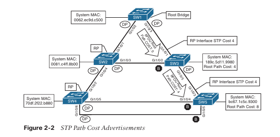
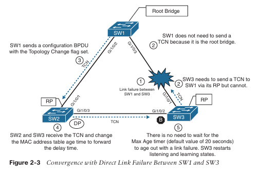

## CAPÍTULO 2

### Protocolo Spanning Tree

Este capítulo cubre los siguientes temas:

- **Fundamentos del Protocolo Spanning Tree (STP)**: esta sección ofrece una visión general de cómo los switches detectan a otros switches y previenen **bucles de reenvío**.
    
- **Protocolo Rapid Spanning Tree (RSTP)**: esta sección analiza las **mejoras introducidas en STP** para lograr una **convergencia más rápida**.
    

Un buen diseño de red proporciona **redundancia** tanto en dispositivos como en enlaces de red (es decir, rutas). La solución más simple consiste en agregar un **segundo enlace entre switches** para superar una falla de enlace o garantizar que un switch esté conectado al menos a otros dos switches dentro de una topología. Sin embargo, estas topologías pueden causar problemas cuando un switch debe reenviar **broadcasts** o cuando ocurre **flooding de unicast desconocido**. Los broadcasts de red se reenvían en un **bucle continuo** hasta que el enlace se satura y el switch se ve obligado a **descartar paquetes**. Además, la **tabla de direcciones MAC** debe cambiar constantemente los puertos asociados a medida que los paquetes entran en bucle. Los paquetes continúan circulando por la topología porque no existe un mecanismo de **tiempo de vida (TTL)** para el reenvío de Capa 2. La **utilización de CPU** del switch aumenta, al igual que el **consumo de memoria**, lo que puede provocar el **bloqueo o caída del switch**.

Este capítulo explica cómo los switches **previenen bucles de reenvío** mientras permiten enlaces redundantes mediante el uso del **Protocolo Spanning Tree (STP)** y el **Protocolo Rapid Spanning Tree (RSTP)**. Otros dos capítulos también tratan temas relacionados con STP:

- **Capítulo 3, “Advanced STP Tuning”**: cubre temas avanzados de STP como **BPDU Guard** y **BPDU Filter**.
    
- **Capítulo 4, “Multiple Spanning Tree Protocol”**: cubre el **Protocolo Multiple Spanning Tree (MSTP)**.

---
### Fundamentos del Protocolo Spanning Tree

El **Protocolo Spanning Tree (STP)** permite que los switches detecten a otros switches mediante el **anuncio y recepción de unidades de datos del protocolo puente (BPDUs)**. STP construye una **topología libre de bucles de Capa 2** en un entorno conmutado **bloqueando temporalmente el tráfico** en puertos redundantes. STP funciona seleccionando un **switch específico como raíz** con el fin de ejecutar un **algoritmo basado en árbol** que identifica qué puertos redundantes **no deben reenviar tráfico**.

STP tiene **múltiples iteraciones**:

- **802.1D**, que es la especificación original.
    
- **Per-VLAN Spanning Tree (PVST)**.
    
- **Per-VLAN Spanning Tree Plus (PVST+)**.
    
- **802.1W Rapid Spanning Tree Protocol (RSTP)**.
    
- **802.1S Multiple Spanning Tree Protocol (MST)**.
    

Los **switches Catalyst** pueden operar actualmente en modos **PVST+**, **RSTP** y **MST**. Los **tres modos** son **retrocompatibles con 802.1D**.
### IEEE 802.1D STP

La **versión original de STP** proviene del estándar **IEEE 802.1D** y proporciona soporte para garantizar una **topología libre de bucles por VLAN**. Este tema es fundamental para comprender las bases del **Rapid Spanning Tree Protocol (RSTP)** y del **Multiple Spanning Tree Protocol (MST)**.
### Estados de puerto 802.1D

En **STP 802.1D**, cada puerto transita por los siguientes **estados**:

- **Disabled (Deshabilitado)**: el puerto está **administrativamente apagado** (por ejemplo, _shutdown_).
    
- **Blocking (Bloqueo)**: el puerto está habilitado, pero **no reenvía tráfico** para evitar la creación de bucles. **No modifica** la tabla de direcciones MAC. Solo **recibe BPDUs** de otros switches.
    
- **Listening (Escucha)**: el puerto ha pasado desde _blocking_ y ahora puede **enviar o recibir BPDUs**. **No reenvía** tráfico de red. La duración de este estado depende de los **temporizadores de STP**. El siguiente estado es _learning_.
    
- **Learning (Aprendizaje)**: el puerto puede **aprender direcciones MAC** (actualiza la tabla MAC) a partir del tráfico recibido. **No reenvía** tráfico de red distinto de BPDUs. La duración también depende de los temporizadores de STP. El siguiente estado es _forwarding_.
    
- **Forwarding (Reenvío)**: el puerto **reenvía todo el tráfico de red** y **actualiza la tabla MAC** como se espera. Es el **estado final** para un puerto que puede reenviar tráfico.
    
- **Broken (Defectuoso)**: el switch ha detectado un **problema de configuración u operativo** en el puerto con impacto significativo. El puerto **descarta paquetes** mientras el problema persista.
    

> **Nota:** La inicialización completa de **STP 802.1D** tarda aproximadamente **30 segundos** para que un puerto transite de _blocking_ a _forwarding_ usando los **temporizadores predeterminados**, después de que el puerto detecta portadora.
### Tipos de puerto 802.1D

El estándar **STP 802.1D** define los siguientes **tipos de puerto**:

- **Puerto raíz (Root Port, RP)**: puerto que conecta hacia el **root bridge** o hacia un switch ascendente en la topología STP. **Debe existir un solo puerto raíz por VLAN** en cada switch.
    
- **Puerto designado (Designated Port, DP)**: puerto que **recibe y reenvía BPDUs** hacia otros switches. Proporciona conectividad a dispositivos **aguas abajo**. **Debe existir un solo puerto designado activo por enlace**.
    
- **Puerto en bloqueo (Blocking port)**: puerto que **no reenvía tráfico** como resultado de los **cálculos de STP**.
    
### Terminología clave de STP

Varios términos clave están relacionados con STP:

- **Root bridge (puente raíz)**: el **switch más importante** en la topología de Capa 2. **Todos sus puertos** se encuentran en **estado forwarding**. Este switch se considera la **raíz del árbol de expansión** para todos los cálculos de rutas realizados por los demás switches. **Todos los puertos del root bridge** se categorizan como **puertos designados**.

- **Unidad de datos del protocolo puente (BPDU)**: este paquete de red se utiliza para que los switches **identifiquen una jerarquía** y **notifiquen cambios** en la topología. Una BPDU utiliza la **dirección MAC de destino 01:80:C2:00:00:00**. Existen **dos tipos de BPDUs**:
    
    - **BPDU de configuración (Configuration BPDU)**: se utiliza para identificar el **root bridge**, los **puertos raíz**, los **puertos designados** y los **puertos en bloqueo**. La BPDU de configuración consta de los siguientes campos: **tipo de STP**, **costo del camino a la raíz**, **identificador del root bridge**, **identificador del bridge local**, **max age**, **hello time** y **forward delay**.
        
    - **BPDU de notificación de cambio de topología (Topology Change Notification, TCN BPDU)**: se utiliza para comunicar **cambios en la topología de Capa 2** a otros switches. Se explica con mayor detalle más adelante en el capítulo.
        
- **Costo del camino a la raíz (Root path cost)**: costo acumulado de un **camino específico** hacia el switch raíz.
    
- **Prioridad del sistema (System priority)**: valor de **4 bits** que indica la **preferencia** de un switch para ser root bridge. El valor predeterminado es **32,768**.
    
- **Extensión del ID de sistema (System ID extension)**: valor de **12 bits** que indica la **VLAN** a la que se relaciona la BPDU. La prioridad del sistema y la extensión del ID de sistema se **combinan** como parte de la identificación del bridge.
    
- **Identificador del bridge raíz (Root bridge identifier)**: combinación de la **dirección MAC** del bridge raíz, la **extensión del ID de sistema** y la **prioridad del sistema** del bridge raíz.
    
- **Identificador del bridge local (Local bridge identifier)**: combinación de la **dirección MAC** del bridge local, la **extensión del ID de sistema** y la **prioridad del sistema** del bridge local.
    
- **Max age**: tiempo máximo durante el cual un bridge **almacena información de BPDU**. El valor predeterminado es **20 segundos**, pero puede configurarse con el comando  
    **`spanning-tree vlan vlan-id max-age max-age`**.  
    Si un switch **pierde contacto** con la fuente de la BPDU, asume que la información de la BPDU sigue siendo válida durante el período de **max age**.
    
- **Hello time**: intervalo de tiempo en el que una BPDU se **anuncia** por un puerto. El valor predeterminado es **2 segundos**, pero puede configurarse entre **1 y 10 segundos** con el comando  
    **`spanning-tree vlan vlan-id hello-time hello-time`**.
    
- **Forward delay**: cantidad de tiempo que un puerto permanece en los estados **listening** y **learning**. El valor predeterminado es **15 segundos**, pero puede cambiarse a un valor entre **4 y 30 segundos** con el comando  
    **`spanning-tree vlan vlan-id forward-time forward-time`**.
    

> **Nota:** STP fue definido **antes de la existencia de los switches modernos**. Los dispositivos que originalmente utilizaban STP se conocían como **bridges (puentes)**. Los switches desempeñan el mismo rol a **mayor velocidad y escala**, realizando esencialmente **bridging de Capa 2**. En este contexto, los términos **bridge** y **switch** son **intercambiables**.
### Costo del camino en Spanning Tree

El **costo de la interfaz STP** es un componente esencial para el **cálculo del costo del camino hacia la raíz**, ya que dicho costo se basa en la **suma acumulada de los costos de las interfaces** necesarias para alcanzar el **root bridge**. Originalmente, el costo de interfaz STP se almacenaba como un **valor de 16 bits**, con una velocidad de referencia de **20 Gbps**. A medida que los switches evolucionaron y aparecieron interfaces de mayor velocidad, **10 Gbps ya no era suficiente** para diferenciar adecuadamente los enlaces.

Se introdujo entonces otro método, denominado **modo largo (long mode)**, que utiliza un **valor de 32 bits** y una velocidad de referencia de **20 Tbps**. El método original, conocido como **modo corto (short mode)**, ha sido el valor predeterminado en la mayoría de los switches, pero se ha ido migrando al **modo largo** según la plataforma y la versión de IOS.

La **Tabla 2-2** muestra una lista de velocidades de enlace y sus correspondientes **costos STP**.

#### Tabla 2-2: Costos STP predeterminados por velocidad de interfaz

|Velocidad del enlace|Costo STP (modo corto)|Costo STP (modo largo)|
|---|--:|--:|
|10 Mbps|100|2,000,000|
|100 Mbps|19|200,000|
|1 Gbps|4|20,000|
|10 Gbps|2|2,000|
|20 Gbps|1|1,000|
|100 Gbps|1|200|
|1 Tbps|1|20|
|10 Tbps|1|2|

Los dispositivos pueden configurarse para usar el **costo de interfaz en modo largo** mediante el comando  
**`spanning-tree pathcost method long`**. Toda la **topología de Capa 2** debe utilizar **la misma configuración** para garantizar una topología consistente. Antes de habilitar este ajuste en un entorno, es importante realizar una **auditoría** para asegurar que la configuración funcione correctamente.
### Construcción de la topología STP

Esta sección se centra en la **lógica que utilizan los switches** para construir una topología STP. La **Figura 2-1** muestra la topología simple utilizada para demostrar conceptos clave de Spanning Tree. Aunque la configuración en todos los switches **no incluye personalizaciones de STP**, el enfoque principal está en la **VLAN 1**, aunque las **VLANs 10, 20 y 99** también existen en la topología. **SW1** ha sido identificado como el **root bridge**, y los **puertos raíz (RP)**, **puertos designados (DP)** y **puertos en bloqueo** han sido identificados visualmente para ayudar en las secciones siguientes.
### Elección del bridge raíz

El **primer paso de STP** es identificar el **root bridge**. Cuando un switch se inicializa, **asume que es el root bridge** y utiliza su **identificador de bridge local** como identificador de root. Luego, escucha las **BPDUs de configuración** de los switches vecinos y hace lo siguiente:

- Si la **BPDU de configuración del vecino es inferior** a su propia BPDU, el switch **ignora** dicha BPDU.
    
- Si la **BPDU de configuración del vecino es preferida** frente a la suya, el switch **actualiza sus BPDUs** para incluir el **nuevo identificador del root bridge** junto con un **nuevo costo de camino hacia la raíz**, que corresponde al **costo total del camino** para alcanzar el nuevo root bridge. Este proceso continúa hasta que **todos los switches de la topología** han identificado al **bridge raíz**.


STP considera que un **switch es más preferible** si la **prioridad** en el **identificador de bridge** es **menor** que la prioridad en las **BPDUs de configuración** de otros switches. Si la prioridad es la misma, entonces el switch **prefiere la BPDU con la dirección MAC del sistema más baja**.

> **Nota:** En general, los switches más antiguos suelen tener **direcciones MAC más bajas** y se consideran más preferibles. Pueden realizarse **cambios de configuración** para optimizar la **ubicación del root bridge** en una topología de **Capa 2** y evitar que la inserción de un switch antiguo haga que este se convierta en el **nuevo root bridge**.

En la **Figura 2-1**, **SW1** puede identificarse como el **root bridge** porque su **dirección MAC de sistema (0062.ec9d.c500)** es la más baja de la topología. Esto se verifica además utilizando el comando **`show spanning-tree root`** para mostrar el root bridge. El **Ejemplo 2-1** demuestra este comando ejecutado en **SW1**. La salida incluye el **número de VLAN**, el **identificador del root bridge**, el **costo del camino a la raíz**, el **hello time**, el **max age** y el **forward delay**. Dado que **SW1 es el root bridge**, **todos sus puertos son puertos designados**, por lo que el campo **Root Port** aparece vacío. Usando este comando, una forma de verificar que el switch conectado es el root bridge por VLAN es observar que el **Root Port esté vacío**.

**Ejemplo 2-1: Verificación del root bridge STP**

```plaintext
SW1# show spanning-tree root

Vlan        Root ID           Root Cost  Hello  Max  Fwd  Root Port
----        ---------------   ---------  -----  ---  ---  ---------
VLAN0001    32769 0062.ec9d.c500    0        2     20   15
VLAN0010    32778 0062.ec9d.c500    0        2     20   15
VLAN0020    32788 0062.ec9d.c500    0        2     20   15
VLAN0099    32867 0062.ec9d.c500    0        2     20   15
```

En el **Ejemplo 2-1**, observa que la **prioridad del root bridge** en **SW1** para la **VLAN 1** es **32,769** y no **32,768**. La prioridad en los paquetes de **BPDU de configuración** es en realidad la **prioridad más el valor de la extensión del ID de sistema (sys-id-ext)**, que corresponde al **número de VLAN**. Puedes confirmarlo observando la **VLAN 10**, cuya prioridad es **32,778**, es decir, **10 más 32,768**.

Cuando un switch **genera BPDUs**, el **costo del camino a la raíz (root path cost)** incluye **únicamente la métrica calculada hasta la raíz** y **no incluye el costo del puerto** por el cual la BPDU se anuncia. El switch que **recibe** la BPDU **suma el costo del puerto de entrada** al costo del camino a la raíz anunciado en la BPDU, junto con el valor del root path cost. El **costo del camino a la raíz siempre es cero en el root bridge**.

La **Figura 2-2** ilustra el **costo del camino a la raíz** tal como **SW1** anuncia las **BPDUs de configuración** hacia **SW3**, y posteriormente las **BPDUs de configuración de SW3 hacia SW5**.



El **Ejemplo 2-2** muestra la salida del comando **`show spanning-tree root`** ejecutado en **SW2** y **SW3**. El campo **Root ID** coincide exactamente con el de **SW1**, pero el **costo del camino a la raíz (root path cost)** ha cambiado a **4**, porque ambos switches deben utilizar un **enlace de 1 Gbps** para alcanzar **SW1**. La interfaz **Gi1/0/1** ha sido identificada en ambos switches como el **puerto raíz (root port)**.

**Ejemplo 2-2:** Identificación de los puertos raíz
```plaintext
SW2# show spanning-tree root

Vlan        Root ID           Root Cost  Hello  Max  Fwd  Root Port
----        ---------------   ---------  -----  ---  ---  ---------
VLAN0001    32769 0062.ec9d.c500    4        2     20   15   Gi1/0/1
VLAN0010    32778 0062.ec9d.c500    4        2     20   15   Gi1/0/1
VLAN0020    32788 0062.ec9d.c500    4        2     20   15   Gi1/0/1
VLAN0099    32867 0062.ec9d.c500    4        2     20   15   Gi1/0/1
```

```
SW3# show spanning-tree root
VLAN0001    32769 0062.ec9d.c500    4    2   20   15   Gi1/0/1
VLAN0010    32778 0062.ec9d.c500    4    2   20   15   Gi1/0/1
VLAN0020    32788 0062.ec9d.c500    4    2   20   15   Gi1/0/1
VLAN0099    32867 0062.ec9d.c500    4    2   20   15   Gi1/0/1
```

La salida confirma que **Gi1/0/1** es el **puerto raíz** en ambos switches para todas las VLAN mostradas, coherente con el **cálculo del costo STP** y la topología definida.
### Localización de los puertos raíz (Root Ports)

Después de que los switches han identificado el **root bridge**, deben determinar cuál será su **puerto raíz (Root Port, RP)**. El root bridge continúa anunciando **BPDUs de configuración** por todos sus puertos, y cada switch compara la información BPDU recibida en sus interfaces para identificar su RP.

El **puerto raíz se selecciona** usando la siguiente **lógica de desempate**, donde **el primer criterio tiene prioridad** y solo se pasa al siguiente si hay empate:

1. **La interfaz con el menor costo de camino (root path cost)** es la preferida.
    
2. **La interfaz asociada al switch anunciador con la menor prioridad de sistema** es preferida.
    
3. **La interfaz asociada al switch anunciador con la menor dirección MAC del sistema** es preferida.
    
4. Si existen múltiples enlaces hacia el **mismo switch**, se prefiere el **menor port priority** del switch anunciador.
    
5. Si aún hay empate y los enlaces son hacia el mismo switch, se prefiere el **menor número de puerto** del switch anunciador.
    

El **Ejemplo 2-3** muestra la salida del comando **`show spanning-tree root`** ejecutado en **SW4** y **SW5**. El campo **Root ID** es exactamente el mismo que en **SW1**, **SW2** y **SW3** (como se vio en los Ejemplos 2-1 y 2-2). Sin embargo, el **costo del camino a la raíz** ha cambiado a **8**, porque ambos switches deben atravesar **dos enlaces de 1 Gbps** para alcanzar **SW1**.

En **SW4**, la interfaz **Gi1/0/2** fue identificada como el **puerto raíz**, mientras que en **SW5**, la interfaz **Gi1/0/3** fue identificada como el **puerto raíz**.

**Ejemplo 2-3:** Identificación de los puertos raíz en SW4 y SW5
```plaintext
SW4# show spanning-tree root

Vlan        Root ID           Root Cost  Hello  Max  Fwd  Root Port
----        ---------------   ---------  -----  ---  ---  ---------
VLAN0001    32769 0062.ec9d.c500    8        2     20   15   Gi1/0/2
VLAN0010    32778 0062.ec9d.c500    8        2     20   15   Gi1/0/2
VLAN0020    32788 0062.ec9d.c500    8        2     20   15   Gi1/0/2
VLAN0099    32867 0062.ec9d.c500    8        2     20   15   Gi1/0/2
```

```plaintext
SW5# show spanning-tree root

Vlan        Root ID           Root Cost  Hello  Max  Fwd  Root Port
----        ---------------   ---------  -----  ---  ---  ---------
VLAN0001    32769 0062.ec9d.c500    8        2     20   15   Gi1/0/3
VLAN0010    32778 0062.ec9d.c500    8        2     20   15   Gi1/0/3
VLAN0020    32788 0062.ec9d.c500    8        2     20   15   Gi1/0/3
VLAN0099    32867 0062.ec9d.c500    8        2     20   15   Gi1/0/3
```

Aquí se ve claramente cómo **STP calcula de forma determinista** el puerto raíz en cada switch, basándose primero en el **costo**, y solo recurriendo a prioridades y direcciones MAC cuando es necesario. Esto es lo que mantiene a la topología **estable, predecible y libre de bucles**, incluso cuando la red crece y se vuelve compleja.

El **root bridge** puede identificarse para una **VLAN específica** mediante el uso del comando **`show spanning-tree root`** y el examen de la información de **vecinos CDP o LLDP** para identificar el **nombre de host** del switch que actúa como **RP (root port)**. Este proceso puede repetirse hasta que se localice el **root bridge**.
### Localización de puertos designados bloqueados

Ahora que el **root bridge** y los **puertos raíz (RP)** han sido identificados, **todos los demás puertos** se consideran **puertos designados**. Sin embargo, si **dos switches que no son raíz** están conectados entre sí por sus puertos designados, **uno de esos puertos debe colocarse en estado de bloqueo** para evitar un **bucle de reenvío**. En la topología mostrada, esto se aplica a los siguientes enlaces:

- **SW2 Gi1/0/3 ↔ SW3 Gi1/0/2**
    
- **SW4 Gi1/0/5 ↔ SW5 Gi1/0/4**
    
- **SW4 Gi1/0/6 ↔ SW5 Gi1/0/5**
    

La **lógica para calcular** qué puerto debe bloquearse entre **dos switches no raíz** es la siguiente:

1. La interfaz es un **puerto designado** y **no debe considerarse** como RP.
    
2. El **switch con menor costo de camino al root bridge** **reenvía** los paquetes, y el que tiene **mayor costo** **bloquea** el puerto. Si hay empate, se pasa al siguiente paso.
    
3. Se compara la **prioridad de sistema** del switch local con la del switch remoto. El **puerto local pasa a estado de bloqueo** si la **prioridad del switch remoto es menor** que la del switch local. Si hay empate, se pasa al siguiente paso.
    
4. Se compara la **dirección MAC del sistema** del switch local con la del switch remoto. El **puerto local pasa a estado de bloqueo** si la **dirección MAC del switch remoto es menor** que la del switch local.
    

En los enlaces **SW2 Gi1/0/3 ↔ SW3 Gi1/0/2**, **SW4 Gi1/0/5 ↔ SW5 Gi1/0/4** y **SW4 Gi1/0/6 ↔ SW5 Gi1/0/5**, se siguen estos pasos para identificar qué puerto entra en **estado de bloqueo**. **SW3 Gi1/0/2**, **SW5 Gi1/0/4** y **SW5 Gi1/0/5** pasan a estado de bloqueo porque las **direcciones MAC** de **SW3** y **SW5** son **menores** que las de **SW2** y **SW4**, respectivamente. **SW5** no necesita examinar números de puerto ni prioridades para las interfaces **Gi1/0/4** y **Gi1/0/5**, porque **SW4 no está en el camino hacia la raíz**.

El comando **`show spanning-tree [vlan vlan-id]`** proporciona información útil para **localizar el estado STP de un puerto**. La **primera parte** de la salida muestra la información relevante del **root bridge** para **VLAN 1**. A continuación, se muestra la información del **bridge local**. Se presentan el **costo STP de la interfaz**, la **prioridad del puerto** y el **rol del puerto**. **Todos los puertos de SW1** son **puertos designados (Desg)** porque **SW1 es el root bridge**.

Estos **tipos de puerto** se esperan en switches Catalyst:

- **Punto a punto (P2P)**: este tipo de puerto se conecta con **otro dispositivo de red** (PC o switch RSTP).
    
- **P2P edge**: este tipo de puerto indica que **PortFast** está habilitado en ese puerto.

**Ejemplo 2-4:** Visualización de la información STP de SW1
```plaintext
SW1# show spanning-tree vlan 1

VLAN0001
  Spanning tree enabled protocol rstp

  This section displays the relevant information for the STP root bridge

  Root ID    Priority    32769
             Address     0062.ec9d.c500
             This bridge is the root
             Hello Time  2 sec   Max Age 20 sec   Forward Delay 15 sec

  This section displays the relevant information for the local STP bridge

  Bridge ID  Priority    32769 (priority 32768 sys-id-ext 1)
             Address     0062.ec9d.c500
             Hello Time  2 sec   Max Age 20 sec   Forward Delay 15 sec
             Aging Time  300 sec

Interface        Role Sts Cost  Prio.Nbr Type
---------------- ---- --- ----- -------- ----
Gi1/0/2          Desg FWD 4     128.2    P2p
Gi1/0/3          Desg FWD 4     128.3    P2p
Gi1/0/14         Desg FWD 4     128.14   P2p Edge
```

> **Nota:** Si el campo **Type** incluye **TYPE Inc.**, esto indica un **desajuste de configuración del puerto** entre este switch Catalyst y el switch al que está conectado. Los problemas más comunes son un **tipo de puerto incorrecto** y una **mala configuración del modo de puerto** (acceso vs. troncal).

El **Ejemplo 2-5** muestra la topología STP para **SW2** y **SW3**. Observa que, en la sección del **root bridge**, la salida proporciona el **costo total del camino a la raíz** y el **puerto identificado como RP** en el switch.

Todos los puertos de **SW2** están en **estado de reenvío**, pero **Gi1/0/2** en **SW3** está en **estado de bloqueo (BLK)**. Específicamente, **SW3 Gi1/0/2** ha sido designado como **puerto alterno** para alcanzar la raíz en caso de que falle la conexión **Gi1/0/1**.

La razón por la cual **SW3 Gi1/0/2** entra en **bloqueo** es que la **dirección MAC del sistema de SW2 (0081.c4ff.8b00)** es **menor** que la **dirección MAC del sistema de SW3 (189c.5d11.9980)**. Esto puede deducirse observando las **direcciones MAC del sistema** en la salida y confirmarse con la **topología mostrada en la Figura 2-1**.

Aquí se ve la elegancia cruel de STP: cuando todo empata, **gana la MAC más baja**. No hay democracia, solo determinismo.

**Ejemplo 2-5:** Verificación de los puertos raíz y en bloqueo para una VLAN

A continuación se muestra la **salida del comando `show spanning-tree vlan 1`** ejecutado en **SW2** y **SW3**, junto con la interpretación clave de lo que está ocurriendo en la topología STP.
#### SW2

```plaintext
SW2# show spanning-tree vlan 1

VLAN0001
  Spanning tree enabled protocol rstp

  Root ID    Priority    32769
             Address     0062.ec9d.c500
             Cost        4
             Port        1 (GigabitEthernet1/0/1)
             Hello Time  2 sec   Max Age 20 sec   Forward Delay 15 sec

  Bridge ID  Priority    32769 (priority 32768 sys-id-ext 1)
             Address     0081.c4ff.8b00
             Hello Time  2 sec   Max Age 20 sec   Forward Delay 15 sec
             Aging Time  300 sec

Interface        Role Sts Cost  Prio.Nbr Type
---------------- ---- --- ----- -------- ----
Gi1/0/1          Root FWD 4     128.1    P2p
Gi1/0/3          Desg FWD 4     128.3    P2p
Gi1/0/4          Desg FWD 4     128.4    P2p
```

**Interpretación (SW2):**

- **SW1** sigue siendo el **root bridge** (MAC `0062.ec9d.c500`).
    
- **Gi1/0/1** es el **puerto raíz (Root Port)** en SW2, con un **costo total 4**.
    
- Todos los demás puertos están en **estado Forwarding** como **puertos designados**.
    
#### SW3

```plaintext
SW3# show spanning-tree vlan 1

VLAN0001
  Spanning tree enabled protocol rstp

  Root ID    Priority    32769
             Address     0062.ec9d.c500
             Cost        4
             Port        1 (GigabitEthernet1/0/1)
             Hello Time  2 sec   Max Age 20 sec   Forward Delay 15 sec

  Bridge ID  Priority    32769 (priority 32768 sys-id-ext 1)
             Address     189c.5d11.9980
             Hello Time  2 sec   Max Age 20 sec   Forward Delay 15 sec
             Aging Time  300 sec

Interface        Role Sts Cost  Prio.Nbr Type
---------------- ---- --- ----- -------- ----
Gi1/0/1          Root FWD 4     128.1    P2p
Gi1/0/2          Altn BLK 4     128.2    P2p
Gi1/0/5          Desg FWD 4     128.5    P2p
```

**Interpretación (SW3):**

- **Gi1/0/1** es el **puerto raíz** hacia SW1.
    
- **Gi1/0/2** está en **estado Alterno / Bloqueado (Altn BLK)**.
    
- **Gi1/0/5** permanece como **puerto designado en forwarding**.
    
### Por qué Gi1/0/2 en SW3 está bloqueado

Entre **SW2 y SW3**, ambos tienen:

- El **mismo costo hacia la raíz**.
    
- La **misma prioridad STP**.
    

STP entonces aplica el **último criterio de desempate**:  
gana el switch con la **dirección MAC más baja**.

- **SW2 MAC**: `0081.c4ff.8b00`
    
- **SW3 MAC**: `189c.5d11.9980`
    

Como **SW2 tiene la MAC más baja**, su puerto permanece en forwarding y **SW3 Gi1/0/2** pasa a **bloqueo**.

Determinismo puro: cuando todo empata, **manda la MAC más baja**. Así STP evita bucles sin negociar ni dudar.
### Verificación de VLANs en enlaces troncales

Todas las interfaces que participan en una **VLAN** se listan en la salida del comando **`show spanning-tree`**. Este comando puede utilizarse como **tarea de auditoría** para puertos troncales que transportan **múltiples VLANs**. La salida incluye el **estado STP por VLAN** en **cada interfaz del switch**.

El comando **`show spanning-tree interface interface-id [detail]`** reduce drásticamente la salida al **estado STP solo de la interfaz especificada**. La palabra clave opcional **`detail`** proporciona información adicional como **costo del puerto**, **prioridad**, **número de transiciones**, **tipo de enlace** y el **conteo de BPDUs enviadas y recibidas** para cada VLAN soportada en esa interfaz. El **Ejemplo 2-6** demuestra el uso de **ambas iteraciones** del comando.

Si **falta una VLAN** en un puerto troncal, se debe **verificar la configuración del troncal**. La configuración de troncales se trata con más detalle en el **Capítulo 5, “VLAN Trunks and EtherChannel Bundles”**. Un problema común es que **una VLAN no esté incluida en la lista de VLANs permitidas** del puerto troncal.
### Ejemplo 2-6: Visualización de VLANs que participan con STP en una interfaz

```plaintext
SW3# show spanning-tree interface gi1/0/1

Vlan        Role Sts Cost  Prio.Nbr Type
----        ---- --- ----- -------- ----
VLAN0001    Root FWD 4     128.1    P2p
VLAN0010    Root FWD 4     128.1    P2p
VLAN0020    Root FWD 4     128.1    P2p
VLAN0099    Root FWD 4     128.1    P2p
```

```plaintext
SW3# show spanning-tree interface gi1/0/1 detail
Output omitted for brevity

Port 1 (GigabitEthernet1/0/1) of VLAN0001 is root forwarding
  Port path cost 4, Port priority 128, Port Identifier 128.1
  Designated root has priority 32769, address 0062.ec9d.c500
  Designated bridge has priority 32769, address 0062.ec9d.c500
  Designated port id is 128.3, designated path cost 0
  Timers: message age 15, forward delay 0, hold 0
  Number of transitions to forwarding state: 1
  Link type is point-to-point by default
  BPDU: sent 15, received 45908

Port 1 (GigabitEthernet1/0/1) of VLAN0010 is root forwarding
  Port path cost 4, Port priority 128, Port Identifier 128.1
  Designated root has priority 32778, address 0062.ec9d.c500
  Designated bridge has priority 32778, address 0062.ec9d.c500
  Designated port id is 128.3, designated path cost 0
  Timers: message age 15, forward delay 0, hold 0
  Number of transitions to forwarding state: 1
  Link type is point-to-point by default
  BPDU: sent 15, received 22957
```

**Idea clave:** en troncales, **STP opera por VLAN**. Si una VLAN no aparece aquí, casi siempre es porque **no está permitida en el troncal**. Esto convierte a `show spanning-tree interface … detail` en una lupa quirúrgica para encontrar errores de diseño o de configuración.
### Cambios de topología STP

En una **topología estable de Capa 2**, las **BPDUs de configuración** siempre fluyen desde el **root bridge** hacia los **switches de borde**. Sin embargo, **cambios en la topología** (por ejemplo, inicialización de un switch, fallas de enlace o enlaces que pasan a estado activo) tienen impacto en **todos los switches** de la topología de Capa 2.

El switch que **detecta un cambio de estado de enlace** envía una **BPDU de notificación de cambio de topología (TCN)** hacia el **root bridge** usando su **puerto raíz (RP)**. Si un switch ascendente recibe la TCN, **envía un acuse de recibo** y **reenvía la TCN** por su RP hasta que llega al root bridge.

Al recibir la TCN, el **root bridge** crea una **nueva BPDU de configuración** con el **bit Topology Change (TC)** activado y la **difunde** a todos los switches. Cuando un switch recibe una BPDU con el bit **Topology Change** activo, **reduce el temporizador de envejecimiento de la tabla MAC** al valor de **forward delay** (por defecto **15 segundos**). Esto **purga** direcciones MAC de dispositivos que **no han comunicado** dentro de esa ventana, mientras **conserva** las de dispositivos activos.

Vaciar la **tabla MAC** evita que un switch siga enviando tráfico a un **host que ya no es alcanzable** por ese puerto. El efecto secundario es un **incremento temporal del flooding de unicast desconocido** mientras se reaprenden las MAC. Este impacto se **mitiga** gracias al comportamiento **CSMA/CD**, y el temporizador MAC vuelve a su valor normal (**300 segundos por defecto**) tras recibir la BPDU de configuración.

Las **TCN se generan por VLAN**, por lo que su impacto está directamente relacionado con la **cantidad de hosts** en la VLAN. A mayor número de hosts, **más probable** es la generación de TCN y **más amplio** el impacto de broadcasts. Los **cambios de topología** deben revisarse como parte del **troubleshooting**. El **Capítulo 3** describe mecanismos como **PortFast** que **modifican este comportamiento** y **reducen la generación de TCN**.

Los cambios de topología pueden observarse con el comando **`show spanning-tree [vlan vlan-id] detail`**. La salida muestra el **contador de cambios de topología** y el **tiempo transcurrido** desde el último cambio. Un **incremento repentino o continuo** en TCNs indica un **problema potencial** y debe investigarse (puertos “flapping”, errores físicos, etc.).

**Ejemplo 2-7:** Visualización detallada del estado STP
```plaintext
SW1# show spanning-tree vlan 10 detail

VLAN0010 is executing the rstp compatible Spanning Tree protocol
Bridge Identifier has priority 32768, sysid 10, address 0062.ec9d.c500
Configured hello time 2, max age 20, forward delay 15, transmit hold-count 6
We are the root of the spanning tree
Topology change flag not set, detected flag not set
Number of topology changes 42 last change occurred 01:02:09 ago
  from GigabitEthernet1/0/2

Times: hold 1, topology change 35, notification 2
hello 2, max age 20, forward delay 15
Timers: hello 0, topology change 0, notification 0, aging 300
```

**Claves de lectura:**

- **Number of topology changes**: cuántas veces STP ha detectado cambios.
    
- **last change occurred**: tiempo desde el último cambio.
    
- **from GigabitEthernet…**: interfaz que **originó** el cambio.
    

Un contador que **sube sin parar** es una sirena de alarma: la topología está inquieta y STP lo está gritando.

El **proceso para determinar por qué están ocurriendo TCNs** implica verificar si el puerto afectado está conectado a un **host** o a **otro switch**.

- Si está conectado a **otro switch**, debes **conectarte a ese switch** y **repetir el proceso** de revisión de los detalles de STP.
    
- Puede ser necesario **examinar tablas CDP** o la **documentación de la red**.
    
- Puedes ejecutar nuevamente el comando **`show spanning-tree [vlan vlan-id] detail`** para encontrar **el último switch en la topología** que identifica el **puerto problemático**.
    
### Convergencia con fallas de enlace directas

Cuando un switch **pierde energía o se reinicia**, o cuando un **cable es retirado** de un puerto, la **señalización de Capa 1** coloca el puerto en estado **down**, lo que permite notificar a otros procesos, como **STP**. STP considera este evento como una **falla directa de enlace** y puede reaccionar de diferentes maneras según la topología.  
Esta sección explica **todos estos escenarios posibles** usando una **topología simple de tres switches**, donde **SW1 es el root switch**.
### Escenario 1: Falla directa de enlace

En el **primer escenario**, falla el enlace entre **SW2 y SW3**.

- En **SW2**, el puerto **Gi1/0/3** es un **puerto designado (DP)**.
    
- En **SW3**, el puerto **Gi1/0/2** está en **estado de bloqueo**.
    

Como **Gi1/0/2 en SW3 ya está bloqueado**, **no existe un camino alternativo inmediato** entre SW2 y SW3. Ambos switches (**SW2 y SW3**) **anuncian una TCN** hacia el **root switch**, lo que provoca que la **topología de Capa 2 vacíe su tabla de direcciones MAC**.
### Escenario 2: Falla directa de enlace

En el **segundo escenario**, falla el enlace entre **SW1 y SW3**.

- El **tráfico normal** desde **SW1** o **SW2** hacia **SW3** se ve afectado, ya que **Gi1/0/2 en SW3** se encuentra en **estado de bloqueo**.
    

La **Figura 2-3** ilustra este escenario de falla y los **eventos que ocurren** para **estabilizar la topología STP**.

Aquí STP muestra su carácter: no es rápido por cortesía, es rápido por supervivencia. Detecta, recalcula, bloquea y libera. Todo para que el bucle no nazca ni por un instante.


### Fases de convergencia ante una falla directa de enlace (Escenario 2)

**Fase 1.**  
**SW1** detecta una falla de enlace en su interfaz **Gi1/0/3**. **SW3** detecta una falla de enlace en su interfaz **Gi1/0/1**.

**Fase 2.**  
Normalmente, **SW1** enviaría una **TCN** por su **puerto raíz**; pero al ser el **root bridge**, **no lo hace**. (Si no fuera el root, sí anunciaría una TCN).  
**SW3** elimina la **mejor BPDU** recibida desde **SW1** por **Gi1/0/1**, ya que el enlace ahora está **down**. En este punto, **SW3** **intentaría** enviar una TCN hacia el root para notificar el cambio de topología; **sin embargo, su puerto raíz está caído**, por lo que no puede hacerlo.

**Fase 3.**  
**SW1** anuncia una **BPDU de configuración** con el **bit de Topology Change (TC)** activado por **todos sus puertos**. Esta BPDU es **recibida y reenviada** por todos los switches del entorno.

**Nota:** Si existieran otros switches conectados a **SW1**, también recibirían una BPDU de configuración con el **flag de Topology Change** activado. Estas BPDUs **impactan a todos los switches** del dominio de **Capa 2**.

**Fase 4.**  
**SW2** y **SW3** reciben la BPDU de configuración con el **Topology Change flag**. Ambos **reducen el temporizador de envejecimiento de la tabla MAC** al valor de **forward delay**, forzando la **depuración de entradas MAC antiguas**. En esta fase, **SW2 no detecta** cambios directos en su conectividad.

**Fase 5.**  
No es necesario esperar al **temporizador Max Age** (valor por defecto **20 segundos**) para depurar la información tras una falla directa de enlace. **SW3** **reinicia los estados STP de listening y learning** para aprender nuevamente la ruta hacia el root bridge a través de **Gi1/0/2** (interfaz que estaba previamente en **estado blocking**).

**Tiempo total de convergencia:**  
Para **SW3**, el tiempo total es de **30 segundos**:

- **15 segundos** en **listening**
    
- **15 segundos** en **learning**  
    antes de que **Gi1/0/2** pueda convertirse en el **puerto raíz (RP)**.
    
### Escenario 3: Falla directa de enlace

En el **tercer escenario**, falla el enlace entre **SW1 y SW2**.  
El tráfico de red desde **SW1** o **SW3** hacia **SW2** se ve afectado porque **Gi1/0/2 en SW3** se encuentra en **estado blocking**. La **Figura 2-4** ilustra este escenario de falla y los **eventos que ocurren** para **estabilizar la topología STP**.

**Fase 1.**  
**SW1** detecta una falla de enlace en **Gi1/0/2**. **SW2** detecta una falla de enlace en **Gi1/0/1**.

**Fase 2.**  
Normalmente, **SW1** enviaría una **TCN** por su puerto raíz; pero al ser el **root bridge**, **no lo hace**.  
**SW2** elimina la mejor BPDU recibida desde **SW1** por **Gi1/0/1**, ya que el enlace está **down**. En este punto, **SW2** **intentaría** enviar una TCN hacia el root para notificar el cambio de topología; **sin embargo, su puerto raíz está caído**, por lo que no puede hacerlo.

Aquí STP se comporta como un sistema nervioso primitivo pero eficaz: **detecta el dolor, corta reflejos peligrosos y reaprende el camino**. No es elegante ni rápido por diseño moderno, pero es **predecible**, y en redes, la previsibilidad es una forma de paz.


**Fase 3.**  
**SW1** anuncia una **BPDU de configuración** con el **flag de Topology Change** activado por **todos sus puertos**. Esta BPDU es recibida y retransmitida hacia **SW3**. **SW3 no puede reenviarla hacia SW2** porque su puerto **Gi1/0/2** aún permanece en **estado blocking**.  
Mientras tanto, **SW2 asume que ahora es el root bridge** y comienza a anunciar **BPDUs de configuración** indicando que él mismo es la raíz.

**Fase 4.**  
**SW3** recibe desde **SW1** la BPDU de configuración con el flag **Topology Change**. **SW3 reduce el temporizador de envejecimiento de la tabla MAC** al valor de **forward delay**, lo que provoca que se purguen entradas MAC antiguas.  
**SW3** también recibe las BPDUs “inferiores” de **SW2** y las **descarta**, ya que todavía está recibiendo BPDUs **superiores** desde **SW1**.

**Fase 5.**  
El temporizador **Max Age** en **SW3** expira, y ahora **SW3 Gi1/0/2** transiciona de **blocking** a **listening**. En este punto, **SW3 ya puede reenviar** la siguiente BPDU de configuración que reciba desde **SW1** hacia **SW2**.

**Fase 6.**  
**SW2** recibe la BPDU de configuración de **SW1** a través de **SW3** y reconoce que es **superior**. Entonces marca su interfaz **Gi1/0/3** como el **puerto raíz (RP)** y la transiciona al estado **listening**.

**Tiempo total de convergencia:**  
El tiempo total de convergencia para **SW2** es de **50 segundos**:

- **20 segundos** por el temporizador **Max Age** en **SW3**
    
- **15 segundos** por el estado **listening** en **SW2**
    
- **15 segundos** por el estado **learning**
    
### Fallas indirectas

En algunos escenarios de falla, la comunicación STP entre switches se ve **deteriorada o filtrada** mientras el enlace físico de red **permanece activo**. Esta situación se conoce como una **falla indirecta de enlace (indirect link failure)**, y se requieren **temporizadores** para detectar y corregir la topología.

La **Figura 2-5** ilustra un escenario de **impedimento** o **corrupción de datos** en el enlace entre **SW1 y SW3**, junto con la lógica utilizada para **resolver la pérdida de tráfico**.


### Convergencia con falla indirecta de enlace

La **Figura 2-5** ilustra un escenario de **falla indirecta de enlace**, donde el enlace físico permanece activo, pero los **datos (incluidas BPDUs)** se ven **impedidos o corrompidos**. En este caso, **SW1** sigue siendo el **root bridge**.

**Fase 1.**  
Ocurre un evento que **impide o corrompe los datos** en el enlace. **SW1** y **SW3** aún **reportan condición de enlace activo** (link up).

**Fase 2.**  
**SW3** deja de recibir **BPDUs de configuración** por su **puerto raíz (RP)**. Mantiene una **entrada en caché** para el RP (**Gi1/0/1**).  
Las BPDUs de **SW1** que llegan **vía SW2** se **descartan**, porque **Gi1/0/2** en **SW3** está en **estado blocking**.  
Tras expirar el **temporizador Max Age** en **SW3**, se **elimina la entrada en caché del RP** y **Gi1/0/2** transiciona de **blocking** a **listening**.

**Fase 3.**  
**SW2** continúa anunciando las **BPDUs de configuración de SW1** hacia **SW3**.

**Fase 4.**  
**SW3** recibe la BPDU de **SW1** desde **SW2** por **Gi1/0/2**. Este puerto se **marca como RP** y continúa la transición por los estados **listening** y **learning**.

**Tiempo total de reconvergencia (SW3):** **50 segundos**

- **20 s** por **Max Age** en SW3
    
- **15 s** en **listening**
    
- **15 s** en **learning**
    

Este es el talón de Aquiles de **802.1D**: cuando la señal existe pero el control falla, **los temporizadores gobiernan**. Funciona, pero no es rápido.
## Rapid Spanning Tree Protocol (RSTP)

Aunque **802.1D** hizo un trabajo digno evitando bucles de Capa 2, utilizaba **una sola topología** de árbol, lo que **limitaba la escalabilidad**. En entornos grandes con **múltiples VLANs**, se requerían **topologías distintas** para ingeniería de tráfico (por ejemplo, **balanceo de carga**), lo que impulsó a Cisco a crear **Per-VLAN Spanning Tree (PVST)** y **PVST+**, aportando mayor flexibilidad.

**PVST y PVST+** son protocolos **propietarios**. Sus conceptos se integraron con mejoras adicionales para lograr **convergencia más rápida** en el estándar **IEEE 802.1W**, conocido como **Rapid Spanning Tree Protocol (RSTP)**.

La idea central de RSTP es simple y poderosa: **menos dependencia de temporizadores y más señalización explícita** entre puertos. Resultado: **convergencia en milisegundos** en escenarios comunes, en lugar de esperar a que el reloj haga su magia lenta.
### Estados de puerto RSTP (802.1W)

RSTP **reduce el número de estados de puerto a tres**:

- **Discarding (Descartando)**: el puerto está habilitado, pero **no reenvía tráfico** para asegurar que no se cree un bucle. Este estado **combina** los estados tradicionales de STP **disabled, blocking y listening**.
    
- **Learning (Aprendizaje)**: el puerto **actualiza la tabla MAC** con el tráfico que recibe, pero **no reenvía tráfico** distinto de BPDUs.
    
- **Forwarding (Reenvío)**: el puerto **reenvía todo el tráfico** y **actualiza la tabla MAC**. Es el **estado final** para un puerto que puede reenviar tráfico.
    

**Nota:** Un switch intenta establecer un **handshake RSTP** con el dispositivo conectado al otro extremo del cable. Si el handshake **no se completa**, el dispositivo remoto se **asume no compatible con RSTP** y el puerto **retrocede a comportamiento 802.1D**. Esto implica que **dispositivos finales** (PCs, impresoras, etc.) aún pueden experimentar **retrasos significativos (~30 s)** mientras el enlace se estabiliza.
### Roles de puerto RSTP (802.1W)

RSTP define los siguientes **roles de puerto**:

- **Puerto raíz (Root Port, RP)**: puerto que conecta con el **root switch** o con un switch ascendente en la topología STP. **Debe existir un solo RP por VLAN** en un switch.
    
- **Puerto designado (Designated Port, DP)**: puerto que **recibe y reenvía tramas** hacia otros switches. Proporciona conectividad a dispositivos y switches **aguas abajo**. **Debe existir un solo DP activo por enlace**.
    
- **Puerto alterno (Alternate Port)**: puerto que proporciona una **ruta alternativa** hacia el root switch a través de **otro switch**.
    
- **Puerto de respaldo (Backup Port)**: puerto que proporciona **redundancia** hacia el **mismo segmento compartido** (típicamente un hub).
    
### Tipos de puerto RSTP (802.1W)

RSTP define **tres tipos de puerto** utilizados para construir la topología STP:

- **Edge port (Puerto de borde)**: puerto en el **borde de la red**, donde se conectan **hosts** a la topología de Capa 2. Estos puertos **no pueden formar bucles** y se corresponden directamente con puertos que tienen **STP PortFast habilitado**.
    
- **Non-edge port**: puerto que **ha recibido una BPDU**.
    
- **Point-to-point port**: cualquier puerto que conecta a **otro switch RSTP en full-duplex**. Los enlaces **full-duplex** no permiten más de dos dispositivos en el segmento, por lo que **determinar full-duplex** es la forma más rápida de verificar la **viabilidad de conexión** a otro switch.
    

RSTP no espera al reloj cuando puede **hablar**. Menos temporizadores, más conversación entre puertos. Esa es la razón por la que converge rápido y duerme tranquila.