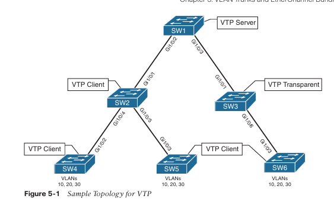
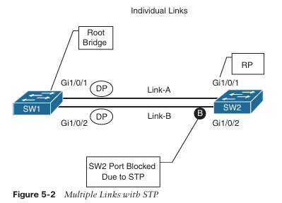
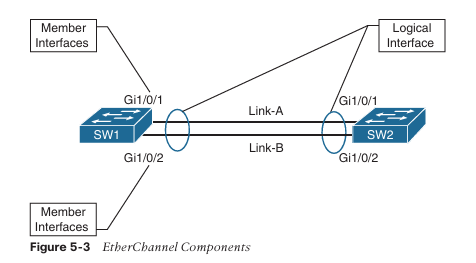
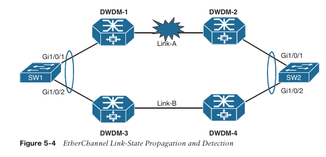

**CAPÍTULO 5**

**Troncales VLAN y Agrupaciones EtherChannel**

Este capítulo cubre los siguientes temas:

- **Protocolo de Troncado de VLAN (VTP):** Esta sección ofrece una visión general de cómo las VLAN pueden aprovisionarse de forma sistemática en los switches.
    
- **Protocolo de Troncado Dinámico (DTP):** Esta sección explica cómo los enlaces troncales pueden establecerse dinámicamente entre switches.
    
- **Agrupación EtherChannel:** Esta sección explica cómo múltiples interfaces físicas pueden combinarse para formar una interfaz lógica, con el fin de aumentar el rendimiento y proporcionar resiliencia sin interrupciones.
    

Este capítulo cubre múltiples funciones relacionadas con la conectividad entre switches. Comienza explicando el Protocolo de Troncado de VLAN (VTP) y el Protocolo de Troncado Dinámico (DTP) para ayudar en el aprovisionamiento de VLAN y garantizar que la conectividad entre switches pueda transportar múltiples VLAN. Finalmente, el capítulo explica el uso de agrupaciones EtherChannel como un método para añadir ancho de banda y suprimir cambios de topología provocados por fallos de enlace.

---

**Protocolo de Troncado de VLAN (VLAN Trunking Protocol)**

Antes de que existieran APIs disponibles en las plataformas Cisco, configurar un switch era un proceso manual. Cisco creó el protocolo propietario **VLAN Trunking Protocol (VTP)** para reducir la carga de aprovisionamiento de VLAN en los switches. Agregar una VLAN puede parecer una tarea simple, pero en un entorno con 100 switches, añadir una VLAN requiere iniciar sesión en los 100 switches para aprovisionar una VLAN. Gracias a VTP, los switches que participan en el mismo dominio VTP pueden crear una VLAN una sola vez en un servidor VTP y propagarla a otros switches clientes VTP dentro del mismo dominio.

Existen cuatro roles en la arquitectura VTP:

- **Servidor:** El switch servidor es responsable de la creación, modificación y eliminación de VLAN dentro del dominio VTP.
    
- **Cliente:** El switch cliente recibe anuncios VTP y modifica las VLAN en ese switch. Las VLAN no pueden configurarse localmente en un cliente VTP.
    
- **Transparente:** Los switches en modo transparente reciben y reenvían anuncios VTP, pero no modifican la base de datos local de VLAN. Las VLAN se configuran solo de forma local.
    
- **Off:** Un switch en este modo no participa en los anuncios VTP y tampoco los reenvía por ninguno de sus puertos. Las VLAN se configuran únicamente de forma local.
    

La Figura 5-1 muestra una topología simple en la que SW1 es el servidor VTP y SW2, SW4, SW5 y SW6 son clientes VTP. SW3 está en modo transparente y no actualiza su base de datos de VLAN a medida que los cambios se propagan a través del dominio VTP. SW3 reenvía los cambios VTP hacia SW6.



Existen tres versiones de VTP, y la versión 1 es la predeterminada. En su forma más simple, VTP versiones 1 y 2 tienen una propagación limitada a las VLAN numeradas del 1 al 1005. VTP versión 3 permite el rango completo de VLAN del 1 al 4094. Al momento de escribir esto, la mayoría de los switches deberían ser capaces de ejecutar VTP versión 3.

VTP admite tener múltiples servidores VTP dentro de un dominio. Estos servidores procesan actualizaciones de otros servidores VTP de la misma manera que lo haría un cliente. Si un dominio VTP es versión 3, el servidor VTP primario debe configurarse mediante el comando **vtp primary**.

**Comunicación VTP**

VTP anuncia actualizaciones utilizando una dirección multicast a través de los enlaces troncales para publicar cambios a todos los switches dentro del dominio VTP. Existen tres tipos principales de anuncios:

- **Resumen (Summary):** Este anuncio ocurre cada 300 segundos o cuando una VLAN es agregada, eliminada o modificada. Incluye la versión de VTP, el dominio, el número de revisión de la configuración y una marca de tiempo.
    
- **Subconjunto (Subset):** Este anuncio ocurre después de un cambio en la configuración de VLAN. Contiene toda la información relevante que los switches necesitan para realizar cambios en las VLAN.
    
- **Solicitudes de cliente (Client requests):** Este anuncio es una solicitud de un cliente para recibir el anuncio de subconjunto más detallado. Normalmente ocurre cuando un switch con un número de revisión menor se une al dominio VTP y observa un anuncio de resumen con un número de revisión superior al que tiene almacenado localmente.

**Configuración de VTP**

Los pasos para configurar VTP son los siguientes:

**Paso 1.** Definir la versión de VTP con el comando `vtp version {1 | 2 | 3}`.

**Paso 2.** Definir el dominio VTP con el comando `vtp domain nombre-dominio`. Cambiar el dominio VTP restablece la base de datos VTP local del switch a 0.

**Paso 3.** Definir el rol del switch en VTP con el comando `vtp mode {server | client | transparent | off}`.

**Paso 4.** (Opcional) Asegurar el dominio VTP con el comando `vtp password contraseña`.  
(Este paso es opcional, pero recomendado porque ayuda a prevenir que switches no autorizados se unan al dominio VTP).

**Paso 5.** (Solo para VTP versión 3) Designar un servidor VTP como servidor primario. Solo el servidor VTP primario puede agregar o eliminar VLAN. A diferencia de versiones anteriores de VTP, donde múltiples servidores podían realizar cambios, un servidor VTP se convierte en primario con el comando en modo EXEC `vtp primary`.

El Ejemplo 5-1 demuestra la configuración de VTP en SW1, SW2, SW3 y SW6 de la Figura 5-1. Muestra configuraciones de ejemplo para tres de los roles de VTP: SW1 como servidor, SW3 como transparente y los demás switches como clientes VTP.

**Ejemplo 5-1:** Configurando el Dominio VTP
```text
SW1(config)# vtp version 3
09:08:11.965 %SW_VLAN-6-OLD_CONFIG_FILE_READ: Old version 2 VLAN configuration
file detected and read OK. Version 3 files will be written in the future.

SW1(config)# vtp domain CISCO
09:08:12.085 %SW_VLAN-6-VTP_DOMAIN_NAME_CHG: VTP domain name changed to CiscoPress.
Changing VTP domain name from CCNP to CISCO

SW1(config)# vtp mode server
Setting device to VTP Server mode for VLANs.

SW1(config)# vtp password PASSWORD
Setting device VTP password to PASSWORD

SW1(config)# exit

SW1# vtp primary
This system is becoming primary server for feature vlan
No conflicting VTP3 devices found.
Do you want to continue? [confirm]
09:25:02.038 %SW_VLAN-4-VTP_PRIMARY_SERVER_CHG: 0062.ec9d.c500 has become the
primary server for the VLAN VTP feature
```

```
SW2(config)# vtp version 3
SW2(config)# vtp domain CISCO
SW2(config)# vtp mode client
SW2(config)# vtp password PASSWORD
Setting device VTP password to PASSWORD
```

```
SW3(config)# vtp version 3
SW3(config)# vtp domain CISCO
SW3(config)# vtp mode transparent
SW3(config)# vtp password PASSWORD
```

```
SW6(config)# vtp version 3
SW6(config)# vtp domain CISCO
SW6(config)# vtp mode client
SW6(config)# vtp password PASSWORD
```

**Verificación de VTP**

El estado de VTP se verifica con el comando `show vtp status`. La información más importante que se muestra es la versión de VTP, el nombre del dominio VTP, el modo VTP, el número de VLAN (estándar y extendidas) y la versión de configuración.

El Ejemplo 5-2 muestra la salida de SW1, SW2, SW3 y SW4. Observe el modo de operación resaltado para SW2, SW3 y SW4. Las dos últimas entradas de VTP Operating Mode no son relevantes porque se utilizan para otras funciones.

**Ejemplo 5-2:** Verificando VTP
```
SW1# show vtp status

VTP Version capable             : 1 to 3
VTP version running             : 3
VTP Domain Name                 : CISCO
VTP Pruning Mode                : Disabled
VTP Traps Generation            : Disabled
Device ID                       : 0062.ec9d.c500

Feature VLAN:
--------------
VTP Operating Mode              : Primary Server
Number of existing VLANs        : 5
Number of existing extended VLANs : 0
Maximum VLANs supported locally : 4096
Configuration Revision          : 1
Primary ID                      : 0062.ec9d.c500
Primary Description             : SW1
MD5 digest                      : 0x9D 0xE3 0xCD 0xD4 0x22 0x70 0xED 0x73
                                  0x9C 0xDE 0x0B 0x7A 0x15 0x65 0xE2 0x65

! La siguiente información se utiliza para otras funciones
! no cubiertas en el examen Enterprise Core y no será explicada

Feature MST:
------------
VTP Operating Mode              : Transparent
Feature UNKNOWN:
----------------
VTP Operating Mode              : Transparent
```

```
SW2# show vtp status | i version run|Operating VLANs|Revision
VTP version running             : 3
VTP Operating Mode              : Client
Configuration Revision          : 1
VTP Operating Mode              : Transparent
VTP Operating Mode              : Transparent
```

```
SW3# show vtp status | i version run|Operating VLANs|Revision
VTP version running             : 3
VTP Operating Mode              : Transparent
VTP Operating Mode              : Transparent
VTP Operating Mode              : Transparent
```

```
SW6# show vtp status | i version run|Operating VLANs|Revision
VTP version running             : 3
VTP Operating Mode              : Client
Configuration Revision          : 1
VTP Operating Mode              : Transparent
VTP Operating Mode              : Transparent
```

Ahora que el dominio VTP ha sido inicializado, veamos cómo funciona VTP; el Ejemplo 5-3 muestra la creación de las VLAN 10, 20 y 30 en SW1. Después de que las VLAN se crean en el servidor VTP, se examina el estado de VTP como método para verificar que el número de revisión se ha incrementado (de 1 a 4 porque se agregaron tres VLAN).

**Ejemplo 5-3:** Creando VLANs en el Servidor del Dominio VTP
```
SW1(config)# vlan 10
SW1(config-vlan)# name PCs
SW1(config-vlan)# vlan 20
SW1(config-vlan)# name VoIP
SW1(config-vlan)# vlan 30
SW1(config-vlan)# name Guest
```

```
SW1# show vtp status | i version run|Operating VLANs|Revision
VTP version running             : 3
VTP Operating Mode              : Primary Server
Configuration Revision          : 4
VTP Operating Mode              : Transparent
VTP Operating Mode              : Transparent
```

El Ejemplo 5-4 confirma que SW6 ha recibido las actualizaciones de VTP desde SW3, que opera en modo transparente. Observe que SW6 muestra una revisión de configuración 4, lo cual coincide con la revisión mostrada en SW1. La base de datos de VLANs refleja que las tres VLANs fueron creadas en este switch sin necesidad de configurarlas mediante la CLI.

**Ejemplo 5-4:** Verificando VTP con un Switch en Modo Transparente
```
SW6# show vtp status | i version run|Operating VLANs|Revision
VTP version running             : 3
VTP Operating Mode              : Client
Configuration Revision          : 4
VTP Operating Mode              : Transparent
VTP Operating Mode              : Transparent
```

```
SW6# show vlan

VLAN Name              Status    Ports
---- ----------------- --------- ----------------------------------------
1    default           active    Gi1/0/1, Gi1/0/2, Gi1/0/4
                                   Gi1/0/5, Gi1/0/6, Gi1/0/7
                                   Gi1/0/8, Gi1/0/9, Gi1/0/10
                                   Gi1/0/11, Gi1/0/12, Gi1/0/13
                                   Gi1/0/14, Gi1/0/15, Gi1/0/16
                                   Gi1/0/17, Gi1/0/18, Gi1/0/19
                                   Gi1/0/20, Gi1/0/21, Gi1/0/22
                                   Gi1/0/23, Gi1/0/24
10   PCs               active
20   VoIP              active
30   Guest             active
1002 fddi-default      act/unsup
1003 trcrf-default     act/unsup
1004 fddinet-default   act/unsup
1005 trbrf-default     act/unsup
```

Es muy importante que todo switch que se conecte a un dominio VTP tenga el número de revisión de VTP restablecido a 0. No restablecer el número de revisión en un switch puede provocar que dicho switch envíe una actualización al servidor VTP. Esto no es un problema cuando se agregan VLANs, pero puede ser catastrófico si se eliminan VLANs, ya que esas VLANs se eliminarán en todo el dominio.

**Dynamic Trunking Protocol**

El Capítulo 1, _Packet Forwarding_, describe cómo los puertos trunk de un switch conectan un switch con otro dispositivo (por ejemplo, otro switch o un firewall) mientras transportan múltiples VLANs a través de ellos. El formato más común implica configurar estáticamente el puerto del switch como trunk, pero Cisco proporciona un mecanismo para que los puertos del switch formen dinámicamente un trunk.

Los puertos trunk dinámicos se establecen cuando los puertos del switch envían paquetes del **Dynamic Trunking Protocol (DTP)** para negociar si el otro extremo puede ser un puerto trunk. Si ambos puertos negocian exitosamente un acuerdo, el puerto se convertirá en un puerto trunk. DTP se anuncia cada 30 segundos a los vecinos para que se mantengan informados de su estado. DTP requiere que el dominio VTP coincida entre los dos switches.

Existen tres modos para configurar un puerto de un switch como trunk:

- **Trunk**: Este modo configura estáticamente el puerto del switch como trunk y anuncia paquetes DTP al otro extremo para establecer un trunk dinámico. Un puerto se coloca en este modo con el comando `switchport mode trunk`.
    
- **Dynamic desirable**: En este modo, el puerto del switch actúa como un puerto de acceso, pero escucha y anuncia paquetes DTP al otro extremo para establecer un trunk dinámico. Si la negociación es exitosa, el puerto se convierte en trunk. Un puerto se coloca en este modo con el comando `switchport mode dynamic desirable`.
    
- **Dynamic auto**: En este modo, el puerto del switch actúa como un puerto de acceso, pero escucha paquetes DTP. Responde a paquetes DTP y, tras una negociación exitosa, el puerto se convierte en trunk. Un puerto se coloca en este modo con el comando `switchport mode dynamic auto`. Este es el modo predeterminado en los switches Catalyst.
    

Un enlace trunk puede formarse exitosamente en casi cualquier combinación de estos modos, excepto cuando ambos extremos están configurados como _dynamic auto_. La Tabla 5-2 muestra una matriz para el establecimiento exitoso de un enlace trunk dinámico.

**Tabla 5-2 Matriz para establecer un enlace trunk dinámico**

```
                     Switch 2
                    Trunk   Dynamic Desirable   Dynamic Auto
Switch 1
Trunk               ✓           ✓                 ✓
Dynamic desirable   ✓           ✓                 ✓
Dynamic auto        ✓           ✓                 X
```

El Ejemplo 5-5 muestra la configuración de DTP con SW1 Gi1/0/2 como puerto _dynamic auto_ y SW2 Gi1/0/1 como puerto _dynamic desirable_.

**Ejemplo 5-5 Configurando DTP en SW1 y SW2**

```
SW1# configure terminal
Enter configuration commands, one per line. End with CNTL/Z.
SW1(config)# interface gi1/0/2
SW1(config-if)# switchport mode dynamic auto
```

```
SW2# configure terminal
Enter configuration commands, one per line. End with CNTL/Z.
SW2(config)# interface gi1/0/1
SW2(config-if)# switchport mode dynamic desirable
```

El estado del trunk se verifica con el comando `show interface [interface-id] trunk`, como se muestra en el Ejemplo 5-6. Bajo la columna _Mode_, existen tres opciones: _auto_ para _dynamic auto_, _desirable_ para _dynamic desirable_, y _on_ para un puerto trunk estático. Nótese que SW1 muestra el modo _auto_ y SW2 muestra el modo _desirable_.

**Ejemplo 5-6 Verificando el estado de un puerto trunk dinámico**

```
SW1# show interfaces trunk
! Salida omitida por brevedad

Puerto    Modo   Encapsulación  Estado     VLAN nativa
Gi1/0/2   auto   802.1q         trunking   1

Puerto    VLANs permitidas en el trunk
Gi1/0/2   1-4094
```

```
SW2# show interfaces trunk
! Salida omitida por brevedad

Puerto    Modo        Encapsulación  Estado     VLAN nativa
Gi1/0/1   desirable   802.1q         trunking   1

Puerto    VLANs permitidas en el trunk
Gi1/0/1   1-4094
```

Un puerto trunk estático intenta establecer y negociar un enlace trunk con un vecino de forma predeterminada. Sin embargo, el comando de configuración de interfaz `switchport nonegotiate` impide que ese puerto forme un trunk con un puerto configurado como _dynamic desirable_ o _dynamic auto_. El Ejemplo 5-7 demuestra el uso de este comando en SW1 Gi1/0/2. La configuración se verifica observando el estado del puerto del switch. Nótese que _Negotiation of Trunking_ ahora se muestra como _Off_.

**Ejemplo 5-7 Deshabilitando la negociación de un puerto trunk**

```
SW1# show run interface gi1/0/2
Building configuration...

!
interface GigabitEthernet1/0/2
 switchport mode trunk
 switchport nonegotiate
end
```

```
SW1# show interfaces gi1/0/2 switchport | i Trunk
Administrative Trunking Encapsulation: dot1q
Operational Trunking Encapsulation: dot1q
Negotiation of Trunking: Off
Trunking Native Mode VLAN: 1 (default)
Trunking VLANs Enabled: ALL
```

> **NOTA**  Como buena práctica, configure ambos extremos de un enlace como puertos fijos (usando `switchport mode access` o `switchport mode trunk`) para eliminar cualquier incertidumbre sobre el funcionamiento del puerto.

**EtherChannel Bundle**

Las velocidades de red Ethernet se basan en potencias de 10 (10 Mbps, 100 Mbps, 1 Gbps, 10 Gbps, 100 Gbps). Cuando un enlace entre switches se satura, ¿cómo se puede añadir ancho de banda a ese enlace para evitar la pérdida de paquetes?

Si ambos switches tienen puertos disponibles con mayor velocidad que el enlace actual (por ejemplo, 10 Gbps frente a 1 Gbps), cambiar el enlace a interfaces de mayor velocidad resuelve el problema de contingencia de ancho de banda. Sin embargo, en la mayoría de los casos, este cambio no es viable.

Idealmente, sería posible conectar un segundo cable y duplicar el ancho de banda entre los switches. No obstante, el Spanning Tree Protocol (STP) colocará uno de los puertos en estado de bloqueo para evitar bucles de reenvío, como se muestra en la Figura 5-2.



Afortunadamente, los enlaces físicos pueden agregarse en un enlace lógico llamado **agrupación EtherChannel**. El estándar de la industria para una agrupación EtherChannel es **EtherChannel** (abreviado como _port channel_), definido en la especificación IEEE 802.3AD de agregación de enlaces. Las interfaces físicas que se utilizan para construir el EtherChannel lógico se denominan **interfaces miembro**. STP opera sobre el enlace lógico y no sobre los enlaces físicos individuales. El enlace lógico tendrá el ancho de banda de todas las interfaces miembro activas, y el tráfico se balanceará entre todos los enlaces. EtherChannel puede utilizarse tanto para reenvío de Capa 2 (acceso o troncal) como de Capa 3 (enrutado).

La Figura 5-3 muestra algunos de los componentes clave de una agrupación EtherChannel entre SW1 y SW2, utilizando sus interfaces Gi1/0/1 y Gi1/0/2.

> **NOTA**  Los términos _EtherChannel_, _EtherChannel bundle_ y _port channel_ se usan con frecuencia de forma indistinta en la plataforma Catalyst, pero otras plataformas Cisco utilizan exclusivamente el término _port channel_.



Una ventaja principal de usar **port channels** es la reducción de cambios de topología cuando un enlace miembro en el port channel se cae o se levanta. En un modelo tradicional, un cambio en el estado de un enlace puede activar un cálculo de STP de Capa 2 o un recálculo de rutas de Capa 3. Una falla de un enlace miembro dentro de un EtherChannel no afecta a esos procesos, siempre que al menos un enlace miembro permanezca activo.

Un switch puede establecer con éxito un EtherChannel configurando estáticamente las interfaces miembro en estado _on_ o utilizando un protocolo de agregación de enlaces dinámico para detectar conectividad entre dispositivos. La mayoría de los ingenieros de red prefieren un método dinámico porque proporciona una forma de garantizar conectividad extremo a extremo entre dispositivos a través de todos los enlaces de red.

Una desventaja importante de configurar estáticamente un EtherChannel en estado _on_ es que no existe una verificación de integridad del enlace. Si el medio físico se degrada y mantiene el estado de enlace como _up_, el port channel reflejará ese enlace como viable para transferir datos, lo cual puede no ser exacto y resultar en pérdidas de paquetes esporádicas.

Un escenario común implica el uso de dispositivos y tecnologías intermedias (por ejemplo, _powered network taps_, firewalls de Capa 2, dispositivos DWDM) entre dispositivos. Es fundamental que el estado del enlace se propague hasta el otro extremo.

La Figura 5-4 ilustra un escenario en el que SW1 y SW2 han combinado sus interfaces Gi1/0/1 y Gi1/0/2 en un EtherChannel estático a través de una infraestructura de transporte DWDM. Una falla de enlace entre DWDM-1 y DWDM-2 no se propaga a SW1 ni a la interfaz Gi1/0/1 de SW2. Los switches continúan reenviando tráfico por la interfaz Gi1/0/1 porque ambos siguen manteniendo estado físico _up_ hacia DWDM-1 o DWDM-2. Tanto SW1 como SW2 balancean tráfico a través de la interfaz Gi1/0/1, lo que provoca pérdida de paquetes para el tráfico enviado por la interfaz Gi1/0/1.

No existe un mecanismo de verificación de estado cuando los puertos EtherChannel se configuran estáticamente en _on_. Sin embargo, si se utilizara un protocolo de agregación de enlaces dinámico entre SW1 y SW2, la falla del enlace sería detectada y las interfaces Gi1/0/1 se marcarían como inactivas dentro del EtherChannel.



**Protocolos de Agregación de Enlaces Dinámicos**

Dos protocolos comunes de agregación de enlaces son **Link Aggregation Control Protocol (LACP)** y **Port Aggregation Protocol (PAgP)**. PAgP es propietario de Cisco y fue desarrollado primero; posteriormente, LACP fue creado como un estándar abierto de la industria. Todos los **enlaces miembro** deben participar en el mismo protocolo tanto en el switch local como en el remoto.

**Modos de Puerto PAgP**

PAgP anuncia mensajes utilizando la dirección MAC multicast 0100:0CCC:CCCC y el código de protocolo 0x0104. PAgP puede operar en dos modos:

- **Auto:** En este modo PAgP, la interfaz no inicia el establecimiento de un EtherChannel ni transmite paquetes PAgP. Si se recibe un paquete PAgP desde el switch remoto, esta interfaz responde y puede establecer una adyacencia PAgP. Si ambos dispositivos están en modo PAgP auto, no se formará una adyacencia PAgP.
    
- **Desirable:** En este modo PAgP, una interfaz intenta establecer un EtherChannel y transmite paquetes PAgP. Las interfaces configuradas como PAgP desirable pueden establecer una adyacencia PAgP únicamente si la interfaz remota está configurada como auto o desirable.
    

**Modos de Puerto LACP**

LACP anuncia mensajes utilizando la dirección MAC multicast 0180:C200:0002. LACP puede operar en dos modos:

- **Passive:** En este modo LACP, una interfaz no inicia el establecimiento de un EtherChannel ni transmite paquetes LACP. Si se recibe un paquete LACP desde el switch remoto, esta interfaz responde y puede establecer una adyacencia LACP. Si ambos dispositivos están en modo LACP passive, no se formará una adyacencia LACP.
    
- **Active:** En este modo LACP, una interfaz intenta establecer un EtherChannel y transmite paquetes LACP. Las interfaces configuradas como LACP active pueden establecer una adyacencia LACP únicamente si la interfaz remota está configurada como active o passive.

**Configuración de EtherChannel**

Es posible configurar EtherChannel accediendo al modo de configuración de interfaz de las interfaces miembro y asignándolas a un ID de EtherChannel, configurando el modo apropiado:

- **EtherChannel estático:** Un EtherChannel estático se configura con el comando de parámetro de interfaz `channel-group etherchannel-id mode on`.
    
- **EtherChannel con LACP:** Un EtherChannel con LACP se configura con el comando de parámetro de interfaz `channel-group etherchannel-id mode {active | passive}`.
    
- **EtherChannel con PAgP:** Un EtherChannel con PAgP se configura con el comando de parámetro de interfaz `channel-group etherchannel-id mode {auto | desirable} [non-silent]`.
    

De forma predeterminada, los puertos PAgP operan en modo _silent_, lo que permite establecer EtherChannel con un dispositivo que no es compatible con PAgP y que rara vez envía paquetes. El uso opcional de la palabra clave _non-silent_ requiere que un puerto reciba paquetes PAgP antes de agregarse al EtherChannel. La opción _non-silent_ se recomienda al conectar switches compatibles con PAgP entre sí; esta opción permite que el enlace se establezca más rápidamente que si no se utilizara.

Los siguientes factores adicionales deben considerarse en la configuración de EtherChannel:

- Los ajustes de configuración del EtherChannel se aplican en la interfaz _port-channel_.
    
- Las interfaces miembro deben estar en el modo correcto de Capa 2 o Capa 3 (es decir, sin `switchport`) antes de asociarse al port channel. El tipo de interfaz miembro determina si el EtherChannel opera en Capa 2 o Capa 3.
    

El Ejemplo 5-8 muestra la configuración de EtherChannel 1 utilizando las interfaces miembro Gi1/0/1 y Gi1/0/2. SW1 utiliza LACP en modo _active_ (acepta e inicia solicitudes) y SW2 utiliza LACP en modo _passive_ (solo responde a una iniciación LACP). El EtherChannel se usará como un enlace troncal, el cual se configura en cada switch después de que se crea el EtherChannel.

**Ejemplo 5-8 Configuración de agrupaciones EtherChannel**

```
SW1# configure terminal
Enter configuration commands, one per line. End with CNTL/Z.
SW1(config)# interface range gi1/0/1-2
SW1(config-if-range)# channel-group 1 mode active
Creating a port-channel interface Port-channel 1
SW1(config-if-range)# interface port-channel 1
SW1(config-if)# switchport mode trunk
```

```
SW2# configure terminal
Enter configuration commands, one per line. End with CNTL/Z.
SW2(config)# interface range gi1/0/1-2
SW2(config-if-range)# channel-group 1 mode passive
Creating a port-channel interface Port-channel 1
SW2(config-if-range)# interface port-channel 1
SW2(config-if)# switchport mode trunk
*13:57:05.434: %LINEPROTO-5-UPDOWN: Line protocol on Interface
GigabitEthernet1/0/1, changed state to down
*13:57:05.446: %LINEPROTO-5-UPDOWN: Line protocol on Interface
GigabitEthernet1/0/2, changed state to down
*13:57:12.722: %EC-5-L3DONTBNDL2: Gi1/0/1 suspended: LACP currently not enabled
on the remote port.
*13:57:13.072: %EC-5-L3DONTBNDL2: Gi1/0/2 suspended: LACP currently not enabled
on the remote port.
*13:57:24.124: %LINEPROTO-5-UPDOWN: Line protocol on Interface
GigabitEthernet1/0/2, changed state to up
*13:57:24.160: %LINEPROTO-5-UPDOWN: Line protocol on Interface
GigabitEthernet1/0/1, changed state to up
*13:57:25.103: %LINK-3-UPDOWN: Interface Port-channel1, changed state to up
*13:57:26.104: %LINEPROTO-5-UPDOWN: Line protocol on Interface Port-channel1,
changed state to up
```

**Verificación del estado de EtherChannel**

Después de que un EtherChannel ha sido configurado, es esencial verificar que se haya establecido correctamente. Como se muestra en el Ejemplo 5-9, el comando `show etherchannel summary` proporciona una vista general de todos los EtherChannels configurados, junto con su estado y el protocolo de agregación dinámica utilizado para cada uno. Un segundo EtherChannel que utiliza PAgP fue configurado en la topología para diferenciar entre interfaces LACP y PAgP.

**Ejemplo 5-9 Visualización del estado resumen de EtherChannel**

```
SW1# show etherchannel summary
Flags:  D - down        P - bundled in port-channel
        I - stand-alone s - suspended
        H - Hot-standby (LACP only)
        R - Layer3      S - Layer2
        U - in use      f - failed to allocate aggregator
        M - not in use, minimum links not met
        u - unsuitable for bundling
        w - waiting to be aggregated
        d - default port
        A - formed by Auto LAG
```

```
Number of channel-groups in use: 1
Number of aggregators:           1

Group  Port-channel  Protocol  Ports
------+-------------+---------+------------------------------
1      Po1(SU)       LACP      Gi1/0/1(P)  Gi1/0/2(P)
2      Po2(SU)       PAgP      Gi1/0/3(P)  Gi1/0/4(P)
```

Cuando se visualiza la salida del comando `show etherchannel summary`, lo primero que se debe comprobar es el estado del EtherChannel, que se muestra en la columna **Port-channel**. El estado debe ser **SU**, como se resalta en el Ejemplo 5-9.

> **NOTA**  Los códigos de estado distinguen entre mayúsculas y minúsculas, por lo que se debe prestar atención al uso correcto de las letras.

La **Tabla 5-3** proporciona una breve explicación de otros campos clave para el estado de la interfaz lógica EtherChannel.

**Tabla 5-3 Campos de estado de la interfaz lógica EtherChannel**

|Campo|Descripción|
|---|---|
|U|La interfaz EtherChannel está funcionando correctamente.|
|D|La interfaz EtherChannel está caída.|
|M|La interfaz EtherChannel ha establecido correctamente al menos una adyacencia LACP; sin embargo, el EtherChannel está configurado con un número mínimo de interfaces activas que supera el número de interfaces miembro actualmente participantes. El tráfico no se reenviará a través de este port-channel. El comando `port-channel min-links min-member-interfaces` está configurado en la interfaz port-channel.|
|S|La interfaz EtherChannel está configurada para conmutación de Capa 2.|
|R|La interfaz EtherChannel está configurada para enrutamiento de Capa 3.|

La **Tabla 5-4** proporciona una breve explicación de los campos relacionados con las interfaces miembro.

**Tabla 5-4 Campos de estado de interfaces miembro de EtherChannel**

| Campo | Descripción                                                                                                                                                                                                                                                                                                  |
| ----- | ------------------------------------------------------------------------------------------------------------------------------------------------------------------------------------------------------------------------------------------------------------------------------------------------------------ |
| P     | La interfaz está participando activamente y reenviando tráfico para este EtherChannel.                                                                                                                                                                                                                       |
| H     | El EtherChannel está configurado con el número máximo de interfaces activas. Esta interfaz está participando en LACP con el par remoto, pero actúa como enlace en espera (standby) y no reenvía tráfico. El comando `lacp max-bundle number-member-interfaces` está configurado en la interfaz EtherChannel. |
| I     | La interfaz miembro no ha detectado actividad LACP en esta interfaz y se trata como una interfaz individual.                                                                                                                                                                                                 |
| w     | Existe un temporizador pendiente para recibir un paquete de este vecino y confirmar que sigue activo.                                                                                                                                                                                                        |
| s     | La interfaz miembro se encuentra en estado suspendido.                                                                                                                                                                                                                                                       |
| r     | El módulo del switch asociado a esta interfaz ha sido retirado del chasis.                                                                                                                                                                                                                                   |
La interfaz lógica puede visualizarse con el comando `show interface port-channel port-channel-id`. La salida incluye estadísticas tradicionales de interfaz y enumera las interfaces miembro, e indica que el ancho de banda refleja el rendimiento combinado de todas las interfaces miembro activas. A medida que cambia el ancho de banda, los sistemas que hacen referencia al ancho de banda (como las políticas de QoS y los costos de interfaz para los protocolos de enrutamiento) se ajustan en consecuencia.

El **Ejemplo 5-10** muestra el uso del comando `show interface port-channel port-channel-id` en SW1. Observa que el ancho de banda es de 2 Gbps y se correlaciona con las dos interfaces de 1 Gbps en el comando `show etherchannel summary`.

**Ejemplo 5-10:** Visualización del estado de la interfaz EtherChannel
```
SW1# show interfaces port-channel 1 
Port-channel1 is up, line protocol is up (connected) 
Hardware is EtherChannel, address is 0062.ec9d.c501 (bia 0062.ec9d.c501) 
MTU 1500 bytes, BW 2000000 Kbit/sec, DLY 10 usec, 
     reliability 255/255, txload 1/255, rxload 1/255 
Encapsulation ARPA, loopback not set 
Keepalive set (10 sec) 
Full-duplex, 1000Mb/s, link type is auto, media type is 
input flow-control is off, output flow-control is unsupported 
Members in this channel: Gi1/0/1 Gi1/0/2 
..
```

**Visualización de vecinos EtherChannel**

Los paquetes LACP y PAgP incluyen mucha información útil que puede ayudar a identificar inconsistencias de configuración. El comando `show etherchannel port` muestra instancias detalladas de la configuración local y la información proveniente de los paquetes. El **Ejemplo 5-11** muestra la salida de este comando y explica puntos clave tanto para LACP como para PAgP.

**Ejemplo 5-11:** Visualización de la salida de `show etherchannel port`
```
SW1# show etherchannel port 
! Output omitted for brevity 
                    Channel-group listing: 
                    --------------------- 
! This is the header that indicates all the ports that are for the first 
! EtherChannel interface. Every member link interface will be listed 
Group: 1
--------- 
                     Ports in the group: 
                     ----------------- 
! This is the first member interface for interface Po1. This interface 
! is configured for LACP active 
Port: Gi1/0/1
Port state = Up Mstr Assoc In-Bndl Gcchange = 
Channel group =  1 
Port-channel  =  Po1       GC =        -        Pseudo port-channel = Po1 
Port index    =  0          Load = 0x00         Protocol = LACP 

! This interface is configured with LACP fast packets, has a port priority 
! of 32,768 and is active in the bundle. 

Flags: S - Device is sending Slow LACPDUs F - Device is sending fast LACPDUs. \
       A - Device is in active mode. P - Device is in passive mode. 
       
Local information: 
                             LACP port      Admin     Oper    Port      Port 
Port       Flags   State   Priority       Key       Key      Number    State 
Gi1/0/1    FA      bndl    32768           0x1       0x1     0x102     0x3F 

! This interface's partner is configured with LACP fast packets, has a system-id 
! of 0081.c4ff.8b00, a port priority of 32,768, and is active in the bundle 
! for 0d:00h:03m:38s. 

Partner's information: 
                  LACP  port                        Admin   Oper   Port   Port 
Port    Flags   Priority   Dev ID          Age   key   Key      Number   State
Gi1/0/1 FA      32768      0081.c4ff.8b00  0s    0x0   0x1      0x102    0x3F 

Age of the port in the current state: 0d:00h:03m:38s 

.. 
! This is the header that indicates all the ports that are for the second 
! EtherChannel interface. Every member link interface will be listed. 

Group: 2
--------- 
             Ports in the group: 
             ------------------ 
! This is the first member interface for interface Po2. This interface 
! is configured for PAgP desirable 

Port: Gi1/0/3
----------- 

Port state    = Up Mstr In-Bndl 
Channel group = 2           Mode = Desirable-Sl    Gcchange = 0 
Port-channel  = Po2         GC = 0x00020001        Pseudo port-channel = Po2 
Port index    = 0           Load = 0x00            Protocol = PAgP

! This interface is in a consistent state, has a neighbor with the 
! 0081.c4ff.8b00 address and has been in the current state for 54m:45s 

Flags:   S - Device is sending Slow hello.  C - Device is in Consistent state. 
         A - Device is in Auto mode.        P - Device learns on physical port. 
         d - PAgP is down. 
Timers: H - Hello timer is running. Q - Quit timer is running. 
         S - Switching timer is running. I - Interface timer is running. 
         
Local information: 
                                Hello    Partner   PAgP     Learning    Group 
Port       Flags State   Timers  Interval Count  Priority    Method     Ifindex 
Gi1/0/3    SC    U6/S7   H       30s      1      128         Any        51 

Partner's information: 
            Partner              Partner         Partner         Partner   Group
Port     Name                    Device ID       Port       Age  Flags     Cap.
Gi1/0/3  SW2                     0081.c4ff.8b00  Gi1/0/3    1s   SC        20001 
Age of the port in the current state: 0d:00h:54m:45s 
..
```

La salida del comando `show etherchannel port` puede proporcionar demasiada información y ralentizar la resolución de problemas cuando solo se necesita una cantidad menor de datos. Las siguientes secciones proporcionan algunos comandos para cada protocolo que ofrecen información más concisa.

**LACP**

El comando `show lacp neighbor [detail]` muestra información adicional sobre el vecino LACP, incluyendo el ID del sistema del vecino, la prioridad del sistema y si está utilizando intervalos rápidos o lentos de paquetes LACP como parte de la salida.

El identificador del sistema LACP se utiliza para verificar que las interfaces miembro estén conectadas al mismo dispositivo y no divididas entre dispositivos distintos. El ID del sistema LACP local se puede ver utilizando el comando `show lacp sys-id`. El Ejemplo 5-12 muestra el uso del comando `show lacp neighbor`.

**Ejemplo 5-12:**  Visualización de Información de Vecinos LACP
```
SW1# show lacp neighbor
Flags:  S – El dispositivo solicita LACPDUs lentos
        F – El dispositivo solicita LACPDUs rápidos
        A – El dispositivo está en modo activo
        P – El dispositivo está en modo pasivo
    
Vecinos del grupo de canal 1
                    LACP port
Puerto   Flags  Prioridad  ID Dispositivo  Edad   Clave LACP   Clave Admin  Clave Oper  Nº Puerto  Estado Puerto
Gi1/0/1          —         —               1s     0x0         0x1          0x102       0x3D
Gi1/0/2          —         —               26s    0x0         0x1          0x103       0x3
```

```
SW1# show lacp sys-id
32768, 0081.c4ff.8b00
```

**PAgP**

El comando `show pagp neighbor` muestra información adicional sobre el vecino PAgP e incluye el ID del sistema del vecino, el número de puerto remoto y si está utilizando intervalos rápidos o lentos de paquetes PAgP en la salida. El Ejemplo 5-13 muestra el uso de este comando.

**Ejemplo 5-13:**  Visualización de Información de Vecinos PAgP
```
SW1# show pagp neighbor

Flags:  S – El dispositivo está enviando slow hello  C – El dispositivo está en estado consistente
        A – El dispositivo está en modo auto   P – El dispositivo aprende en el puerto físico
    
Vecinos del grupo de canal 2

Puerto   Nombre Vecino  ID Dispositivo Vecino  Puerto Vecino  Edad  Flags  Capacidad Grupo
Gi1/0/3  SW2            —                      Gi1/0/3        11s   SC     20001
Gi1/0/4  SW2            —                      Gi1/0/4        5s    SC     20001
```

**Verificación de Paquetes EtherChannel**

Un paso vital en la resolución de problemas durante el establecimiento de _port channels_ es verificar que los paquetes LACP o PAgP se estén transmitiendo entre dispositivos. El primer paso de troubleshooting que se puede realizar es verificar los contadores de EtherChannel para el protocolo correspondiente.

**LACP**

Los contadores de LACP se visualizan con el comando `show lacp counters`. La salida incluye una lista de las interfaces EtherChannel, las interfaces miembro asociadas, contadores de paquetes LACP enviados y recibidos, y cualquier error. En una interfaz funcional, las columnas de enviados (_sent_) y recibidos (_received_) deberían incrementarse con el tiempo. Si los contadores no aumentan, indica un problema.

El problema podría estar relacionado con un enlace físico, o podría deberse a una configuración incompleta o incompatible con el dispositivo remoto. Verifique los contadores LACP en el dispositivo remoto para confirmar si está transmitiendo paquetes LACP.

El Ejemplo 5-14 demuestra el comando `show lacp counters` en SW2. Observe que la columna _Received_ no se incrementa en Gi1/0/2 para el _port-channel_ 1, pero sí se incrementa la columna _Sent_. Esto indica un problema que debe investigarse más a fondo.


**Ejemplo 5-14:** Visualización de contadores de paquetes LACP
```text
SW2# show lacp counters
Port        LACPDUs        Marker        Marker Response      LACPDUs
            Sent  Recv     Sent  Recv     Sent  Recv           Pkts Err
-----------------------------------------------------------------------
Channel group: 1
Gi1/0/1     23    23       0     0        0     0              0
Gi1/0/2     22    0        0     0        0     0              0
```

```
SW2# show lacp counters
Port        LACPDUs        Marker        Marker Response      LACPDUs
            Sent  Recv     Sent  Recv     Sent  Recv           Pkts Err
-----------------------------------------------------------------------
Channel group: 1
Gi1/0/1     28    28       0     0        0     0              0
Gi1/0/2     27    0        0     0        0     0              0
```

> **NOTA**  Los contadores de LACP pueden limpiarse con el comando `clear lacp counters`.

**PAgP**

La salida del comando PAgP `show pagp counters` incluye una lista de las interfaces EtherChannel, sus interfaces miembro asociadas, contadores de paquetes PAgP enviados y recibidos, y cualquier error. Los contadores de PAgP pueden limpiarse con el comando `clear pagp counters`.

El Ejemplo 5-15 muestra el comando `show pagp counters` en SW2 para la segunda interfaz EtherChannel que fue creada en SW1.

**Ejemplo 5-15:** Visualización de contadores de paquetes PAgP
```text
SW1# show pagp counters
Information            Flush            PAgP
Port     Sent  Recv    Sent  Recv        Err Pkts
-----------------------------------------------
Channel group: 2
Gi1/0/3  31    51      0     0           0
Gi1/0/4  44    38      0     0           0
```

**Opciones avanzadas de configuración LACP**

LACP proporciona algunas opciones de ajuste avanzadas que no están disponibles con PAgP. Las siguientes secciones examinan algunas de las opciones avanzadas de configuración de LACP y el impacto de su comportamiento en la selección de interfaces miembro para un _port channel_.

**LACP Fast**

Los estándares originales de LACP envían paquetes LACP cada 30 segundos. Un enlace se considera inutilizable si los paquetes LACP no se reciben después de tres intervalos, lo que puede resultar en una posible pérdida de paquetes de 90 segundos en un enlace antes de que esa interfaz miembro sea eliminada de un port channel.

Se realizó una enmienda a los estándares para que los paquetes LACP se anuncien cada 1 segundo. Esto se conoce como **LACP fast**, ya que un enlace puede identificarse y eliminarse en 3 segundos en comparación con los 90 segundos especificados en el estándar LACP inicial. LACP fast se habilita en las interfaces miembro con el comando de configuración de interfaz `lacp rate fast`.

> **NOTA**  Todas las interfaces en ambos switches deben configurarse de la misma forma—ya sea usando LACP fast o LACP slow—para que el EtherChannel se establezca correctamente.

El Ejemplo 5-16 muestra cómo se puede identificar el estado actual de LACP en las interfaces locales y vecinas, junto con cómo una interfaz puede convertirse a LACP fast.

**Ejemplo 5-16:** Configuración de LACP Fast y verificación del estado de velocidad LACP
```text
SW1(config)# interface range gi1/0/1-2
SW1(config-if-range)# lacp rate fast

SW1# show lacp internal
Flags:  S - Device is requesting Slow LACPDUs
        F - Device is requesting Fast LACPDUs
        A - Device is in Active mode    P - Device is in Passive mode

Channel group 1

Port    Flags  State  LACP port  Admin  Oper   Port   Port
                    Priority    Key    Key    Number State
Gi1/0/1  FA    bndl   32768      0x1    0x1    0x102  0x3P
Gi1/0/2  FA    bndl   32768      0x1    0x1    0x103  0x3P
```

**Número mínimo de interfaces miembro de EtherChannel**

Una interfaz EtherChannel se vuelve activa y operativa solo cuando al menos una interfaz miembro forma exitosamente una adyacencia con un dispositivo remoto. En algunos escenarios de diseño que usan LACP, se requiere un número mínimo de adyacencias antes de que la interfaz EtherChannel se active. Esta opción puede configurarse con el comando de configuración de la interfaz EtherChannel `port-channel min-links min-links`.

El Ejemplo 5-17 muestra cómo establecer el número mínimo de interfaces EtherChannel en dos y luego apagar una de las interfaces miembro en SW1. Hacerlo impide que el EtherChannel cumpla con el número mínimo de enlaces requeridos y lo desactiva. Observe que el estado del EtherChannel es **not in use** en el nuevo estado.

**Ejemplo 5-17:** Configuración del número mínimo de interfaces miembro de EtherChannel
```text
SW1(config)# interface port-channel 1
SW1(config-if)# port-channel min-links 2
SW1(config-if)# interface gi1/0/1
SW1(config-if)# shutdown
10:44:46.516: %ETC-5-MINLINKS_NOTMET: Port-channel Po1 is down bundled ports (1)
 does not meet min-links
10:44:47.506: %LINEPROTO-5-UPDOWN: Line protocol on Interface Gigabit
Ethernet1/0/2, changed state to down
10:44:47.508: %LINEPROTO-5-UPDOWN: Line protocol on Interface Port-channel1,
changed state to down
10:44:48.499: %LINK-5-CHANGED: Interface GigabitEthernet1/0/1, changed state to
administratively down
10:44:48.515: %LINK-5-CHANGED: Interface Port-channel1, changed state to down

SW1# show etherchannel summary
! Output omitted for brevity
Flags: D - down         P - bundled in port-channel
        I - stand-alone S - suspended
        H - Hot-standby (LACP only)
        R - Layer3      S - Layer2
        U - in use      f - failed to allocate aggregator
        M - not in use, minimum links not met
...
Group Port-channel  Protocol  Ports
------+-------------+---------+-------------------------------
1     Po1(SM)       LACP      Gi1/0/1(P) Gi1/0/2(P)
```

> **NOTA**  El número mínimo de interfaces miembro de EtherChannel no necesita configurarse en ambos dispositivos para que funcione correctamente. Sin embargo, se recomienda configurarlo en ambos switches para acelerar la resolución de problemas y ayudar al personal operativo.

**Número máximo de interfaces miembro de EtherChannel**

Un EtherChannel puede configurarse para tener un número máximo específico de interfaces miembro en un port channel. Esto puede hacerse para asegurar que el conteo de interfaces miembro activas avance en potencias de dos (por ejemplo, 2, 4, 8) para acomodar hashes de balanceo de carga. El número máximo de interfaces miembro en un EtherChannel puede configurarse con el comando de configuración de la interfaz del port-channel `lacp max-bundle max-links`.

El Ejemplo 5-18 muestra la configuración del número máximo de interfaces miembro activas para un port channel; se puede observar que esas interfaces ahora aparecen como **Hot-standby**.

**Ejemplo 5-18:** Configuración y verificación del número máximo de enlaces
```text
SW1(config)# interface port-channel1
SW1(config-if)# lacp max-bundle 1
11:01:11.972: %LINEPROTO-5-UPDOWN: Line protocol on Interface Gigabit
Ethernet1/0/1, changed state to down
11:01:11.979: %LINEPROTO-5-UPDOWN: Line protocol on Interface Gigabit
Ethernet1/0/2, changed state to down
11:01:11.982: %LINEPROTO-5-UPDOWN: Line protocol on Interface Port-channel1,
changed state to down
11:01:13.850: %LINEPROTO-5-UPDOWN: Line protocol on Interface Gigabit
Ethernet1/0/1, changed state to up
11:01:13.989: %LINEPROTO-5-UPDOWN: Line protocol on Interface Port-channel1,
changed state to up

SW1# show etherchannel summary
! Output omitted for brevity
Flags: D - down         P - bundled in port-channel
        I - stand-alone s - suspended
        H - Hot-standby (LACP only)
        R - Layer3      S - Layer2
        U - in use      f - failed to allocate aggregator
        M - not in use, minimum links not met
        u - unsuitable for bundling
        w - waiting to be aggregated
        d - default port
        A - formed by Auto LAG

Group Port-channel  Protocol  Ports
------+-------------+---------+-------------------------------
1     Po1(SU)       LACP      Gi1/0/1(P) Gi1/0/2(H)
```

El número máximo de interfaces miembro de EtherChannel solo necesita configurarse en el switch primario para ese port-channel; sin embargo, se recomienda configurarlo en ambos switches para acelerar la resolución de problemas y ayudar al personal operativo.

El switch primario del EtherChannel controla qué interfaces miembro (y enlaces asociados) están activas. Esto se determina examinando la prioridad de puerto LACP. Un valor de prioridad más bajo es preferido. Si la prioridad del puerto es la misma, entonces se prefiere el número de interfaz más bajo.

**Prioridad del sistema LACP**

La **prioridad del sistema LACP** identifica qué switch es el switch primario para un EtherChannel. El switch primario de un EtherChannel es responsable de elegir qué interfaces miembro estarán activas en un port-channel cuando hay más interfaces miembro que el número máximo de interfaces miembro asociadas a un port-channel. El switch con la **menor prioridad de sistema** es el preferido. La prioridad del sistema LACP puede cambiarse con el comando `lacp system-priority priority`.

El Ejemplo 5-19 muestra cómo se puede ver y cambiar la prioridad del sistema LACP.

**Ejemplo 5-19:** Visualización y cambio de la prioridad del sistema LACP
```text
SW1# show lacp sys-id
32768, 0062.ec9d.c500

SW1# configure terminal
Enter configuration commands, one per line. End with CNTL/Z.
SW1(config)# lacp system-priority 1

SW1# show lacp sys-id
1, 0062.ec9d.c500
```

**Prioridad de la interfaz LACP**

La **prioridad de la interfaz LACP** permite que el switch primario elija qué interfaces miembro estarán activas en un EtherChannel cuando hay más interfaces miembro que el número máximo permitido para el port-channel. Se prefiere el puerto con **menor prioridad de puerto**. El comando de configuración de interfaz `lacp port-priority priority` establece la prioridad de la interfaz.

El Ejemplo 5-20 cambia la prioridad del puerto en SW1 para Gi1/0/2 de modo que sea la interfaz más preferida cuando el enlace máximo permitido se establece en 1. SW1 es el switch primario para el port-channel 1, por lo que Gi1/0/2 pasa a estado activo y el puerto Gi1/0/1 queda en estado _hot-standby_.

**Ejemplo 5-20:** Cambio de la prioridad del puerto LACP
```text
SW1# show etherchannel summary | b Group
Group  Port-channel  Protocol  Ports
-----  ------------  --------  -------------------------------
1      Po1(SU)       LACP      Gi1/0/1(P)  Gi1/0/2(H)

SW1(config)# interface gi1/0/2
SW1(config-if)# lacp port-priority 1

SW1# show etherchannel summary | b Group
Group  Port-channel  Protocol  Ports
-----  ------------  --------  -------------------------------
1      Po1(SU)       LACP      Gi1/0/1(H)  Gi1/0/2(P)
```

**Solución de problemas de EtherChannel Bundles**

Es importante recordar que un EtherChannel es una interfaz lógica, por lo que **todas las interfaces miembro deben tener las mismas características**. Si no lo hacen, se producirán problemas.

Como regla general, al configurar EtherChannels en un switch, coloca primero cada interfaz miembro en el **tipo de puerto de switch apropiado** (Capa 2 o Capa 3) y luego asocia las interfaces a un port-channel. **Toda la demás configuración del port-channel se realiza sobre la interfaz port-channel**, no sobre las interfaces físicas.

Las siguientes configuraciones **deben coincidir** en las interfaces miembro:

- **Tipo de puerto:** Cada interfaz debe configurarse de forma consistente como un puerto de Capa 2 o un puerto enrutado de Capa 3.
    
- **Modo de puerto:** Todos los port-channels de Capa 2 deben configurarse como puertos de acceso o como puertos trunk. No se pueden mezclar.
    
- **VLAN nativa:** Las interfaces miembro en un port-channel trunk de Capa 2 deben configurarse con la misma VLAN nativa, usando el comando `switchport trunk native vlan vlan-id`.
    
- **VLANs permitidas:** Las interfaces miembro en un port-channel trunk de Capa 2 deben configurarse para soportar las mismas VLANs, usando el comando `switchport trunk allowed vlan vlan-ids`.
    
- **Velocidad:** Todas las interfaces miembro deben tener la misma velocidad.
    
- **Dúplex:** El dúplex debe ser el mismo en todas las interfaces miembro.
    
- **MTU:** Todas las interfaces miembro de Capa 3 deben tener la misma MTU configurada. La interfaz no puede añadirse al port-channel si la MTU no coincide con la de las demás interfaces miembro.
    
- **Load interval:** El intervalo de carga debe configurarse igual en todas las interfaces miembro.
    
- **Storm control:** Los puertos miembro deben tener configuraciones de control de tormentas idénticas en todas las interfaces miembro.

Además de prestar atención a los ajustes de configuración anteriores, verifica lo siguiente al solucionar problemas en el establecimiento de un EtherChannel:

- Asegúrate de que cada enlace miembro esté conectado únicamente entre dos dispositivos.
    
- Asegúrate de que todos los puertos miembro estén activos.
    
- Asegúrate de que ambos extremos de los enlaces estén configurados estáticamente en estado **on** y que **LACP** esté habilitado con al menos un extremo en modo **active**, o que **PAgP** esté habilitado con al menos un extremo en modo **desirable**.
    
- Asegúrate de que todas las interfaces miembro estén configuradas de manera consistente (excepto la prioridad de puerto LACP).
    
- Verifica la transmisión y recepción de paquetes **LACP** o **PAgP** en ambos dispositivos.
    

**Balanceo de tráfico con EtherChannel Bundles**

El tráfico que fluye a través de una interfaz port-channel **no se reenvía por los enlaces miembro de forma round-robin**. En su lugar, se calcula un **hash**, y los paquetes se reenvían de forma consistente por un enlace específico en función de ese hash, que se basa en varios campos del encabezado del paquete. El **load-balancing hash** es una configuración a nivel de sistema que utiliza el comando global `port-channel load-balance`. A continuación se muestra una lista común de opciones de hash (algunas versiones más recientes de IOS XE incluyen el número de VLAN como parte del hash):

- **dst-ip:** Dirección IP de destino
    
- **dst-mac:** Dirección MAC de destino
    
- **dst-mixed-ip-port:** Dirección IP de destino y puerto TCP/UDP de destino
    
- **dst-port:** Puerto TCP/UDP de destino
    
- **src-dst-ip:** Direcciones IP de origen y destino
    
- **src-dst-ip-only:** Solo direcciones IP de origen y destino
    
- **src-dst-mac:** Direcciones MAC de origen y destino
    
- **src-dst-mixed-ip-port:** Direcciones IP de origen y destino y puertos TCP/UDP de origen y destino
    
- **src-dst-port:** Puertos TCP/UDP de origen y destino
    
- **src-ip:** Dirección IP de origen
    
- **src-mac:** Dirección MAC de origen
    
- **src-mixed-ip-port:** Dirección IP de origen y puerto TCP/UDP de origen
    
- **src-port:** Puerto TCP/UDP de origen

Si los enlaces están distribuidos de forma desigual, cambiar el valor del **hash** puede proporcionar una relación de distribución diferente entre los enlaces miembro. Por ejemplo, si un port-channel se establece con un hash que utiliza una **dirección MAC** como parte del cálculo, esto puede afectar al flujo de tráfico porque la dirección MAC del router no cambia (la dirección MAC del router siempre será la misma, ya sea como origen o como destino). Una mejor elección sería usar la **dirección IP de origen/destino** o basar el hash en **sesiones TCP/UDP**.

El comando `show etherchannel load-balance` muestra cómo un switch realizará el balanceo de carga del tráfico de red según su tipo: **non-IP, IPv4 o IPv6**. El **Ejemplo 5-21** muestra este comando ejecutado en SW1.

**Example 5-21:** Viewing the Port-Channel Hash Algorithm
```
SW1# show etherchannel load-balance
EtherChannel Load-Balancing Configuration:
        src-dst-mixed-ip-port

EtherChannel Load-Balancing Addresses Used Per-Protocol:
Non-IP: Source XOR Destination MAC address
IPv4: Source XOR Destination IP address and TCP/UDP (layer-4) port number
IPv6: Source XOR Destination IP address and TCP/UDP (layer-4) port number
```

Otro punto crítico es que el **hash es una función binaria**, por lo que los enlaces deberían estar en **potencias de dos** (por ejemplo, 2, 4, 8) para mantener la consistencia. Un EtherChannel de **tres puertos** no equilibrará la carga de forma efectiva como lo haría uno de **dos o cuatro puertos**. La mejor manera de ver la carga de cada enlace miembro es con el comando `show etherchannel port`. La utilización del enlace se muestra en **hexadecimal** bajo el campo **Load** y se utiliza para identificar la distribución del tráfico.