**CAPÍTULO 6**

**Fundamentos del Enrutamiento IP**

Este capítulo cubre los siguientes temas:

- **Visión general de los protocolos de enrutamiento:** Esta sección explica cómo los diferentes protocolos de enrutamiento anuncian e identifican rutas.
    
- **Selección de rutas:** Esta sección explica la lógica que utiliza un router para identificar la mejor ruta e instalarla en la tabla de enrutamiento.
    
- **Enrutamiento estático:** Esta sección proporciona una breve visión general de los conceptos fundamentales del enrutamiento estático.
    
- **Enrutamiento basado en políticas (Policy-Based Routing):** Esta sección explica cómo los paquetes pueden ser reenviados dinámicamente en función de las características del paquete.
    
- **Enrutamiento y reenvío virtual:** Esta sección explica la creación de routers lógicos sobre un router físico.
    

Este capítulo repasa los fundamentos del Capítulo 1, _“Reenvío de Paquetes”_, así como algunos componentes del funcionamiento del plano de control de un router. Refuerza la lógica de la Base de Información de Enrutamiento (RIB), las diferencias entre los protocolos de enrutamiento más comunes y explica conceptos comunes relacionados con las rutas estáticas.

---
**Visión general de los protocolos de enrutamiento**

La función principal de un router es mover un paquete IP desde una red hacia otra red diferente. Un router aprende redes no directamente conectadas mediante la configuración de rutas estáticas o a través de protocolos de enrutamiento IP dinámicos.

Los protocolos de enrutamiento IP dinámicos distribuyen información de la topología de red entre routers y proporcionan actualizaciones sin intervención cuando se produce un cambio en la topología de la red. Los requisitos de diseño o las limitaciones de hardware pueden restringir el enrutamiento IP al uso de rutas estáticas, las cuales no se adaptan bien a los cambios de topología y pueden suponer una carga para los ingenieros de red, dependiendo del tamaño de la red. Con protocolos de enrutamiento dinámico, los routers intentan seleccionar la mejor ruta libre de bucles por la cual reenviar un paquete hacia su dirección IP de destino.

Algunos ingenieros de red intercambian indistintamente los términos _network_, _subnet_, _network prefix_ y _path_. Dependiendo del contexto, esto puede ser correcto. Las siguientes definiciones sirven como una mejor referencia:

- Una **subred**, **prefijo de red** o **prefijo** se refiere a una ubicación específica dentro de una red.
    
- Un **camino (path)** es una serie de enlaces de red entre dos prefijos de red. A menudo existen múltiples caminos, pero no todos son eficientes.
    
- Una **ruta (route)** es un camino designado por rutas estáticas o por un protocolo de enrutamiento dinámico para alcanzar una red de destino. Una ruta puede existir en un proceso de enrutamiento local, como OSPF y BGP, o como una ruta instalada en la tabla de enrutamiento de un router.

Un sistema de routers interconectados y componentes relacionados, gestionados bajo una administración de red común, se conoce como **sistema autónomo (AS)** o **dominio de enrutamiento**. Internet está compuesto por miles de sistemas autónomos que abarcan todo el mundo.

Los protocolos de enrutamiento dinámico más comunes que se encuentran en la mayoría de las plataformas de enrutamiento actuales son los siguientes:

- **Routing Information Protocol Version 2 (RIPv2)**
    
- **Enhanced Interior Gateway Routing Protocol (EIGRP)**
    
- **Open Shortest Path First (OSPF)**
    
- **Intermediate System-to-Intermediate System (IS-IS)**
    
- **Border Gateway Protocol (BGP)**
    

Con la excepción de BGP, los protocolos de esta lista están diseñados y optimizados para el enrutamiento dentro de un sistema autónomo y se conocen como **Interior Gateway Protocols (IGP)**. Los **Exterior Gateway Protocols (EGP)** enrutan tráfico entre sistemas autónomos. BGP es un EGP, pero también puede utilizarse dentro de un sistema autónomo. Si BGP intercambia rutas dentro de un sistema autónomo, se denomina una **sesión BGP interna (iBGP)**. Si intercambia rutas entre sistemas autónomos diferentes, se denomina una **sesión BGP externa (eBGP)**.

La Figura 6-1 muestra una ilustración de cómo uno o muchos IGP pueden ejecutarse dentro de un sistema autónomo y cómo las sesiones eBGP interconectan los distintos sistemas autónomos entre sí.

Los EGP y los IGP utilizan algoritmos diferentes para la selección de rutas y se analizan en las secciones siguientes.

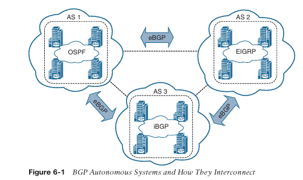

**Algoritmos de Vector de Distancia**

Los **protocolos de enrutamiento de vector de distancia**, como RIPv2, anuncian rutas como vectores, donde **distancia** es una métrica o costo (como el número de saltos) y **vector** es la dirección IP del router de siguiente salto utilizada para alcanzar una red de destino:

- **Distancia:** La distancia es la métrica de la ruta para llegar a la red.
    
- **Vector:** El vector es la interfaz o dirección para llegar a la red.
    

Cuando un router recibe información de enrutamiento de un vecino, almacena esa información en una base de datos de enrutamiento local a medida que se recibe, y el algoritmo de vector de distancia (como los algoritmos Bellman-Ford y Ford-Fulkerson) se utiliza para determinar qué rutas son las mejores rutas libres de bucles hacia cada destino. Una vez que se determinan las mejores rutas, se instalan en la tabla de enrutamiento y se anuncian a cada router vecino.

Los routers que ejecutan protocolos de vector de distancia anuncian la información de enrutamiento a sus vecinos desde su propia perspectiva, modificada a partir de la información original recibida. Por lo tanto, un protocolo de vector de distancia no tiene un mapa completo de toda la red; en su lugar, su base de datos refleja lo que un vecino sabe sobre cómo llegar a la red de destino y cuán lejos está ese vecino de la red de destino. La ventaja de los protocolos de vector de distancia es que requieren menos CPU y memoria y pueden ejecutarse en routers de gama baja.

Una analogía común utilizada para describir los protocolos de vector de distancia es una señal en una intersección que indica que el destino está a 2 millas hacia el oeste; los conductores confían ciegamente en esa información, sin saber realmente si existe un camino más corto o mejor hacia el destino o si la señal es siquiera correcta. La Figura 6-2 ilustra cómo un router que utiliza un protocolo de vector de distancia ve la red y la dirección que R3 necesita tomar para llegar a la red 192.168.1.0/24.

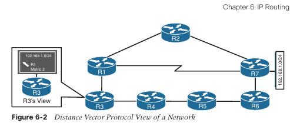

Un **protocolo de vector de distancia** selecciona una ruta basándose únicamente en la distancia. No tiene en cuenta las velocidades de los enlaces ni otros factores. En la Figura 6-2, el enlace entre R1 y R7 es un enlace serial con solo 64 Kbps de ancho de banda, mientras que todos los demás enlaces son enlaces Ethernet de 1 Gbps. RIPv2 no toma esto en consideración y reenvía el tráfico a través del enlace serial, lo que dará como resultado pérdida de paquetes cuando ese enlace esté sobresuscrito.

**Algoritmos de Vector de Distancia Mejorados**

El **algoritmo de actualización por difusión (DUAL)** es un algoritmo de vector de distancia mejorado que EIGRP utiliza para calcular la ruta más corta hacia una red de destino dentro de un dominio de enrutamiento. EIGRP anuncia información de red a sus vecinos como otros protocolos de vector de distancia, pero tiene algunas mejoras, como su nombre lo sugiere. A continuación se enumeran algunas de las mejoras introducidas por este algoritmo en comparación con otros algoritmos de vector de distancia:

- Ofrece un tiempo de convergencia rápido ante cambios en la topología de la red.
    
- Envía actualizaciones solo cuando hay un cambio en la topología. No envía actualizaciones completas de la tabla de enrutamiento de forma periódica, como suelen hacerlo los protocolos de vector de distancia.
    
- Utiliza mensajes hello y forma relaciones de vecindad al igual que los protocolos de estado de enlace.
    
- Puede utilizar ancho de banda, retardo, fiabilidad, carga y tamaño máximo de unidad de transmisión (MTU) en lugar del conteo de saltos para los cálculos de rutas.
    
- Tiene la opción de balancear tráfico entre rutas de costo igual o de costo desigual.
    

EIGRP a veces se denomina un **protocolo de enrutamiento híbrido** porque tiene características tanto de los protocolos de vector de distancia como de los de estado de enlace, como se muestra en la lista anterior. EIGRP se basa en métricas más avanzadas que el conteo de saltos (por ejemplo, ancho de banda) para sus cálculos de mejor ruta. De forma predeterminada, EIGRP anuncia el retardo total del camino y el ancho de banda mínimo para una ruta. Esta información se anuncia en todas las direcciones, como ocurre con un protocolo de vector de distancia; sin embargo, cada router puede calcular la mejor ruta basándose en la información proporcionada por sus vecinos directos.

La Figura 6-3 muestra la topología anterior, pero ahora incluye los cálculos de métrica de EIGRP para cada uno de los enlaces, donde se prefiere la métrica más baja. R3 intenta reenviar paquetes hacia la red de destino 192.168.1.0/24. Si el dominio de enrutamiento usara un protocolo de vector de distancia, como RIPv2, seleccionaría la ruta R3–R1–R7, que es la ruta más corta hacia el destino basada en el conteo de saltos (dos saltos), pero no puede soportar tráfico por encima de 64 Kbps. Aunque EIGRP seleccionaría la ruta R3–R1–R2–R7, que es una ruta más larga (tres saltos), proporciona más ancho de banda y no tiene tanto retardo (debido al proceso de serialización en interfaces de menor velocidad).

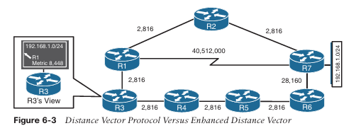

**Algoritmos de Estado de Enlace**

Un **protocolo de enrutamiento dinámico de estado de enlace** anuncia el estado del enlace y la métrica del enlace para cada uno de sus enlaces conectados y para los routers directamente conectados a todos los routers de la red. **OSPF** e **IS-IS** son dos **protocolos de enrutamiento de estado de enlace** comúnmente utilizados en redes empresariales y de proveedores de servicios. Las actualizaciones de OSPF se denominan **anuncios de estado de enlace (LSA)**, y las de IS-IS utilizan **paquetes de estado de enlace (LSP)** para sus anuncios.

A medida que un router recibe un anuncio de un vecino, almacena la información en una base de datos local llamada **base de datos de estado de enlace (LSDB)** y anuncia la información de estado de enlace a cada uno de sus routers vecinos exactamente como la recibió. La información de estado de enlace se inunda esencialmente por toda la red, sin cambios, de router en router, tal como la anunció el router de origen. Esto permite que todos los routers de la red tengan un mapa sincronizado e idéntico de la red.

Utilizando el mapa completo de la red, cada router ejecuta el **algoritmo de Dijkstra de camino más corto (SPF)** para calcular la mejor ruta libre de bucles. El algoritmo de estado de enlace luego rellena la tabla de enrutamiento con esta información.

Debido a que tienen el mapa completo de la red, los protocolos de estado de enlace suelen requerir más CPU y memoria que los protocolos de vector de distancia, pero son menos propensos a bucles de enrutamiento y permiten rutas más precisas. Además, los protocolos de estado de enlace están equipados con capacidades extendidas como **LSA opacos** para OSPF y **TLV (tipo/longitud/valor)** para IS-IS que les permiten soportar funciones comúnmente utilizadas por los proveedores de servicios, como la ingeniería de tráfico MPLS.

Una analogía de los protocolos de estado de enlace es un sistema de navegación GPS. El sistema GPS tiene un mapa completo y puede tomar la mejor decisión sobre cuál es el camino más corto y óptimo para llegar a un destino. La Figura 6-4 ilustra cómo R3 vería el dominio de enrutamiento y usaría esta información para calcular el mejor camino libre de bucles hacia la red de destino 192.168.1.0/24, que sería la ruta **R3→R1→R4**, basada en la métrica más baja.

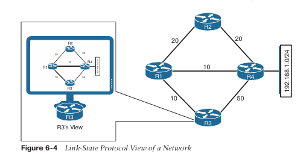

**Algoritmos de Estado de Enlace**

Un **protocolo de enrutamiento dinámico de estado de enlace** anuncia el estado del enlace y la métrica del enlace para cada uno de sus enlaces conectados y para los routers directamente conectados a todos los routers de la red. **OSPF** e **IS-IS** son dos **protocolos de enrutamiento de estado de enlace** comúnmente utilizados en redes empresariales y de proveedores de servicios. Los anuncios de OSPF se denominan **anuncios de estado de enlace (LSA)** y los de IS-IS utilizan **paquetes de estado de enlace (LSP)** para sus anuncios.

Cuando un router recibe un anuncio de un vecino, almacena la información en una base de datos local llamada **base de datos de estado de enlace (LSDB)** y anuncia la información de estado de enlace a cada uno de sus routers vecinos exactamente como la recibió. La información de estado de enlace se inunda esencialmente por toda la red, sin cambios, de router en router, tal como la anunció el router de origen. Esto permite que todos los routers de la red tengan un mapa sincronizado e idéntico de la red.

Utilizando el mapa completo de la red, cada router ejecuta el **algoritmo de camino más corto primero de Dijkstra (SPF)** para calcular las mejores rutas libres de bucles. El algoritmo de estado de enlace luego rellena la tabla de enrutamiento con esta información.

Debido a que poseen el mapa completo de la red, los protocolos de estado de enlace normalmente requieren más CPU y memoria que los protocolos de vector de distancia, pero son menos propensos a bucles de enrutamiento y permiten rutas más precisas. Además, los protocolos de estado de enlace están equipados con capacidades extendidas como **LSA opacos** para OSPF y **TLV (tipo/longitud/valor)** para IS-IS, lo que les permite soportar funciones comúnmente utilizadas por los proveedores de servicios, como la ingeniería de tráfico MPLS.

Una analogía de los protocolos de estado de enlace es un sistema de navegación GPS. El sistema GPS tiene un mapa completo y puede tomar la mejor decisión sobre cuál es el camino más corto y óptimo para llegar a un destino. La Figura 6-4 ilustra cómo R3 vería el dominio de enrutamiento y utilizaría esta información para calcular el mejor camino libre de bucles hacia la red de destino 192.168.1.0/24, que sería la ruta **R3→R1→R4**, basada en la métrica más baja.

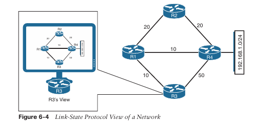

**Algoritmo de Vector de Ruta**

Un **protocolo de vector de ruta**, como **BGP**, es similar a un protocolo de vector de distancia; la diferencia es que, en lugar de basarse en la distancia para determinar la mejor ruta libre de bucles, utiliza varios **atributos de ruta BGP**. Los atributos de ruta BGP incluyen el **camino de sistema autónomo (AS_Path)**, **MED (multi-exit discriminator)**, **origen**, **siguiente salto (next hop)**, **preferencia local**, **agregación atómica** y **agregador**. Los atributos de ruta BGP se cubren en el Capítulo 11, “BGP”, y el Capítulo 12, “BGP Avanzado”.

Un protocolo de vector de ruta garantiza rutas libres de bucles manteniendo un registro de cada sistema autónomo por el que atraviesa un anuncio de enrutamiento. Cada vez que un router recibe un anuncio en el que ya forma parte del **AS_Path**, el anuncio se rechaza porque aceptar ese AS_Path provocaría un bucle de enrutamiento.

La Figura 6-5 ilustra el concepto de prevención de bucles mediante los siguientes pasos:

1. **R1 (AS 1)** anuncia el prefijo **10.1.1.0/24** a **R2 (AS 2)**. R1 añade **AS 1** al **AS_Path** durante el anuncio de la ruta hacia R2.
    
2. **R2** anuncia el prefijo **10.1.1.0/24** a **R4** y añade **AS 2** al **AS_Path** durante el anuncio de la ruta hacia R4.
    
3. **R4** anuncia el prefijo **10.1.1.0/24** a **R3** y añade **AS 4** al **AS_Path** durante el anuncio de la ruta hacia R3.
    
4. **R3** anuncia el prefijo **10.1.1.0/24** de vuelta a **R1** y **R2** después de añadir **AS 3** al **AS_Path** durante el anuncio de la ruta.
    
5. Cuando **R1** recibe el anuncio de ruta desde **R3**, ignora el anuncio porque detecta su **AS (AS 1)** en el **AS_Path “3 4 2 1”** y considera el anuncio como un bucle. **R2** también ignora el anuncio de ruta desde **R3** al detectar su **AS (AS 2)** en el **AS_Path “3 4 2 1”** y también lo considera un bucle.
    

> **NOTA:** La Figura 6-5 no muestra el anuncio del prefijo **10.1.1.0/24** desde **R1** hacia **R3** para facilitar la visualización, pero el proceso también ocurre en la otra dirección. **R3** intenta anunciar el prefijo **10.1.1.0/24** a **R2** (y **R4**) y **R2** también anunciará el prefijo a **R1**. **R1** ignora el anuncio de ruta porque detecta su **AS (AS 1)** en el **AS_Path** y también lo considera un bucle.

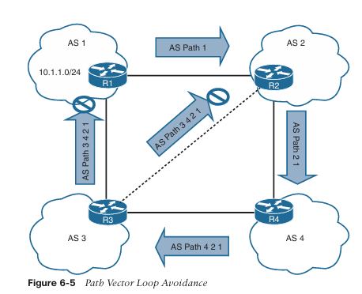

**Selección de Ruta (Path Selection)**  
Un router identifica la ruta que debe seguir un paquete evaluando la longitud del prefijo que está programada en la **Forwarding Information Base (FIB)**. La FIB se programa a través de la tabla de enrutamiento, también conocida como **Routing Information Base (RIB)**. La RIB está compuesta por rutas presentadas por los procesos de enrutamiento. La selección de ruta tiene tres componentes principales:

- **Longitud del prefijo:** La longitud del prefijo representa el número de bits binarios iniciales en la máscara de subred que están en 1.
    
- **Distancia administrativa:** La **distancia administrativa (AD)** es una valoración del nivel de confianza de una fuente de información de enrutamiento. Si un router aprende una ruta hacia un destino desde más de un protocolo de enrutamiento y todas las rutas tienen la misma longitud de prefijo, entonces se compara la AD.
    
- **Métricas:** Una métrica es una unidad de medida utilizada por un protocolo de enrutamiento en el cálculo de la mejor ruta. Las métricas varían de un protocolo de enrutamiento a otro.
    

**Longitud del Prefijo (Prefix Length)**  
Veamos un escenario en el que un router selecciona una ruta cuando el destino del paquete se encuentra dentro del rango de red de múltiples rutas. Supongamos que un router tiene las siguientes rutas con diferentes longitudes de prefijo en la tabla de enrutamiento:

- 10.0.3.0/28
    
- 10.0.3.0/26
    
- 10.0.3.0/24
    

Cada una de estas rutas, también conocidas como **rutas de prefijo** o simplemente **prefijos**, tiene una longitud de prefijo (máscara de subred) diferente. Las rutas se consideran destinos distintos y todas se instalan en la RIB, también conocida como la tabla de enrutamiento. La tabla de enrutamiento también incluye la interfaz de salida y la dirección IP del siguiente salto (a menos que el prefijo sea una red conectada). La Tabla 6-2 muestra esta tabla de enrutamiento. Se ha proporcionado el rango de direcciones IP aplicable para ayudar a ilustrar el concepto.

**Tabla 6-2 Representación de la Tabla de Enrutamiento**

|Prefijo|Rango de direcciones IP|Next Hop|Interfaz de salida|
|---|---|---|---|
|10.0.3.0/28|10.0.3.0–10.0.3.15|10.1.1.1|GigabitEthernet 1/1|
|10.0.3.0/26|10.0.3.0–10.0.3.63|10.2.2.2|GigabitEthernet 2/2|
|10.0.3.0/24|10.0.3.0–10.0.3.255|10.3.3.3|GigabitEthernet 3/3|
Si un paquete necesita ser reenviado, la ruta elegida depende de la **longitud del prefijo**, donde **siempre se prefiere la longitud de prefijo más larga**. Por ejemplo, /28 se prefiere sobre /26, y /26 se prefiere sobre /24. El siguiente es un ejemplo, usando la Tabla 6-2 como referencia:

- Si un paquete necesita ser reenviado a **10.0.3.14**, el router hace coincidir las tres rutas, ya que encaja dentro de todos los rangos de direcciones IP. Pero el paquete se reenvía al siguiente salto **10.1.1.1** con la interfaz de salida **GigabitEthernet 1/1**, porque **10.0.3.0/28** tiene la coincidencia de prefijo más larga.
    
- Si un paquete necesita ser reenviado a **10.0.3.42**, el router hace coincidir los prefijos **10.0.3.0/24** y **10.0.3.0/26**. Pero el paquete se reenvía a **10.2.2.2** con la interfaz de salida **GigabitEthernet 2/2**, porque **10.0.3.0/26** tiene la coincidencia de prefijo más larga.
    
- Si un paquete necesita ser reenviado a **10.0.3.100**, el router solo hace coincidir el prefijo **10.0.3.0/24**. El paquete se reenvía a **10.3.3.3** con la interfaz de salida **GigabitEthernet 3/3**.
    

La decisión de reenvío es una función de la **FIB** y resulta de los cálculos realizados en la **RIB**. La RIB se calcula mediante la combinación de métricas del protocolo de enrutamiento y la distancia administrativa.

**Distancia Administrativa (Administrative Distance)**  
Cuando un router ejecuta múltiples protocolos de enrutamiento, a medida que cada protocolo recibe actualizaciones de rutas y otra información de enrutamiento, cada protocolo elige la mejor ruta hacia cualquier destino dado, y cada uno intenta instalar esta ruta en la tabla de enrutamiento. La **Tabla 6-3** proporciona las **distancias administrativas (AD)** predeterminadas para una variedad de protocolos de enrutamiento.

**Tabla 6-3 Distancias Administrativas Predeterminadas de Protocolos de Enrutamiento**

|Origen de la Ruta|Distancia Administrativa Predeterminada|
|---|---|
|Interfaz conectada directamente|0|
|Ruta estática|1|
|Ruta resumen EIGRP|5|
|Ruta BGP externa (eBGP)|20|
|Ruta EIGRP (interna)|90|
|Ruta OSPF|110|
|Ruta IS-IS|115|
|Ruta RIPv2|120|
|Ruta EIGRP (externa)|170|
|Ruta BGP interna (iBGP)|200|
> **NOTA**  Cuando una ruta estática apunta a una interfaz de salida conectada directamente para alcanzar el siguiente salto en lugar de usar la dirección IP del siguiente salto, se le asigna la misma **distancia administrativa predeterminada de 0** que a una interfaz conectada directamente. Este tema se cubre en la sección **“Rutas estáticas conectadas directamente”** de este capítulo.

La **RIB** se programa a partir de los distintos procesos de protocolos de enrutamiento. Cada protocolo de enrutamiento presenta la misma información para la inserción en la RIB: la red de destino, la dirección IP del siguiente salto, la **AD** y los valores de **métrica**. La RIB acepta o rechaza una ruta según la siguiente lógica:

- Si la ruta no existe en la RIB, la ruta es aceptada.
    
- Si la ruta existe en la RIB, se debe comparar la AD. Si la AD de la ruta que ya está en la RIB es menor que la de la nueva ruta enviada, la nueva ruta es rechazada y se notifica al proceso de enrutamiento que la envió.
    
- Si la ruta existe en la RIB, se debe comparar la AD. Si la AD de la ruta que ya está en la RIB es mayor que la de la nueva ruta enviada, la ruta es aceptada e instalada, y se notifica al protocolo de origen actual de la eliminación de la entrada de la RIB.
    

Considere otro ejemplo sobre este tema. Suponga que un router ejecuta **OSPF, IS-IS y EIGRP**, y que todos los protocolos aprenden una ruta hacia la red de destino **10.3.3.0/24** con una ruta y métrica diferentes.

Cada uno de estos tres protocolos intenta instalar la ruta **10.3.3.0/24** en la tabla de enrutamiento. Como la longitud de prefijo es la misma, el siguiente punto de decisión es la **AD**, donde el protocolo de enrutamiento con la **AD más baja** instala la ruta en la tabla de enrutamiento.

Debido a que la ruta interna de **EIGRP** tiene la mejor AD, es la que se instala en la tabla de enrutamiento, como se demuestra en la **Tabla 6-4**.

**Tabla 6-4 Selección de Ruta desde la RIB**

|Protocolo de Enrutamiento|AD|Red|Se instala en la RIB|
|---|---|---|---|
|EIGRP|90|10.3.3.0/24|✓|
|OSPF|110|10.3.3.0/24|X|
|IS-IS|115|10.3.3.0/24|X|

El protocolo o protocolos de enrutamiento que no lograron instalar su ruta en la tabla (en este ejemplo, **OSPF** e **IS-IS**) dependen del proceso de la tabla de enrutamiento para informarles si la mejor ruta falla, de modo que puedan intentar reinstalar esta ruta.

Por ejemplo, si la ruta **EIGRP 10.3.3.0/24** instalada en la tabla de enrutamiento falla por alguna razón, el proceso de la tabla de enrutamiento llama a **OSPF** e **IS-IS** y les solicita que reinstalen la ruta en la tabla de enrutamiento. De estos dos protocolos, la ruta preferida se elige en función de la **AD**, que sería **OSPF** debido a su menor AD.

Comprender el orden de procesamiento desde un router es crítico porque, en algunos escenarios, la ruta con la AD más baja no siempre puede instalarse en la RIB. Por ejemplo, el proceso de selección de rutas de **BGP** podría elegir una ruta **iBGP** en lugar de una ruta **eBGP**. Por lo tanto, BGP presentaría una ruta con una AD de **200**, no **20**, a la RIB, lo que podría permitir que una ruta aprendida vía **OSPF** con una AD de **110** gane. Estas situaciones son poco comunes; sin embargo, recuerde que la **mejor ruta es la del protocolo de enrutamiento presentada a la RIB cuando se compara la AD**.

**NOTA**  
La AD predeterminada no siempre puede ser adecuada para una red; por ejemplo, puede existir el requisito de ajustar la AD para que las rutas OSPF sean preferidas sobre las rutas EIGRP. Sin embargo, cambiar la AD en los protocolos de enrutamiento puede tener consecuencias graves, como bucles de enrutamiento y otros comportamientos anómalos en una red. Se recomienda que la AD se modifique solo con extrema precaución y únicamente después de haber analizado cuidadosamente lo que se necesita lograr.

**Métricas**  
La lógica para seleccionar la mejor ruta para un protocolo de enrutamiento puede variar. La mayoría de los **IGP** prefieren rutas aprendidas internamente sobre rutas externas y, adicionalmente, priorizan la ruta con la métrica más baja.

**Multipath de Costo Igual**  
Si un protocolo de enrutamiento identifica múltiples rutas como la mejor ruta y admite múltiples rutas en sus tablas, limita el número máximo de rutas permitidas por destino. Esto se conoce como **multipath de costo igual (ECMP)** y proporciona balanceo de carga a través de todos los enlaces. **RIPv2, EIGRP, OSPF e IS-IS** admiten ECMP. ECMP proporciona un mecanismo para aumentar el ancho de banda a través de múltiples rutas al dividir el tráfico de manera equitativa entre los enlaces.

La **Figura 6-6** ilustra cuatro routers ejecutando **OSPF**. Los cuatro routers pertenecen a la misma área y utilizan la misma métrica de costo por interfaz. **R1** tiene dos rutas con costo igual para alcanzar la red **10.3.3.0/24**. **R1** instala ambas rutas en la tabla de enrutamiento y reenvía el tráfico a través de las rutas **R1→R2→R3** y **R1→R4→R3** para alcanzar la red **10.3.3.0/24**.

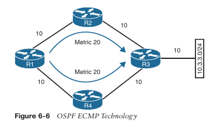

La salida del **Ejemplo 6-1** confirma que ambas rutas han sido instaladas en la **RIB** y, como las métricas son idénticas, el router está utilizando **ECMP**.

**Example 6-1:** R1’s Routing Table, Showing the ECMP Paths to 10.3.3.0/24
```
R1# show ip route
! Output omitted for brevity
O    10.3.3.0/24 [110/30] via 10.12.1.2, 00:49:12, GigabitEthernet0/2
                   [110/30] via 10.14.1.4, 00:49:51, GigabitEthernet0/4
```

**Balanceo de Carga de Costo Desigual**

De forma predeterminada, los protocolos de enrutamiento instalan únicamente rutas con la métrica de ruta más baja. Sin embargo, **EIGRP** puede configurarse (no está habilitado por defecto) para instalar múltiples rutas con métricas de ruta diferentes. Esta configuración permite **balanceo de carga de costo desigual** entre múltiples rutas. El tráfico se transmite por las interfaces del router en una proporción basada en la métrica de ruta asociada a cada interfaz.

La **Figura 6-7** muestra una topología con cuatro routers ejecutando **EIGRP**. El retardo se ha incrementado en la interfaz **Gi0/2** de **R3** de **1** a **10 μs**. **R1** ve dos rutas con métricas diferentes. La ruta desde **R1→R2→R3** tiene asignada una métrica de **5632**, y la ruta **R1→R4→R3** tiene asignada una métrica de **3328**.

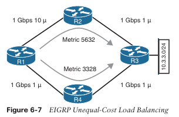

El **Ejemplo 6-2** muestra la tabla de enrutamiento de **R1**. Observe que las métricas son diferentes para cada ruta hacia la red **10.3.3.0/24**.

**Example 6-2:** R1’s Routing Table, Showing the Unequal-Cost Load Balancing
```
R1# show ip route eigrp
! Output omitted for brevity
Gateway of last resort is not set

     10.0.0.0/8 is variably subnetted, 7 subnets, 2 masks
D    10.3.3.0/24 [90/3328] via 10.14.1.4, 00:00:02, GigabitEthernet0/4
                 [90/5632] via 10.12.1.2, 00:00:02, GigabitEthernet0/2
```

La ruta explícita debe visualizarse para ver el tráfico con **balanceo de carga de costo desigual**. En el **Ejemplo 6-3**, **R1** reenvía **71** paquetes hacia **R2** por cada **120** paquetes que se reenvían hacia **R4**.

**Example 6-3:** Viewing the Unequal-Cost Load Balancing Ratio
```
R1# show ip route 10.3.3.0
Routing entry for 10.3.3.0/24
  Known via "eigrp 100", distance 90, metric 3328, type internal
  Redistributing via eigrp 100
  Last update from 10.14.1.4 on GigabitEthernet0/4, 00:00:53 ago
  Routing Descriptor Blocks:
  * 10.14.1.4, from 10.14.1.4, 00:00:53 ago, via GigabitEthernet0/4
      Route metric is 3328, traffic share count is 120
      Total delay is 30 microseconds, minimum bandwidth is 1000000 Kbit
      Reliability 255/255, minimum MTU 1500 bytes
      Loading 1/255, Hops 2
    10.12.1.2, from 10.12.1.2, 00:00:53 ago, via GigabitEthernet0/2
      Route metric is 5632, traffic share count is 71
      Total delay is 120 microseconds, minimum bandwidth is 1000000 Kbit
      Reliability 255/255, minimum MTU 1500 bytes
      Loading 1/255, Hops 2
```

**Static Routing**

Las rutas estáticas proporcionan un control preciso sobre el enrutamiento, pero pueden crear una carga administrativa a medida que aumenta el número de routers y segmentos de red. El uso de enrutamiento estático consume **cero ancho de banda de red**, ya que la implementación de entradas manuales de rutas no requiere comunicación con otros routers.

Desafortunadamente, debido a que los routers no se comunican entre sí, no existe inteligencia de red. Si un enlace se cae, otros routers no sabrán que la ruta de red ya no es válida.  
Las rutas estáticas son útiles cuando:

- Los protocolos de enrutamiento dinámico no pueden usarse en un router debido a CPU o memoria limitadas.
    
- Las rutas aprendidas de protocolos de enrutamiento dinámico necesitan ser reemplazadas.
    

**Static Route Types**

Las rutas estáticas pueden clasificarse como una de las siguientes:

- Rutas estáticas directamente conectadas
    
- Rutas estáticas recursivas
    
- Rutas estáticas completamente especificadas
    

**Directly Attached Static Routes**

Las interfaces seriales punto a punto (P2P) no necesitan mantener una adyacencia ni usar el Protocolo de Resolución de Direcciones (ARP), por lo que las rutas estáticas pueden referenciar directamente la interfaz de salida de un router. Una ruta estática que utiliza únicamente la interfaz de salida como siguiente salto se conoce como una **ruta estática directamente conectada**, y requiere que la interfaz de salida esté en estado _up_ para que la ruta se instale en la RIB.

Las rutas estáticas directamente conectadas se configuran con el comando:

```
ip route network subnet-mask next-hop-interface-id
```

La **Figura 6-8** ilustra a R1 conectándose a R2 mediante una conexión serial. R1 utiliza una ruta estática directamente conectada hacia la red **10.22.22.0/24**, y R2 utiliza una ruta estática directamente conectada hacia la red **10.11.11.0/24** para permitir conectividad bidireccional entre las dos redes remotas. Se requieren rutas estáticas en ambos routers para que el tráfico de retorno tenga un camino de regreso.

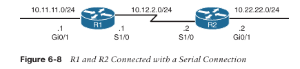

**El Ejemplo 6-4** muestra la configuración de R1 y R2 usando rutas estáticas con interfaces seriales 1/0. R1 indica que la red **10.22.22.0/24** es alcanzable a través de la interfaz **S1/0**, y R2 indica que la red **10.11.11.0/24** es alcanzable a través de la interfaz **S1/0**.

**Example 6-4:** Configuring Directly Attached Static Routes
```
R1# configure term
Enter configuration commands, one per line. End with CNTL/Z.
R1(config)# ip route 10.22.22.0 255.255.255.0 Serial 1/0

R2# configure term
Enter configuration commands, one per line. End with CNTL/Z.
R2(config)# ip route 10.11.11.0 255.255.255.0 Serial 1/0
```

**El Ejemplo 6-5** muestra la tabla de enrutamiento con la ruta estática configurada.  
Una ruta estática directamente conectada **no muestra información de [AD/Métrica]** cuando se visualiza en la tabla de enrutamiento.  
Obsérvese que la ruta estática se muestra como **directly connected** junto con la interfaz de salida.

**Example 6-5:** R1 and R2 Routing Table
```
R1# show ip route
! Output omitted for brevity
Gateway of last resort is not set

     10.0.0.0/8 is variably subnetted, 5 subnets, 2 masks
C    10.11.11.0/24 is directly connected, GigabitEthernet0/1
C    10.12.2.0/24 is directly connected, Serial1/0
S    10.22.22.0/24 is directly connected, Serial1/0

R2# show ip route
! Output omitted for brevity
Gateway of last resort is not set

     10.0.0.0/8 is variably subnetted, 5 subnets, 2 masks
S    10.11.11.0/24 is directly connected, Serial1/0
C    10.12.2.0/24 is directly connected, Serial1/0
C    10.22.22.0/24 is directly connected, GigabitEthernet0/1
```

> **NOTA**  Configurar una ruta estática directamente conectada hacia una interfaz que utiliza ARP (es decir, Ethernet) puede causar problemas y no es recomendable. El router debe repetir el proceso ARP para cada destino que coincida con la ruta estática, lo que consume CPU y memoria. Dependiendo del tamaño del prefijo de la ruta estática y del número de búsquedas, la configuración puede causar inestabilidad del sistema.

**Rutas Estáticas Recursivas**  
El motor de reenvío en los dispositivos Cisco necesita saber qué interfaz debe usar un paquete de salida. Una **ruta estática recursiva** especifica la dirección IP del siguiente salto. La búsqueda recursiva ocurre cuando el router consulta la RIB para localizar la ruta hacia la dirección IP del siguiente salto (conectada, estática o dinámica) y luego cruza esa información con la tabla de adyacencias.

Las rutas estáticas recursivas se configuran con el comando `ip route network subnet-mask next-hop-ip`. Las rutas estáticas recursivas requieren que la dirección IP del siguiente salto exista en la tabla de enrutamiento para poder instalar la ruta estática en la RIB. Una ruta estática recursiva puede no resolver la dirección de reenvío del siguiente salto usando la ruta por defecto (0.0.0.0/0). La ruta estática fallará en los requisitos de alcanzabilidad del siguiente salto y no será instalada en la RIB.

La Figura 6-9 muestra una topología con R1 y R2 conectados usando el puerto Gi0/0. R1 utiliza una ruta estática recursiva hacia la red 10.22.22.0/24, y R2 utiliza una ruta estática recursiva hacia la red 10.11.11.0/24 para permitir conectividad entre estas redes.

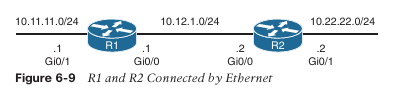

En el **Ejemplo 6-6**, la configuración de R1 indica que la red **10.22.22.0/24** es alcanzable a través de la dirección IP **10.12.1.2**, y la configuración de R2 indica que la red **10.11.11.0/24** es alcanzable a través de la dirección IP **10.12.1.1**.

**Ejemplo 6-6:** Configuring Recursive Static Routes
```
R1# configure term
Enter configuration commands, one per line. End with CNTL/Z.
R1(config)# ip route 10.22.22.0 255.255.255.0 10.12.1.2

R2# configure term
Enter configuration commands, one per line. End with CNTL/Z.
R2(config)# ip route 10.11.11.0 255.255.255.0 10.12.1.1
```

La salida del **Ejemplo 6-7** verifica que la ruta estática fue configurada en R1 para la red **10.22.22.0/24** con la dirección IP del siguiente salto **10.12.1.2**. Observa que la información de **[AD/Métrica]** está presente en la salida y que se muestra la dirección IP del siguiente salto.

**Ejemplo 6-7:** IP Routing Table for R1
```
R1# show ip route
! Output omitted for brevity

10.0.0.0/8 is variably subnetted, 5 subnets, 2 masks
C    10.11.11.0/24 is directly connected, GigabitEthernet0/1
C    10.12.1.0/24 is directly connected, GigabitEthernet0/0
S    10.23.1.0/24 [1/0] via 10.12.1.2
S    10.22.22.0/24 [1/0] via 10.12.1.2
```

Cisco admite la configuración de múltiples rutas estáticas recursivas. En la **Figura 6-10**, R1 necesita conectividad hacia la red **10.23.1.0/24** y hacia la red **10.33.33.0/24**.

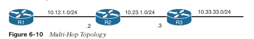

R1 podría configurar la ruta estática para la red **10.33.33.0/24** con una dirección IP de siguiente salto como **10.12.1.2** o **10.23.1.3**. Si R1 configura la ruta estática con la dirección IP de siguiente salto **10.23.1.3**, el router realiza una segunda búsqueda al construir la entrada CEF para la red **10.33.33.0/24**.

**Fully Specified Static Routes**

La recursión de rutas estáticas puede simplificar las topologías si un enlace falla, porque puede permitir que la ruta estática permanezca instalada mientras cambia a una interfaz de salida diferente en la misma dirección que el destino. Sin embargo, surgen problemas si la búsqueda recursiva se resuelve hacia una interfaz diferente que apunta en la dirección opuesta.

Para corregir este problema, la configuración de la ruta estática debe usar la interfaz de salida y la dirección IP del siguiente salto. Una ruta estática con una interfaz de salida y una dirección IP de siguiente salto se conoce como una **fully specified static route**. Si la interfaz listada no está en estado _up_, el router elimina la ruta estática de la RIB. Especificar la dirección IP del siguiente salto junto con la interfaz física elimina la búsqueda recursiva y no involucra los problemas de procesamiento ARP que ocurren cuando se usa solo la interfaz de salida.

Las rutas estáticas completamente especificadas se configuran con el comando:

```
ip route network subnet-mask interface-id next-hop-ip
```

Retomando la **Figura 6-9**, R1 y R2 usan rutas estáticas completamente especificadas para conectarse a las redes **10.11.11.0/24** y **10.22.22.0/24** usando la interfaz **Gi0/0**. La configuración se muestra en el **Ejemplo 6-8**.

**Example 6-8:** Configuring Fully Specified Static Routes
```
R1# configure term
Enter configuration commands, one per line. End with CNTL/Z.
R1(config)# ip route 10.22.22.0 255.255.255.0 GigabitEthernet0/0 10.12.1.2

R2# configure term
Enter configuration commands, one per line. End with CNTL/Z.
R2(config)# ip route 10.11.11.0 255.255.255.0 GigabitEthernet0/0 10.12.1.1
```

La salida del **Ejemplo 6-9** verifica que R1 solo puede alcanzar la red **10.22.22.0/24** a través de **10.12.1.2** desde la interfaz **Gi0/0**.

**Example 6-9:** Verifying the Fully Specified Static Route
```
R1# show ip route
! Output omitted for brevity

10.0.0.0/8 is variably subnetted, 5 subnets, 2 masks
C   10.11.11.0/24 is directly connected, GigabitEthernet0/1
C   10.12.1.0/24 is directly connected, GigabitEthernet0/0
S   10.22.22.0/24 [1/0] via 10.12.1.2, GigabitEthernet0/0
```

**Floating Static Routing**

La distancia administrativa (AD) por defecto de una ruta estática es **1**, pero una ruta estática puede configurarse con un valor de AD de **1 a 255** para una ruta específica. La AD se establece en una ruta estática añadiendo el valor de AD como parte de la estructura del comando.

El uso de una **floating static route** es una técnica común para proporcionar conectividad de respaldo para prefijos aprendidos mediante protocolos de enrutamiento dinámico. Una ruta estática flotante se configura con una AD más alta que la de la ruta primaria. Debido a que la AD es mayor que la de la ruta primaria, se instala en la RIB solo cuando la ruta primaria es retirada.

En la **Figura 6-11**, R1 y R2 están configurados con dos enlaces. La red de tránsito **10.12.1.0/24** es preferida sobre la red **10.12.2.0/24**.

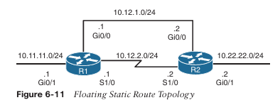

Example 6-10 muestra la configuración de la ruta estática flotante en R1, y R2 se configuraría de forma similar. La ruta estática que usa el enlace Ethernet (10.12.1.0/24) tiene una AD de 10, y el enlace serial (10.12.2.0/24) tiene una AD establecida en 210.

**Example 6-10:** Configuring the Floating Static Route for R1
```
R1# configure terminal
Enter configuration commands, one per line.  End with CNTL/Z.
R1(config)# ip route 10.22.22.0 255.255.255.0 10.12.1.2 10
R1(config)# ip route 10.22.22.0 255.255.255.0 Serial 1/0 210
```

Example 6-11 muestra las tablas de enrutamiento de R1. Observa que la ruta estática a través del enlace serial no se instala en la RIB. Solo la ruta estática por el enlace Ethernet (10.12.1.0/24) con una AD de 10 se instala en la RIB.

**Example 6-11:** Routing Table of R1 with a Floating Static Route
```
R1# show ip route
! Output omitted for brevity

Gateway of last resort is not set

     10.0.0.0/8 is variably subnetted, 5 subnets, 2 masks
C       10.11.11.0/24 is directly connected, GigabitEthernet0/1
C       10.12.1.0/24 is directly connected, GigabitEthernet0/0
C       10.12.2.0/24 is directly connected, Serial1/0
S       10.22.22.0/24 [10/0] via 10.12.1.2
```

Example 6-12 muestra la tabla de enrutamiento de R1 después de apagar el enlace Ethernet Gi0/0 para simular una falla de enlace. La red 10.12.1.0/24 (Gi0/0 de R1) se elimina de la RIB. La ruta estática flotante a través de la red 10.12.2.0/24 (Serial1/0 de R1) ahora es la mejor ruta y se instala en la RIB. Observa que la AD no se muestra para esa ruta estática.

**Example 6-12:** Routing Table After Ethernet Link Failure
```
R1# configure terminal
Enter configuration commands, one per line.  End with CNTL/Z.
R1(config)# interface GigabitEthernet0/0
R1(config-if)# shutdown

R1# show ip route
! Output omitted for brevity

Gateway of last resort is not set

     10.0.0.0/8 is variably subnetted, 5 subnets, 2 masks
C       10.11.11.0/24 is directly connected, GigabitEthernet0/1
C       10.12.2.0/24 is directly connected, Serial1/0
S       10.22.22.0/24 is directly connected, Serial1/0
```

Aunque la AD de la ruta estática no se muestra, sigue estando programada en la RIB. El **Example 6-13** muestra la entrada explícita de la red. La salida confirma que la ruta estática flotante con AD 210 está actualmente activa en la tabla de enrutamiento.

**Example 6-13:** Verifying the AD for the Floating Static Route
```
R1# show ip route 10.22.22.0
Routing entry for 10.22.22.0/24
  Known via "static", distance 210, metric 0 (connected)
  Route Descriptor Blocks:
  * directly connected, via Serial1/0
      Route metric is 0, traffic share count is 1
```

**Static Routes to Null Interfaces**

La interfaz **null** es una interfaz virtual que siempre está en estado _up_. Las interfaces null no reenvían ni reciben tráfico de red; en su lugar, descartan el tráfico destinado a ellas sin añadir sobrecarga a la CPU del router.

Configurar una ruta estática hacia una interfaz null proporciona un método para descartar tráfico de red sin requerir la configuración de una lista de acceso. Crear una ruta estática hacia **Null0** es una técnica común para prevenir bucles de enrutamiento. La ruta estática hacia la interfaz Null0 actúa como un rango de red resumido y enruta las rutas más específicas hacia el destino real.

La **Figure 6-12** muestra una topología común en la que la empresa ABC ha adquirido el rango de red 172.16.0.0/20 de su proveedor de servicios de Internet. ABC utiliza solo una parte de las direcciones asignadas, pero conserva el bloque de red grande anticipando crecimiento futuro.

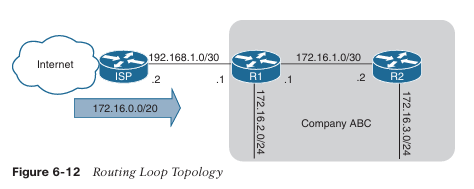

El proveedor de servicios coloca una ruta estática para la red **172.16.0.0/20** hacia la interfaz de R1 (**192.168.1.1**). R1 utiliza una ruta por defecto estática hacia el proveedor de servicios (**192.168.1.2**) y una ruta estática para la red **172.16.3.0/24** vía R2 (**172.16.1.2**). Como R2 accede a todas las demás redes a través de R1, una ruta por defecto estática apunta hacia la interfaz de R1 (**172.16.1.1**).

Si los paquetes se envían a cualquier dirección en el rango **172.16.0.0/20** que no sea utilizada por la empresa ABC, el paquete queda atrapado en un bucle entre R1 y el ISP, consumiendo ancho de banda adicional hasta que expira el TTL del paquete.

Por ejemplo, un equipo en Internet envía un paquete a **172.16.5.5**, y la red **172.16.5.0/24** no está asignada. R1 o R2 envían el paquete a R1 debido a la ruta estática **172.16.0.0/20**. R1 consulta la RIB, y la coincidencia de prefijo más larga para ese prefijo es la ruta por defecto de regreso al ISP, por lo que R1 envía el paquete de vuelta al ISP, creando el bucle de enrutamiento.

El **Example 6-14** muestra el bucle de enrutamiento cuando los paquetes se originan desde R2. Observe cómo la dirección IP del traceroute alterna entre la interfaz del router del ISP (**192.168.1.2**) y R1 (**192.168.1.1**).

**Example 6-14:** Packet Traces Demonstrating the Routing Loop
```
R2# trace 172.16.5.5 source GigabitEthernet 0/2

Type escape sequence to abort.
Tracing the route to 172.16.5.5

  1 172.16.1.1 0 msec 0 msec 0 msec
  2 192.168.1.1 0 msec 0 msec 0 msec
  3 192.168.1.2 0 msec 4 msec 0 msec
  4 192.168.1.1 0 msec 0 msec 0 msec
  5 192.168.1.2 0 msec 0 msec 0 msec

! Output omitted for brevity
```

Para prevenir el bucle de enrutamiento, se agrega una ruta estática para **172.16.0.0/20**, apuntando a la interfaz **Null0** en R1. Cualquier paquete que coincida con el rango de red **172.16.0.0/20** y que no tenga una coincidencia más específica en la RIB de R1 será descartado. El **Example 6-15** muestra la configuración de la ruta estática hacia null en R1 con la nueva ruta estática a Null0 añadida.

**Example 6-15:** R1 Static Route for 172.16.0.0/20 to Null0
```
R1
 ip route 0.0.0.0 0.0.0.0 Gi0/0 192.168.1.2
 ip route 172.16.3.0 255.255.255.0 Gi0/2 172.16.1.2
 ip route 172.16.0.0 255.255.240.0 Null0
```

La salida del **Example 6-16** confirma que la ruta estática hacia null ha eliminado el bucle de enrutamiento según lo previsto.

**Example 6-16:** Packet Traces Demonstrating Loop Prevention
```
R2# trace 172.16.5.5 source GigabitEthernet 0/2
Type escape sequence to abort.
Tracing the route to 172.16.5.5

  1 172.16.1.1 * * *
  2 172.16.1.1 * * *

! Output omitted for brevity
```

**IPv6 Static Routes**

Los principios de enrutamiento estático para rutas IPv4 son exactamente los mismos para IPv6. Es importante asegurarse de que el enrutamiento IPv6 esté habilitado usando el comando de configuración **ipv6 unicast-routing**. Las rutas estáticas IPv6 se configuran con el comando **ipv6 route network/prefix-length [next-hop-interface-id | next-hop-interface-id next-ipv6-address]**. La **Figure 6-13** muestra R1 y R2 con direccionamiento IPv6 para demostrar el enrutamiento estático.

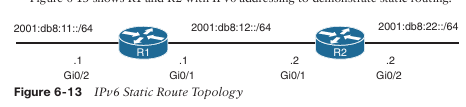

R1 necesita una ruta estática hacia la red **2001:db8:22::/64** de R2, y R2 necesita una ruta estática hacia la red **2001:db8:11::/64** de R1. El **Example 6-17** demuestra la configuración de rutas estáticas IPv6 para R1 y R2.

**Example 6-17:** Configuring the IPv6 Static Route
```
R1# configure terminal
Enter configuration commands, one per line. End with CNTL/Z.
R1(config)# ipv6 unicast-routing
R1(config)# ipv6 route 2001:db8:22::/64 2001:db8:12::2

R2# configure terminal
Enter configuration commands, one per line. End with CNTL/Z.
R2(config)# ipv6 unicast-routing
R2(config)# ipv6 route 2001:db8:11::/64 2001:db8:12::1
```

> **NOTE**  Si la dirección de next-hop es una dirección **IPv6 link-local**, la ruta estática debe ser una **ruta estática totalmente especificada**.

La tabla de enrutamiento IPv6 se muestra con el comando **show ipv6 route**, como se demuestra en el Example 6-18. El formato es casi idéntico al de la tabla de enrutamiento IPv4.

**Example 6-18:** Displaying IPv6 Routing Table
```
R1# show ipv6 route
! Output omitted for brevity
IPv6 Routing Table - default - 6 entries
Codes: C - Connected, L - Local, S - Static, U - Per-user Static route
       B - BGP, HA - Home Agent, MR - Mobile Router, R - RIP
       H - NHRP, I1 - ISIS L1, I2 - ISIS L2, IA - ISIS interarea
       IS - ISIS summary, D - EIGRP, EX - EIGRP external, NM - NEMO
       ND - ND Default, NDP - ND Prefix, DCE - Destination, NDr - Redirect
       RL - RPL, O - OSPF Intra, OI - OSPF Inter, OE1 - OSPF ext 1
       OE2 - OSPF ext 2, ON1 - OSPF NSSA ext 1, ON2 - OSPF NSSA ext 2
       la - LISP alt, lr - LISP site-registrations, ld - LISP dyn-eid
       lA - LISP away, a - Application
C   2001:db8:11::/64 [0/0]
     via GigabitEthernet0/2, directly connected
C   2001:db8:12::/64 [0/0]
     via GigabitEthernet0/1, directly connected
S   2001:db8:22::/64 [1/0]
     via 2001:DB8:12::2
```

La conectividad se puede verificar con los comandos **traceroute** o **ping**. El Example 6-19 muestra a R1 haciendo ping a la dirección IPv6 **2001:db8:22::2** de R2.

**Example 6-19:** Verifying IPv6 Routing
```
R1# ping 2001:db8:22::2
Type escape sequence to abort.
Sending 5, 100-byte ICMP Echos to 2001:DB8:22::2, timeout is 2 seconds:
!!!!!
Success rate is 100 percent (5/5), round-trip min/avg/max = 1/1/4 ms
```

**Enrutamiento basado en políticas (Policy-based Routing)**

Un router toma decisiones de reenvío basándose en las direcciones de destino de los paquetes IP. Algunos escenarios requieren otros factores, como la longitud del paquete o la dirección de origen, al decidir dónde debe reenviar el router un paquete.

El **enrutamiento basado en políticas (PBR)** permite el reenvío condicional de paquetes basándose en características del paquete distintas de la dirección IP de destino.

PBR proporciona las siguientes capacidades:

- Enrutamiento por tipo de protocolo (ICMP, TCP, UDP, etc.)
    
- Enrutamiento por dirección IP de origen, dirección IP de destino, o ambas
    
- Asignación manual de diferentes rutas hacia el mismo destino, basada en tolerancia a la latencia, velocidad del enlace o utilización para tráfico transitorio específico
    

Algunas de las desventajas del enrutamiento condicional incluyen las siguientes:

- Carga administrativa en términos de escalabilidad
    
- Falta de inteligencia de red
    
- Complejidad en la resolución de problemas
    
- No todas las opciones de configuración son compatibles con todas las plataformas de hardware
    

Los paquetes se examinan para el procesamiento PBR a medida que se reciben en la interfaz del router. Las políticas PBR locales también pueden identificar tráfico que se origina en el propio router.

PBR verifica la existencia de la dirección IP del siguiente salto y luego reenvía los paquetes usando la dirección de siguiente salto especificada. También se pueden configurar múltiples direcciones de siguiente salto, de modo que si la primera dirección de siguiente salto no existe en la Base de Información de Enrutamiento (RIB), se puedan usar las direcciones secundarias. Si ninguna de las direcciones de siguiente salto especificadas existe en la tabla de enrutamiento, los paquetes no se reenvían de forma condicional.

> **NOTE**  Las políticas PBR no modifican la RIB porque las políticas no son universales para todos los paquetes. Debido a que PBR no cambia la RIB, la resolución de problemas puede volverse más compleja, ya que la tabla de enrutamiento muestra las direcciones de siguiente salto aprendidas por el protocolo de enrutamiento, pero no muestra una dirección de siguiente salto diferente para el tráfico condicional.

La Figura 6-14 proporciona una topología de ejemplo para ilustrar los conceptos de PBR. R1, R2, R3, R4 y R5 están configurados con OSPF. El tráfico entre R2 y R5 fluye a través de la red 10.24.1.0/24 porque enviar tráfico hacia R3 resulta en un costo mayor para ese enlace y tiene un costo adicional para el segundo enlace.

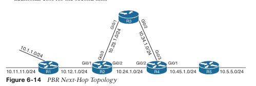

El **Ejemplo 6-20** demuestra la ruta normal del tráfico usando **traceroute** entre las redes **10.11.1.0/24** y **10.5.5.0/24** sin PBR configurado.

**Example 6-20:** traceroute for Normal Traffic Flow
```
R1# traceroute 10.5.5.5 source 10.1.1.1
Type escape sequence to abort.
Tracing the route to 10.5.5.5

 1 10.12.1.2 5 msec 7 msec 3 msec
 2 10.24.1.4 3 msec 5 msec 13 msec
 3 10.45.1.5 5 msec * 4 msec
```

El **Ejemplo 6-21** demuestra que, después de configurar una política PBR en **R2** para establecer el siguiente salto hacia **10.23.1.3** para el tráfico con origen en la red **10.11.1.0/24** de **R1**, la ruta tomada desde la red **10.11.0/24** ya no cruza la red **10.24.1.0/24** y, en su lugar, avanza a través de **R3**.  
El tráfico con origen en la red **10.11.11.0/24** de **R1** no cumple con los criterios de la política PBR y utiliza la tabla de enrutamiento. Este tráfico sigue la ruta mostrada anteriormente en el **Ejemplo 6-20**.

**Example 6-21** R1 to R5 Paths Demonstrating PBR Selective Engagement
```
R1# traceroute 10.5.5.5 source 10.1.1.1
Type escape sequence to abort.
Tracing the route to 10.5.5.5

 1 10.12.1.2 3 msec 3 msec 7 msec
 2 10.23.1.3 4 msec 6 msec 14 msec
 3 10.34.1.4 4 msec 1 msec 4 msec
 4 10.45.1.5 11 msec * 6 msec
```

```
R1# traceroute 10.5.5.5 source 10.11.11.11
Type escape sequence to abort.
Tracing the route to 10.5.5.5

 1 10.12.1.2 3 msec 3 msec 3 msec
 2 10.24.1.4 10 msec 4 msec 4 msec
 3 10.45.1.5 3 msec * 3 msec
```

El **Ejemplo 6-22** muestra que aplicar una configuración PBR **no modifica la tabla de enrutamiento**. El reenvío condicional de paquetes ocurre fuera del alcance de la **RIB** y no aparece cuando se utiliza el comando **show ip route**.

**Example 6-22** R2 Routing Table for the 10.5.5.0/24 Network
```
R2# show ip route 10.5.5.5
Routing entry for 10.5.5.0/24
  Known via "ospf 1", distance 110, metric 3, type intra area
  Last update from 10.24.1.4 on GigabitEthernet0/2, 00:12:37 ago
  Routing Descriptor Blocks:
  * 10.24.1.4, from 10.24.1.4, 00:12:37 ago, via GigabitEthernet0/2
      Route metric is 3, traffic share count is 1
```

## Virtual Routing and Forwarding

El **enrutamiento y reenvío virtual (VRF)** es una tecnología que crea **routers virtuales separados** sobre un router físico. Las interfaces del router, las tablas de enrutamiento y las tablas de reenvío quedan **completamente aisladas entre VRF**, evitando que el tráfico de una VRF se reenvíe hacia otra. Todas las interfaces del router pertenecen a la **VRF global** hasta que se asignan explícitamente a una VRF definida por el usuario. La VRF global es sinónima de la tabla de enrutamiento normal de routers sin VRF.

Cada VRF mantiene **su propia tabla de enrutamiento**, por lo que es posible permitir **espacios de direcciones IP superpuestos**. Las VRF proporcionan **segmentación** entre interfaces de red, subinterfaces, direcciones IP y tablas de enrutamiento. Configurar VRF en routers garantiza que los **caminos de cada VRF estén aislados**, aumenta la seguridad de red mediante segmentación y elimina la necesidad de cifrar el tráfico entre routers cuando no se requiere privacidad entre instancias VRF.

La **Figura 6-15** muestra dos routers para ayudar a visualizar el concepto de tabla de enrutamiento con VRF. Uno de los routers tiene **dos VRF configuradas**, y el otro tiene una **VRF de gestión** llamada **MGMT**. Esta figura puede usarse como referencia para los ejemplos siguientes.

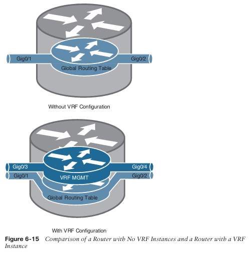

La **creación de instancias VRF multiprotocolo** requiere el comando de configuración global **`vrf definition vrf-name`**. Dentro del submodo de definición de la VRF, se utiliza el comando **`address-family (ipv4 | ipv6)`** para especificar la familia de direcciones adecuada. Luego, la VRF se asocia a la interfaz mediante el comando **`vrf forwarding vrf-name`** dentro del submodo de configuración de la interfaz.

Los siguientes pasos son necesarios para crear una VRF y asignarla a una interfaz:

**Step 1.**  
Crear una tabla de enrutamiento VRF multiprotocolo usando el comando  
`vrf definition vrf-name`.

**Step 2.**  
Inicializar la familia de direcciones apropiada usando el comando  
`address-family (ipv4 | ipv6)`. La familia de direcciones puede ser IPv4, IPv6 o ambas.

**Step 3.**  
Entrar al submodo de configuración de la interfaz y especificar la interfaz que se asociará con la instancia VRF usando el comando  
`interface interface-id`.

**Step 4.**  
Asociar la instancia VRF a la interfaz o subinterfaz ingresando el comando  
`vrf forwarding vrf-name`  
dentro del submodo de configuración de la interfaz.

**Step 5.**  
Configurar una dirección IP (IPv4, IPv6 o ambas) en la interfaz o subinterfaz configurando uno o ambos de los siguientes comandos:

IPv4:

```
ip address ip-address subnet-mask [secondary]
```

IPv6:

```
ipv6 address ipv6-address/prefix-length
```

La **Tabla 6-5** proporciona un conjunto de interfaces y direcciones IP que se superponen entre la tabla de enrutamiento global y la instancia VRF. Esta información se utiliza en los ejemplos siguientes.

**Table 6-5 Sample Interfaces and IP Addresses**

|Interface|IP Address|VRF|Global|
|---|---|---|---|
|Gigabit Ethernet 0/1|10.0.3.1/24|—|✓|
|Gigabit Ethernet 0/2|10.0.4.1/24|—|✓|
|Gigabit Ethernet 0/3|10.0.3.1/24|MGMT|—|
|Gigabit Ethernet 0/4|10.0.4.1/24|MGMT|—|

El **Ejemplo 6-23** muestra cómo se asignan las direcciones IP a las interfaces en la tabla de enrutamiento global, junto con la creación de la instancia VRF llamada **MGMT** y dos interfaces asociadas a ella (ver Tabla 6-5). Las direcciones IP en la instancia VRF **MGMT** se superponen con las configuradas en la tabla global, pero **no existe conflicto** porque pertenecen a **tablas de enrutamiento diferentes**.

**Ejemplo 6-23:** Configuración de Direcciones IP en la Tabla de Enrutamiento Global
```
R1(config)# interface GigabitEthernet0/1
R1(config-if)# ip address 10.0.3.1 255.255.255.0
R1(config)# interface GigabitEthernet0/2
R1(config-if)# ip address 10.0.4.1 255.255.255.0
R1(config)# vrf definition MGMT
R1(config-vrf)# address-family ipv4
R1(config)# interface GigabitEthernet0/3
R1(config-if)# vrf forwarding MGMT
R1(config-if)# ip address 10.0.3.1 255.255.255.0
R1(config)# interface GigabitEthernet0/4
R1(config-if)# vrf forwarding MGMT
R1(config-if)# ip address 10.0.4.1 255.255.255.0
```

El **Ejemplo 6-24** muestra la tabla de enrutamiento global con el comando **show ip route** para resaltar las direcciones IP configuradas en el Ejemplo 6-23. Obsérvese que las interfaces en la tabla de enrutamiento de la VRF **MGMT** no aparecen con este comando.

**Ejemplo 6-24:** Salida de la Tabla de Enrutamiento Global
```
R1# show ip route
! Output omitted for brevity
C    10.0.0.0/8 is variably subnetted, 4 subnets, 2 masks
C    10.0.3.0/24 is directly connected, GigabitEthernet0/1
L    10.0.3.1/32 is directly connected, GigabitEthernet0/1
C    10.0.4.0/24 is directly connected, GigabitEthernet0/2
L    10.0.4.1/32 is directly connected, GigabitEthernet0/2
```

El **Ejemplo 6-25** muestra las direcciones IP y rutas de la VRF **MGMT** configuradas en el Ejemplo 6-23, visualizadas con el comando **show ip route vrf-name**.

**Ejemplo 6-25:** Salida de la Tabla de Enrutamiento de la VRF
```
R1# show ip route vrf MGMT
! Output omitted for brevity
10.0.0.0/8 is variably subnetted, 4 subnets, 2 masks
C    10.0.3.0/24 is directly connected, GigabitEthernet0/3
L    10.0.3.1/32 is directly connected, GigabitEthernet0/3
C    10.0.4.0/24 is directly connected, GigabitEthernet0/4
L    10.0.4.1/32 is directly connected, GigabitEthernet0/4
```

Las instancias de **VRF** en un router pueden compararse con las **VLAN** (Virtual Local Area Networks) en un switch. Sin embargo, en lugar de depender de tecnologías de Capa 2 como 802.1Q para la separación, las instancias VRF permiten la interacción y la segmentación con **protocolos de enrutamiento dinámico de Capa 3**.