**CAPÍTULO 7**

# **EIGRP**

Este capítulo cubre los siguientes temas:

- **Fundamentos de EIGRP:** Esta sección explica cómo EIGRP establece una adyacencia de vecinos con otros routers y cómo se intercambian las rutas entre ellos.
    
- **Cálculo de la Métrica de Ruta:** Esta sección explica cómo EIGRP calcula la métrica de la ruta para identificar las mejores rutas y las rutas alternativas libres de bucles.
    
- **Detección de Fallos y Temporizadores:** Esta sección explica cómo EIGRP detecta la ausencia de un vecino y el proceso de convergencia.
    
- **Resumen de Rutas:** Esta sección explica la lógica y la configuración relacionadas con el resumen de rutas en un router.
    

_Enhanced Interior Gateway Routing Protocol (EIGRP)_ es un protocolo de enrutamiento de **vector distancia mejorado**, comúnmente utilizado en redes empresariales. Inicialmente, era un protocolo propietario de Cisco, pero fue liberado a la Internet Engineering Task Force (IETF) mediante el **RFC 7868**, publicado en mayo de 2016.

Este capítulo explica los mecanismos internos del protocolo de enrutamiento EIGRP, los cálculos de métricas de ruta y los mecanismos de detección de fallos, así como técnicas para optimizar el funcionamiento del protocolo de enrutamiento.

---

## **Fundamentos de EIGRP**

EIGRP supera las deficiencias de otros protocolos de enrutamiento de vector distancia como **RIPv2**, con características como **balanceo de carga de costo desigual**, **soporte para redes de hasta 255 saltos** y **convergencia rápida**.  
EIGRP utiliza un **algoritmo de actualización difusa (DUAL)** para identificar rutas de red y permitir una convergencia rápida mediante **rutas de respaldo libres de bucles precalculadas**. La mayoría de los protocolos de enrutamiento de vector distancia usan el **conteo de saltos** como métrica para las decisiones de enrutamiento. Sin embargo, usar únicamente el conteo de saltos para la selección de rutas no tiene en cuenta la **velocidad del enlace** ni el **retardo total**. EIGRP añade lógica al algoritmo de selección de rutas que utiliza factores adicionales más allá del conteo de saltos.

## **Sistemas Autónomos**

Un router puede ejecutar múltiples procesos EIGRP. Cada proceso opera dentro del contexto de un **sistema autónomo**, que representa un dominio de enrutamiento común. Los routers dentro del mismo dominio utilizan la misma fórmula de cálculo de métricas e intercambian rutas únicamente con miembros del mismo sistema autónomo. Un sistema autónomo de EIGRP no debe confundirse con un sistema autónomo de **Border Gateway Protocol (BGP)**.

En la Figura 7-1, el sistema autónomo EIGRP **AS 100** está compuesto por R1, R2, R3 y R4, y el sistema autónomo EIGRP **AS 200** está compuesto por R3, R5 y R6. Cada proceso EIGRP se asocia a un sistema autónomo específico y mantiene una **tabla de topología EIGRP independiente**. R1 no tiene conocimiento de las rutas del AS 200 porque pertenece a un sistema autónomo diferente, el AS 100. R3 puede participar en ambos sistemas autónomos y, por defecto, **no transfiere rutas aprendidas de un sistema autónomo a otro**.

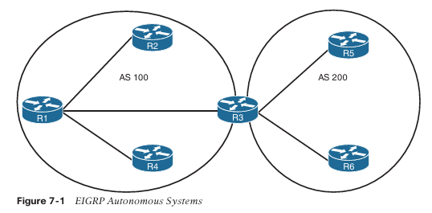

## **Terminología de EIGRP**

Esta sección explica algunos de los **conceptos fundamentales de EIGRP** y el **proceso de selección de rutas** en EIGRP.  
La **Figura 7-2** es la topología de referencia para esta sección; muestra a **R1** calculando las **mejores rutas** y las **rutas alternativas libres de bucles** hacia la red **10.4.4.0/24**. Cada valor entre paréntesis representa la **métrica calculada de un enlace específico para un segmento**, basada en el **ancho de banda** y el **retardo**.

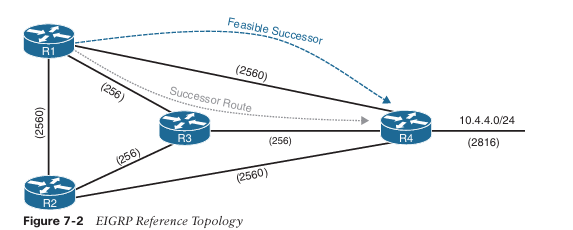

**La Tabla 7-2** enumera algunos términos clave, sus definiciones y su correlación con la **Figura 7-2**.

**Tabla 7-2 Terminología EIGRP**

|Term|Definition|
|---|---|
|**Successor route**|La ruta con la métrica de camino más baja para alcanzar un destino. La ruta sucesora de R1 para llegar a 10.4.4.0/24 en R4 es R1→R3→R4.|
|**Successor**|El primer router siguiente (next-hop) para la ruta sucesora. El sucesor de R1 para 10.4.4.0/24 es R3.|
|**Feasible distance (FD)**|El valor de la métrica para la ruta con la métrica más baja hacia un destino. La distancia factible se calcula localmente usando la fórmula mostrada en la sección “Path Metric Calculation”, más adelante en este capítulo. El FD calculado por R1 para la red de destino 10.4.4.0/24 es 3328 (es decir, 256+256+2816).|
|**Reported distance (RD)**|La distancia reportada por un router para alcanzar un destino. El valor de la distancia reportada es la distancia factible para el router que anuncia. R3 anuncia la red de destino 10.4.4.0/24 a R1 y R2 con un RD de 3072. R4 anuncia la red de destino 10.4.4.0/24 a R1, R2 y R3 con un RD de 2816.|
|**Feasibility condition**|Una condición bajo la cual, para que una ruta sea considerada una ruta de respaldo, la distancia reportada recibida para esa ruta debe ser menor que la distancia factible calculada localmente. Esta lógica garantiza un camino libre de bucles.|
|**Feasible successor**|Una ruta que cumple la condición de factibilidad y se mantiene como ruta de respaldo. La condición de factibilidad asegura que la ruta de respaldo sea libre de bucles. La ruta R1→R4 es el sucesor factible porque el RD 2816 es menor que el FD 3328 para la ruta R1→R3→R4.|

**Topology Table**

EIGRP contiene una **topology table** que lo diferencia de un protocolo de vector distancia “verdadero”. La tabla de topología de EIGRP es un componente vital de DUAL y contiene información para identificar rutas de respaldo libres de bucles. La tabla de topología contiene todos los prefijos de red anunciados dentro de un sistema autónomo EIGRP. Cada entrada en la tabla contiene lo siguiente:

- **Network prefix**
    
- **EIGRP neighbors** que han anunciado ese prefijo
    
- **Metrics** de cada vecino (por ejemplo, distancia reportada, conteo de saltos)
    
- **Values** utilizados para calcular la métrica (por ejemplo, carga, confiabilidad, retardo total, ancho de banda mínimo)
    

La **Figura 7-3** muestra la tabla de topología para R1 en la **Figura 7-2**. Esta sección se centra en la red **10.4.4.0/24** para explicar la tabla de topología.

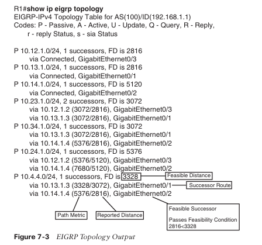

Al examinar la entrada de ruta para la red de destino **10.4.4.0/24**, observe que **R1** calcula una **FD** de **3328** para la ruta **successor**. El **successor** (router upstream) anuncia la ruta successor con una **RD** de **3072**. La segunda entrada de ruta tiene una métrica de **5376** y una **RD** de **2816**. Debido a que **2816 es menor que 3328**, la segunda entrada **cumple la condición de factibilidad**, lo que significa que la segunda entrada se clasifica como el **feasible successor** para la red **10.4.4.0/24**.

La ruta **10.4.4.0/24** está en estado **passive (P)**, lo que significa que la topología es estable. Durante un cambio de topología, las rutas pasan a un estado **active (A)** mientras se calcula una nueva ruta.

## EIGRP Neighbors

Los vecinos EIGRP intercambian la **tabla de enrutamiento completa** al formar una adyacencia, y anuncian **solo actualizaciones incrementales** a medida que ocurren cambios de topología dentro de la red. La **tabla de vecinos** es vital para el seguimiento del estado del vecino y las actualizaciones enviadas a cada vecino.

EIGRP utiliza **cinco tipos diferentes de paquetes** para comunicarse con otros routers, como se muestra en la **Tabla 7-3**. EIGRP utiliza el **número de protocolo IP 88** en el encabezado IP y emplea **paquetes multicast y unicast** cuando es necesario. La comunicación entre routers se realiza mediante multicast, usando la **dirección de grupo 224.0.0.10** cuando es posible.

### Table 7-3 EIGRP Packet Types

| Opcode Value | Packet Type | Function                                                                                             |
| ------------ | ----------- | ---------------------------------------------------------------------------------------------------- |
| 1            | Update      | Usado para transmitir información de enrutamiento y alcanzabilidad a otros vecinos EIGRP             |
| 2            | Request     | Usado para obtener información específica de uno o más vecinos                                       |
| 3            | Query       | Enviado para buscar una ruta alternativa durante la convergencia                                     |
| 4            | Reply       | Enviado como respuesta a un paquete query                                                            |
| 5            | Hello       | Usado para el descubrimiento de vecinos EIGRP y para detectar cuándo un vecino ya no está disponible |
## Cálculo de la Métrica de Ruta (Path Metric Calculation)

El cálculo de la métrica es un componente crítico para cualquier protocolo de enrutamiento. **EIGRP** utiliza múltiples factores para calcular la métrica de una ruta. El cálculo de la métrica usa **ancho de banda** y **retardo** de forma predeterminada, pero también puede incluir la **carga de la interfaz** y la **confiabilidad**. La fórmula mostrada en la **Figura 7-4** ilustra la **fórmula clásica de la métrica EIGRP**.

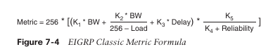

EIGRP utiliza **valores K** para definir qué factores usa la fórmula y el impacto asociado de cada factor al calcular la métrica. Un concepto erróneo común es que el valor K se aplica directamente al ancho de banda, la carga, el retardo o la confiabilidad; esto no es correcto. Por ejemplo, **K1** y **K2** hacen referencia al ancho de banda (BW).

**BW** representa el enlace más lento en la ruta que está escalado a un enlace de 10 Gbps (10⁷). La velocidad del enlace se correlaciona con el ancho de banda configurado en una interfaz y se mide en kilobits por segundo.

**Delay** es la medida total del retardo en la ruta, medida en microsegundos (µs).

Teniendo en cuenta estas definiciones, la fórmula de la **métrica clásica de EIGRP** se muestra en la **Figura 7-5**.

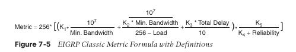

> **NOTA**  RFC 7868 establece que, si **K₅ = 0**, entonces el cociente de confiabilidad se define como **1**.  
Este paso no se demuestra en la parte superior de la **Figura 7-6**, pero sí aparece en la fórmula inferior más simplificada de la **Figura 7-6**.

Por defecto, **K₁** y **K₃** tienen valor **1**, y **K₂**, **K₄** y **K₅** se establecen en **0**.  
La **Figura 7-6** coloca los valores K por defecto dentro de la fórmula y luego muestra una versión simplificada de la misma.

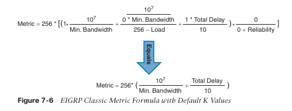

El **paquete de actualización EIGRP** incluye atributos de ruta asociados a cada prefijo.  
Los atributos de ruta de EIGRP pueden incluir **conteo de saltos**, **retardo acumulativo**, **velocidad mínima del enlace (ancho de banda)** y **RD**.  
Los atributos se actualizan a lo largo del camino, lo que permite que cada router identifique de manera independiente la ruta más corta.

La **Figura 7-7** muestra la información en los paquetes de actualización EIGRP para la red **10.11.0/24** propagándose a través del sistema autónomo. Observe que el **conteo de saltos aumenta**, el **ancho de banda mínimo disminuye**, el **retardo total aumenta** y el **RD cambia** en cada router dentro del AS.

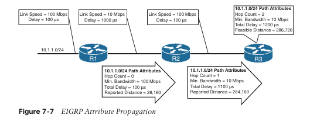

La **Tabla 7-4** muestra algunos **tipos de red comunes**, **velocidades de enlace**, **retardo** y **métricas EIGRP**, usando la **fórmula simplificada** de la **Figura 7-6**.

**Tabla 7-4 Métricas predeterminadas de interfaz EIGRP para métricas clásicas**

|Interface Type|Link Speed (kbps)|Delay|Metric|
|---|--:|--:|--:|
|Serial|64|20,000 µs|40,512,000|
|T1|1544|20,000 µs|2,170,031|
|Ethernet|10,000|1000 µs|281,600|
|FastEthernet|100,000|100 µs|28,160|
|GigabitEthernet|1,000,000|10 µs|2816|
|10 GigabitEthernet|10,000,000|10 µs|512|

Usando la topología de la **Figura 7-2**, la métrica desde **R1** y **R2** hacia la red **10.4.4.0/24** puede calcularse usando la fórmula de la Figura 7-8. La **velocidad del enlace** para ambos routers es **1 Gbps**, y el **retardo total** es **30 µs** (10 µs para el enlace **10.4.4.0/24**, 10 µs para el enlace **10.34.1.0/24**, y 10 µs para el enlace **10.13.1.0/24**).

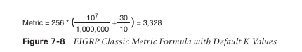

**Wide Metrics**

Las especificaciones originales de **EIGRP** medían el **retardo** en unidades de **10 µs** y el **ancho de banda** en **kilobits por segundo**, lo cual no escala bien con interfaces de mayor velocidad. De hecho, las métricas clásicas de EIGRP **no diferencian** entre un enlace de **11 Gbps** y uno de **50 Gbps**.

EIGRP incluye soporte para un **segundo conjunto de métricas**, conocido como **wide metrics**, que aborda el problema de escalabilidad con interfaces de mayor capacidad. Así como EIGRP escala por **256** para acomodar **RIP**, las **wide metrics** de EIGRP escalan por **65,536** para acomodar enlaces de mayor velocidad. Esto proporciona soporte para **velocidades de interfaz de hasta 655 Tbps (65,536 × 10⁷)** sin problemas de escalabilidad.

La **Figura 7-9** muestra la **fórmula explícita** de las wide metrics de EIGRP. Obsérvese que se incluye un **K value adicional (K6)**; este añade un atributo extendido para medir **jitter**, **energía** u **otros atributos futuros**.

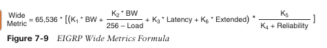

La **latencia** es el **retardo total de la interfaz** medido en **picosegundos (10⁻¹²)** en lugar de medirse en **microsegundos (10⁻⁶)**. La **Figura 7-10** muestra la **fórmula de métricas amplias (wide metrics) de EIGRP actualizada**, que tiene en cuenta las **conversiones de latencia y escalabilidad**.

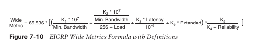

### Compatibilidad hacia atrás de métricas (Metric Backward Compatibility)

Las **métricas amplias (wide metrics) de EIGRP** fueron diseñadas teniendo en cuenta la **compatibilidad hacia atrás**. Con EIGRP wide metrics, los valores **K₁ y K₃** se establecen en **1**, y **K₂, K₄, K₅ y K₆** se establecen en **0**, lo que permite la compatibilidad con versiones anteriores porque los valores K coinciden con las métricas clásicas.  
Mientras **K₁ a K₅** sean iguales y **K₆** no esté configurado, las dos métricas permiten adyacencia entre routers. EIGRP puede detectar cuándo está estableciendo vecindad con un router que usa métricas clásicas y **reescala** la métrica.

### Balanceo de carga (Load Balancing)

EIGRP permite instalar **múltiples rutas sucesoras** (usando la misma métrica) en la **RIB**. Instalar múltiples rutas en la RIB para el mismo prefijo se denomina **equal-cost multipathing (ECMP)**.

EIGRP también soporta **balanceo de carga de costo desigual**, lo que permite la instalación tanto de rutas sucesoras como de **sucesores factibles** en la RIB de EIGRP. EIGRP soporta el balanceo de carga de costo desigual cambiando el **variance multiplier** de EIGRP. El **EIGRP variance value** es la **distancia factible (FD)** de una ruta multiplicada por el multiplicador de varianza.  
Cualquier sucesor factible cuya métrica sea **menor que el valor de varianza de EIGRP** se instala en la RIB. EIGRP instala múltiples rutas donde la FD de las rutas es menor que el valor de varianza de EIGRP, hasta el número máximo de rutas ECMP, como se explicó anteriormente.

Dividir la métrica del sucesor factible entre la métrica del sucesor proporciona el **multiplicador de varianza**. El multiplicador de varianza es un número entero, por lo que cualquier resto **siempre debe redondearse hacia arriba**.

El **Ejemplo 7-1** proporciona una verificación breve de que ambas rutas han sido instaladas en la RIB. Obsérvese que las métricas de las rutas son diferentes. Una métrica de ruta es **3328** y la otra es **5376**. El **traffic share count** está correlacionado con la proporción de tráfico enviada por cada ruta.

**Example 7-1:** Verifying Unequal-Cost Load Balancing
```
R1# show ip route 10.4.4.0
Routing entry for 10.4.4.0/24
  Known via "eigrp 100", distance 90, metric 3328, type internal
  Redistributing via eigrp 100
  Last update from 10.13.1.3 on GigabitEthernet0/1, 00:00:35 ago
  Routing Descriptor Blocks:
  * 10.14.1.4, from 10.14.1.4, 00:00:35 ago, via GigabitEthernet0/2
      Route metric is 5376, traffic share count is 149
      Total delay is 110 microseconds, minimum bandwidth is 1000000 Kbit
      Reliability 255/255, minimum MTU 1500 bytes
      Loading 1/255, Hops 1
    10.13.1.3, from 10.13.1.3, 00:00:35 ago, via GigabitEthernet0/1
      Route metric is 3328, traffic share count is 240
      Total delay is 30 microseconds, minimum bandwidth is 1000000 Kbit
      Reliability 254/255, minimum MTU 1500 bytes
      Loading 1/255, Hops 2
```

### **Detección de fallos y temporizadores (Failure Detection and Timers)**

Una función secundaria de los **hello packets** de EIGRP es asegurar que los vecinos EIGRP sigan estando activos y disponibles. Los paquetes **hello** de EIGRP se envían a intervalos determinados por el **hello timer**. El temporizador hello por defecto de EIGRP es de **5 segundos**, pero es de **60 segundos** en interfaces de baja velocidad (**T1 o inferiores**).

EIGRP utiliza un segundo temporizador llamado **hold time**, que es la cantidad de tiempo durante la cual EIGRP considera que un router sigue siendo alcanzable y funcional. El valor por defecto del **hold time** es **3 veces el temporizador hello**. El valor por defecto es de **15 segundos**, y es de **180 segundos** para interfaces de baja velocidad (T1 o inferiores).

El temporizador hold disminuye continuamente y, al recibir un paquete hello, el temporizador hold se reinicia y vuelve a comenzar la cuenta regresiva. Si el temporizador hold llega a **0**, EIGRP declara al vecino como **inalcanzable** y notifica a **DUAL** de un cambio en la topología.

### **Convergencia (Convergence)**

Cuando un enlace falla y el protocolo de la interfaz pasa a estado **down**, cualquier vecino conectado a esa interfaz también pasa a estado **down**. Cuando un vecino EIGRP pasa a estado down, debe realizarse un **re-cálculo de rutas** para cualquier prefijo donde ese vecino EIGRP haya sido un **sucesor** (router upstream).

Cuando EIGRP detecta que ha perdido su sucesor para una ruta, el **sucesor factible**, si existe, se convierte **instantáneamente** en la nueva ruta sucesora, proporcionando una ruta de respaldo. El router envía entonces un **paquete de actualización** para esa ruta debido a las nuevas métricas de EIGRP. Los routers downstream ejecutan su propio algoritmo **DUAL** para cualquier prefijo afectado, teniendo en cuenta las nuevas métricas de EIGRP. Es posible que ocurra un cambio del sucesor o del sucesor factible tras recibir nuevas métricas EIGRP desde un router sucesor para un prefijo.

La **Figura 7-11** demuestra este escenario, donde el enlace entre **R1 y R3** falla. Cuando el enlace falla, **R3** instala el **sucesor factible** anunciado por **R2** como ruta sucesora. R3 envía un paquete de actualización con un nuevo **RD de 19** para el prefijo **10.1.1.0/24**. **R5** recibe la actualización de R3 y calcula una **FD de 29** para la ruta **R3→R2→R1** hacia **10.1.1.0/24**.  
R5 compara esa ruta con la recibida desde **R4**, que tiene una métrica de **25**. **R5 elige la ruta vía R4 como la ruta sucesora**.

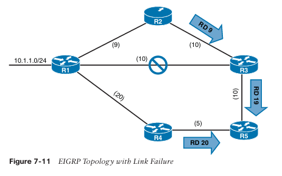

Si no hay un **sucesor factible** disponible para un prefijo, **DUAL** debe realizar un nuevo cálculo de ruta. El estado de la ruta cambia de **pasivo (P)** a **activo (A)** en la tabla de topología de EIGRP.

El router que detecta el cambio de topología envía **paquetes de consulta (query)** a los vecinos EIGRP para esa ruta. El paquete query incluye el prefijo con el **retardo establecido en infinito**, de modo que otros routers sepan que ha pasado a estado activo. Cuando el router envía los paquetes query de EIGRP, establece el estado de respuesta **reply** para cada vecino en función de cada prefijo. El router mantiene el seguimiento del estado de respuesta de cada paquete query de EIGRP por prefijo.

Al recibir un paquete query, un router EIGRP realiza una de las siguientes acciones:

- Puede responder al query indicando que **no tiene una ruta** hacia el prefijo.
    
- Si el query **no proviene del sucesor** para esa ruta, detecta el retardo establecido en infinito y lo **ignora**, ya que no provino del sucesor. El router receptor responde con los **atributos EIGRP** para esa ruta.
    
- Si el query **proviene del sucesor** para la ruta, el router receptor detecta el retardo establecido en infinito, establece el prefijo como **activo** en la topología EIGRP y envía un **paquete query** a todos los vecinos EIGRP downstream para ese prefijo.
    

El proceso de queries continúa de router en router hasta que todos los routers alcanzan un **límite de query (query boundary)**. Un límite de query se establece cuando un router **no marca el prefijo como activo**, lo que significa que responde a un query de la siguiente forma:

- Indica que **no tiene una ruta** hacia el prefijo.
    
- Responde con **atributos EIGRP** porque el query no provino del sucesor.
    

Cuando un router recibe una **respuesta (reply)** por cada query downstream que envió, completa el proceso DUAL, cambia la ruta a **pasiva** y envía paquetes reply a los routers upstream que enviaron un query. Al recibir el paquete reply para un prefijo, el estado de reply se anota para ese vecino y prefijo. El proceso de replies continúa upstream hasta que se reciben los replies a los queries del primer router.

La **Figura 7-12** muestra una topología donde el enlace entre **R1 y R2** ha fallado y **R2** ha generado queries para la red **10.1.1.0/24**.

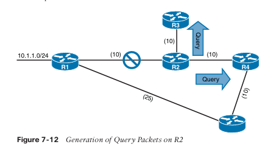

A continuación tienes la **traducción al español**, **manteniendo el formato**, **sin omitir contenido** y **sin modificar los ejemplos ni los pasos**.

**CCNP and CCIE Enterprise Core ENCOR 350-401 Official Cert Guide**

Los siguientes pasos se procesan en orden desde la perspectiva de **R2** al calcular una nueva ruta hacia la red **10.1.1.0/24**:

**Step 1.**  
R2 detecta la falla del enlace. R2 no tiene un **sucesor factible** para la ruta, establece la entrada de ruta para **10.1.1.0/24** como **activa**, y envía **queries** a **R3** y **R4**.

**Step 2.**  
R3 recibe el **query** de R2 y procesa el campo **Delay**, que está configurado en infinito. R3 no tiene otros vecinos EIGRP y envía una **respuesta (reply)** a R2 indicando que la ruta no existe.

R4 recibe el **query** de R2 y procesa el campo **Delay**, que está configurado en infinito. Debido a que el query fue recibido desde el **sucesor** y no existe un sucesor factible para el prefijo, R4 marca la ruta como **activa** y envía un **query** a **R5**.

**Step 3.**  
R5 recibe el **query** de R4 y detecta que el campo **Delay** está configurado en infinito. Debido a que el query fue recibido de un **no-sucesor** y existe un sucesor en una interfaz diferente, R5 envía una **respuesta** para la red **10.1.1.0/24** a R4 con los atributos EIGRP apropiados.

**Step 4.**  
R4 recibe la respuesta de R5, reconoce el paquete y calcula una nueva ruta. Debido a que este es el último **query pendiente** en R4, R4 establece el prefijo como **pasivo**. Con todos los queries satisfechos, R4 responde al **query de R2** con las nuevas métricas EIGRP.

**Step 5.**  
R2 recibe la respuesta de R4, reconoce el paquete y calcula una nueva ruta. Debido a que este es el último **query pendiente** en R2, R2 establece el prefijo como **pasivo**.

## **Route Summarization**

EIGRP funciona bien con optimizaciones mínimas. La **escalabilidad** de un sistema autónomo EIGRP depende de la **sumarización**. A medida que el tamaño de un sistema autónomo EIGRP aumenta, la convergencia puede tardar más. Escalar una topología EIGRP requiere resumir rutas de forma jerárquica.

EIGRP resume rutas **por interfaz** y no dentro del proceso de enrutamiento. La sumarización se habilita configurando un **rango de direcciones resumidas** bajo una interfaz EIGRP, donde todas las rutas que caen dentro del rango de la dirección resumida se consideran rutas componentes. Con la sumarización habilitada, las rutas componentes se **suprimen** (no se anuncian), y **solo** se anuncia la ruta resumida. La ruta resumida no se anuncia hasta que una de las rutas componentes coincide. La sumarización específica por interfaz puede realizarse en cualquier punto de la topología de red. Además de reducir las tablas de enrutamiento de todos los routers, la sumarización crea un **límite de queries (query boundary)** y reduce el dominio de queries cuando una ruta pasa a estado activo durante la convergencia.

La **Figura 7-13** ilustra el concepto de sumarización EIGRP. Sin sumarización, R2 anuncia las rutas **172.16.1.0/24**, **172.16.3.0/24**, **172.16.12.0/24** y **172.16.23.0/24** hacia R4. R2 puede resumir estas rutas a **172.16.0.0/16** de modo que solo un anuncio sea enviado a R4.

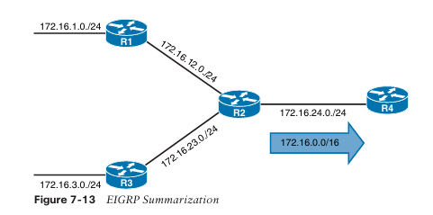