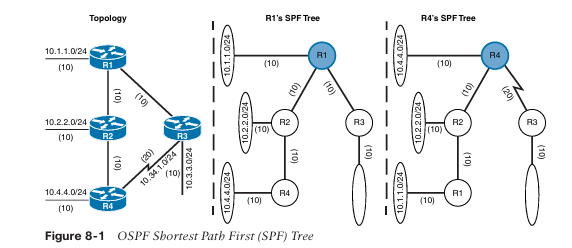
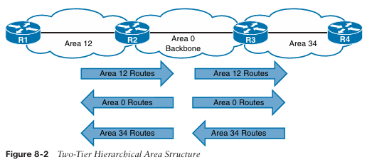
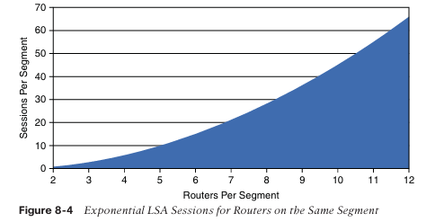
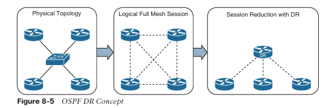
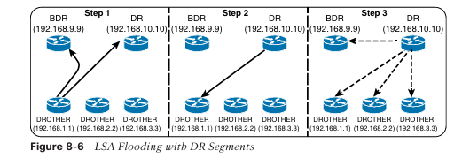
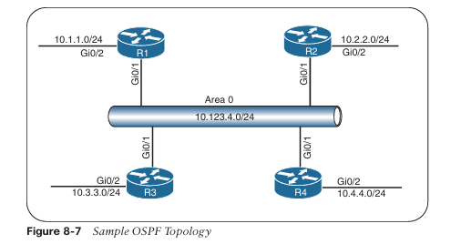
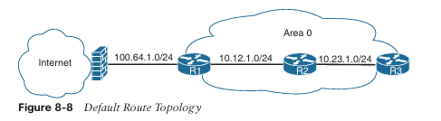
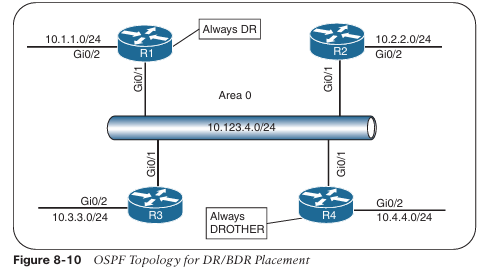
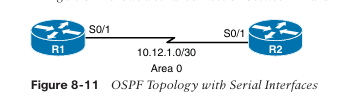

A continuación tienes la **traducción al español**, **manteniendo el formato**, **sin omitir contenido** y **sin modificar la estructura**.

---

## **CAPÍTULO 8**

# **OSPF**

Este capítulo cubre los siguientes temas:

- **Fundamentos de OSPF:** Esta sección proporciona una visión general de la comunicación entre routers OSPF.
    
- **Configuración de OSPF:** Esta sección describe las técnicas de configuración de OSPF y los comandos que pueden ejecutarse para verificar el intercambio de rutas.
    
- **Anuncio de Ruta por Defecto:** Esta sección explica cómo se anuncian las rutas por defecto en OSPF.
    
- **Optimizaciones Comunes de OSPF:** Esta sección revisa configuraciones comunes de OSPF para optimizar el funcionamiento del protocolo.
    

El protocolo **Open Shortest Path First (OSPF)** es el primer protocolo de enrutamiento de **estado de enlace (link-state)** cubierto en este libro. OSPF es un **Protocolo de Gateway Interior (IGP)** no propietario que supera las deficiencias de otros protocolos de enrutamiento por vector de distancia y distribuye información de enrutamiento dentro de un único dominio de enrutamiento OSPF. OSPF introdujo el concepto de **subnetting de longitud variable (VLSM)**, que soporta enrutamiento sin clases (classless routing), sumarización, autenticación y etiquetado de rutas externas. Actualmente existen dos versiones principales de OSPF en redes de producción:

- **OSPF Versión 2 (OSPFv2):** Definida en RFC 2328 y soporta IPv4
    
- **OSPF Versión 3 (OSPFv3):** Definida en RFC 5340 y modifica la estructura original para soportar IPv6
    

Este capítulo explica los conceptos fundamentales de OSPF y las bases para establecer **vecindades (neighbor relationships)** e intercambiar rutas con otros routers OSPF. Otros dos capítulos de este libro también cubren temas relacionados con OSPF. A continuación, una visión general de ellos:

- **Capítulo 9, “Advanced OSPF”:** Explica la función de segmentar el dominio OSPF en áreas más pequeñas para soportar topologías de mayor tamaño.
    
- **Capítulo 10, “OSPFv3”:** Explica cómo OSPF puede utilizarse para el enrutamiento de paquetes IPv6.

---

## **Fundamentos de OSPF**

OSPF envía **anuncios de estado de enlace (Link-State Advertisements, LSAs)** a los routers vecinos que contienen el estado del enlace y la métrica del enlace. Los LSAs recibidos se almacenan en una base de datos local llamada **base de datos de estado de enlace (Link-State Database, LSDB)** y luego se inundan (flooded) a lo largo de todo el dominio de enrutamiento OSPF, tal como los anunció el router original. Todos los routers OSPF mantienen una copia sincronizada e idéntica de la LSDB para la misma área.

La LSDB proporciona la topología de la red, ofreciendo esencialmente al router un mapa completo de la red. Todos los routers OSPF ejecutan el algoritmo **Dijkstra shortest path first (SPF)** para construir una topología de rutas más cortas libre de bucles. OSPF detecta dinámicamente los cambios de topología dentro de la red y calcula rutas libres de bucles en un corto período de tiempo con un tráfico mínimo del protocolo de enrutamiento.

Cada router se ve a sí mismo como la raíz o la parte superior del árbol SPF, y el **árbol de ruta más corta (Shortest Path Tree, SPT)** contiene todas las redes de destino dentro del dominio OSPF. El SPT difiere para cada router OSPF, pero la LSDB utilizada para calcular el SPT es idéntica en todos los routers OSPF.

La Figura 8-1 muestra una topología OSPF simple y el SPT desde la perspectiva de R1 y R4. Observe que la perspectiva local de cada router siempre estará en la parte superior (raíz) del árbol. Existe una diferencia en la conectividad con la red 10.3.3.0/24 cuando se observa el SPT de R1 y el de R4. Desde la perspectiva de R1, falta el enlace serial entre R3 y R4; desde la perspectiva de R4, falta el enlace Ethernet entre R1 y R3.



Los **SPT** dan la ilusión de que no existe redundancia en las redes, pero recuerde que el SPT muestra la ruta más corta hacia una red y se construye a partir de la **LSDB**, que contiene todos los enlaces de un área. Durante un cambio de topología, el SPT se reconstruye y puede cambiar.

OSPF proporciona escalabilidad para la tabla de enrutamiento mediante el uso de múltiples **áreas OSPF** dentro del dominio de enrutamiento. Cada área OSPF ofrece una colección de redes y hosts conectados que se agrupan. OSPF utiliza una arquitectura jerárquica de dos niveles, donde el **Área 0** es un área especial conocida como el **backbone**, a la cual deben conectarse todas las demás áreas. En otras palabras, el Área 0 proporciona conectividad de tránsito entre áreas que no son backbone. Las áreas no backbone anuncian rutas hacia el backbone, y el backbone anuncia rutas hacia las áreas no backbone.

La **Figura 8-2** muestra el anuncio de rutas hacia otras áreas. Las rutas del Área 12 se anuncian al Área 0 y luego al Área 34. Las rutas del Área 34 se anuncian al Área 0 y luego al Área 12. Las rutas del Área 0 se anuncian a todas las demás áreas OSPF.



Cuando se segmenta un dominio de enrutamiento OSPF en múltiples áreas, ya no es cierto que todos los routers OSPF tengan **LSDB** idénticas; sin embargo, todos los routers dentro de la misma área sí tendrán LSDB idénticas.

La reducción del tráfico de enrutamiento utiliza menos memoria y recursos del router y, por lo tanto, proporciona escalabilidad. El Capítulo 9 explica las áreas con mayor detalle; este capítulo se centra en los conceptos básicos de OSPF. Para el resto de este capítulo, **OSPF Área 0** se utiliza como área de referencia.

Un router puede ejecutar múltiples procesos OSPF. Cada proceso mantiene su propia base de datos única, y las rutas aprendidas en un proceso OSPF no están disponibles para otros procesos OSPF sin redistribución de rutas entre procesos. Los números de proceso OSPF son significativos localmente y no tienen que coincidir entre routers. Ejecutar el proceso OSPF número 1 en un router y el proceso OSPF número 1234 en otro router aun así permitirá que ambos routers se conviertan en vecinos.

**Inter-Router Communication**

OSPF se ejecuta directamente sobre IPv4, usando el número de protocolo **89** en el encabezado IP, que está reservado para OSPF por la Internet Assigned Numbers Authority (IANA). OSPF utiliza multidifusión cuando es posible para reducir tráfico innecesario. Las direcciones multicast OSPF son las siguientes:

- **AllSPFRouters**: Dirección IPv4 **224.0.0.5** o dirección MAC **01:00:5E:00:00:05**. Todos los routers que ejecutan OSPF deben poder recibir estos paquetes.
    
- **AllDRouters**: Dirección IPv4 **224.0.0.6** o dirección MAC **01:00:5E:00:00:06**. La comunicación con los routers designados (DR) utiliza esta dirección.
    

Dentro del protocolo OSPF, se comunican cinco tipos de paquetes. La **Tabla 8-2** describe brevemente los tipos de paquetes OSPF.

**Table 8-2 OSPF Packet Types**

| Type | Packet Name                       | Functional Overview                                                                                                                                                                                                             |
| ---: | --------------------------------- | ------------------------------------------------------------------------------------------------------------------------------------------------------------------------------------------------------------------------------- |
|    1 | Hello                             | Estos paquetes se utilizan para descubrir y mantener vecinos. Los paquetes se envían periódicamente en todas las interfaces OSPF para descubrir nuevos vecinos mientras se asegura que otros vecinos adyacentes sigan en línea. |
|    2 | Database description (DBD or DDP) | Estos paquetes se utilizan para resumir el contenido de la base de datos. Se intercambian cuando se está formando una adyacencia OSPF. Se usan para describir el contenido de la LSDB.                                          |
|    3 | Link-state request (LSR)          | Estos paquetes se utilizan para descargas de base de datos. Cuando un router piensa que parte de su LSDB está obsoleta, puede solicitar una porción de la base de datos de un vecino usando este tipo de paquete.               |
|    4 | Link-state update (LSU)           | Estos paquetes se utilizan para actualizaciones de la base de datos. Este es un LSA explícito para un enlace de red específico y normalmente se envía en respuesta directa a un LSR.                                            |
|    5 | Link-state ack                    | Estos paquetes se utilizan para confirmaciones de flooding de LSAs. Se envían en respuesta al flooding de LSAs, haciendo del flooding una función de transporte confiable.                                                      |

**OSPF Hello Packets**

Los **paquetes hello de OSPF** son responsables de descubrir y mantener vecinos. En la mayoría de los casos, un router envía paquetes hello a la dirección **AllSPFRouters (224.0.0.5)**. La **Tabla 8-3** enumera algunos de los datos contenidos dentro de un paquete hello de OSPF.

**Table 8-3 OSPF Hello Packet Fields**

|Data Field|Description|
|---|---|
|**Router ID (RID)**|Un identificador único de 32 bits dentro de un dominio OSPF, utilizado para construir una topología.|
|Authentication options|Un campo que permite comunicación segura entre routers OSPF para prevenir actividad maliciosa. Las opciones son ninguna, texto claro o autenticación MD5 (Message Digest 5).|
|Area ID|El área OSPF a la que pertenece la interfaz OSPF. Es un número de 32 bits que puede escribirse en formato decimal con puntos (0.0.1.0) o decimal (256).|
|Interface address mask|La máscara de red de la dirección IP primaria de la interfaz por la cual se envía el hello.|
|**Interface priority**|La prioridad de la interfaz del router para las elecciones de DR.|
|**Hello interval**|El intervalo de tiempo, en segundos, en el que un router envía paquetes hello por la interfaz.|
|**Dead interval**|El intervalo de tiempo, en segundos, que un router espera recibir un hello de un vecino antes de declarar a ese router como caído.|
|Designated router and backup designated router|La dirección IP del DR y del DR de respaldo (BDR) para el enlace de red.|
|Active neighbor|Una lista de vecinos OSPF vistos en el segmento de red. Un router debe haber recibido un hello del vecino dentro del intervalo dead.|

**Router ID**

El **router ID (RID)** de OSPF es un número de 32 bits que identifica de forma única a un router OSPF y es un componente esencial para construir una topología OSPF. En algunas salidas de comandos OSPF, _neighbor ID_ se refiere al RID; los términos son sinónimos. El RID debe ser único para cada proceso OSPF en un dominio OSPF y debe ser único entre procesos OSPF en un router.

**Neighbors**

Un **vecino OSPF** es un router que comparte un enlace de red común habilitado para OSPF. Los routers OSPF descubren otros vecinos mediante los paquetes hello de OSPF. Un **vecino adyacente OSPF** es un vecino OSPF que comparte una base de datos OSPF sincronizada entre ambos vecinos.

Cada proceso OSPF mantiene una tabla de vecinos OSPF adyacentes y el estado de cada router. La **Tabla 8-4** describe brevemente los estados de vecinos OSPF.

**Table 8-4 OSPF Neighbor States**

|State|Description|
|---|---|
|**Down**|Este es el estado inicial de una relación de vecindad. Indica que el router no ha recibido ningún paquete hello de OSPF.|
|**Attempt**|Este estado es relevante para redes NBMA que no soportan broadcast y requieren configuración explícita de vecinos. Indica que no se ha recibido información recientemente, pero el router sigue intentando comunicarse.|
|**Init**|Este estado indica que se ha recibido un paquete hello de otro router, pero la comunicación bidireccional aún no se ha establecido.|
|**2-Way**|Se ha establecido comunicación bidireccional. Si se requiere un DR o BDR, el proceso de elección ocurre durante este estado.|
|**ExStart**|Este es el primer estado en la formación de una adyacencia. Los routers identifican cuál será el router primario o secundario para la sincronización de la LSDB.|
|**Exchange**|Durante este estado, los routers intercambian estados de enlace utilizando paquetes DBD.|
|**Loading**|Se envían paquetes LSR al vecino solicitando las LSAs más recientes que se hayan descubierto (pero no recibidas) en el estado Exchange.|
|**Full**|Los routers vecinos están completamente adyacentes.|

**Designated Router and Backup Designated Router**

Las redes de acceso múltiple, como Ethernet (LANs) y Frame Relay, permiten que existan más de dos routers en un mismo segmento de red. Esta configuración podría causar problemas de escalabilidad con OSPF a medida que aumenta el número de routers en un segmento. Los routers adicionales inundan más LSAs en el segmento y el tráfico OSPF se vuelve excesivo a medida que aumentan las adyacencias OSPF. Si cuatro routers comparten la misma red de acceso múltiple, se forman seis adyacencias OSPF, junto con seis ocurrencias de inundación de la base de datos en la red.

La **Figura 8-3** muestra una topología física simple de cuatro routers y cómo se establecen la topología lógica y las adyacencias.


La **fórmula del número de aristas**, ( n(n - 1) / 2 ), donde **n** representa el número de routers, se utiliza para identificar la cantidad de sesiones en una topología de malla completa (_full mesh_). Si hay **5 routers** presentes en un segmento, ( 5(5 - 1) / 2 = 10 ), entonces **10 adyacencias OSPF** existirán en ese segmento. Al continuar con esta lógica, agregar **un router adicional** generaría **15 adyacencias OSPF** en el segmento de red.

Tener tantas adyacencias por segmento consume **más ancho de banda**, **más procesamiento de CPU** y **más memoria** para mantener cada uno de los estados de vecindad.

La **Figura 8-4** ilustra la **tasa exponencial** de adyacencias OSPF necesarias a medida que aumenta el número de routers en un segmento de red.



OSPF supera esta ineficiencia creando un **pseudonodo** (router virtual) para gestionar el estado de adyacencia con todos los demás routers en ese segmento de red de difusión (_broadcast_). Un router en el segmento de difusión, conocido como **designated router (DR)**, asume el rol del pseudonodo. El DR reduce la cantidad de adyacencias OSPF en un segmento de red de acceso múltiple, porque los routers forman una adyacencia OSPF completa **solo con el DR** y no entre ellos. El DR es responsable de **inundar las actualizaciones** a todos los routers OSPF en ese segmento conforme ocurren los cambios. La **Figura 8-5** demuestra cómo el uso de un DR simplifica una topología de cuatro routers, dejándola con **solo tres adyacencias de vecinos**.



Si el **DR** fallara, **OSPF** tendría que formar nuevas adyacencias, invocando **todas las nuevas LSA**, y potencialmente podría causar **pérdidas temporales de rutas**. En caso de una falla del DR, el **backup designated router (BDR)** se convierte en el nuevo DR. Luego se realiza una **elección** para reemplazar al BDR. Para minimizar el tiempo de transición, el **BDR también forma adyacencias OSPF completas** con todos los routers OSPF en ese segmento.

El proceso **DR/BDR** distribuye las **LSA** de la siguiente manera, asumiendo que todos los routers OSPF (**DR, BDR y DROTHER**) en un segmento forman una adyacencia OSPF completa con el DR y el BDR:

1. Cuando un router OSPF aprende una nueva ruta, envía la **LSA actualizada** a la dirección **AllDRouters (224.0.0.6)**, que solo el DR y el BDR aceptan y procesan, como se ilustra en el **paso 1 de la Figura 8-6**.
    
2. El **DR envía un acuse de recibo unicast** al router que envió la LSA inicial, como se ilustra en el **paso 2 de la Figura 8-6**.
    
3. El **DR inunda la LSA** a todos los routers del segmento mediante la dirección **AllSPFRouters (224.0.0.5)**, como se muestra en el **paso 3 de la Figura 8-6**.



### **Configuración de OSPF**

El proceso de configuración de **OSPF** reside principalmente dentro del **proceso OSPF**, aunque algunas opciones de OSPF se configuran directamente en el **submodo de configuración de la interfaz**.  
El comando **router ospf process-id** define e inicializa el proceso OSPF. El **process ID** de OSPF tiene **significado local**, pero generalmente se mantiene igual por consistencia operativa.  
OSPF se habilita en una interfaz utilizando **dos métodos**:

- Una **sentencia network de OSPF**
    
- **Configuración específica por interfaz**
    

La siguiente sección describe estas técnicas.

### **Sentencia Network de OSPF**

La sentencia **network** de OSPF identifica las interfaces que el proceso OSPF utilizará y el **área** a la que estarán asociadas dichas interfaces.  
Las sentencias network se comparan con la **dirección IPv4 primaria** y la **máscara de red** asociadas a una interfaz.

Un error común es pensar que la sentencia network **anuncia las redes en OSPF**. En realidad, la sentencia network **selecciona y habilita OSPF en la interfaz**.  
La interfaz es la que se anuncia en OSPF mediante la **LSA**. La sentencia network utiliza una **máscara comodín (wildcard mask)**, lo que permite que la configuración sea tan específica o tan amplia como sea necesario.  
La selección de interfaces dentro del proceso OSPF se realiza usando el comando:

```
network ip-address wildcard-mask area area-id
```

El concepto es similar a la configuración de **Enhanced Interior Gateway Routing Protocol (EIGRP)**, excepto que OSPF está basado en **áreas**.  
Si la dirección IP de una interfaz coincide con **dos sentencias network** que pertenecen a **áreas diferentes**, se utiliza la **sentencia network más específica** (es decir, la de **prefijo más largo**) y las demás sentencias network se ignoran para la asignación de área.

La **red conectada** de una interfaz habilitada para OSPF se agrega a la **LSDB de OSPF** bajo el **área correspondiente**, en la cual la interfaz participa.  
Las **redes conectadas secundarias** se agregan a la LSDB **solo si la dirección IP secundaria coincide con una sentencia network** asociada a la misma área.

Para ayudar a ilustrar el concepto, los siguientes escenarios explican posibles casos de uso de la sentencia network para un router con **cuatro interfaces**.  
La **Tabla 8-5** proporciona direcciones IP e interfaces.

#### **Tabla 8-5 – Interfaces de ejemplo y direcciones IP**

|Interfaz|Dirección IP|
|---|---|
|GigabitEthernet0/0|10.0.0.10/24|
|GigabitEthernet0/1|10.0.10.10/24|
|GigabitEthernet0/2|192.0.10.10/24|
|GigabitEthernet0/3|192.10.0.10/24|
La configuración del **Ejemplo 8-1** habilita OSPF para el **Área 0** únicamente en las interfaces que **coinciden explícitamente** con las direcciones IP de la **Tabla 8-5**.

**Example 8-1 Configuring OSPF with Explicit IP Addresses**

```
router ospf 1
 network 10.0.0.10 0.0.0.0 area 0
 network 10.0.10.10 0.0.0.0 area 0
 network 192.0.0.10 0.0.0.0 area 0
 network 192.10.0.10 0.0.0.0 area 0
```

El **Ejemplo 8-2** muestra la configuración de OSPF para el **Área 0**, utilizando sentencias **network** que coinciden con las **subredes** usadas en la **Tabla 8-5**.  
Si se establece el último octeto de las direcciones IP en **0** y se cambia la **wildcard mask** a **255**, las sentencias network coincidirán con **todas las direcciones IP dentro de la red /24**.

**Example 8-2 Configuring OSPF with Explicit Subnet**

```
router ospf 1
 network 10.0.0.0 0.0.0.255 area 0
 network 10.0.10.0 0.0.0.255 area 0
 network 192.0.0.0 0.0.0.255 area 0
 network 192.10.0.0 0.0.0.255 area 0
```

El **Ejemplo 8-3** muestra la configuración de OSPF para el **Área 0**, usando sentencias **network** para interfaces que están dentro de los rangos **10.0.0.0/8** o **192.0.0.0/8**, lo que resultará en que OSPF quede habilitado en **las cuatro interfaces**, como en los ejemplos anteriores.

**Example 8-3 Configuring OSPF with Large Subnet Ranges**

```
router ospf 1
 network 10.0.0.0 0.255.255.255 area 0
 network 192.0.0.0 0.255.255.255 area 0
```

El **Ejemplo 8-4** muestra la configuración de OSPF para el **Área 0** con el fin de **habilitar OSPF en todas las interfaces**.

**Example 8-4 Configuring OSPF for All Interfaces**

```
router ospf 1
 network 0.0.0.0 255.255.255.255 area 0
```

> **NOTA**  Por simplicidad, este capítulo se centra en la operación de OSPF con **una sola área, el Área 0**.  El **Capítulo 9** explica en detalle el comportamiento de OSPF con **múltiples áreas**.

### **Configuración Específica por Interfaz**

El segundo método para habilitar OSPF en **IOS XE** es configurarlo **directamente en una interfaz** usando el comando:

```
ospf process-id area area-id [secondaries none]
```

Este método también **añade las redes conectadas secundarias** a la LSDB, **a menos que** se utilice la opción `secondaries none`.

Este enfoque proporciona un **control explícito** para habilitar OSPF; sin embargo, **la configuración no está centralizada** y la **complejidad aumenta** a medida que crece el número de interfaces en los routers.  
Si existe una configuración híbrida en un router, **las configuraciones específicas por interfaz tienen prioridad** sobre las sentencias `network` con asignación de área.

El **Ejemplo 8-5** muestra una configuración de OSPF específica por interfaz.

**Example 8-5 Configuring OSPF on IOS for a Specific Interface**

```
interface GigabitEthernet0/0
 ip address 10.0.0.1 255.255.255.0
 ip ospf 1 area 0
```

### **Configuración Estática del Router ID**

Por defecto, el **Router ID (RID)** se asigna dinámicamente usando la **dirección IP más alta** de cualquier interfaz **loopback** que esté _up_.  
Si no existen interfaces loopback, la **dirección IP más alta de cualquier interfaz física activa** se convierte en el RID cuando se inicializa OSPF.

El proceso OSPF **selecciona el RID al inicializarse** y **no cambia** hasta que el proceso se reinicia.  
Los cambios en las interfaces (como añadir o eliminar direcciones IP) se detectan **solo cuando el proceso OSPF se reinicia**, momento en el que el RID puede cambiar.

La topología OSPF se construye **en torno al RID**. Configurar un RID estático ayuda en **tareas de troubleshooting** y **reduce la generación de LSAs** cuando el RID cambia en un entorno OSPF.  
El RID tiene **cuatro octetos** y generalmente representa una **dirección IPv4** que reside en el router por simplicidad operativa; sin embargo, **no es un requisito**.

El comando:

```
router-id router-id
```

asigna estáticamente el **OSPF RID** bajo el proceso OSPF.

El comando EXEC:

```
clear ip ospf process
```

reinicia el proceso OSPF en el router para que OSPF pueda **usar el nuevo RID**.

### **Interfaces Pasivas**

Habilitar una interfaz con OSPF es la forma más rápida de **anunciar un segmento de red** a otros routers OSPF. Sin embargo, puede ser fácil que alguien conecte un **router OSPF no autorizado** en un segmento habilitado para OSPF e introduzca **rutas falsas**, causando estragos en la red.  
Hacer que una interfaz de red sea **pasiva** aún añade el segmento de red a la **LSDB**, pero **impide que la interfaz forme adyacencias OSPF**. Una **interfaz pasiva** no envía _OSPF hellos_ ni procesa ningún paquete OSPF recibido.

El comando:

```
passive-interface interface-id
```

bajo el proceso OSPF hace que la interfaz sea pasiva, y el comando:

```
passive-interface default
```

hace que **todas las interfaces** sean pasivas. Para permitir que una interfaz procese paquetes OSPF, se utiliza el comando:

```
no passive-interface interface-id
```

### **Requisitos para la Adyacencia de Vecinos**

La siguiente lista de requisitos debe cumplirse para que se forme una **adyacencia OSPF**:

- Los **RID** deben ser **únicos** entre los dos dispositivos. Deben ser únicos en todas las áreas del dominio OSPF completo para evitar errores.
    
- Las interfaces deben **compartir una subred común**. OSPF utiliza la **dirección IP primaria** de la interfaz al enviar _OSPF hellos_. La **máscara de red** (en el paquete hello) se utiliza para extraer el ID de red del paquete hello. Las máscaras de red en las interfaces deben coincidir, **excepto** para interfaces OSPF de tipo _point-to-point_ o enlaces virtuales.
    
- Las **MTU (maximum transmission units)** en las interfaces deben coincidir. El protocolo OSPF no soporta fragmentación, por lo que las MTU deben ser iguales.
    
- El **ID de área** debe coincidir para el segmento.
    
- La **habilitación de DR** debe coincidir para el segmento.
    
- Los **timers hello y dead** de OSPF deben coincidir para el segmento.
    
- El **tipo de autenticación** y las **credenciales** (si existen) deben coincidir para el segmento.
    
- Las **banderas de tipo de área** deben coincidir para el segmento (por ejemplo, _stub_, _NSSA_). _(Estos temas no se tratan en este libro)._
    
### **Topología y Configuración de Ejemplo**

La **Figura 8-7** muestra un ejemplo de topología básica de configuración OSPF. Todos los routers tienen direcciones IP de **loopback** que coinciden con sus **RID** (R1 = 192.168.1.1, R2 = 192.168.2.2, y así sucesivamente).



**En R1 y R2**, OSPF se habilita en **todas las interfaces con un solo comando**. **R3** utiliza sentencias **basadas en red**, y **R4** usa **comandos específicos por interfaz**. **R1 y R2** configuran la **Gi0/2 como interfaz pasiva**, y **R3 y R4** hacen que **todas las interfaces sean pasivas por defecto**, pero **activan Gi0/1**.

El **Ejemplo 8-6** proporciona una **configuración OSPF de ejemplo** para los cuatro routers.

**Ejemplo 8-6:** Configuración de OSPF para la Topología de Ejemplo
```
! OSPF is enabled with a single command, and the passive interface is
! set individually
R1# configure terminal
Enter configuration commands, one per line. End with CNTL/Z.
R1(config)# interface Loopback0
R1(config-if)# ip address 192.168.1.1 255.255.255.255
R1(config)# interface GigabitEthernet0/1
R1(config-if)# ip address 10.123.4.1 255.255.255.0
R1(config)# interface GigabitEthernet0/2
R1(config-if)# ip address 10.1.1.1 255.255.255.0
R1(config)# router ospf 1
R1(config-router)# router-id 192.168.1.1
R1(config-router)# passive-interface GigabitEthernet0/2
R1(config-router)# network 0.0.0.0 255.255.255.255 area 0
```

```
! OSPF is enabled with a single command, and the passive interface is
! set individually
R2(config)# interface Loopback0
R2(config-if)# ip address 192.168.2.2 255.255.255.255
```

```
R2(config-if)# interface GigabitEthernet0/1
R2(config-if)# ip address 10.123.4.2 255.255.255.0
R2(config-if)# interface GigabitEthernet0/2
R2(config-if)# ip address 10.2.2.2 255.255.255.0
R2(config-if)# router ospf 1
R2(config-router)# router-id 192.168.2.2
R2(config-router)# passive-interface GigabitEthernet0/2
R2(config-router)# network 0.0.0.0 255.255.255.255 area 0
```

**OSPF se habilita con un comando de red por interfaz, y la interfaz pasiva se habilita globalmente mientras la interfaz Gi0/1 se restablece a estado activo.**

```
R3(config)# interface Loopback0
R3(config-if)# ip address 192.168.3.3 255.255.255.255
R3(config)# interface GigabitEthernet0/1
R3(config-if)# ip address 10.123.4.3 255.255.255.0
R3(config)# interface GigabitEthernet0/2
R3(config-if)# ip address 10.3.3.3 255.255.255.0
R3(config)# router ospf 1
R3(config-router)# router-id 192.168.3.3
R3(config-router)# passive-interface default
R3(config-router)# no passive-interface GigabitEthernet0/1
R3(config-router)# network 10.3.3.3 0.0.0.0 area 0
R3(config-router)# network 10.123.4.3 0.0.0.0 area 0
R3(config-router)# network 192.168.3.3 0.0.0.0 area 0
```

**OSPF se habilita con un solo comando bajo cada interfaz, y la interfaz pasiva se habilita globalmente mientras la interfaz Gi0/1 se pone en estado activo.**

```
R4(config-router)# interface Loopback0
R4(config-if)# ip address 192.168.4.4 255.255.255.255
R4(config-if)# ip ospf 1 area 0
R4(config)# interface GigabitEthernet0/1
R4(config-if)# ip address 10.123.4.4 255.255.255.0
R4(config-if)# ip ospf 1 area 0
R4(config)# interface GigabitEthernet0/2
R4(config-if)# ip address 10.4.4.4 255.255.255.0
R4(config-if)# ip ospf 1 area 0
R4(config-router)# router ospf 1
R4(config-router)# router-id 192.168.4.4
R4(config-router)# passive-interface default
R4(config-router)# no passive-interface GigabitEthernet0/1
```

### **Confirmación de Interfaces**

Es una buena práctica verificar que las **interfaces correctas estén ejecutando OSPF** después de realizar cambios en la configuración. El comando:

```
show ip ospf interface [brief | interface-id]
```

muestra las interfaces con OSPF habilitado.

El **Ejemplo 8-7** muestra un fragmento de la salida desde **R1**. La salida enumera **todas las interfaces con OSPF habilitado**, la **dirección IP asociada** a cada interfaz, el **RID del DR y del BDR** (y sus direcciones IP de interfaz asociadas para ese segmento), y los **temporizadores OSPF** de esa interfaz.

**Ejemplo 8-7:** Salida de la interfaz OSPF en formato detallado
```
R1# show ip ospf interface
! Output omitted for brevity
Loopback0 is up, line protocol is up
  Internet Address 192.168.1.1/32, Area 0, Attached via Network Statement
  Process ID 1, Router ID 192.168.1.1, Network Type LOOPBACK, Cost: 1
  Topology-MTID    Cost    Disabled    Shutdown    Topology Name
        0            1        no           no          Base
  Loopback interface is treated as a stub Host

GigabitEthernet0/1 is up, line protocol is up
  Internet Address 10.123.4.1/24, Area 0, Attached via Network Statement
  Process ID 1, Router ID 192.168.1.1, Network Type BROADCAST, Cost: 1
  Topology-MTID    Cost    Disabled    Shutdown    Topology Name
        0            1        no           no          Base
  Transmit Delay is 1 sec, State DROTHER, Priority 1
  Designated Router (ID) 192.168.4.4, Interface address 10.123.4.4
  Backup Designated router (ID) 192.168.3.3, Interface address 10.123.4.3
  Timer intervals configured, Hello 10, Dead 40, Wait 40, Retransmit 5

  Neighbor Count is 3, Adjacent neighbor count is 2
    Adjacent with neighbor 192.168.3.3 (Backup Designated Router)
    Adjacent with neighbor 192.168.4.4 (Designated Router)
  Suppress hello for 0 neighbor(s)
```

El **Ejemplo 8-8** muestra el comando `show ip ospf interface` usando la palabra clave **brief**.

**Ejemplo 8-8:** Salida de la interfaz OSPF en formato breve
```
R1# show ip ospf interface brief
Interface  PID  Area  IP Address/Mask     Cost  State   Nbrs F/C
Lo0        1    0     192.168.1.1/32       1     LOOP    0/0
Gi0/2      1    0     10.1.1.1/24          1     DR      0/0
Gi0/1      1    0     10.123.4.1/24        1     DROTH  2/3

R2# show ip ospf interface brief
Interface  PID  Area  IP Address/Mask     Cost  State   Nbrs F/C
Lo0        1    0     192.168.2.2/32       1     LOOP    0/0
Gi0/2      1    0     10.2.2.2/24          1     DR      0/0
Gi0/1      1    0     10.123.4.2/24        1     DROTH  2/3

R3# show ip ospf interface brief
Interface  PID  Area  IP Address/Mask     Cost  State   Nbrs F/C
Lo0        1    0     192.168.3.3/32       1     LOOP    0/0
Gi0/1      1    0     10.123.4.3/24        1     BDR     3/3
Gi0/2      1    0     10.3.3.3/24          1     DR      0/0
```

```
R4# show ip ospf interface brief
Interface  PID  Area  IP Address/Mask     Cost  State  Nbrs F/C
Lo0        1    0     192.168.4.4/32       1     LOOP   0/0
Gi0/1      1    0     10.123.4.4/24        1     DR     3/3
Gi0/2      1    0     10.4.4.4/24          1     DR     0/0
```

La **Tabla 8-6** proporciona una visión general de los campos presentes en la salida del **Ejemplo 8-8**.

### Tabla 8-6 Columnas de la Interfaz OSPF

|Campo|Descripción|
|---|---|
|**Interface**|Interfaces con OSPF habilitado|
|**PID**|El ID del proceso OSPF asociado a esta interfaz|
|**Area**|El área a la que está asociada esta interfaz|
|**IP Address/Mask**|La dirección IP y la máscara de subred (network mask) de la interfaz|
|**Cost**|El costo asignado a una interfaz, que se utiliza para calcular la métrica de la ruta|
|**State**|El estado actual de la interfaz, que puede ser DR, BDR, DROTHER, LOOP o Down|
|**Nbrs F**|El número de routers OSPF vecinos en un segmento que están completamente adyacentes|
|**Nbrs C**|El número de routers OSPF vecinos en un segmento que han sido detectados y están en estado 2-Way|

> **NOTA**  El **DROTHER** es un router en un segmento con DR habilitado que no es ni el DR ni el BDR; simplemente es cualquier otro router. Los **DROTHER** no establecen adyacencias completas entre sí.

### Verificación de Adyacencias de Vecinos OSPF

El comando `show ip ospf neighbor [detail]` proporciona la tabla de vecinos OSPF.  
El **Ejemplo 8-9** muestra una salida de ejemplo en R1, R2, R3 y R4.

**Example 8-9:**  OSPF Neighbor Output
```
R1# show ip ospf neighbor
Neighbor ID     Pri   State           Dead Time   Address      Interface
192.168.2.2       1   2WAY/DROTHER    00:00:37    10.123.4.2   GigabitEthernet0/1
192.168.3.3       1   FULL/BDR        00:00:35    10.123.4.3   GigabitEthernet0/1
192.168.4.4       1   FULL/DR         00:00:33    10.123.4.4   GigabitEthernet0/1
```

```
R2# show ip ospf neighbor
Neighbor ID     Pri   State           Dead Time   Address      Interface
192.168.1.1       1   2WAY/DROTHER    00:00:30    10.123.4.1   GigabitEthernet0/1
192.168.3.3       1   FULL/DR         00:00:32    10.123.4.3   GigabitEthernet0/1
192.168.4.4       1   FULL/BDR        00:00:31    10.123.4.4   GigabitEthernet0/1
```

```
R3# show ip ospf neighbor
Neighbor ID     Pri   State           Dead Time   Address      Interface
192.168.1.1       1   FULL/DROTHER    00:00:35    10.123.4.1   GigabitEthernet0/1
192.168.2.2       1   FULL/DROTHER    00:00:34    10.123.4.2   GigabitEthernet0/1
192.168.4.4       1   FULL/DR         00:00:31    10.123.4.4   GigabitEthernet0/1
```

```
R4# show ip ospf neighbor
Neighbor ID     Pri   State           Dead Time   Address      Interface
192.168.1.1       1   FULL/DROTHER    00:00:36    10.123.4.1   GigabitEthernet0/1
192.168.2.2       1   FULL/DROTHER    00:00:34    10.123.4.2   GigabitEthernet0/1
192.168.3.3       1   FULL/BDR        00:00:35    10.123.4.3   GigabitEthernet0/1
```

La **Tabla 8-7** proporciona una breve descripción de los campos mostrados en el **Ejemplo 8-9**.  
Los estados de los vecinos en R1 identifican a R3 como el **BDR** y a R4 como el **DR**.  
R3 y R4 identifican a R1 y R2 como **DROTHER** en la salida.

### Tabla 8-7 Campos de Estado de Vecinos OSPF

|Campo|Descripción|
|---|---|
|**Neighbor ID**|El router ID (RID) del router vecino.|
|**PRI**|La prioridad de la interfaz del vecino, utilizada para las elecciones de DR/BDR.|
|**State**|El primer campo es el estado del vecino, como se describe en la Tabla 8-4. El segundo campo es el rol DR, BDR o DROTHER si la interfaz requiere un DR. En enlaces que no son DR, el segundo campo muestra un guion (-).|
|**Dead Time**|El tiempo restante antes de que el router declare al vecino como inalcanzable.|
|**Address**|La dirección IP principal del vecino OSPF.|
|**Interface**|La interfaz local a la que está asociado el vecino OSPF.|

### Verificación de Rutas OSPF

El siguiente paso es verificar las rutas OSPF instaladas en la tabla de enrutamiento IP.  
Las rutas OSPF que se instalan en la **Routing Information Base (RIB)** se muestran con el comando:

```
show ip route ospf
```

El **Ejemplo 8-10** proporciona una salida de ejemplo del proceso OSPF para R1. En la salida, donde aparecen dos conjuntos de números entre corchetes (por ejemplo, **[110/2]**), el primer número es la **distancia administrativa (AD)**, que es **110 por defecto para OSPF**, y el segundo número es el **métrico del camino** para esa red. La salida para R2, R3 y R4 sería similar a la salida del Ejemplo 8-10.

**Example 8-10:**  OSPF Routes Installed in the RIB
```
R1# show ip route ospf
! Output omitted for brevity
Codes: L - local, C - connected, S - static, R - RIP, M - mobile, B - BGP
       D - EIGRP, EX - EIGRP external, O - OSPF, IA - OSPF inter area
       N1 - OSPF NSSA external type 1, N2 - OSPF NSSA external type 2
       E1 - OSPF external type 1, E2 - OSPF external type 2

Gateway of last resort is not set

      10.0.0.0/8 is variably subnetted, 7 subnets, 2 masks
O     10.2.2.0/24 [110/2] via 10.123.4.2, 00:35:03, GigabitEthernet0/1
O     10.3.3.0/24 [110/2] via 10.123.4.3, 00:35:03, GigabitEthernet0/1
O     10.4.4.0/24 [110/2] via 10.123.4.4, 00:35:03, GigabitEthernet0/1

      192.168.2.0/32 is subnetted, 1 subnets
O     192.168.2.2 [110/2] via 10.123.4.2, 00:35:03, GigabitEthernet0/1

      192.168.3.0/32 is subnetted, 1 subnets
O     192.168.3.3 [110/2] via 10.123.4.3, 00:35:03, GigabitEthernet0/1

      192.168.4.0/32 is subnetted, 1 subnets
O     192.168.4.4 [110/2] via 10.123.4.4, 00:35:03, GigabitEthernet0/1
```

> **NOTA**  Los términos **path cost** y **path metric** son sinónimos desde la perspectiva de OSPF.

## Default Route Advertisement

OSPF soporta la publicidad de la **ruta por defecto** dentro del dominio OSPF. La ruta por defecto se anuncia utilizando el comando:

```
default-information originate [always] [metric metric-value] [metric-type metric-value]
```

dentro del proceso OSPF.

Si una ruta por defecto no existe en la tabla de enrutamiento, la palabra clave opcional **always** anuncia una ruta por defecto independientemente de si la ruta por defecto existe en la RIB o no. Además, el valor del métrico de la ruta puede modificarse con la opción **metric metric-value**, y el tipo de métrico puede cambiarse con la opción **metric-type metric-value**.

La **Figura 8-8** ilustra un escenario común en el que R1 tiene una ruta estática por defecto hacia un firewall que está conectado a Internet. Para proporcionar conectividad a otras partes de la red (por ejemplo, R2 y R3), R1 anuncia una ruta por defecto en OSPF.



El **Ejemplo 8-11** proporciona la configuración relevante en R1. Observe que R1 tiene una **ruta estática por defecto** hacia el firewall (**100.64.1.2**) para cumplir el requisito de que la ruta por defecto exista en la RIB, por lo que **no se requiere** la palabra clave **always**.

**Example 8-1:**  OSPF Default Information Origination Configuration
```
R1
 ip route 0.0.0.0 0.0.0.0 100.64.1.2
 !
 router ospf 1
  network 10.0.0.0 0.255.255.255 area 0
  default-information originate
```

El **Ejemplo 8-12** proporciona las tablas de enrutamiento para R2 y R3. Observe que OSPF anuncia la ruta por defecto como una **ruta OSPF externa**.

**Example 8-12:**  Routing Tables for R2 and R3
```
R2# show ip route | begin Gateway
Gateway of last resort is 10.12.1.1 to network 0.0.0.0

O*E2  0.0.0.0/0 [110/1] via 10.12.1.1, 00:02:56, GigabitEthernet0/1
      10.0.0.0/8 is variably subnetted, 4 subnets, 2 masks
C     10.12.1.0/24 is directly connected, GigabitEthernet0/1
C     10.23.1.0/24 is directly connected, GigabitEthernet0/2
```

```
R3# show ip route | begin Gateway
Gateway of last resort is 10.23.1.2 to network 0.0.0.0

O*E2  0.0.0.0/0 [110/1] via 10.23.1.2, 00:01:47, GigabitEthernet0/1
      10.0.0.0/8 is variably subnetted, 3 subnets, 2 masks
O     10.12.1.0/24 [110/2] via 10.23.1.2, 00:05:23, GigabitEthernet0/1
C     10.23.1.0/24 is directly connected, GigabitEthernet0/1
```

## Common OSPF Optimizations

Casi todas las redes requieren **ajustes (tuning)** basados en el equipamiento, los requisitos técnicos u otros factores. Las siguientes secciones explican conceptos comunes involucrados en la **optimización de una red OSPF**.

**Costes de Enlace**

El costo de interfaz es un componente esencial del cálculo SPF de Dijkstra porque la métrica del camino más corto se basa en el costo acumulado de la interfaz (es decir, la métrica) desde el router hasta el destino. OSPF asigna el costo de enlace OSPF (es decir, la métrica) a una interfaz usando la fórmula mostrada en la Figura 8-9.

![[20260108130703.png]]

El ancho de banda de referencia por defecto es 100 Mbps. La Tabla 8-8 muestra el costo OSPF para tipos de interfaz comunes usando el ancho de banda de referencia por defecto.

**Tabla 8-8** Costos de Interfaz OSPF Usando Configuración por Defecto

|Tipo de Interfaz|Costo OSPF|
|---|---|
|T1|64|
|Ethernet|10|
|FastEthernet|1|
|GigabitEthernet|1|
|10 GigabitEthernet|1|

Observe en la Tabla 8-8 que no hay diferenciación en el costo de enlace asociado a una interfaz FastEthernet y una interfaz 10 GigabitEthernet. Cambiar el ancho de banda de referencia a un valor más alto permite una diferenciación del costo entre interfaces de mayor velocidad. Establecer el valor demasiado alto podría causar problemas porque las interfaces de bajo ancho de banda no serían distinguibles. La métrica LSA de OSPF es de 16 bits y el costo de interfaz no puede exceder 65,535.

Bajo el proceso OSPF, el comando **auto-cost reference-bandwidth bandwidth-in-mbps** cambia el ancho de banda de referencia para todas las interfaces OSPF asociadas con ese proceso. Si el ancho de banda de referencia se cambia en un router OSPF, el ancho de banda de referencia debería cambiarse en todos los routers OSPF para asegurar que la selección del mejor camino evite bucles de enrutamiento.

**NOTA** NX-OS usa un costo de referencia por defecto de 40,000 Mbps. Para alinearse con otros routers e incorporar interfaces de mayor velocidad, establecer el ancho de banda de referencia en 40,000 Mbps podría estandarizar el ancho de banda de referencia en múltiples plataformas.

El costo OSPF puede configurarse manualmente con el comando **ip ospf cost 1–65535** bajo el submodo de configuración de interfaz. Aunque el costo de interfaz está limitado a 65,535 debido a las limitaciones de LSA, la métrica del camino puede exceder un valor de 16 bits (65,535) porque todos los costos de enlace se calculan localmente.

**Detección de Fallos**

Una función secundaria de los paquetes hello de OSPF es asegurar que los vecinos OSPF adyacentes estén aún saludables y disponibles. OSPF envía paquetes hello a intervalos establecidos, basados en el temporizador hello. OSPF usa un temporizador secundario llamado **OSPF dead interval timer**, que por defecto es cuatro veces el temporizador hello. Al recibir un paquete hello de un router vecino, el temporizador dead de OSPF se reinicia al valor inicial y luego comienza a decrementarse nuevamente.

Si un router no recibe un hello antes de que el temporizador **OSPF dead interval** llegue a 0, el estado del vecino cambia a **down**. El router OSPF envía inmediatamente el LSA correspondiente, reflejando el cambio de topología, y el algoritmo SPF se procesa en todos los routers dentro del área.

**Hello Timer**  
El intervalo por defecto del temporizador hello de OSPF varía según el tipo de red OSPF. OSPF permite modificar el intervalo del temporizador hello con valores entre 1 y 65,535 segundos. Cambiar el intervalo del temporizador hello modifica el temporizador dead por defecto también. El temporizador hello de OSPF se modifica con el comando del submodo de configuración de interfaz **ip ospf hello-interval 1–65535**.

**Dead Interval Timer**  
El temporizador dead puede cambiarse a un valor entre 1 y 65,535 segundos. El temporizador dead de OSPF puede modificarse con el comando **ip ospf dead-interval 1–65535** bajo el submodo de configuración de interfaz.

**OSPF Timers**  
Los temporizadores para una interfaz OSPF se muestran con el comando **show ip ospf interface**, como se demuestra en el Ejemplo 8-13. Observe los temporizadores hello y dead resaltados.

**Ejemplo 8-13:** Temporizadores de Interfaz OSPF
```
R1# show ip ospf interface | i Timer|line
Loopback0 is up, line protocol is up
GigabitEthernet0/2 is up, line protocol is up
  Timer intervals configured, Hello 10, Dead 40, Wait 40, Retransmit 5
GigabitEthernet0/1 is up, line protocol is up
  Timer intervals configured, Hello 10, Dead 40, Wait 40, Retransmit 5
```

**DR Placement**  
Los roles de DR y BDR para una red broadcast consumen CPU y memoria en los routers anfitriones para mantener estados con todos los demás routers de ese segmento. Se recomienda ubicar el DR y el BDR en routers con recursos adecuados.

Las siguientes secciones explican el proceso de elección del DR y cómo el rol de DR puede asignarse a hardware específico.

**Designated Router Elections**  
El proceso de elección DR/BDR ocurre durante la formación de la adyacencia OSPF—específicamente durante el último paso del estado de vecino **2-Way**, justo antes del estado **ExStart**. Cuando un router entra en el estado 2-Way, ya ha recibido un hello del vecino. Si el paquete hello incluye un RID distinto, entonces…

…que **0.0.0.0** para el DR o BDR, el nuevo router asume que los routers actuales son el DR y el BDR reales.

Cualquier router con una **prioridad OSPF** de **1 a 255** en su interfaz OSPF intenta convertirse en DR. Por defecto, todas las interfaces OSPF usan una prioridad de **1**. Los routers incluyen su **RID** y su **prioridad OSPF** en sus paquetes hello para ese segmento.

Los routers luego reciben y examinan los paquetes hello OSPF de los routers vecinos. Si un router se identifica como más preferible que los otros hellos que recibe, continúa enviando hellos con su RID y prioridad listados. Si el hello recibido es más favorable, el router actualiza su paquete hello OSPF para usar el RID más preferible en el campo DR. OSPF considera más preferible a un router si la prioridad de la interfaz es la más alta para ese segmento. Si la prioridad OSPF es igual, el RID más alto es más favorable.

Después de que todos los routers han acordado el mismo DR, todos los routers de ese segmento se vuelven adyacentes con el DR. Luego se realiza la elección del BDR. La elección sigue la misma lógica que la del DR, excepto que el DR no añade su RID al campo BDR del paquete hello.

Los roles de DR y BDR de OSPF **no pueden ser preemptados** después de la elección DR/BDR. Solo cuando ocurre una falla (o reinicio del proceso) del DR o BDR comienza la elección para reemplazar el rol que falta.

> **NOTA**  Para asegurar que todos los routers en un segmento tengan tiempo de inicializarse, OSPF inicia un temporizador **wait** cuando los paquetes hello OSPF no contienen un router DR/BDR para un segmento. El valor por defecto del temporizador wait es el **dead interval**. Después de que el temporizador wait expira, un router participa en la elección DR. El temporizador wait comienza cuando OSPF se inicia por primera vez en una interfaz; por lo tanto, si un router aún puede elegirse como DR para un segmento sin otros routers OSPF, espera hasta que el temporizador wait expire.

La forma más sencilla de determinar el rol de una interfaz es ver la interfaz OSPF con el comando **show ip ospf interface brief**. El Ejemplo 8-14 muestra este comando ejecutado en R1 y R3 de la topología de ejemplo. Observe que la interfaz **Gi0/2** de R1 es el DR para la red **10.1.1.0/24** (porque no hay otro router presente), y la interfaz **Gi0/1** de R1 es **DROTHER** para el segmento de red **10.123.4.0/24**. La interfaz **Gi0/1** de R3 es el **BDR** para la red **10.123.4.0/24**.

**Ejemplo 8-14:** Estado de la Interfaz OSPF
```
R1# show ip ospf interface brief
Interface  PID  Area  IP Address/Mask   Cost  State  Nbrs F/C
Lo0        1    0     192.168.1.1/32    1     LOOP   0/0
Gi0/2      1    0     10.1.1.1/24       1     DR     0/0
Gi0/1      1    0     10.123.4.1/24     1     DROTH  2/3
```

```
R3# show ip ospf interface brief
Interface  PID  Area  IP Address/Mask   Cost  State  Nbrs F/C
Lo0        1    0     192.168.3.3/32    1     LOOP   0/0
Gi0/1      1    0     10.123.4.3/24     1     BDR    3/3
Gi0/2      1    0     10.3.3.3/24       1     DR     0/0
```

El campo de **adyacencia completa** del vecino refleja el número de routers que se han vuelto adyacentes en ese segmento de red. El campo **neighbors count** es el número de otros routers OSPF en ese segmento. Podría asumirse que todos los routers se vuelven adyacentes entre sí, pero eso anularía el propósito de usar un DR. Solo el **DR** y el **BDR** se vuelven adyacentes con los routers en un segmento de red.

**Ubicación del DR y BDR**

En el Ejemplo 8-14, R4 ganó la elección de DR y R3 ganó la elección de BDR porque todos los routers OSPF tenían la misma prioridad OSPF, por lo que el siguiente punto de decisión fue el **RID** más alto. Los RIDs coincidieron con las direcciones IP de loopback o de interfaces. La dirección de loopback de R4 es la más alta en ese segmento; la de R3 es la segunda más alta.

Modificar el **RID** de un router para la ubicación del DR es una mala estrategia de diseño. Una técnica mejor implica modificar la **prioridad de la interfaz** a un valor más alto que el del DR existente. En la topología actual, el rol de DR para el segmento **10.123.4.0/24** requiere que la prioridad cambie a un valor mayor que **1** (la prioridad existente del DR es 1) en el nodo deseado. Recuerde que **OSPF no hace preemption** de los roles DR o BDR, y que el proceso OSPF podría necesitar reiniciarse en el DR/BDR actual para que los cambios surtan efecto.

La prioridad puede configurarse manualmente en la interfaz con el comando **ip ospf priority 0–255**. Establecer la prioridad de una interfaz en **0** elimina inmediatamente esa interfaz de la elección DR/BDR. Aumentar la prioridad por encima del valor por defecto (**1**) hace que esa interfaz sea más favorable frente a interfaces con el valor por defecto.

La Figura 8-10 proporciona un ejemplo de topología para ilustrar la modificación de la ubicación DR/BDR en un segmento de red. R4 nunca debería convertirse en DR/BDR para el segmento **10.123.4.0/24**, y R1 siempre debería convertirse en DR para ese segmento.



Para evitar que R4 participe en la elección de DR/BDR, la prioridad OSPF se cambia a 0. La prioridad de la interfaz de R1 debe cambiarse a un valor mayor que 1 para asegurar que siempre gane la elección de DR.

**Ejemplo 8-15:** Configuración de OSPF con manipulación del DR
```
R1# configure terminal
Enter configuration commands, one per line. End with CNTL/Z.
R1(config)# interface GigabitEthernet0/1
R1(config-if)# ip ospf priority 100
```

```
R4# configure terminal
Enter configuration commands, one per line. End with CNTL/Z.
R4(config)# interface GigabitEthernet0/1
R4(config-if)# ip ospf priority 0
```

Observe que al configurar la prioridad de la interfaz en 0 en R4, el estado de vecindad con R1 cambió. Cuando la prioridad DR de la interfaz se cambió a cero, R4 se eliminó a sí mismo como DR, R3 fue promovido de BDR a DR y luego R1 fue elegido como BDR. Debido a que R1 ahora es BDR, cualquier adyacencia DROTHER puede avanzar y establecer una adyacencia completa con otros routers.

El Ejemplo 8-16 verifica el estado de la topología. R1 muestra una prioridad de 100 y R4 muestra una prioridad de 0. Sin embargo, R1 se encuentra en la posición de BDR y no en el rol de DR, como se pretendía.

**Ejemplo 8-16:** Verificación de la manipulación del DR

```
R2# show ip ospf neighbor

Neighbor ID     Pri   State           Dead Time   Address     Interface
192.168.1.1     100   FULL/BDR        00:00:31    10.123.4.1  GigabitEthernet0/1
192.168.3.3     1     FULL/DR         00:00:33    10.123.4.3  GigabitEthernet0/1
192.168.4.4     0     2WAY/DROTHER    00:00:31    10.123.4.4  GigabitEthernet0/1
```

Este ejemplo muestra una operación normal porque el rol de DR/BDR no admite _preemption_. Si todos los routers se iniciaron al mismo tiempo, R1 sería el DR debido al temporizador de espera en el proceso inicial de elección de DR de OSPF. Para completar la migración del rol de DR a R1, el proceso OSPF debe reiniciarse en R3, como se demuestra en el Ejemplo 8-17. Después de reiniciar el proceso, se vuelve a comprobar la adyacencia OSPF y ahora R1 es el DR para el segmento de red 10.123.4.0/24.

**Ejemplo 8-17:** Reiniciando el proceso OSPF del DR
```
R3# clear ip ospf process
Reset ALL OSPF processes? [no]: y
21:55:09.054: %OSPF-5-ADJCHG: Process 1, Nbr 192.168.1.1 on GigabitEthernet0/1 from FULL to DOWN, Neighbor Down: Interface down or detached
21:55:09.055: %OSPF-5-ADJCHG: Process 1, Nbr 192.168.2.2 on GigabitEthernet0/1 from FULL to DOWN, Neighbor Down: Interface down or detached
21:55:09.055: %OSPF-5-ADJCHG: Process 1, Nbr 192.168.4.4 on GigabitEthernet0/1 from FULL to DOWN, Neighbor Down: Interface down or detached
```

```
R3# show ip ospf neighbor
Neighbor ID     Pri   State           Dead Time   Address     Interface
192.168.1.1     100   FULL/DR         00:00:37    10.123.4.1  GigabitEthernet0/1
192.168.2.2     100   FULL/DROTHER    00:00:34    10.123.4.2  GigabitEthernet0/1
192.168.4.4     0     FULL/DROTHER    00:00:35    10.123.4.4  GigabitEthernet0/1
```

## Tipos de Red OSPF

Los distintos tipos de medios pueden proporcionar características diferentes o limitar el número de nodos permitidos en un segmento. Frame Relay y Ethernet son medios de acceso múltiple comunes y, debido a que admiten más de dos nodos en un segmento de red, se requiere un DR. Otros circuitos de red, como los enlaces seriales (con encapsulación HDLC o PPP), no requieren un DR, y tener uno solo desperdicia ciclos de CPU del router.

El tipo de red OSPF predeterminado se establece según el medio utilizado para la conexión y puede modificarse independientemente del tipo de medio real. La implementación de OSPF de Cisco considera los distintos medios y proporciona cinco tipos de red OSPF, como se enumeran en la Tabla 8-9.

**Tabla 8-9**  **Tipos de Red OSPF**

|Tipo|Descripción|Campo DR/BDR en Hellos OSPF|Temporizadores|
|---|---|---|---|
|Broadcast|Configuración predeterminada en enlaces Ethernet con OSPF habilitado.|Sí|Hello: 10Wait: 40Dead: 40|
|Non-broadcast|Configuración predeterminada en interfaces Frame Relay con OSPF habilitado. Puede permanecer como interfaz principal o subinterfaces multipunto de Frame Relay.|Sí|Hello: 30Wait: 120Dead: 120|
|Point-to-point|Configuración predeterminada en subinterfaces punto a punto de Frame Relay con OSPF habilitado.|No|Hello: 10Wait: 40Dead: 40|
|Point-to-multipoint|No habilitado por defecto en ningún tipo de interfaz. La interfaz se anuncia como una ruta host (/32) y establece la dirección de siguiente salto hacia la interfaz de salida. Se utiliza principalmente para topologías hub-and-spoke.|No|Hello: 30Wait: 120Dead: 120|
|Loopback|Configuración predeterminada en interfaces loopback con OSPF habilitado. La interfaz se anuncia como una ruta host (/32).|N/A|N/A|

Los tipos de red _non-broadcast_ y _point-to-multipoint_ están fuera del alcance del examen Enterprise Core, pero los otros tipos de red OSPF se explican en las secciones siguientes.

**Broadcast**

Los medios de difusión como Ethernet se definen mejor como difusión de acceso múltiple para distinguirlos de las redes de acceso múltiple no broadcast (NBMA). Las redes broadcast son de acceso múltiple en el sentido de que pueden conectar más de dos dispositivos, y los broadcasts se envían desde una interfaz capaz de alcanzar todas las interfaces conectadas a ese segmento.

El tipo de red OSPF se establece como _broadcast_ por defecto para interfaces Ethernet. Se requiere un DR para este tipo de red OSPF debido a la posibilidad de que existan múltiples nodos en un segmento, y el _flooding_ de LSAs debe controlarse. El temporizador _hello_ tiene un valor predeterminado de 10 segundos, según lo definido en RFC 2328.

El comando de parámetros de interfaz `ip ospf network broadcast` anula la configuración automática y establece de forma estática una interfaz como tipo de red OSPF broadcast.

**Redes Point-to-Point**

Una red que permite que solo dos dispositivos se comuniquen se considera una red punto a punto (P2P). Debido a la naturaleza del medio, las redes punto a punto no utilizan el Protocolo de Resolución de Direcciones (ARP), y el tráfico broadcast no se convierte en un factor limitante.

El tipo de red OSPF se establece como _point-to-point_ por defecto para interfaces seriales (HDLC o encapsulación PPP), interfaces de túnel GRE y subinterfaces punto a punto de Frame Relay. Solo existen dos extremos y no se necesita DR, por lo que OSPF no desperdicia ciclos de CPU en funcionalidad de DR. El temporizador _hello_ se establece en 10 segundos en los tipos de red OSPF punto a punto.

La **Figura 8-11** muestra una conexión serial entre **R1** y **R2**.



El **Ejemplo 8-18** muestra la configuración relevante de la interfaz serial y de OSPF para **R1** y **R2**. Observe que no hay comandos especiales aplicados en la configuración.

**Ejemplo 8-18:** Configuración de las interfaces seriales y OSPF en R1 y R2
```
R1
interface serial 0/1
 ip address 10.12.1.1 255.255.255.252
!
router ospf 1
 router-id 192.168.1.1
 network 0.0.0.0 255.255.255.255 area 0
```

```
R2
interface serial 0/1
 ip address 10.12.1.2 255.255.255.252
!
router ospf 1
 router-id 192.168.2.2
 network 0.0.0.0 255.255.255.255 area 0
```

El **Ejemplo 8-19** verifica que el tipo de red OSPF está configurado como **POINT_TO_POINT**, lo que indica el tipo de red OSPF punto a punto.

**Ejemplo 8-19:** Verificación de interfaces OSPF P2P
```
R1# show ip ospf interface s0/1 | include Type
 Process ID 1, Router ID 192.168.1.1, Network Type POINT_TO_POINT, Cost: 64
```

```
R2# show ip ospf interface s0/1 | include Type
 Process ID 1, Router ID 192.168.2.2, Network Type POINT_TO_POINT, Cost: 64
```

El **Ejemplo 8-20** muestra que los tipos de red OSPF punto a punto no utilizan un DR. Observe el guion (-) en el campo **State**.

**Ejemplo 8-20:** Verificación de vecinos OSPF en interfaces P2P
```
R1# show ip ospf neighbor

Neighbor ID     Pri   State      Dead Time   Address     Interface
192.168.2.2       0   FULL/-     00:00:36    10.12.1.2   Serial0/1
```

Las interfaces que utilizan un tipo de red **OSPF punto a punto (P2P)** forman una adyacencia OSPF más rápidamente porque se omite la elección de DR y no existe temporizador de espera. Las interfaces Ethernet que están directamente conectadas a solo dos routers OSPF dentro de la misma subred pueden cambiarse al tipo de red OSPF punto a punto para obtener estas ventajas, acelerando la convergencia SPF. El comando de configuración de interfaz **ip ospf network point-to-point** establece una interfaz como un tipo de red OSPF punto a punto.
### Redes Loopback

El tipo de red OSPF **loopback** está habilitado de forma predeterminada para las interfaces loopback y solo puede utilizarse en interfaces loopback. El tipo de red OSPF loopback establece que la dirección IP siempre se anuncie con una longitud de prefijo /32, incluso si la dirección IP configurada en la interfaz loopback no tiene una longitud de prefijo /32. Es posible demostrar este comportamiento utilizando la Figura 8-11 y anunciando una interfaz loopback. El Ejemplo 8-21 proporciona la configuración actualizada. Observe que el tipo de red para la interfaz loopback de R2 se establece en OSPF punto a punto para asegurar que la interfaz loopback de R2 anuncie la red **192.168.2.0/24** y no **192.168.2.2/32**.

**Ejemplo 8-21:** Tipo de red OSPF Loopback
```
R1
interface Loopback0
 ip address 192.168.1.1 255.255.255.0
!
interface Serial 0/1
 ip address 10.12.1.1 255.255.255.252
!
router ospf 1
 router-id 192.168.1.1
 network 0.0.0.0 255.255.255.255 area 0
```

```
R2
interface Loopback0
 ip address 192.168.2.2 255.255.255.0
!
 ip ospf network point-to-point
interface Serial 0/1
 ip address 10.12.1.2 255.255.255.252
!
router ospf 1
 router-id 192.168.2.2
 network 0.0.0.0 255.255.255.255 area 0
```

Los tipos de red de las interfaces loopback de R1 y R2 se verifican para confirmar que han cambiado y que son diferentes, como se muestra en el Ejemplo 8-22.

**Ejemplo 8-22:** Visualización del tipo de red OSPF para interfaces Loopback
```
R1# show ip ospf interface Loopback0 | include Type
 Process ID 1, Router ID 192.168.1.1, Network Type LOOPBACK, Cost: 1

R2# show ip ospf interface Loopback0 | include Type
 Process ID 1, Router ID 192.168.2.2, Network Type POINT_TO_POINT, Cost: 1
```

Se incluyen dos métodos para verificar la máscara de subred en el anuncio de la interfaz loopback. El primer método requiere examinar la ruta desde un router diferente. El Ejemplo 8-23 muestra la tabla de enrutamiento de R1 y R2. Observe que la dirección loopback de R1 aparece como un prefijo de red /32 en la tabla de enrutamiento de R2, lo cual es el comportamiento esperado con el tipo de red OSPF loopback predeterminado. La dirección loopback de R2 aparece como un prefijo de red /24 en la tabla de enrutamiento de R1 porque el tipo de red OSPF se cambió a punto a punto. Las loopbacks de R1 y R2 se configuraron con un prefijo /24; sin embargo, como la Loopback0 de R1 es un tipo de red OSPF loopback, se anuncia como /32.

**Ejemplo 8-23:** Tabla de enrutamiento OSPF para tipos de red OSPF Loopback
```
R1# show ip route ospf
! Output omitted for brevity

Gateway of last resort is not set

192.168.2.0/24 [110/65] via 10.12.1.2, 00:02:49, Serial0/0
```

```
R2# show ip route ospf
! Output omitted for brevity

Gateway of last resort is not set

192.168.1.0/32 is subnetted, 1 subnets
O 192.168.1.1 [110/65] via 10.12.1.1, 00:37:15, Serial0/0
```

El segundo método de verificación implica examinar la base de datos OSPF, como se muestra en el Ejemplo 8-24.

**Ejemplo 8-24:** Entradas de la base de datos OSPF para tipos de red OSPF Loopback
```
R1# show ip ospf database router | I Advertising|Network|Mask
 Advertising Router: 192.168.1.1
  Link connected to: a Stub Network
   (Link ID) Network/subnet number: 192.168.1.1
   (Link Data) Network Mask: 255.255.255.255

  Link connected to: a Stub Network
   (Link ID) Network/subnet number: 10.12.1.0
   (Link Data) Network Mask: 255.255.255.0

 Advertising Router: 192.168.2.2
  Link connected to: a Stub Network
   (Link ID) Network/subnet number: 192.168.2.0
   (Link Data) Network Mask: 255.255.255.0

  Link connected to: a Stub Network
   (Link ID) Network/subnet number: 10.12.1.0
   (Link Data) Network Mask: 255.255.255.0
```