**CAPÍTULO 9**

**OSPF Avanzado**

Este capítulo cubre los siguientes temas:

- **Áreas:** Esta sección describe los beneficios y funciones de las áreas dentro de un dominio de enrutamiento OSPF.
    
- **Anuncios de Estado de Enlace:** Esta sección explica cómo OSPF almacena, comunica y construye una topología a partir de los anuncios de estado de enlace (LSA).
    
- **Redes Discontinuas:** Esta sección demuestra una red discontinua y explica por qué una red de este tipo no puede distribuir rutas correctamente a todas las áreas.
    
- **Selección de Rutas OSPF:** Esta sección explica cómo OSPF toma decisiones de selección de rutas para las rutas aprendidas dentro del dominio de enrutamiento OSPF.
    
- **Sumarización de Rutas:** Esta sección explica cómo funciona la sumarización de redes con OSPF.
    
- **Filtrado de Rutas:** Esta sección explica cómo las rutas OSPF pueden ser filtradas en un router.
    

El protocolo Open Shortest Path First (OSPF) escala bien con una planificación de red adecuada. Los esquemas de direccionamiento IP, la segmentación por áreas, la sumarización de direcciones y las capacidades de hardware para cada área deben tenerse en cuenta al diseñar una red.

Este capítulo amplía el Capítulo 8, **OSPF**, y explica las funciones y características que se encuentran en redes empresariales de mayor tamaño. Al final de este capítulo, deberías tener una comprensión sólida del anuncio de rutas dentro de un dominio OSPF multiárea, la selección de rutas y las técnicas de optimización.

---

**Áreas**

Un área OSPF es una agrupación lógica de routers o, más específicamente, una agrupación lógica de interfaces de router. La pertenencia a un área se define a nivel de interfaz, y el ID de área se incluye en el paquete hello de OSPF. Una interfaz solo puede pertenecer a un área. Todos los routers dentro de la misma área OSPF mantienen una copia idéntica de la base de datos de estado de enlace (LSDB).

Un área OSPF crece a medida que se añaden nuevos enlaces de red y aumenta el número de routers dentro del área. Aunque el uso de un área única simplifica la topología, existen compromisos:

- Se ejecuta un cálculo completo del árbol de ruta más corta (SPF) cuando un enlace falla dentro del área.
    
- La LSDB aumenta de tamaño y se vuelve inmanejable a medida que crece la red, ya que la LSDB consume más memoria y el cálculo SPF tarda más tiempo.
    
- No se produce ninguna sumarización de la información de enrutamiento.
    

Un diseño adecuado aborda cada uno de estos problemas segmentando el dominio de enrutamiento OSPF en múltiples áreas OSPF, manteniendo la LSDB en un tamaño manejable. El dimensionamiento y diseño de las redes OSPF deben tener en cuenta las limitaciones de hardware del router más pequeño dentro de esa área.

Si un router tiene interfaces en múltiples áreas, el router mantiene múltiples LSDB (una por cada área). La topología interna de un área no es visible fuera de esa área. Si ocurre un cambio de topología (como la caída de un enlace o la adición de una red) dentro de un área, todos los routers en esa misma área OSPF recalculan nuevamente el árbol SPF completo. Los routers fuera de esa área no recalculan el SPF completo, sino que realizan un cálculo SPF parcial si cambian las métricas o se elimina un prefijo.

En esencia, un área OSPF oculta la topología de otras áreas, pero permite que las redes sean visibles en otras áreas dentro del dominio OSPF. La segmentación del dominio OSPF en múltiples áreas reduce el tamaño de la LSDB por área, acelera los cálculos SPF y disminuye el tráfico de inundación de la LSDB entre routers cuando ocurre una caída de enlace.

El hecho de que un router se conecte a múltiples áreas OSPF no significa que las rutas de un área se inyecten automáticamente en otra. La Figura 9-1 muestra el router R1 conectado al Área 1 y al Área 2. Las rutas del Área 1 no se anuncian en el Área 2 y viceversa.


El Área 0 es un área especial llamada el _backbone_. Por diseño, todas las áreas deben conectarse al Área 0 porque OSPF espera que todas las áreas inyecten información de enrutamiento en el backbone, y el Área 0 anuncia las rutas a las demás áreas. El diseño del backbone es fundamental para prevenir bucles de enrutamiento.

Los _Area Border Routers (ABR)_ son routers OSPF conectados al Área 0 y a otra área OSPF. Según la definición de Cisco y de acuerdo con la RFC 3509, los ABR son responsables de anunciar rutas desde un área e inyectarlas en otra área OSPF diferente. Todo ABR debe participar en el Área 0; de lo contrario, las rutas no se anunciarán hacia otra área. Los ABR calculan un SPF independiente para cada área en la que participan.

La Figura 9-2 muestra que R1 está conectado al Área 0, Área 1 y Área 2. R1 es un ABR correcto porque ahora participa en el Área 0. En R1 ocurre lo siguiente:

- Las rutas del Área 1 se anuncian hacia el Área 0.
    
- Las rutas del Área 2 se anuncian hacia el Área 0.
    
- Las rutas del Área 0 se anuncian hacia las Áreas 1 y 2. Esto incluye las rutas locales del Área 0, además de las rutas que fueron anunciadas hacia el Área 0 desde las Áreas 1 y 2.


La Figura 9-3 muestra una topología OSPF multiárea a mayor escala que se utiliza a lo largo de este capítulo para describir diversos conceptos de OSPF.


En la topología:

- R1, R2, R3 y R4 pertenecen al Área 1234.
    
- R4 y R5 pertenecen al Área 0.
    
- R5 y R6 pertenecen al Área 56.
    
- R4 y R5 son ABR.
    
- El Área 1234 se conecta al Área 0, y el Área 56 se conecta al Área 0.
    
- Los routers en el Área 1234 pueden ver rutas de los routers en el Área 0 y el Área 56, y viceversa.
    

El Ejemplo 9-1 muestra la configuración OSPF para los ABR R4 y R5. Obsérvese que R4 y R5 tienen una interfaz en el Área 0 y otra en un área que no es backbone. Además, la declaración OSPF network de R4 para el enlace serial no necesita coincidir exactamente con la red 10.24.1.0/29, siempre que esté dentro del rango configurado.

**Ejemplo 9-1:** Configuración OSPF Multiárea de Ejemplo
```
R4
router ospf 1
 router-id 192.168.4.4
 network 10.24.1.0 0.0.0.255 area 1234
 network 10.45.1.0 0.0.0.255 area 0
```

```
R5
router ospf 1
 router-id 192.168.5.5
 network 10.45.1.0 0.0.0.255 area 0
 network 10.56.1.0 0.0.0.255 area 56
```

El Ejemplo 9-2 verifica que las interfaces en R4 pertenecen al Área 1234 y al Área 0, y que las interfaces en R5 pertenecen al Área 0 y al Área 56.

**Ejemplo 9-2:** Verificación de Interfaces para los ABR
```
R4# show ip ospf interface brief
Interface  PID  Area   IP Address/Mask   Cost  State  Nbrs F/C
Gi0/0      1    0      10.45.1.4/24      1     BDR    1/1
Se1/0      1    1234   10.24.1.4/29      64    P2P    1/1
```

```
R5# show ip ospf interface brief
Interface  PID  Area   IP Address/Mask   Cost  State  Nbrs F/C
Gi0/0      1    0      10.45.1.5/24      1     DR     1/1
Gi0/1      1    56     10.56.1.5/24      1     BDR    1/1
```

**Area ID**

El ID de área es un campo de 32 bits y puede representarse en formato decimal simple (0 a 4,294,967,295) o en formato decimal con puntos (0.0.0.0 a 255.255.255.255). Durante la configuración del router, el área puede configurarse en formato decimal simple en un router y en formato decimal con puntos en otro router, y aun así los routers pueden formar una adyacencia. OSPF anuncia el ID de área en formato decimal con puntos en el paquete hello de OSPF.

**Tipos de Rutas OSPF**

Las rutas OSPF hacia redes de destino dentro de la misma área se conocen como **rutas intra-área**. En la Figura 9-3, el enlace serial entre R2 y R4 (10.24.1.0/29) es una ruta intra-área hacia R1. La tabla de enrutamiento IP muestra rutas OSPF intra-área con una **O**.

Las rutas OSPF hacia redes de destino en un área diferente usando un ABR se conocen como **rutas inter-área**. En la Figura 9-3, la red Ethernet entre R4 y R5 (10.45.1.0/24) es una ruta inter-área hacia R1. La tabla de enrutamiento IP muestra rutas OSPF inter-área con **O IA**.

El Ejemplo 9-3 proporciona la tabla de enrutamiento para R1 a partir de la Figura 9-3. Obsérvese que la tabla de enrutamiento OSPF de R1 muestra rutas de las redes dentro del Área 1234 como rutas intra-área (rutas **O**) y rutas del Área 0 y del Área 56 como rutas inter-área (rutas **O IA**).

**Ejemplo 9-3:** Tablas de Enrutamiento OSPF para una Topología OSPF Multiárea de Ejemplo
```
R1# show ip route | begin Gateway
Gateway of last resort is not set

     10.0.0.0/8 is variably subnetted, 6 subnets, 3 masks

! The following two routes are OSPF intra-area routes as they all come from
! Area 1234
O     10.3.3.0/24 [110/2] via 10.123.1.3, 00:12:07, GigabitEthernet0/0
O     10.24.1.0/29 [110/65] via 10.123.1.2, 00:12:07, GigabitEthernet0/0

! The following two routes are OSPF inter-area routes as they all come from
! outside of Area 1234
O IA  10.45.1.0/24 [110/66] via 10.123.1.2, 00:12:07, GigabitEthernet0/0
O IA  10.56.1.0/24 [110/67] via 10.123.1.2, 00:12:07, GigabitEthernet0/0
C     10.123.1.0/24 is directly connected, GigabitEthernet0/0
```

El Ejemplo 9-4 proporciona la tabla de enrutamiento para R4 a partir de la Figura 9-3. Obsérvese que la tabla de enrutamiento de R4 muestra las rutas dentro del Área 1234 y del Área 0 como rutas intra-área, y las rutas del Área 56 como rutas inter-área, ya que no están conectadas directamente al Área 56.

Obsérvese que la métrica de las rutas 10.3.3.0/24 y 10.123.1.0/24 ha aumentado drásticamente en comparación con la métrica de la ruta 10.56.1.0/24. La razón es que debe atravesar el enlace serial lento, que tiene un costo de interfaz de 64.

**Ejemplo 9-4:** Tabla de Enrutamiento OSPF para el ABR R4
```
R4# show ip route | begin Gateway
Gateway of last resort is not set

     10.0.0.0/8 is variably subnetted, 7 subnets, 3 masks
O     10.3.3.0/24 [110/66] via 10.24.1.2, 00:03:45, Serial1/0
C     10.24.1.0/29 is directly connected, Serial1/0
C     10.45.1.0/24 is directly connected, GigabitEthernet0/0
O IA  10.56.1.0/24 [110/2] via 10.45.1.5, 00:04:56, GigabitEthernet0/0
O     10.123.1.0/24 [110/65] via 10.24.1.2, 00:13:19, Serial1/0
```

El Ejemplo 9-5 proporciona las tablas de enrutamiento OSPF (con filtrado de salida en la CLI) para R5 y R6 a partir de la Figura 9-3. R5 y R6 contienen únicamente rutas inter-área en la tabla de enrutamiento OSPF porque las rutas intra-área están conectadas directamente.

**Ejemplo 9-3:** Tablas de Enrutamiento OSPF para una Topología OSPF Multiárea de Ejemplo
```
R1# show ip route | begin Gateway
Gateway of last resort is not set

     10.0.0.0/8 is variably subnetted, 6 subnets, 3 masks

! The following two routes are OSPF intra-area routes as they all come from
! Area 1234
O     10.3.3.0/24 [110/2] via 10.123.1.3, 00:12:07, GigabitEthernet0/0
O     10.24.1.0/29 [110/65] via 10.123.1.2, 00:12:07, GigabitEthernet0/0

! The following two routes are OSPF inter-area routes as they all come from
! outside of Area 1234
O IA  10.45.1.0/24 [110/66] via 10.123.1.2, 00:12:07, GigabitEthernet0/0
O IA  10.56.1.0/24 [110/67] via 10.123.1.2, 00:12:07, GigabitEthernet0/0
C     10.123.1.0/24 is directly connected, GigabitEthernet0/0
```

El Ejemplo 9-4 proporciona la tabla de enrutamiento para R4 a partir de la Figura 9-3. Obsérvese que la tabla de enrutamiento de R4 muestra las rutas dentro del Área 1234 y del Área 0 como rutas intra-área, y las rutas del Área 56 como rutas inter-área, ya que no están conectadas directamente al Área 56.

Obsérvese que la métrica de las rutas 10.3.3.0/24 y 10.123.1.0/24 ha aumentado drásticamente en comparación con la métrica de la ruta 10.56.1.0/24. La razón es que debe atravesar el enlace serial lento, que tiene un costo de interfaz de 64.

**Ejemplo 9-4:** Tabla de Enrutamiento OSPF para el ABR R4
```
R4# show ip route | begin Gateway
Gateway of last resort is not set

     10.0.0.0/8 is variably subnetted, 7 subnets, 3 masks
O     10.3.3.0/24 [110/66] via 10.24.1.2, 00:03:45, Serial1/0
C     10.24.1.0/29 is directly connected, Serial1/0
C     10.45.1.0/24 is directly connected, GigabitEthernet0/0
O IA  10.56.1.0/24 [110/2] via 10.45.1.5, 00:04:56, GigabitEthernet0/0
O     10.123.1.0/24 [110/65] via 10.24.1.2, 00:13:19, Serial1/0
```

El Ejemplo 9-5 proporciona las tablas de enrutamiento OSPF (con filtrado de salida en la CLI) para R5 y R6 a partir de la Figura 9-3. R5 y R6 contienen únicamente rutas inter-área en la tabla de enrutamiento OSPF porque las rutas intra-área están conectadas directamente.

**Ejemplo 9-5:** Tablas de Enrutamiento OSPF para R5 y R6
```
R5# show ip route ospf | begin Gateway
Gateway of last resort is not set

     10.0.0.0/8 is variably subnetted, 7 subnets, 3 masks
O IA  10.3.3.0/24 [110/67] via 10.45.1.4, 00:04:13, GigabitEthernet0/0
O IA  10.24.1.0/29 [110/65] via 10.45.1.4, 00:04:13, GigabitEthernet0/0
O IA  10.123.1.0/24 [110/66] via 10.45.1.4, 00:04:13, GigabitEthernet0/0
```

```
R6# show ip route ospf | begin Gateway
Gateway of last resort is not set

     10.0.0.0/8 is variably subnetted, 6 subnets, 3 masks
O IA  10.3.3.0/24 [110/68] via 10.56.1.5, 00:07:04, GigabitEthernet0/0
O IA  10.24.1.0/29 [110/66] via 10.56.1.5, 00:08:19, GigabitEthernet0/0
O IA  10.45.1.0/24 [110/2] via 10.56.1.5, 00:08:18, GigabitEthernet0/0
O IA  10.123.1.0/24 [110/67] via 10.56.1.5, 00:08:19, GigabitEthernet0/0
```

Las rutas OSPF hacia redes de destino desde fuera del dominio OSPF que se inyectan en el dominio OSPF mediante redistribución se conocen como **rutas externas**. Las rutas OSPF externas pueden provenir de un dominio OSPF diferente o de un protocolo de enrutamiento distinto. Las rutas OSPF externas están fuera del alcance del examen CCNP y CCIE Enterprise Core ENCOR 350-401 y no se tratan en este libro.

**Anuncios de Estado de Enlace (Link-State Advertisements)**

Cuando los vecinos OSPF se vuelven adyacentes, las LSDB se sincronizan entre los routers OSPF. A medida que un router OSPF agrega o elimina una red conectada directamente a o desde su base de datos, el router inunda el anuncio de estado de enlace (LSA) a todas las interfaces OSPF activas. El LSA de OSPF contiene un mapa completo de las redes anunciadas desde ese router.

OSPF utiliza seis tipos de LSA para el enrutamiento IPv4:

- **Tipo 1, LSA de router:** Anuncia los LSA que se originan dentro de un área.
    
- **Tipo 2, LSA de red:** Anuncia un segmento de red de acceso múltiple conectado a un DR.
    
- **Tipo 3, LSA de resumen:** Anuncia prefijos de red que se originaron en un área diferente.
    
- **Tipo 4, LSA de resumen de ASBR:** Anuncia un LSA de resumen para un ASBR específico.
    
- **Tipo 5, LSA externo de AS:** Anuncia LSA para rutas que han sido redistribuidas.
    
- **Tipo 7, LSA externo NSSA:** Anuncia rutas redistribuidas en NSSA.
    

Los tipos de LSA 1, 2 y 3, que se utilizan para construir el árbol SPF para rutas intra-área e inter-área, se explican en esta sección.

La Figura 9-4 muestra una captura de un LSA de actualización OSPF y describe los componentes importantes del LSA: el tipo de LSA, la edad del LSA, el número de secuencia y el router anunciador. Debido a que este es un LSA de tipo 1, los ID de enlace y la relevancia del costo son importantes porque enumeran las redes adjuntas y el costo del enlace OSPF para cada interfaz.

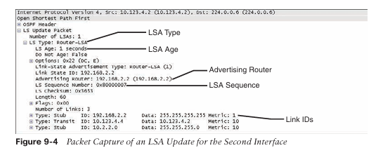

**Secuencias de LSA**

OSPF utiliza el número de secuencia para superar los problemas causados por retrasos en la propagación de LSA en una red. El número de secuencia del LSA es un número de 32 bits para controlar el versionado. Cuando el router originador envía LSA, el número de secuencia del LSA se incrementa. Si un router recibe un LSA con un número de secuencia mayor que el que existe en la LSDB, procesa el LSA. Si el número de secuencia del LSA es menor que el de la LSDB, el router considera el LSA como obsoleto y lo descarta.

**Edad del LSA y Flooding**

Cada LSA de OSPF incluye un campo de edad que se introduce en la LSDB local y que se incrementa en 1 cada segundo. Cuando la edad del LSA de OSPF de un router supera los 1800 segundos (30 minutos) para sus redes, el router originador anuncia un nuevo LSA con el campo de edad del LSA establecido en 0. A medida que cada router reenvía el LSA, la edad del LSA se incrementa con un retraso mínimo calculado que refleja el enlace. Si la edad del LSA alcanza los 3600, el LSA se considera inválido y se elimina de la LSDB. El flooding repetitivo de los LSA es un mecanismo de seguridad secundario para garantizar que todos los routers mantengan una LSDB consistente dentro de un área.

**Tipos de LSA**

Todos los routers dentro de un área OSPF tienen un conjunto idéntico de LSA para esa área. Los ABR mantienen un conjunto separado de LSA para cada área OSPF. La mayoría de los LSA en un área serán diferentes de los LSA en otra área. La salida genérica de **router LSA** se muestra con el comando `show ip ospf database`.

**LSA Tipo 1: Enlace de Router**

Cada router OSPF anuncia un LSA de tipo 1. Los LSA de tipo 1 son los bloques de construcción esenciales dentro de la LSDB. Existe una entrada de LSA de tipo 1 para cada enlace habilitado para OSPF (es decir, cada interfaz y sus redes conectadas). La Figura 9-5 muestra que, en este ejemplo, los LSA de tipo 1 no se anuncian fuera del Área 1234, lo que significa que la topología subyacente de un área es invisible para otras áreas.

> **NOTA**  Los LSA de tipo 1 para un área se muestran con el comando `show ip ospf database router`.

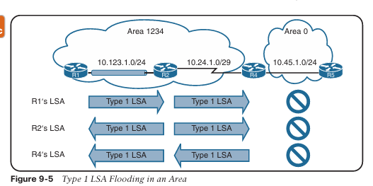

Los campos iniciales de cada LSA de tipo 1 indican el RID del router anunciante del LSA, la edad, el número de secuencia, el número de enlaces y el ID del enlace. Cada interfaz habilitada para OSPF aparece listada bajo el número de enlaces de cada router. Cada red dentro de un router contiene el tipo de enlace, la información correlacionada para la identificación del router vecino y la métrica de la interfaz.

La información correlacionada para la identificación del router vecino suele ser el RID del vecino, con la excepción de los segmentos de red de acceso múltiple que contienen routers designados (DR). En esos escenarios, la dirección de la interfaz del DR identifica al router vecino.

La Figura 9-6 es una subsección de referencia del Área 1234 tomada de la Figura 9-3 original.

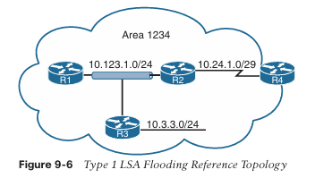

Si se correlacionan únicamente los LSA de tipo 1 de la topología de referencia de la Figura 9-6, entonces la Figura 9-7 demuestra la topología construida por todos los routers del Área 1234 utilizando los atributos LSA del Área 1234 de los cuatro routers. Usando solo LSA de tipo 1, se establece una conexión entre R2 y R4 porque apuntan entre sí como RID en el LSA punto a punto. Obsérvese que los otros tres enlaces, R1, R2 y R3 (10.123.1.0), aún no han sido conectados directamente.

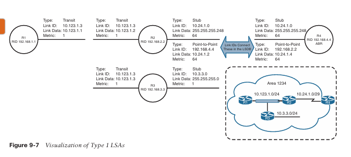

**LSA Tipo 2: Enlace de Red**

Un LSA de tipo 2 representa un segmento de red de acceso múltiple que utiliza un DR. El DR siempre anuncia el LSA de tipo 2 e identifica a todos los routers conectados a ese segmento de red. Si no se ha elegido un DR, un LSA de tipo 2 no está presente en la LSDB porque el LSA de tipo 1 de tipo tránsito correspondiente es un stub. Al igual que los LSA de tipo 1, los LSA de tipo 2 no se inundan fuera del área OSPF de origen.

El Área 1234 tiene solo un segmento con DR que conecta a R1, R2 y R3 porque R3 no ha formado una adyacencia OSPF en el segmento de red 10.3.3.0/24. En el segmento de red 10.123.1.0/24, R3 es elegido como DR y R2 es elegido como BDR en función de sus RID.

Ahora que tenemos el LSA de tipo 2 para el Área 1234, todos los enlaces de red están conectados. La Figura 9-8 proporciona una visualización de los LSA de tipo 1 y tipo 2, que corresponden perfectamente con el Área 1234.

**LSA Tipo 3: Enlace Resumen**

Los LSA de tipo 3 representan redes de otras áreas. El rol de los ABR es participar en múltiples áreas OSPF y garantizar que las redes asociadas con LSA de tipo 1 sean alcanzables en las áreas OSPF no originarias.

Como se explicó anteriormente, los ABR no reenvían LSA de tipo 1 ni de tipo 2 a otras áreas. Cuando un ABR recibe un LSA de tipo 1, crea un LSA de tipo 3 que referencia la red del LSA de tipo 1 original. El LSA de tipo 2 se utiliza para determinar la máscara de red del segmento de red de acceso múltiple. El ABR anuncia el LSA de tipo 3 a otras áreas. Si un ABR recibe un LSA de tipo 3 desde el Área 0 (el backbone), regenera un nuevo LSA de tipo 3 para el área no backbone y enumera como router anunciante, con la métrica de costo adicional.

La Figura 9-9 demuestra el concepto de la interacción de un LSA de tipo 3 con LSA de tipo 1.

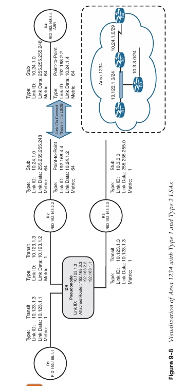

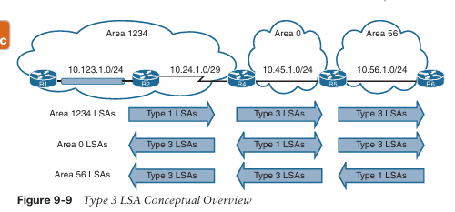

Los LSA de tipo 3 aparecen bajo las áreas correspondientes donde existen en el dominio OSPF. Por ejemplo, el LSA de tipo 3 para 10.56.1.0 existe en las áreas 0 y 1234 en R5. Sin embargo, en R5 el LSA de tipo 3 existe solo en el Área 0 porque la red 10.56.1.0 es un LSA de tipo 1 en el Área 56.

La información detallada de los LSA de tipo 3 se muestra con el comando **show ip ospf database summary**. La salida puede restringirse a un LSA específico agregando el prefijo de red al final del comando.

El router que anuncia los LSA de tipo 3 es el último ABR que anuncia el prefijo. La métrica dentro del LSA de tipo 3 utiliza la siguiente lógica:

- Si el LSA de tipo 3 se crea a partir de un LSA de tipo 1, es la métrica total del camino para llegar al router originador en el LSA de tipo 1.
    
- Si el LSA de tipo 3 se crea a partir de un LSA de tipo 3 proveniente del Área 0, es la métrica total hasta el ABR más la métrica en el LSA de tipo 3 original.
    

Por ejemplo, a partir de la Figura 9-9, cuando R2 anuncia la red 10.123.1.0/24, ocurre lo siguiente:

- R4 recibe el LSA de tipo 1 de R2 y crea un nuevo LSA de tipo 3 utilizando la métrica 65: el costo de 1 para la interfaz LAN de R2 y 64 para el enlace serial entre R2 y R4.
    
- R4 anuncia el LSA de tipo 3 con la métrica 65 hacia el Área 0.
    
- R5 recibe el LSA de tipo 3 y crea un nuevo LSA de tipo 3 para el Área 56, utilizando la métrica 66: el costo de 1 para el enlace entre R4 y R5 más la métrica original del LSA de tipo 3 (65).
    
- R6 recibe el LSA de tipo 3. Parte del cálculo de R6 es la métrica para llegar al ABR (R5), que es 1, más la métrica en el LSA de tipo 3 (66). Por lo tanto, R6 calcula la métrica 67 para llegar a 10.123.1.0/24.
    

El LSA de tipo 3 contiene el ID del enlace (número de red), la máscara de subred, la dirección IP del ABR que anuncia y la métrica para el prefijo de red.

La Figura 9-10 proporciona la perspectiva de R4 del LSA de tipo 3 creado por el ABR (R5) para la red 10.56.1.0/24. R4 no sabe si la red 10.56.1.0/24 está conectada directamente al ABR (R5) o si está a múltiples saltos de distancia. R4 sabe que su métrica hasta el ABR (R5) es 1 y que el LSA de tipo 3 ya tiene una métrica de 1, por lo que su métrica total para alcanzar la red 10.56.1.0/24 es 2.

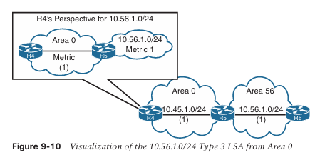

La Figura 9-11 proporciona la perspectiva de R3 del LSA de tipo 3 creado por el ABR (R4) para la red 10.56.1.0/24. R3 no sabe si la red 10.56.1.0/24 está conectada directamente al ABR (R4) o si se encuentra a múltiples saltos de distancia. R3 sabe que su métrica hasta el ABR (R4) es 65 y que el LSA de tipo 3 ya tiene una métrica de 2, por lo que su métrica total de ruta para alcanzar la red 10.56.1.0/24 es 67.

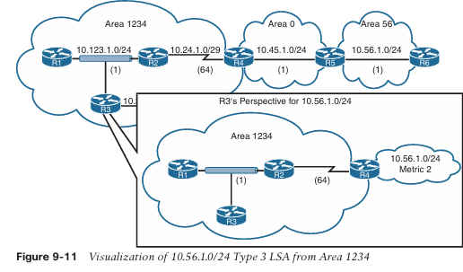

> **Nota** Un ABR anuncia solo un LSA de tipo 3 para un prefijo, incluso si tiene múltiples rutas desde su área (LSA de tipo 1) o desde áreas externas (LSA de tipo 3). La métrica de la mejor ruta será la que se utilice cuando el LSA se anuncie a un área diferente.

> **Nota** OSPF contiene funcionalidad para optimizar la sumarización de rutas cuando un ABR anuncia rutas entre áreas. Las áreas Stub o Not-So-Stubby (NSSA) proporcionan un método para bloquear la entrada de rutas externas desde un área y reemplazarlas por una ruta por defecto. Estos tipos de área pueden mejorarse aún más a Totally Stubby o Totally NSSA para impedir que rutas externas y rutas entre áreas entren en un área a través del ABR y sean reemplazadas también por una ruta por defecto.

### Redes Discontinuas

Los ingenieros de red que no comprenden completamente el diseño de OSPF pueden crear una topología como la ilustrada en la Figura 9-12. Aunque R2 y R3 tienen interfaces OSPF en el Área 0, el tráfico desde el Área 12 debe cruzar el Área 23 para llegar al Área 34. Un diseño OSPF con esta característica es discontinuo porque el tráfico entre áreas intenta cruzar un área que no es backbone.

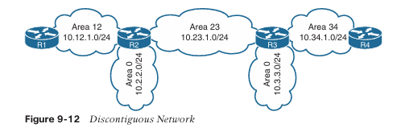

A primera vista, parece que las rutas en las tablas de enrutamiento de R2 y R3 en la Figura 9-13 se anuncian a través del Área 23; sin embargo, este no es el caso. La red 10.34.1.0/24 se anuncia en OSPF por R3 y R4 como un LSA de tipo 1. R3 es un ABR y convierte el LSA de tipo 1 de 10.34.1.0/24 del Área 34 en un LSA de tipo 3. R3 utiliza el LSA de tipo 3 desde el Área 0 para generar el LSA de tipo 3 para el Área 23. R2 puede instalar el LSA de tipo 3 del Área 23 en su tabla de enrutamiento.


La mayoría de las personas asumiría que la ruta 10.34.1.0/24 aprendida por el Área 23 luego se anunciaría hacia el Área 0 de R2 y después se propagaría al Área 12. Sin embargo, estarían equivocados. Existen tres reglas fundamentales que los ABR utilizan para crear LSAs de tipo 3:

- Los LSAs de tipo 1 recibidos desde un área crean LSAs de tipo 3 hacia el área backbone y hacia las áreas no backbone.
    
- Los LSAs de tipo 3 recibidos desde el Área 0 se crean para el área no backbone.
    
- Los LSAs de tipo 3 recibidos desde un área no backbone solo se insertan en la LSDB del área de origen. Los ABR no crean un LSA de tipo 3 para las otras áreas (incluyendo un Área 0 segmentada).
    

La solución más simple para una red discontinua es asegurar que el Área 0 sea contigua. Existen otras funciones, como enlaces virtuales o el uso de túneles GRE, que pueden utilizarse también; sin embargo, están fuera del alcance de este libro y complican el entorno operativo.

## Selección de Ruta en OSPF

OSPF ejecuta el algoritmo de camino más corto de Dijkstra (SPF) para crear una topología libre de bucles de los caminos más cortos. Todos los routers utilizan la misma lógica para calcular el camino más corto hacia cada red. La selección de rutas prioriza los caminos utilizando la siguiente lógica:

1. Intra-área
    
2. Inter-área
    
3. Rutas externas (que implican lógica adicional no cubierta en este libro)
    

### Rutas Intra-área

Las rutas intra-área siempre se prefieren sobre las rutas inter-área. Si existen múltiples rutas intra-área para la misma red de destino, la ruta con la métrica total más baja se instala en la Base de Información de Enrutamiento de OSPF (RIB), que luego se presenta en la RIB global del router. Si existe un empate en la métrica, ambas rutas se instalan en la RIB de OSPF.

En la Figura 9-14, R1 está calculando la ruta hacia la red 10.4.4.0/24. En lugar de tomar la ruta Ethernet más rápida (R1→R2→R4), R1 toma el camino más lento por el enlace serial (R1→R3→R4) hacia R4, porque las rutas intra-área se prefieren sobre las rutas inter-área.

La Figura 9-6 muestra la entrada de la tabla de enrutamiento de R1 para la red 10.4.4.0/24. Obsérvese que la métrica es 111 y que la ruta intra-área fue seleccionada sobre la ruta inter-área, aun cuando la ruta inter-área tiene una métrica total más baja.

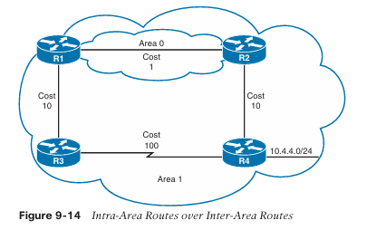

**Ejemplo 9-6:**  Tabla de Enrutamiento de R1 para la Red 10.4.4.0/24
```
R1# show ip route 10.4.4.0
Routing entry for 10.4.4.0/24
  Known via "ospf 1", distance 110, metric 111, type intra area
  Last update from 10.13.1.3 on GigabitEthernet0/1, 00:00:42 ago
  Routing Descriptor Blocks:
  * 10.13.1.3, from 10.34.1.4, 00:00:42 ago, via GigabitEthernet0/1
      Route metric is 111, traffic share count is 1
```

**Rutas Inter-área**

La siguiente prioridad para seleccionar un camino hacia una red en un área diferente es elegir el camino con la métrica total más baja hacia el destino. Si existe un empate en la métrica, ambos caminos se instalan en la RIB de OSPF. Todas las rutas inter-área para una red deben atravesar el Área 0 para ser consideradas.

En la Figura 9-15, R1 está calculando el camino hacia R6. R1 utiliza el camino R1→R3→R5→R6 porque su métrica total es 35, frente al camino R1→R2→R4→R6, que tiene una métrica de 40.

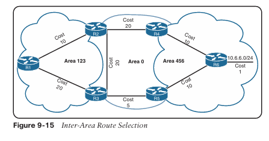

**Multipath de Costo Igual**

Si OSPF identifica múltiples caminos en los algoritmos de selección de ruta, esas rutas se instalan en la tabla de enrutamiento utilizando multipath de costo igual (ECMP). El número máximo predeterminado de caminos ECMP es cuatro. La configuración predeterminada de ECMP puede sobrescribirse con el comando `maximum-paths maximum-paths` dentro del proceso OSPF para modificar el valor por defecto.

**Sumarización de Rutas**

La escalabilidad de rutas es un factor crítico para los protocolos de enrutamiento IGP utilizados por los proveedores de servicios, ya que puede haber miles de routers operando en una red. Dividir un dominio de enrutamiento OSPF en múltiples áreas reduce el tamaño de la LSDB para cada área. Aunque el número de routers y redes permanece igual dentro del dominio OSPF, los LSA detallados de tipo 1 y tipo 2 se intercambian por LSA de tipo 3 más simples.

Por ejemplo, tomando como referencia la topología para LSAs de la Figura 9-16 para el Área 1234, existen tres LSA de tipo 1 y un LSA de tipo 2 para la red 10.123.1.0/24. Posteriormente, esos cuatro LSA se convierten en un único LSA de tipo 3 fuera del Área 1234. La Figura 9-16 ilustra la reducción de LSAs mediante la segmentación por áreas para la red 10.123.1.0/24.

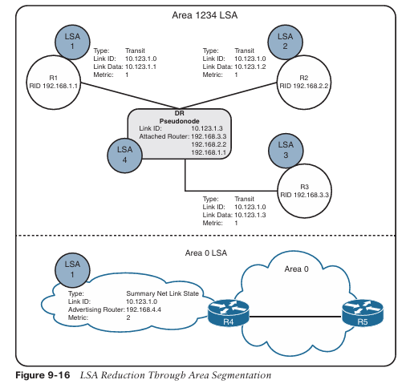

**Fundamentos de la Sumarización**

Otro método para reducir el tamaño de la LSDB consiste en la sumarización de prefijos de red. Los routers más nuevos disponen de mayor memoria y procesadores más rápidos que en el pasado, pero como todos los routers deben mantener una copia idéntica de la LSDB, un área OSPF debe adaptarse al router más pequeño y lento de esa área.

La sumarización de rutas también ayuda a que los cálculos de SPF se ejecuten más rápido. Un router que tiene 10.000 rutas de red tardará más en ejecutar el cálculo SPF que un router con 100 rutas. Dado que todos los routers dentro de un área deben mantener una copia idéntica de la LSDB, la sumarización ocurre entre áreas en los ABR.

La sumarización puede eliminar el cálculo SPF fuera del área para los prefijos resumidos, ya que los prefijos más específicos quedan ocultos. La Figura 9-17 presenta una topología de red simple donde el enlace serial entre R3 y R4 tiene un costo de ruta mayor, y R1, R2 y R3 utilizan la ruta a través de 10.124.0/24 para alcanzar la red 172.16.46.0/24. Si la red 10.124.0/24 falla, todos los routers en el Área 1 deben ejecutar el cálculo SPF. R4 identificaría que las redes 10.113.10/24 y 10.113.0/24 deberían cambiar su siguiente salto por el enlace serial. Ambos LSA de tipo 3 para estas redes deben actualizarse con las nuevas métricas de ruta y anunciarse hacia el Área 0. Los routers en el Área 0 ejecutan el cálculo SPF únicamente sobre esos dos prefijos.

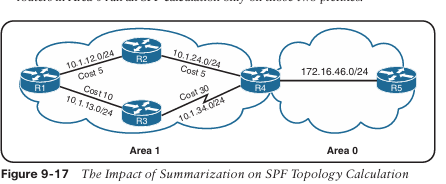

