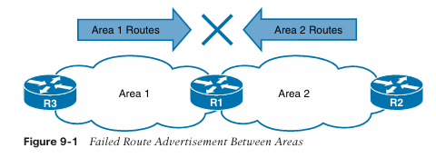
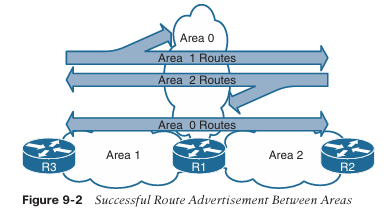
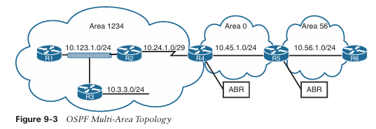

**CAPÍTULO 9**

**OSPF Avanzado**

Este capítulo cubre los siguientes temas:

- **Áreas:** Esta sección describe los beneficios y funciones de las áreas dentro de un dominio de enrutamiento OSPF.
    
- **Anuncios de Estado de Enlace:** Esta sección explica cómo OSPF almacena, comunica y construye una topología a partir de los anuncios de estado de enlace (LSA).
    
- **Redes Discontinuas:** Esta sección demuestra una red discontinua y explica por qué una red de este tipo no puede distribuir rutas correctamente a todas las áreas.
    
- **Selección de Rutas OSPF:** Esta sección explica cómo OSPF toma decisiones de selección de rutas para las rutas aprendidas dentro del dominio de enrutamiento OSPF.
    
- **Sumarización de Rutas:** Esta sección explica cómo funciona la sumarización de redes con OSPF.
    
- **Filtrado de Rutas:** Esta sección explica cómo las rutas OSPF pueden ser filtradas en un router.
    

El protocolo Open Shortest Path First (OSPF) escala bien con una planificación de red adecuada. Los esquemas de direccionamiento IP, la segmentación por áreas, la sumarización de direcciones y las capacidades de hardware para cada área deben tenerse en cuenta al diseñar una red.

Este capítulo amplía el Capítulo 8, **OSPF**, y explica las funciones y características que se encuentran en redes empresariales de mayor tamaño. Al final de este capítulo, deberías tener una comprensión sólida del anuncio de rutas dentro de un dominio OSPF multiárea, la selección de rutas y las técnicas de optimización.

---

**Áreas**

Un área OSPF es una agrupación lógica de routers o, más específicamente, una agrupación lógica de interfaces de router. La pertenencia a un área se define a nivel de interfaz, y el ID de área se incluye en el paquete hello de OSPF. Una interfaz solo puede pertenecer a un área. Todos los routers dentro de la misma área OSPF mantienen una copia idéntica de la base de datos de estado de enlace (LSDB).

Un área OSPF crece a medida que se añaden nuevos enlaces de red y aumenta el número de routers dentro del área. Aunque el uso de un área única simplifica la topología, existen compromisos:

- Se ejecuta un cálculo completo del árbol de ruta más corta (SPF) cuando un enlace falla dentro del área.
    
- La LSDB aumenta de tamaño y se vuelve inmanejable a medida que crece la red, ya que la LSDB consume más memoria y el cálculo SPF tarda más tiempo.
    
- No se produce ninguna sumarización de la información de enrutamiento.
    

Un diseño adecuado aborda cada uno de estos problemas segmentando el dominio de enrutamiento OSPF en múltiples áreas OSPF, manteniendo la LSDB en un tamaño manejable. El dimensionamiento y diseño de las redes OSPF deben tener en cuenta las limitaciones de hardware del router más pequeño dentro de esa área.

Si un router tiene interfaces en múltiples áreas, el router mantiene múltiples LSDB (una por cada área). La topología interna de un área no es visible fuera de esa área. Si ocurre un cambio de topología (como la caída de un enlace o la adición de una red) dentro de un área, todos los routers en esa misma área OSPF recalculan nuevamente el árbol SPF completo. Los routers fuera de esa área no recalculan el SPF completo, sino que realizan un cálculo SPF parcial si cambian las métricas o se elimina un prefijo.

En esencia, un área OSPF oculta la topología de otras áreas, pero permite que las redes sean visibles en otras áreas dentro del dominio OSPF. La segmentación del dominio OSPF en múltiples áreas reduce el tamaño de la LSDB por área, acelera los cálculos SPF y disminuye el tráfico de inundación de la LSDB entre routers cuando ocurre una caída de enlace.

El hecho de que un router se conecte a múltiples áreas OSPF no significa que las rutas de un área se inyecten automáticamente en otra. La Figura 9-1 muestra el router R1 conectado al Área 1 y al Área 2. Las rutas del Área 1 no se anuncian en el Área 2 y viceversa.



El Área 0 es un área especial llamada el _backbone_. Por diseño, todas las áreas deben conectarse al Área 0 porque OSPF espera que todas las áreas inyecten información de enrutamiento en el backbone, y el Área 0 anuncia las rutas a las demás áreas. El diseño del backbone es fundamental para prevenir bucles de enrutamiento.

Los _Area Border Routers (ABR)_ son routers OSPF conectados al Área 0 y a otra área OSPF. Según la definición de Cisco y de acuerdo con la RFC 3509, los ABR son responsables de anunciar rutas desde un área e inyectarlas en otra área OSPF diferente. Todo ABR debe participar en el Área 0; de lo contrario, las rutas no se anunciarán hacia otra área. Los ABR calculan un SPF independiente para cada área en la que participan.

La Figura 9-2 muestra que R1 está conectado al Área 0, Área 1 y Área 2. R1 es un ABR correcto porque ahora participa en el Área 0. En R1 ocurre lo siguiente:

- Las rutas del Área 1 se anuncian hacia el Área 0.
    
- Las rutas del Área 2 se anuncian hacia el Área 0.
    
- Las rutas del Área 0 se anuncian hacia las Áreas 1 y 2. Esto incluye las rutas locales del Área 0, además de las rutas que fueron anunciadas hacia el Área 0 desde las Áreas 1 y 2.



La Figura 9-3 muestra una topología OSPF multiárea a mayor escala que se utiliza a lo largo de este capítulo para describir diversos conceptos de OSPF.



En la topología:

- R1, R2, R3 y R4 pertenecen al Área 1234.
    
- R4 y R5 pertenecen al Área 0.
    
- R5 y R6 pertenecen al Área 56.
    
- R4 y R5 son ABR.
    
- El Área 1234 se conecta al Área 0, y el Área 56 se conecta al Área 0.
    
- Los routers en el Área 1234 pueden ver rutas de los routers en el Área 0 y el Área 56, y viceversa.
    

El Ejemplo 9-1 muestra la configuración OSPF para los ABR R4 y R5. Obsérvese que R4 y R5 tienen una interfaz en el Área 0 y otra en un área que no es backbone. Además, la declaración OSPF network de R4 para el enlace serial no necesita coincidir exactamente con la red 10.24.1.0/29, siempre que esté dentro del rango configurado.

**Ejemplo 9-1:** Configuración OSPF Multiárea de Ejemplo
```
R4
router ospf 1
 router-id 192.168.4.4
 network 10.24.1.0 0.0.0.255 area 1234
 network 10.45.1.0 0.0.0.255 area 0
```

```
R5
router ospf 1
 router-id 192.168.5.5
 network 10.45.1.0 0.0.0.255 area 0
 network 10.56.1.0 0.0.0.255 area 56
```

El Ejemplo 9-2 verifica que las interfaces en R4 pertenecen al Área 1234 y al Área 0, y que las interfaces en R5 pertenecen al Área 0 y al Área 56.

**Ejemplo 9-2:** Verificación de Interfaces para los ABR
```
R4# show ip ospf interface brief
Interface  PID  Area   IP Address/Mask   Cost  State  Nbrs F/C
Gi0/0      1    0      10.45.1.4/24      1     BDR    1/1
Se1/0      1    1234   10.24.1.4/29      64    P2P    1/1
```

```
R5# show ip ospf interface brief
Interface  PID  Area   IP Address/Mask   Cost  State  Nbrs F/C
Gi0/0      1    0      10.45.1.5/24      1     DR     1/1
Gi0/1      1    56     10.56.1.5/24      1     BDR    1/1
```

**Area ID**

El ID de área es un campo de 32 bits y puede representarse en formato decimal simple (0 a 4,294,967,295) o en formato decimal con puntos (0.0.0.0 a 255.255.255.255). Durante la configuración del router, el área puede configurarse en formato decimal simple en un router y en formato decimal con puntos en otro router, y aun así los routers pueden formar una adyacencia. OSPF anuncia el ID de área en formato decimal con puntos en el paquete hello de OSPF.

**Tipos de Rutas OSPF**

Las rutas OSPF hacia redes de destino dentro de la misma área se conocen como **rutas intra-área**. En la Figura 9-3, el enlace serial entre R2 y R4 (10.24.1.0/29) es una ruta intra-área hacia R1. La tabla de enrutamiento IP muestra rutas OSPF intra-área con una **O**.

Las rutas OSPF hacia redes de destino en un área diferente usando un ABR se conocen como **rutas inter-área**. En la Figura 9-3, la red Ethernet entre R4 y R5 (10.45.1.0/24) es una ruta inter-área hacia R1. La tabla de enrutamiento IP muestra rutas OSPF inter-área con **O IA**.

El Ejemplo 9-3 proporciona la tabla de enrutamiento para R1 a partir de la Figura 9-3. Obsérvese que la tabla de enrutamiento OSPF de R1 muestra rutas de las redes dentro del Área 1234 como rutas intra-área (rutas **O**) y rutas del Área 0 y del Área 56 como rutas inter-área (rutas **O IA**).

