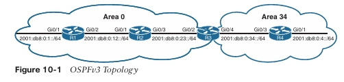

**CAPÍTULO 10**

## OSPFv3

Este capítulo cubre los siguientes temas:

- **Fundamentos de OSPFv3:** Esta sección proporciona una visión general del protocolo de enrutamiento OSPFv3 y las similitudes con OSPFv2.
    
- **Configuración de OSPFv3:** Esta sección demuestra la configuración y verificación de un entorno OSPFv3.
    
- **Soporte IPv4 en OSPFv3:** Esta sección explica y demuestra cómo OSPFv3 puede utilizarse para el intercambio de rutas IPv4.
    

OSPF versión 3 (OSPFv3), que es la versión más reciente del protocolo OSPF, incluye soporte tanto para las familias de direcciones IPv4 como IPv6. El protocolo OSPFv3 no es compatible hacia atrás con OSPFv2, pero los mecanismos del protocolo descritos en los Capítulos 8, “OSPF”, y 9, “OSPF Avanzado”, son esencialmente los mismos para OSPFv3. Este capítulo amplía el Capítulo 9 y analiza OSPFv3 y su soporte de IPv6.

---

## Fundamentos de OSPFv3

OSPFv3 es diferente de OSPFv2 en los siguientes aspectos:

- **Soporte para múltiples familias de direcciones:** OSPFv3 admite las familias de direcciones IPv4 e IPv6.
    
- **Nuevos tipos de LSA:** Se han creado nuevos tipos de LSA para transportar prefijos IPv6.
    
- **Eliminación de la semántica de direccionamiento:** La información del prefijo IP ya no está presente en las cabeceras de los paquetes OSPF. En su lugar, se transporta como información de carga útil dentro de los LSA, lo que hace que el protocolo sea esencialmente independiente de la familia de direcciones, de forma similar a IS-IS. OSPFv3 utiliza el término _link_ (enlace) en lugar de _network_ (red) porque los cálculos del SPT se realizan por enlace y no por subred.
    
- **Inundación de LSA:** OSPFv3 incluye un nuevo campo de tipo de estado de enlace que se utiliza para determinar el alcance de inundación de los LSA, así como el manejo de tipos de LSA desconocidos.
    
- **Formato de paquete:** OSPFv3 funciona directamente sobre IPv6 y se ha reducido el número de campos en la cabecera del paquete.
    
- **Router ID:** El Router ID se utiliza para identificar vecinos, independientemente del tipo de red en OSPFv3. Al configurar OSPFv3 en routers IOS, el RID siempre debe asignarse manualmente dentro del proceso de enrutamiento.
    
- **Autenticación:** La autenticación entre vecinos ha sido eliminada del protocolo OSPF y ahora se realiza mediante cabeceras de extensión IPsec en el paquete IPv6.
    
- **Adyacencias de vecinos:** La comunicación entre routers en OSPFv3 se gestiona mediante direccionamiento IPv6 de enlace local. Los vecinos no se detectan automáticamente en interfaces NBMA (Non-Broadcast Multi-Access). Un vecino debe especificarse manualmente utilizando la dirección de enlace local. IPv6 permite que múltiples subredes se asignen a una sola interfaz, y OSPFv3 permite que se formen adyacencias de vecinos incluso si los routers no comparten una subred común.
    
- **Múltiples instancias:** Los paquetes OSPFv3 incluyen un campo de ID de instancia que puede utilizarse para controlar qué routers de un segmento de red tienen permitido formar adyacencias.
    

> **Nota** RFC 5340 proporciona una cobertura detallada de todas las diferencias entre OSPFv2 y OSPFv3.

### Anuncios de Estado de Enlace en OSPFv3

La base de datos de estado de enlace de OSPF está organizada y se anuncia de forma diferente en la versión 3 que en la versión 2. OSPFv3 modifica la estructura del LSA de router (tipo 1), renombra el LSA de resumen de red como LSA de prefijo intra-área, y renombra el LSA de resumen de ASBR como LSA de prefijo inter-área. La diferencia principal es que el LSA de router solo es responsable de anunciar parámetros de la interfaz, como el tipo de interfaz (punto a punto, broadcast, NBMA, punto a multipunto y enlaces virtuales) y la métrica (costo).

La información de direcciones IP se anuncia de forma independiente mediante dos nuevos tipos de LSA:

- LSA de prefijo intra-área
    
- LSA de enlace
    

El cálculo de Dijkstra de OSPF utilizado para determinar el árbol de caminos más cortos (SPT) solo examina los LSA de router y de red. Anunciar la información de prefijos IP utilizando nuevos tipos de LSA elimina la necesidad de que OSPF ejecute cálculos completos del SPF cada vez que se agrega o cambia un nuevo prefijo IP en una interfaz. La base de datos de estado de enlace (LSDB) de OSPFv3 crea un árbol de caminos más cortos basado en enlaces en lugar de redes.

### Comunicación en OSPFv3

Los paquetes OSPFv3 utilizan el número de protocolo 89 en la cabecera IPv6, y los routers se comunican entre sí utilizando la dirección IPv6 de enlace local de la interfaz local como dirección de origen. También utiliza los mismos cinco tipos de paquetes y la misma lógica que OSPFv2. Dependiendo del tipo de paquete, la dirección de destino es una dirección de enlace local unicast o una dirección multicast con alcance de enlace local:

- FF02::5: OSPFv3 AllSPFRouters
    
- FF02::6: OSPFv3 AllDRouters
    

Cada router utiliza la dirección multicast AllSPFRouters FF02::5 para enviar mensajes hello de OSPF a los routers en el mismo enlace. Los mensajes hello se utilizan para el descubrimiento de vecinos y para detectar si un vecino deja de estar disponible. Los routers DR y BDR también utilizan esta dirección para enviar mensajes de actualización de estado de enlace y de confirmación de inundación a todos los routers.

Los routers que no son DR ni BDR envían mensajes de actualización de estado de enlace y de confirmación de enlace al DR y al BDR utilizando la dirección AllDRouters FF02::6.

### Configuración de OSPFv3

El proceso de configuración de OSPFv3 implica los siguientes pasos:

**Paso 1.** Inicializar el proceso de enrutamiento. Como requisito previo, `ipv6 unicast-routing` debe estar habilitado en el router. Posteriormente, el proceso OSPFv3 se configura con el comando `router ospfv3 [process-id]`.

**Paso 2.** Definir el Router ID. El comando `router-id router-id` asigna un Router ID al proceso OSPF. El Router ID es un valor de 32 bits que no necesita coincidir con una dirección IPv4. Puede ser cualquier valor en formato de dirección IPv4 (por ejemplo, 0.1.2.3), siempre que sea único dentro del dominio OSPF.

OSPFv3 utiliza el mismo algoritmo que OSPFv2 para asignar dinámicamente el RID. Si no hay direcciones IPv4 disponibles, el RID se establece en 0.0.0.0 y no se permiten adyacencias.

**Paso 3.** (Opcional) Inicializar la familia de direcciones. La familia de direcciones se inicializa dentro del proceso de enrutamiento con el comando `address-family [ipv6 | ipv4] unicast`. La familia de direcciones apropiada se habilita automáticamente cuando OSPFv3 se habilita en una interfaz.

**Paso 4.** Habilitar OSPFv3 en una interfaz. El comando de interfaz `ospfv3 process-id ipv6 area area-id` habilita el protocolo y asigna la interfaz a un área.

> **NOTA**  OSPFv3 no utiliza el comando `network` para inicializar interfaces.

La Figura 10-1 muestra una topología simple de cuatro routers para demostrar la configuración de OSPFv3. El Área 0 está compuesta por R1, R2 y R3, y el Área 34 contiene R3 y R4. R3 es el ABR.



El Ejemplo 10-1 proporciona las configuraciones de direccionamiento OSPFv3 e IPv6 para R1, R2, R3 y R4. El direccionamiento IPv6 link-local se ha configurado en todas las interfaces del router para reflejar sus números locales (por ejemplo, las interfaces de R1 se configuran con FE80::1), además del direccionamiento IPv6 tradicional. La dirección link-local se configura de forma estática para ayudar con la salida de diagnóstico en este capítulo. La configuración de OSPFv3 se ha resaltado en este ejemplo.

**Ejemplo 10-1:** Direccionamiento IPv6 y Configuración de OSPFv3
```
R1
interface Loopback0
 ipv6 address 2001:DB8::1/128
 ospfv3 1 ipv6 area 0
!
interface GigabitEthernet0/1
 ipv6 address FE80::1 link-local
 ipv6 address 2001:DB8:0:1::1/64
 ospfv3 1 ipv6 area 0
!
interface GigabitEthernet0/2
 ipv6 address FE80::1 link-local
 ipv6 address 2001:DB8:0:12::1/64
 ospfv3 1 ipv6 area 0
!
router ospfv3 1
 router-id 192.168.1.1
```

```
R2
interface Loopback0
 ipv6 address 2001:DB8::2/128
 ospfv3 1 ipv6 area 0
!
interface GigabitEthernet0/1
 ipv6 address FE80::2 link-local
 ipv6 address 2001:DB8:0:12::2/64
 ospfv3 1 ipv6 area 0
!
interface GigabitEthernet0/3
 ipv6 address FE80::2 link-local
 ospfv3 1 ipv6 area 0
!
router ospfv3 1
 router-id 192.168.2.2
```

```
R3
interface Loopback0
 ipv6 address 2001:DB8::3/128
 ospfv3 1 ipv6 area 0
!
interface GigabitEthernet0/2
 ipv6 address FE80::3 link-local
 ipv6 address 2001:DB8:0:23::3/64
 ospfv3 1 ipv6 area 0
!
interface GigabitEthernet0/4
 ipv6 address FE80::3 link-local
 ipv6 address 2001:DB8:0:34::3/64
 ospfv3 1 ipv6 area 34
!
router ospfv3 1
 router-id 192.168.3.3
```

```
R4
interface Loopback0
 ipv6 address 2001:DB8::4/128
 ospfv3 1 ipv6 area 34
!
interface GigabitEthernet0/1
 ipv6 address FE80::4 link-local
 ipv6 address 2001:DB8:0:4::4/64
 ospfv3 1 ipv6 area 34
!
interface GigabitEthernet0/3
 ipv6 address FE80::4 link-local
 ipv6 address 2001:DB8:0:34::4/64
 ospfv3 1 ipv6 area 34
!
router ospfv3 1
 router-id 192.168.4.4
```

> **NOTA**  Versiones anteriores de IOS usaban los comandos `ipv6 router ospf` para inicializar el proceso OSPF e `ipv6 ospf process-id area area-id` para identificar la interfaz. Estos comandos se consideran heredados y deben migrarse a los que se usan en este libro.

## Verificación de OSPFv3

Los comandos para ver configuraciones y estados de OSPFv3 son similares a los usados en OSPFv2; básicamente reemplazan `ip ospf` por `ospfv3 ipv6`. Usar OSPFv3 requiere verificar las interfaces OSPFv3, las vecindades y la tabla de enrutamiento.

Por ejemplo, para ver la adyacencia de vecinos en OSPFv2 se ejecuta `show ip ospf neighbor`, y para OSPFv3 se usa `show ospfv3 ipv6 neighbor`. El Ejemplo 10-2 muestra este comando ejecutado en R3.

**Ejemplo 10-2:** Identificando los vecinos OSPFv3 de R3
```
R3# show ospfv3 ipv6 neighbor

            OSPFV3 1 address-family ipv6 (router-id 192.168.3.3)

Neighbor ID  Pri  State      Dead Time  Interface ID  Interface
192.168.2.2    1  FULL/DR    00:00:32             5  GigabitEthernet0/2
192.168.4.4    1  FULL/BDR   00:00:33             5  GigabitEthernet0/4
```

El Ejemplo 10-3 muestra la interfaz GigabitEthernet0/2 de R3 habilitada para OSPFv3 con el comando `show ospfv3 interface [interface-id]`. Observa que la semántica de direcciones se ha eliminado en comparación con OSPFv2. El comando se vincula al valor de _interface ID_ en lugar de a una dirección IP, como en OSPFv2. Además, cierta información de topología describe el enlace. El router local es el DR (192.168.1.1) y el vecino adyacente es el BDR (192.168.2.2).

**Ejemplo 10-3:** Visualización de la configuración de interfaz OSPFv3
```
R1# show ospfv3 interface GigabitEthernet0/2
GigabitEthernet0/2 is up, line protocol is up
  Link Local Address FE80::1, Interface ID 3
  Area 0, Process ID 0, Instance ID 0, Router ID 192.168.1.1
  Network Type BROADCAST, Cost: 1
  Transmit Delay is 1 sec, State DR, Priority 1
  Designated Router (ID) 192.168.1.1, local address FE80::1
  Backup designated router (ID) 192.168.2.2, local address FE80::2
  Timer intervals configured, Hello 10, Dead 40, Wait 40, Retransmit 5
    Hello due in 00:00:01
  Graceful restart helper support enabled
  Index 1/1, flood queue length 0
  Next 0x0/0x0/0x0/0x0
  Last flood scan length is 0, maximum is 4
  Last flood scan time is 0 msec, maximum is 0 msec
  Neighbor Count is 1, Adjacent neighbor count is 1
    Adjacent with neighbor 192.168.2.2 (Backup Designated Router)
  Suppress hello for 0 neighbor(s)
```

Una versión resumida de las configuraciones de interfaz OSPFv3 puede verse con el comando `show ospfv3 interface brief`. En la salida se proporciona el ID de proceso asociado, el área, la familia de direcciones (IPv4 o IPv6), el estado de la interfaz y el conteo de vecinos.

El Ejemplo 10-4 muestra este comando ejecutado en el ABR, R3. Observa que algunas interfaces residen en el Área 0 y otras residen en el Área 34.

**Ejemplo 10-4:** Visualización resumida de las interfaces OSPFv3
```
R3# show ospfv3 interface brief
Interface  PID  Area  AF   Cost  State  Nbrs F/C
Lo0        1    0     ipv6 1     LOOP   0/0
Gi0/2      1    0     ipv6 1     BDR    1/1
Gi0/4      1    34    ipv6 1     DR     1/1
```

La tabla de enrutamiento IPv6 de OSPFv3 se visualiza con el comando `show ipv6 route ospf`.  
Las rutas intra-área se indican con **O** y las rutas inter-área se indican con **OI**.

El Ejemplo 10-5 muestra este comando ejecutado en R1. La dirección de reenvío de las rutas es la dirección _link-local_ del router vecino.

**Ejemplo 10-5:** Visualización de las rutas OSPFv3 en la tabla de enrutamiento IPv6
```
R1# show ipv6 route ospf
! Output omitted for brevity
IPv6 Routing Table - default - 11 entries
Codes: R - RIP, O - OSPF intra, OI - OSPF inter, OE1 - OSPF ext 1,
       OE2 - OSPF ext 2, ON1 - OSPF NSSA ext 1, ON2 - OSPF NSSA ext 2

O   2001:DB8::2/128 [110/1]
     via FE80::2, GigabitEthernet0/2
O   2001:DB8::3/128 [110/2]
     via FE80::2, GigabitEthernet0/2
OI  2001:DB8::4/128 [110/3]
     via FE80::2, GigabitEthernet0/2
O   2001:DB8:0:4::/64 [110/4]
     via FE80::2, GigabitEthernet0/2
O   2001:DB8:0:2::/64 [110/2]
     via FE80::2, GigabitEthernet0/2
OI  2001:DB8:0:34::/64 [110/3]
     via FE80::2, GigabitEthernet0/2
```

**Interfaz pasiva**

OSPFv3 admite la capacidad de marcar una interfaz como pasiva. El comando se introduce bajo el proceso OSPFv3 o bajo la familia de direcciones específica. Colocar el comando bajo el proceso global hace que la configuración aplique a ambas familias de direcciones. Una interfaz se marca como pasiva con el comando `passive-interface interface-id` o de forma global con `passive-interface default`, y luego la interfaz se marca como activa con el comando `no passive-interface interface-id`.

El Ejemplo 10-6 muestra cómo hacer que la interfaz LAN en R1 sea explícitamente pasiva y cómo hacer que todas las interfaces en R4 sean pasivas excepto la interfaz Gi0/3, que permanece activa.

**Ejemplo 10-6:** Configuración de interfaces pasivas OSPFv3
```
R1(config)# router ospfv3 1
R1(config-router)# passive-interface GigabitEthernet0/1
```

```
R4(config)# router ospfv3 1
R4(config-router)# passive-interface default
22:10:46.838: %OSPFv3-5-ADJCHG: Process 1, IPv6, Nbr 192.168.3.3 on
GigabitEthernet0/3 from FULL to DOWN, Neighbor Down: Interface down or detached
R4(config-router)# no passive-interface GigabitEthernet0/3
```

El estado activo/pasivo de una interfaz se verifica examinando el estado de la interfaz OSPFv3 mediante el comando `show ospfv3 interface [interface-id]` y buscando la palabra clave **Passive**. En el Ejemplo 10-7, R1 confirma que la interfaz Gi0/1 es pasiva.

**Ejemplo 10-7:** Visualización del estado de una interfaz OSPFv3
```
R1# show ospfv3 interface GigabitEthernet 0/1 | include Passive
  No Hellos (Passive interface)
```

**Sumarización**

La capacidad de resumir redes IPv6 es importante, al igual que la sumarización de rutas en IPv4 (y puede ser aún más importante, debido a las limitaciones de hardware). El Ejemplo 10-8 muestra la tabla de enrutamiento IPv6 antes de que se aplique la sumarización en R3.

**Ejemplo 10-8:** Tabla de enrutamiento IPv6 de R4 antes de la sumarización
```
R4# show ipv6 route ospf | begin Application
IA - LISP away, A - Application
OI  2001:DB8::1/128 [110/3]
     via FE80::3, GigabitEthernet0/3
OI  2001:DB8::2/128 [110/2]
     via FE80::3, GigabitEthernet0/3
OI  2001:DB8::3/128 [110/3]
     via FE80::3, GigabitEthernet0/3
OI  2001:DB8:0:1::/64 [110/4]
     via FE80::3, GigabitEthernet0/3
OI  2001:DB8:0:12::/64 [110/3]
     via FE80::3, GigabitEthernet0/3
OI  2001:DB8:0:23::/64 [110/2]
     via FE80::3, GigabitEthernet0/3
```

La sumarización de las interfaces loopback del router del Área 0 (2001:db8:0::1/128, 2001:db8:0::2/128 y 2001:db8:0::3/128) elimina tres rutas de la tabla de enrutamiento.

La sumarización de rutas internas de OSPFv3 sigue las mismas reglas que en OSPFv2 y debe realizarse en los ABR. En nuestra topología, R3 resume las tres direcciones loopback en la red 2001:db8:0::/65. La sumarización implica el comando `area area-id range prefix/prefix-length`, que reside bajo la familia de direcciones en el proceso OSPFv3.

El Ejemplo 10-9 muestra la configuración de R3 para resumir estos prefijos.

**Ejemplo 10-9:** Sumarización IPv6
```
R3# configure terminal
Enter configuration commands, one per line. End with CNTL/Z.
R3(config)# router ospfv3 1
R3(config-router)# address-family ipv6 unicast
R3(config-router-af)# area 0 range 2001:db8:0::/65
```

El **Ejemplo 10-10** muestra la tabla de enrutamiento IPv6 de R4 después de configurar R3 para resumir las interfaces loopback del Área 0. La ruta resumida se resalta en este ejemplo.

**Ejemplo 10-10:** Tabla de enrutamiento IPv6 de R4 después de la sumarización
```
R4# show ipv6 route ospf | begin Application
IA - LISP away, A - Application
OI  2001:DB8::/65 [110/4]
     via FE80::3, GigabitEthernet0/3
OI  2001:DB8:0:1::/64 [110/4]
     via FE80::3, GigabitEthernet0/3
OI  2001:DB8:0:12::/64 [110/3]
     via FE80::3, GigabitEthernet0/3
OI  2001:DB8:0:23::/64 [110/2]
     via FE80::3, GigabitEthernet0/3
```

**Tipo de red**

OSPFv3 admite los mismos tipos de red OSPF que OSPFv2. El Ejemplo 10-11 muestra que la interfaz Gi0/3 de R2 está configurada como un tipo de red OSPF broadcast y se confirma que se encuentra en estado DR.

**Ejemplo 10-11:** Visualización del tipo de red OSPFv3 configurado dinámicamente
```
R2# show ospfv3 interface GigabitEthernet 0/3 | include Network
  Network Type BROADCAST, Cost: 1

R2# show ospfv3 interface brief
Interface  PID  Area  AF   Cost  State  Nbrs F/C
Lo0        1    0     ipv6 1     LOOP   0/0
Gi0/3      1    0     ipv6 1     DR     1/1
Gi0/1      1    0     ipv6 1     BDR    1/1
```

El tipo de red OSPFv3 se cambia con el comando de parámetro de interfaz `ospfv3 network {point-to-point | broadcast}`. El Ejemplo 10-12 muestra las interfaces asociadas con la red 2001:DB8:0:23::/64 siendo cambiadas a punto a punto.

**Ejemplo 10-12:** Cambio del tipo de red OSPFv3
```
R2# configure terminal
Enter configuration commands, one per line. End with CNTL/Z.
R2(config)# interface GigabitEthernet 0/3
R2(config-if)# ospfv3 network point-to-point

R3(config)# interface GigabitEthernet 0/2
R3(config-if)# ospfv3 network point-to-point
```

Después de introducir los cambios, los nuevos parámetros se verifican en el Ejemplo 10-13. La red ahora es un enlace punto a punto y el estado de la interfaz muestra P2P como confirmación.

**Ejemplo 10-13:** Visualización del tipo de red OSPFv3 configurado estáticamente
```
R2# show ospfv3 interface GigabitEthernet 0/3 | include Network
  Network Type POINT_TO_POINT, Cost: 1

R2# show ospfv3 interface brief
Interface  PID  Area  AF   Cost  State  Nbrs F/C
Lo0        1    0     ipv6 1     LOOP   0/0
Gi0/3      1    0     ipv6 1     P2P    1/1
Gi0/1      1    0     ipv6 1     BDR    1/1
```

**Soporte IPv4 en OSPFv3**

RFC 5838 especifica que OSPFv3 debería admitir múltiples familias de direcciones estableciendo el valor del ID de instancia desde el rango reservado para IPv6 al rango reservado para IPv4 (64 a 95) en los LSAs de enlace.

Habilitar el soporte IPv4 para OSPFv3 es directo:

**Paso 1.**  
Asegurar que la interfaz IPv4 tenga configurada una dirección IPv6 (global o link-local). Recuerde que configurar una dirección global también coloca una dirección link-local; alternativamente, una dirección link-local puede configurarse de forma estática.

**Paso 2.**  
Habilitar el proceso OSPFv3 para IPv4 en la interfaz con el comando `ospfv3 process-id ipv4 area area-id`.

Usando la topología mostrada en la Figura 10-1, el direccionamiento IPv4 ha sido aplicado en R1, R2, R3 y R4 siguiendo las convenciones descritas anteriormente. El Ejemplo 10-14 demuestra el despliegue de IPv4 usando la implementación OSPFv3 existente.

**Ejemplo 10-14:** Cambios de configuración para soporte IPv4
```
R1(config)# interface Loopback 0
R1(config-if)# ospfv3 1 ipv4 area 0
R1(config-if)# interface GigabitEthernet0/1
R1(config-if)# ospfv3 1 ipv4 area 0
R1(config-if)# interface GigabitEthernet0/2
R1(config-if)# ospfv3 1 ipv4 area 0
```

```
R2(config)# interface Loopback 0
R2(config-if)# ospfv3 1 ipv4 area 0
R2(config-if)# interface GigabitEthernet0/1
R2(config-if)# ospfv3 1 ipv4 area 0
R2(config-if)# interface GigabitEthernet0/3
R2(config-if)# ospfv3 1 ipv4 area 0
```

```
R3(config)# interface Loopback 0
R3(config-if)# ospfv3 1 ipv4 area 0
R3(config-if)# interface GigabitEthernet0/2
R3(config-if)# ospfv3 1 ipv4 area 0
```

```
R3(config-if)# interface GigabitEthernet0/4
R3(config-if)# ospfv3 1 ipv4 area 34
```

```
R4(config)# interface Loopback 0
R4(config-if)# ospfv3 1 ipv4 area 34
R4(config-if)# interface GigabitEthernet0/1
R4(config-if)# ospfv3 1 ipv4 area 34
R4(config-if)# interface GigabitEthernet0/3
R4(config-if)# ospfv3 1 ipv4 area 34
```

El Ejemplo 10-15 verifica que las rutas fueron intercambiadas e instaladas en la RIB IPv4.

**Ejemplo 10-15:** Verificando el intercambio de rutas IPv4 con OSPFv3
```
R4# show ip route ospfv3 | begin Gateway
Gateway of last resort is not set

     10.0.0.0/8 is variably subnetted, 5 subnets, 2 masks
O IA  10.1.1.0/24 [110/4] via 10.34.1.3, 00:00:39, GigabitEthernet0/3
O IA  10.12.1.0/24 [110/3] via 10.34.1.3, 00:00:39, GigabitEthernet0/3
O IA  10.23.1.0/24 [110/2] via 10.34.1.3, 00:00:39, GigabitEthernet0/3
     192.168.1.0/32 is subnetted, 3 subnets
O IA  192.168.1.1 [110/3] via 10.34.1.3, 00:00:39, GigabitEthernet0/3
O IA  192.168.2.0/32 is subnetted, 3 subnets
O IA  192.168.2.2 [110/2] via 10.34.1.3, 00:00:39, GigabitEthernet0/3
O IA  192.168.3.0/32 is subnetted, 3 subnets
O IA  192.168.3.3 [110/1] via 10.34.1.3, 00:00:39, GigabitEthernet0/3
```

El comando `show ospfv3 interface [brief]` muestra las familias de direcciones habilitadas en una interfaz. Cuando IPv4 e IPv6 están configurados en una interfaz, aparece una entrada para cada familia de direcciones. El Ejemplo 10-16 enumera las interfaces y las familias de direcciones asociadas.

**Ejemplo 10-16:** Listado de interfaces OSPFv3 y sus familias de direcciones
```
R4# show ospfv3 interface brief
Interface    PID  Area  AF     Cost  State  Nbrs  F/C
Lo0          1    34           1     LOOP   0/0
Gi0/1        1    34           1     DR     1/1
Gi0/3        1    34           1     DR     1/1
Lo0          1    34   ipv6    1     LOOP   0/0
Gi0/1        1    34   ipv6    1     DR     0/0
Gi0/3        1    34   ipv6    1     BDR    1/1
```

El Ejemplo 10-17 muestra cómo ver los vecinos OSPFv3 para mostrar los vecinos habilitados para IPv4 e IPv6 como entidades separadas.

**Ejemplo 10-17:** Verificando vecinos OSPFv3 IPv4
```
R4# show ospfv3 neighbor

OSPFv3 1 address-family ipv4 (router-id 192.168.4.4)

Neighbor ID   Pri  State     Dead Time  Interface ID  Interface
192.168.3.3     1  FULL/BDR  00:00:30    6             GigabitEthernet0/3

OSPFv3 1 address-family ipv6 (router-id 192.168.4.4)

Neighbor ID   Pri  State     Dead Time  Interface ID  Interface
192.168.3.3     1  FULL/DR   00:00:31    6             GigabitEthernet0/3
192.168.3.3     1  FULL/DR   00:00:31                   GigabitEthernet0/3
```