**CAPÍTULO 11**

# BGP

Este capítulo cubre los siguientes temas:

- **Fundamentos de BGP:** Esta sección proporciona una visión general de los fundamentos del protocolo de enrutamiento BGP.
    
- **Configuración básica de BGP:** Esta sección recorre el proceso de configuración de BGP para establecer una sesión de vecindad y cómo se intercambian rutas entre pares.
    
- **Resumen de rutas IPv4:** Esta sección ofrece una visión general de cómo funciona la sumarización de rutas con BGP y algunas de las consideraciones de diseño asociadas con la sumarización.
    
- **BGP multiprotocolo para IPv6:** Esta sección explica cómo BGP proporciona soporte para el enrutamiento IPv6 y su configuración.
    

La RFC 1654 define el **Border Gateway Protocol (BGP)** como un protocolo de enrutamiento EGP estandarizado que proporciona escalabilidad, flexibilidad y estabilidad de red. Cuando se creó BGP, la principal consideración de diseño fue la interconectividad IPv4 entre redes públicas como Internet y redes privadas. BGP es el único protocolo utilizado para intercambiar redes entre Internet y redes privadas, y en el momento de su redacción ha crecido hasta soportar más de 940,000 prefijos de red IPv4 y más de 180,000 prefijos de red IPv6, y continúa creciendo.

Debido al gran tamaño de las tablas BGP, BGP no anuncia actualizaciones incrementales ni refresca anuncios de red como lo hacen OSPF e IS-IS. BGP prefiere la estabilidad dentro de la red, ya que una caída de enlace podría resultar en el recálculo de rutas para miles de rutas.

Este capítulo cubre los fundamentos de BGP (atributos de ruta, familias de direcciones y comunicación entre routers), configuración de BGP, sumarización de rutas y soporte para IPv6. El Capítulo 12, **“BGP Avanzado”**, explica escenarios comunes de BGP en entornos empresariales para filtrado y manipulación de rutas, comunidades BGP y la lógica que utiliza BGP para identificar la mejor ruta.

---

## Fundamentos de BGP

Desde la perspectiva de BGP, un **sistema autónomo (AS)** es una colección de routers bajo el control de una sola organización, que utiliza uno o más IGP y métricas comunes para enrutar paquetes dentro del AS. Si se utilizan múltiples IGP o métricas dentro de un AS, el AS debe presentarse de forma consistente hacia los AS externos en la política de enrutamiento. No se requiere un IGP dentro de un AS; un AS podría usar únicamente BGP como protocolo de enrutamiento.

### Números de Sistema Autónomo

Una organización que requiere conectividad a Internet debe obtener un **número de sistema autónomo (ASN)**. Los ASN originalmente eran de 2 bytes (rango de 16 bits), lo que permitía 65,535 ASN posibles. Debido al agotamiento de ASN, la RFC 4893 amplió el campo ASN para acomodar 4 bytes (rango de 32 bits). Esto permite 4,294,967,295 ASN únicos, lo que representa un aumento significativo respecto a los 65,535 ASN originales.

Existen dos bloques de ASN privados disponibles para que cualquier organización los utilice, siempre que no se intercambien públicamente en Internet. Los ASN privados son 64,512–65,534 en el rango de 16 bits y 4,200,000,000–4,294,967,294 como ASN privados dentro del rango extendido de 32 bits.

> **NOTA**  La RFC 1930 definió el rango de ASN privados como 64,512–65,635, pero la RFC 6996 cambió el rango privado de 16 bits a 64,512–65,534. La RFC 7300 define la razón por la cual los ASN al final de los rangos de ASN de 16 y 32 bits, 65,535 y 4,294,967,295 respectivamente, no deben usarse.

La **Internet Assigned Numbers Authority (IANA)** es responsable de asignar todos los ASN públicos para asegurar que sean globalmente únicos. IANA requiere los siguientes elementos al solicitar un ASN público:

- Prueba de un rango de red asignado públicamente
    
- Prueba de que la conectividad a Internet se proporciona a través de múltiples conexiones
    
- Necesidad de una política de enrutamiento única frente a los proveedores
    

Si una organización no puede proporcionar esta información, debe utilizar el ASN proporcionado por su proveedor de servicios.

> **NOTA**  Es imperativo utilizar únicamente el ASN asignado por IANA, el ASN asignado por su proveedor de servicios o un ASN privado. Utilizar el ASN de otra organización sin permiso podría provocar pérdida de tráfico y causar graves problemas en Internet.

## Atributos de Ruta

BGP utiliza **atributos de ruta (PAs)** asociados con cada ruta de red. Los PAs proporcionan a BGP granularidad y control de las políticas de enrutamiento dentro de BGP. Los PAs de prefijo en BGP se clasifican de la siguiente manera:

- **Bien conocidos obligatorios**
    
- **Bien conocidos discrecionales**
    
- **Opcionales transitivos**
    
- **Opcionales no transitivos**
    

Según la RFC 4271, los atributos bien conocidos deben ser reconocidos por todas las implementaciones de BGP. Los atributos bien conocidos obligatorios deben incluirse con cada anuncio de prefijo; los atributos bien conocidos discrecionales pueden o no incluirse con un anuncio de prefijo.

Los atributos opcionales no tienen que ser reconocidos por todas las implementaciones de BGP. Los atributos opcionales pueden configurarse como transitivos y permanecer con el anuncio de la ruta de un AS a otro. Otros PAs son **no transitivos** y no pueden compartirse de un AS a otro.

## Prevención de Bucles

BGP es un **protocolo de enrutamiento de vector de ruta** y no contiene una topología completa de la red, a diferencia de los protocolos de enrutamiento de estado de enlace. BGP se comporta como los protocolos de vector de distancia, asegurando que una ruta esté libre de bucles.

El atributo de BGP **AS_Path** es un atributo bien conocido obligatorio e incluye una lista completa de todos los AS por los que ha atravesado el anuncio de prefijo en su origen. AS_Path se utiliza como el mecanismo de prevención de bucles en BGP. Si un router BGP recibe un anuncio de prefijo con su propio AS listado en el atributo AS_Path, descarta el prefijo porque el router considera que el anuncio forma un bucle.

La Figura 11-1 muestra el mecanismo de prevención de bucles:

- El AS 100 anuncia la ruta 172.16.1.0/24 al AS 200.
    
- El AS 200 anuncia la ruta al AS 400, que luego anuncia la ruta al AS 300.
    
- El AS 300 anuncia la ruta de vuelta al AS 100 con un AS_Path de 300 400 200 100. El AS 100 se identifica a sí mismo en el AS_Path y descarta la ruta.

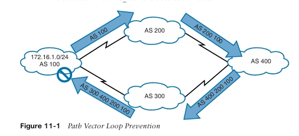

## Familias de Direcciones

Originalmente, BGP estaba destinado al enrutamiento de prefijos IPv4 entre organizaciones, pero la RFC 2858 añadió la capacidad de BGP multiprotocolo (MP-BGP) mediante una extensión llamada **identificador de familia de direcciones (AFI)**. Una **familia de direcciones** corresponde a un protocolo de red específico, como IPv4 o IPv6, y se proporciona granularidad adicional mediante un identificador de subfamilia de direcciones (SAFI), como unicast o multicast. En BGP, la **Información de Alcanzabilidad de Capa de Red (NLRI)** es la longitud del prefijo y el prefijo.

Cada familia de direcciones mantiene una base de datos y una configuración separadas para cada familia de direcciones de protocolo y subfamilia en BGP. Esto permite que una política de enrutamiento en una familia de direcciones sea diferente de una política de enrutamiento en otra familia de direcciones, aunque el router utilice la misma sesión BGP con el otro router. BGP incluye los encabezados AFI y SAFI con cada anuncio de ruta para diferenciar entre la AFI y la SAFI y las bases de datos.

## Comunicación Entre Routers

BGP no utiliza paquetes hello para descubrir vecinos, como lo hacen los protocolos IGP, y dos vecinos BGP no pueden descubrirse dinámicamente como en OSPF. BGP fue diseñado como un protocolo de enrutamiento entre sistemas autónomos, lo que implica que las adyacencias de vecinos no deberían cambiar con frecuencia y están coordinadas. Los vecinos BGP se definen por dirección IP.

BGP utiliza el puerto TCP 179 para comunicarse con otros routers. TCP permite manejar la fragmentación, la secuenciación y la confiabilidad (acuse de recibo y retransmisión) de los paquetes de comunicación. La mayoría de las implementaciones recientes de BGP establecen el bit de no fragmentar (DF) para evitar la fragmentación y dependen del descubrimiento de MTU de la ruta.

Los IGP siguen la topología física porque las sesiones se forman con hellos que no pueden cruzar límites de red (es decir, solo un salto). BGP utiliza TCP, que es capaz de cruzar límites de red (es decir, es multihop). Aunque BGP puede formar adyacencias de vecinos que están conectados directamente, también puede formar adyacencias que están a múltiples saltos de distancia.

Una sesión BGP se refiere a la adyacencia establecida entre dos routers BGP. Las sesiones multihop requieren que el router utilice una ruta subyacente instalada en la RIB (estática o de cualquier protocolo de enrutamiento) para establecer la sesión TCP con el extremo remoto.

En la Figura 11-2, R1 puede establecer una sesión BGP con R2. Además, R2 puede establecer una sesión BGP con R4, aunque pase a través de R3. R1 y R2 están conectados directamente, pero R2 tiene una ruta estática para alcanzar la red 10.34.1.0/24 de R4. R4 tiene una ruta estática para alcanzar la red 10.23.1.0/24. R3 no es consciente de que R2 y R4 han establecido una sesión BGP, aunque los paquetes fluyan a través de R3.

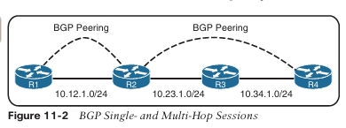

> **NOTA**  Los vecinos BGP conectados a la misma red utilizan la tabla ARP para localizar la dirección IP del par. Las sesiones BGP multihop requieren información de enrutamiento para encontrar la dirección IP del par. Es común tener una ruta estática o un IGP en ejecución entre vecinos iBGP para proporcionar la información de topología necesaria para establecer la sesión TCP de BGP. Una ruta por defecto no es suficiente para establecer una sesión BGP multihop.

BGP puede considerarse como un protocolo de enrutamiento del plano de control o como una aplicación, porque permite el intercambio de rutas con un par que está a múltiples saltos de distancia. En la Figura 11-2, R2 ha establecido una sesión BGP multihop con R4. R3 no requiere ejecutar BGP con R2 o R4, pero sí necesita conocer todas las rutas que se reenviarán a través de él para proporcionar conectividad entre R2 y R4.

## Tipos de Sesión BGP

Las sesiones BGP se clasifican en dos tipos:

- **BGP interno (iBGP)**: Sesiones establecidas dentro de un router iBGP que están en el mismo AS o que participan en la misma confederación BGP. A los prefijos iBGP se les asigna una **distancia administrativa (AD)** de 200 al instalarse en la RIB del router.
    
- **BGP externo (eBGP)**: Sesiones establecidas con un router BGP que se encuentra en un AS diferente. A los prefijos eBGP se les asigna una **AD** de 20 al instalarse en la RIB del router.
    

Las siguientes secciones revisan estos dos tipos de sesiones BGP.

## iBGP

La necesidad de BGP dentro de un AS suele surgir cuando se requieren múltiples políticas de enrutamiento o cuando se proporciona conectividad de tránsito entre sistemas autónomos. En la Figura 11-3, el AS 65200 proporciona conectividad de tránsito al AS 65100 y al AS 65300. El AS 65100 se conecta en R2, y el AS 65300 se conecta en R4.

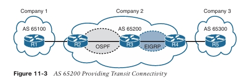

R2 podría formar una sesión iBGP directamente con R4, pero R3 no sabría cómo reenviar tráfico hacia los AS 65100 o AS 65300 cuando el tráfico entra por R3, como se muestra en la Figura 11-4, porque R3 no tendría la información de reenvío de rutas adecuada para el tráfico de destino.R2 podría formar una sesión iBGP directamente con R4, pero R3 no sabría cómo reenviar tráfico hacia los AS 65100 o AS 65300 cuando el tráfico entra por R3, como se muestra en la Figura 11-4, porque R3 no tendría la información de reenvío de rutas adecuada para el tráfico de destino.

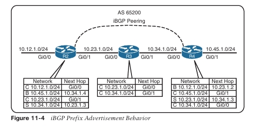

Podrías asumir que redistribuir la tabla BGP dentro de un IGP soluciona el problema, pero esto no es una solución viable por varias razones:

- **Escalabilidad:** Internet, al momento de escribir esto, tiene más de 940.000 prefijos de red IPv4 y continúa creciendo en tamaño. Los IGP no pueden escalar a ese nivel de rutas.
    
- **Enrutamiento personalizado:** Los protocolos de estado de enlace y los protocolos de vector de distancia usan métricas como método principal para la selección de rutas. Los protocolos IGP siempre usan este término de enrutamiento para la selección de rutas. BGP utiliza múltiples pasos para identificar la mejor ruta y permite que los atributos de ruta BGP manipulen el camino de un prefijo. El camino podría ser más largo y normalmente sería considerado subóptimo desde la perspectiva de un IGP.
    
- **Atributos de ruta:** Todos los atributos de ruta BGP no pueden mantenerse dentro de los protocolos IGP. Solo BGP es capaz de mantener el atributo de camino a medida que el prefijo se anuncia de un borde del AS al otro.
    

Usando la Figura 11-3 como referencia, establecer sesiones iBGP en el AS 65200 entre todos los routers (R2, R3 y R4) en una malla completa permite un reenvío adecuado entre los AS 65100 y AS 65300.

> **NOTA**  Los proveedores de servicios proporcionan conectividad de tránsito. Las organizaciones empresariales son consumidoras y no deberían proporcionar conectividad de tránsito entre sistemas autónomos a través de Internet.

### eBGP

Las sesiones eBGP son el componente principal de BGP en Internet. eBGP implica el intercambio de prefijos de red entre sistemas autónomos. Los siguientes comportamientos son diferentes en las **sesiones eBGP** que en las **sesiones iBGP**:

- El tiempo de vida (TTL) en los paquetes eBGP se establece en 1 por defecto. Los paquetes eBGP se descartan en tránsito si se intenta una sesión BGP multihop. El TTL en los paquetes iBGP se establece en 255, lo que permite sesiones multihop.
    
- El router que anuncia modifica la dirección next-hop de BGP a la dirección IP origen de la conexión BGP.
    
- El router que anuncia antepone su ASN al atributo AS Path existente.
    
- El router receptor verifica que el atributo AS Path no contenga un ASN que coincida con el ASN local. BGP descarta la ruta si falla la comprobación de prevención de bucles del AS Path.
    

Las configuraciones para las sesiones eBGP e iBGP son fundamentalmente las mismas, excepto que el ASN en la sentencia **remote-as** es diferente del ASN definido en el proceso BGP.

La Figura 11-5 muestra las sesiones eBGP e iBGP que serían necesarias entre los routers para permitir la alcanzabilidad entre los AS 65100 y AS 65300. Observe que todos los routers en el AS 65200 establecen sesiones iBGP en una malla completa para permitir un reenvío adecuado entre los AS 65100 y AS 65300.

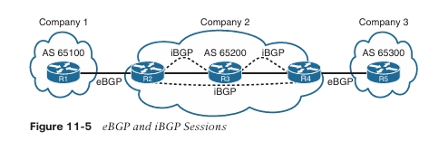

**Mensajes BGP**

La comunicación BGP utiliza cuatro tipos de mensajes, como se muestra en la Tabla 11-2.

**Tabla 11-2 Tipos de Paquetes BGP**

|Tipo|Nombre|Descripción funcional|
|--:|---|---|
|1|OPEN|Configura y establece la adyacencia BGP|
|2|UPDATE|Anuncia, actualiza o retira rutas|
|3|NOTIFICATION|Indica una condición de error a un vecino BGP|
|4|KEEPALIVE|Garantiza que los vecinos BGP sigan activos|

- **OPEN:** Un mensaje OPEN se utiliza para establecer una adyacencia BGP. Ambas partes negocian ciertas capacidades antes de que se establezca el emparejamiento BGP. El mensaje OPEN contiene el número de versión de BGP, el ASN del router originador, el tiempo de _hold_, el identificador BGP y otros parámetros opcionales que establecen las capacidades de la sesión.
    
    - **Hold time:** El campo _hold time_ en el mensaje OPEN establece el valor propuesto del temporizador de _hold_, en segundos, para cada vecino BGP. El temporizador de _hold_, en conjunto con los mensajes _keepalive_, actúa como un mecanismo de latido para garantizar que un vecino esté sano y activo. Al establecer una sesión BGP, los routers usan el menor valor de _hold time_ contenido en los mensajes OPEN de ambos routers. El valor del _hold time_ debe ser al menos de 3 segundos, o establecerse en 0 para deshabilitar los mensajes _keepalive_. En routers Cisco, el _hold time_ por defecto es de 180 segundos.
        
    - **Identificador BGP:** El **router ID BGP (RID)** es un número único de 32 bits que identifica al router BGP en los prefijos anunciados. El RID puede utilizarse como un mecanismo de prevención de bucles para rutas anunciadas dentro de un sistema autónomo. El RID puede configurarse manual o dinámicamente para BGP. Debe establecerse un valor distinto de cero para que los routers puedan convertirse en vecinos.
        
- **KEEPALIVE:** BGP no depende del estado de la conexión TCP para garantizar que los vecinos sigan activos. Los mensajes KEEPALIVE se intercambian cada un tercio del temporizador de _hold_ acordado entre los dos routers BGP. Los dispositivos Cisco tienen un _hold time_ por defecto de 180 segundos, por lo que el intervalo de _keepalive_ por defecto es de 60 segundos. Si el _hold time_ se establece en 0, entonces no se envían mensajes _keepalive_ entre los vecinos BGP.
    
- **UPDATE:** Un mensaje UPDATE anuncia y facilita nuevas rutas, retira rutas previamente anunciadas, o ambas cosas. Un mensaje UPDATE incluye los prefijos anunciados en el campo _Network Layer Reachability Information (NLRI)_, así como otros atributos BGP (PA). Los prefijos que deben retirarse se anuncian en el campo _WITHDRAWN ROUTES_ del mensaje UPDATE. Un mensaje UPDATE puede actuar como un _keepalive_ para reducir tráfico innecesario. Al recibir un UPDATE, el temporizador de _hold_ se reinicia a su valor inicial. Si el temporizador de _hold_ expira, la sesión BGP se cae, las rutas del vecino se eliminan y se envía un mensaje UPDATE a otros vecinos BGP para retirar los prefijos afectados.
    
- **NOTIFICATION:** Un mensaje NOTIFICATION se envía cuando se detecta un error en la sesión BGP, como la expiración del temporizador de _hold_, cambios en las capacidades del vecino o cuando se solicita un reinicio de la sesión BGP. Esto provoca el cierre de la conexión BGP.

**Estados de Vecinos BGP**

BGP forma una sesión TCP con routers vecinos llamados _peers_. BGP utiliza una **máquina de estados finitos (FSM)** para mantener una tabla de todos los peers BGP y su estado operativo. La sesión BGP puede reportar los siguientes estados:

- **Idle**
    
- **Connect**
    
- **Active**
    
- **OpenSent**
    
- **OpenConfirm**
    
- **Established**
    

La Figura 11-6 muestra la FSM de BGP y los estados, listados en el orden utilizado para establecer una sesión BGP.

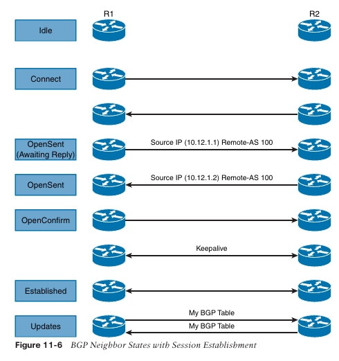

**Idle**

Idle es la primera etapa de la FSM de BGP. BGP detecta un evento de inicio e intenta iniciar una conexión TCP con el peer BGP y también escucha una nueva conexión desde un peer remoto.

Si un error hace que BGP regrese al estado Idle por segunda vez, el **ConnectRetryTimer** se establece en 60 segundos y debe decrementarse hasta cero antes de que la conexión pueda iniciarse nuevamente. Fallos adicionales para salir del estado Idle provocan que el **ConnectRetryTimer** se duplique con respecto al tiempo anterior.

**Connect**

En el estado Connect, BGP inicia la conexión TCP. Si el _three-way handshake_ TCP se completa, el proceso BGP establecido reinicia el **ConnectRetryTimer** y envía un mensaje **OPEN** al vecino; luego cambia al estado **OpenSent**.

Si el **ConnectRetryTimer** se agota antes de que esta etapa se complete, se intenta una nueva conexión TCP, el **ConnectRetryTimer** se reinicia y el estado permanece en Connect. Si la conexión TCP falla, el estado cambia a **Active**. Para cualquier otro evento, el estado cambia a **Idle**.

Los routers BGP utilizan el puerto TCP **179** para escuchar conexiones entrantes y como puerto de destino para conectarse a peers BGP. El router que inicia la conexión TCP saliente utiliza un puerto de origen aleatorio y el puerto de destino **179**.

El Ejemplo 11-1 muestra una sesión BGP establecida utilizando el comando **show tcp brief** para mostrar las sesiones TCP entre los routers. Obsérvese que para R2, el puerto de origen TCP es **59884** y el puerto de destino es **179**; esto significa que R2 inició la conexión TCP.

**Example 11-1:** An Established BGP Session
```
R1# show tcp brief
TCB        Local Address        Foreign Address        (state)
F6F8A258   10.12.1.1:179         10.12.1.2:59884        ESTAB
```

```
R2# show tcp brief
TCB        Local Address        Foreign Address        (state)
EF153BB8   10.12.1.2:59884       10.12.1.1:179          ESTAB
```

**Active**

En el estado Active, BGP inicia un nuevo _three-way handshake_ TCP. Si se establece una conexión, se envía un mensaje **OPEN**, el _hold timer_ se establece en 4 minutos y el estado cambia a **OpenSent**. Si este intento de conexión TCP falla, el estado regresa a **Connect** y el **ConnectRetryTimer** se reinicia.

**OpenSent**

En el estado **OpenSent**, un mensaje **OPEN** ya ha sido enviado por el router originador y este está esperando un mensaje **OPEN** del otro router. Una vez que el router originador recibe el mensaje **OPEN** del otro router, ambos mensajes **OPEN** son verificados en busca de errores. Se revisan los siguientes elementos:

- Las versiones de BGP deben coincidir.
    
- La dirección IP de origen del mensaje **OPEN** debe coincidir con la dirección IP configurada para el vecino.
    
- El número de AS en el mensaje **OPEN** debe coincidir con el que está configurado para el vecino.
    
- Los identificadores de BGP (RID) deben ser únicos. Si no existe un RID, esta condición no se cumple.
    
- Los parámetros de seguridad (como contraseña y TTL) deben estar configurados correctamente.
    

Si los mensajes **OPEN** no tienen errores, se negocia el _hold timer_ (utilizando el valor más bajo) y se envía un mensaje **KEEPALIVE** (asumiendo que el valor no sea 0). El estado de la conexión pasa entonces a **OpenConfirm**. Si se encuentra un error en el mensaje **OPEN**, se envía un mensaje **NOTIFICATION** y el estado regresa a **Idle**.

Si TCP recibe un mensaje de desconexión, BGP cierra la conexión, reinicia el **ConnectRetryTimer** y establece el estado en **Active**. Cualquier otro evento en este proceso hace que el estado pase a **Idle**.

**OpenConfirm**

En el estado **OpenConfirm**, BGP espera un mensaje **KEEPALIVE** o **NOTIFICATION**. Al recibir un mensaje **KEEPALIVE** del vecino, el estado pasa a **Established**. Si el _hold timer_ expira, ocurre un evento de parada o se recibe un mensaje **NOTIFICATION**, el estado pasa a **Idle**.

**Established**

En el estado **Established**, la sesión BGP queda establecida. Los vecinos BGP intercambian rutas utilizando mensajes **UPDATE**. A medida que se reciben mensajes **UPDATE** y **KEEPALIVE**, el _hold timer_ se reinicia. Si el _hold timer_ expira, se detecta un error y BGP mueve al vecino nuevamente al estado **Idle**.

**Configuración Básica de BGP**

Cuando se configura BGP, es recomendable pensar en la configuración desde una perspectiva modular. La configuración de un router BGP requiere los siguientes componentes:

- **Parámetros de sesión BGP:** Los parámetros de sesión BGP proporcionan los ajustes que permiten establecer la comunicación con el vecino BGP remoto. Los ajustes de sesión incluyen el ASN del par BGP, la autenticación y los _keepalive timers_.
    
- **Inicialización de la familia de direcciones:** La familia de direcciones se inicializa bajo el modo de configuración del router BGP. La publicidad y la sumarización de redes ocurren dentro de la familia de direcciones.
    
- **Activar la familia de direcciones en el peer BGP:** Para que una sesión se inicie, una familia de direcciones para un vecino debe estar activada. La dirección IP del vecino se agrega a la tabla de vecinos y BGP intenta establecer una sesión BGP o acepta una sesión BGP iniciada desde el router vecino.
    

---

Los siguientes pasos muestran cómo configurar BGP:

**Paso 1.**  
Inicializar el proceso de enrutamiento BGP con el comando global  
`router bgp as-number`.

**Paso 2.**  
(Opcional) Definir estáticamente el router ID (RID) de BGP. La lógica de asignación dinámica del RID utiliza la dirección IP más alta de cualquier interfaz _loopback_ activa. Si no existe una interfaz _loopback_, entonces la dirección IP más alta de cualquier interfaz _up_ activa se convierte en el RID cuando se inicializa el proceso BGP.  
Para asegurar que el RID no cambie, se asigna un RID estático (típicamente representando una dirección IP que reside en el router, como una dirección _loopback_). Cualquier dirección IPv4 puede usarse, incluidas direcciones IP no configuradas en el router. Configurar estáticamente el RID de BGP es una buena práctica y se realiza con el comando  
`bgp router-id router-id`.  
Cuando el router ID cambia, todas las sesiones BGP se reinician y deben establecerse nuevamente.

**Paso 3.**  
Identificar la dirección IP del vecino BGP y el número de sistema autónomo con el comando de configuración del router BGP  
`neighbor ip-address remote-as as-number`.  
Es importante comprender el flujo de tráfico de los paquetes BGP entre pares. La dirección IP de origen del paquete BGP reflejará la dirección IP de la interfaz de salida. Cuando se recibe un paquete BGP, el router correlaciona la dirección IP de origen del paquete con la dirección IP del vecino configurado. Si la dirección IP de origen del paquete BGP no coincide con una entrada en la tabla de vecinos, el paquete no puede asociarse a un vecino y es descartado.

> **NOTA**  IOS XE activa la familia de direcciones IPv4 de forma predeterminada. Esto puede simplificar la configuración en un entorno IPv4 porque los pasos 4 y 5 son opcionales, pero puede causar confusión al trabajar con otras familias de direcciones. El comando de configuración del router BGP `no bgp default ipv4-unicast` deshabilita la activación automática del AFI IPv4, por lo que los pasos 4 y 5 pasan a ser necesarios.

**Paso 4.**  
Inicializar la familia de direcciones con el comando de configuración del router BGP  
`address-family afi safi`.  
Ejemplos de valores de _afi_ incluyen IPv4 e IPv6, y ejemplos de _safi_ incluyen _unicast_ y _multicast_.

**Paso 5.**  
Activar la familia de direcciones para el vecino BGP con el comando de configuración de la familia de direcciones BGP  
`neighbor ip-address activate`.

La Figura 11-7 muestra una topología para una configuración BGP simple.

El Ejemplo 11-2 muestra cómo configurar R1 y R2 utilizando la sintaxis por defecto y opcional de IPv4 AFI. R1 está configurado con la familia de direcciones IPv4 por defecto habilitada, y R2 deshabilita la familia de direcciones IPv4 por defecto y la activa manualmente para el vecino específico 10.12.1.1. El comando `no bgp default ipv4-unicast` no es necesario en R2, y BGP funcionará correctamente para prefijos IPv4, pero estandarizar el comportamiento es más sencillo cuando se trabaja con otras familias de direcciones como IPv6.

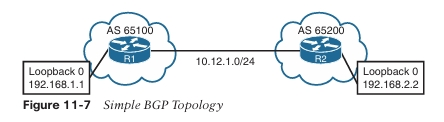

**Ejemplo 11-2:** Configuración básica de BGP en IOS XE
```
R1 (Familia de direcciones IPv4 predeterminada habilitada)
router bgp 65100
 neighbor 10.12.1.2 remote-as 65200

R2 (Familia de direcciones IPv4 predeterminada deshabilitada)
router bgp 65200
 no bgp default ipv4-unicast
 neighbor 10.12.1.1 remote-as 65100
 !
 address-family ipv4
  neighbor 10.12.1.1 activate
```

**Verificación de sesiones BGP**

La sesión BGP se verifica con el comando `show bgp afi safi summary`. El Ejemplo 11-3 muestra el resumen de BGP IPv4 unicast. Observe que el Router ID de BGP y la versión de la tabla son los primeros componentes que se muestran. La columna Up/Down indica que la sesión BGP ha estado activa por más de 5 minutos.

**Ejemplo 11-3:** Verificación del resumen de sesión BGP IPv4
```
R1# show bgp ipv4 unicast summary
BGP router identifier 192.168.1.1, local AS number 65100
BGP table version is 1, main routing table version 1

Neighbor        V    AS MsgRcvd MsgSent TblVer InQ OutQ Up/Down State/PfxRcd
10.12.1.2       4 65200        8        9      1    0    0 00:05:23            0
```

### Tabla 11-3 Campos del Resumen de BGP

|Campo|Descripción|
|---|---|
|Neighbor|Dirección IP del par BGP|
|V|Versión de BGP utilizada por el par|
|AS|Número de sistema autónomo del par BGP|
|MsgRcvd|Conteo de mensajes recibidos del par BGP|
|MsgSent|Conteo de mensajes enviados al par BGP|
|TblVer|Última versión de la base de datos BGP enviada al par|
|InQ|Número de mensajes recibidos del par y en cola para ser procesados|
|OutQ|Número de mensajes en cola para ser enviados al par|
|Up/Down|Tiempo durante el cual la sesión BGP ha estado establecida o el estado actual si la sesión no está en estado establecido|
|State/PfxRcd|Estado actual del par o número de prefijos recibidos del par|

**Ejemplo 11-4:** Verificando el Vecino BGP IPv4
```text
R2# show bgp ipv4 unicast neighbors 10.12.1.1

BGP neighbor is 10.12.1.1, remote AS65100, external link
  BGP version 4, remote router ID 192.168.1.1
  BGP state = Established, up for 00:01:04
  Last read 00:00:10, last write 00:00:09, hold time is 180, keepalive interval is 60 seconds
  Neighbor sessions:
    1 active, is not multisession capable (disabled)

Neighbor capabilities:
 Route refresh: advertised and received (new)
 Four-octets ASN Capability: advertised and received
 Address family IPv4 Unicast: advertised and received
 Enhanced Refresh Capability: advertised
 Multisession Capability:
 Stateful switchover support enabled: NO for session 1

Message statistics:
                 Sent   Rcvd
Opens:           1      1
Notifications:   0      0
Updates:         0      0
Keepalives:      2      2
Route Refresh:   0      0
Total:           3      3

Default minimum time between advertisement runs is 0 seconds

For address family: IPv4 Unicast
 Session: 10.12.1.1
 BGP table version 1, neighbor version 1/0
 Output queue size : 0
 Index 1, Advertise bit 0

 Prefix activity:
                          Sent   Rcvd
 Prefixes Current:        0       0
 Prefixes Total:          0       0
 Implicit Withdraw:       n/a     0
 Explicit Withdraw:       n/a     0
 Used as bestpath:        n/a     0
 Used as multipath:       n/a     0

 Outbound         Inbound
 Local Policy Denied Prefixes:
 Total             0        0

Number of NLRIs in the update sent: max 0, min 0

Address tracking is enabled, the RIB does have a route to 10.12.1.1
Connections established 2; dropped 1
Last reset 00:01:40, due to Peer closed the session
Transport(tcp) path-mtu-discovery is enabled
Connection state is ESTAB, I/O status: 1, unread input bytes: 0
Local host: 10.12.1.2, Local port: 179
Foreign host: 10.12.1.1, Foreign port: 56824
```

### Anuncio de Rutas

Las sentencias **network** de BGP no habilitan BGP en una interfaz específica; en su lugar, identifican prefijos de red específicos que se instalan en la tabla BGP, conocida como **Loc-RIB**.

Después de configurar una sentencia **network** en BGP, el proceso BGP busca en la RIB coincidencias exactas del prefijo de red. La ruta puede provenir de una red conectada, una red conectada secundaria o cualquier ruta aprendida por un protocolo de enrutamiento. Si la sentencia **network** coincide con una ruta en la RIB, se configuran los siguientes atributos BGP, según el tipo de ruta:

- **Red conectada**: el atributo **next-hop** de BGP se establece en 0.0.0.0, el atributo **origin** de BGP se establece en **i (IGP)** y el **weight** de BGP se establece en 32,768.
    
- **Ruta estática o protocolo de enrutamiento**: el atributo **next-hop** de BGP se establece en la dirección IP del siguiente salto en la RIB, el atributo **origin** de BGP se establece en **i (IGP)**, el **weight** de BGP se establece en 32,768 y el **MED** se establece en la métrica del IGP.
    

Después de que los atributos BGP se configuran, la ruta se instala en la **Loc-RIB** (la tabla BGP). No todas las rutas en la Loc-RIB se anuncian a los pares BGP. Todas las rutas en la Loc-RIB siguen el siguiente proceso antes de anunciarse a los pares BGP:

**Paso 1.** Pasar una verificación de validez. Verificar que el NLRI sea válido y que la dirección **next-hop** sea resoluble en la RIB. Si el NLRI falla, el NLRI permanece, pero no se procesa más.

**Paso 2.** Procesar las políticas de salida hacia los vecinos. Después del procesamiento, si una ruta no fue denegada por las políticas de salida, la ruta se mantiene en el **Adj-RIB-Out** para referencia posterior.

**Paso 3.** Anunciar las rutas a los pares BGP. Si el atributo **next-hop** de BGP es 0.0.0.0 para los prefijos en el NLRI, entonces la dirección **next-hop** se cambia a la dirección IP de la sesión BGP.

La Figura 11-8 ilustra el concepto de instalar rutas desde la RIB mediante la sentencia **network** y luego anunciarlas a los pares BGP.

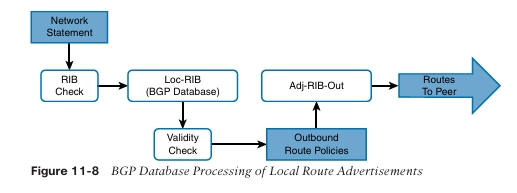

> **NOTA**  BGP solo anuncia la mejor ruta de forma predeterminada a otros pares BGP, independientemente del número de rutas en la Loc-RIB.

La sentencia **network** reside dentro de la familia de direcciones apropiada en la configuración del router BGP. El comando **network network mask subnet-mask [route-map route-map-name]** se utiliza para anunciar redes IPv4. El parámetro opcional **route-map** proporciona un método para establecer atributos BGP específicos para la ruta instalada en la Loc-RIB. Los route-maps se analizan con más detalle en el Capítulo 12.

La Figura 11-7 ilustra R1 y R2 conectados a través de la red 10.12.1.0/24. El Ejemplo 11-5 demuestra la configuración donde ambos routers anuncian las interfaces Loopback 0 (192.168.1.1/32 y 192.168.2.2/32, respectivamente) y la red 10.12.1.0/24 en BGP. Observe que R1 usa la familia de direcciones IPv4 predeterminada, y R2 especifica explícitamente la familia de direcciones IPv4.

**Example 11-5:** Configuring BGP Network Advertisement
```
R1
 router bgp 65100
 neighbor 10.12.1.2 remote-as 65200
 network 10.12.1.0 mask 255.255.255.0
 network 192.168.1.1 mask 255.255.255.255

R2
 router bgp 65200
 no bgp default ipv4-unicast
 neighbor 10.12.1.1 remote-as 65100
 !
 address-family ipv4
  network 10.12.1.0 mask 255.255.255.0
  network 192.168.2.2 mask 255.255.255.255
  neighbor 10.12.1.1 activate
```

**Recepción y Visualización de Rutas**

BGP utiliza tres tablas para mantener el prefijo de red y los atributos de ruta (PA) de una ruta:

- **Adj-RIB-In**: Contiene las rutas en su forma original (es decir, antes de que se procesen las políticas de ruta de entrada). Para ahorrar memoria, la tabla se depura después de que se procesan todas las políticas de ruta.
    
- **Loc-RIB**: Contiene todas las rutas que se originaron localmente o que fueron recibidas de otros pares BGP. Después de que las rutas pasan las comprobaciones de validez y alcanzabilidad del next-hop, el algoritmo de mejor ruta de BGP selecciona la mejor ruta para un prefijo específico. La Loc-RIB, también conocida como la tabla BGP, se utiliza para presentar rutas a la tabla de enrutamiento IP (RIB).
    
- **Adj-RIB-Out**: Contiene las rutas después de que se han procesado las políticas de ruta de salida.
    

No todas las rutas en la Loc-RIB se anuncian a un par BGP ni se instalan en la RIB cuando se reciben de un par BGP. BGP realiza los siguientes pasos de procesamiento de rutas:

**Paso 1.**  
Almacenar la ruta en la Adj-RIB-In en el estado original y aplicar la política de ruta de entrada según el vecino del cual se recibió la ruta.

**Paso 2.**  
Actualizar la Loc-RIB con la entrada más reciente. La Adj-RIB-In se borra para ahorrar memoria.

**Paso 3.**  
Realizar una verificación de validez para confirmar que la ruta es válida y que el next-hop es resoluble en la RIB. Si la ruta falla, permanece en la Loc-RIB pero no se procesa más.

**Paso 4.**  
Identificar la mejor ruta de BGP y pasar solo la mejor ruta y sus atributos de ruta al paso 5. El proceso de selección de la mejor ruta de BGP se describe en el Capítulo 12.

**Paso 5.**  
Instalar la mejor ruta de BGP en la RIB, procesar la política de ruta de salida, almacenar las rutas no descartadas en la Adj-RIB-Out y anunciarlas a los pares BGP.

La Figura 11-9 muestra la lógica completa de procesamiento de rutas BGP. Incluye la recepción de una ruta desde un par BGP y el algoritmo de mejor ruta de BGP.

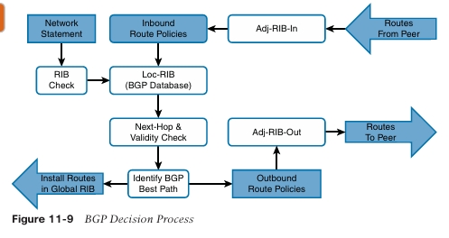

El comando **show bgp afi safi** muestra el contenido de la tabla BGP (Loc-RIB) en el router. Cada entrada en la Loc-RIB contiene al menos una ruta, pero puede contener múltiples rutas para el mismo prefijo de red. El Ejemplo 11-6 muestra la tabla BGP en R1, que contiene rutas recibidas y rutas generadas localmente.

**Ejemplo 11-6:** Visualización de la Tabla BGP (Loc-RIB)
```
R1# show bgp ipv4 unicast
BGP table version is 4, local router ID is 192.168.1.1
Status codes: s suppressed, d damped, h history, * valid, > best, i - internal,
              r RIB-failure, S Stale, m multipath, b backup-path, f RT-Filter,
              x best-external, a additional-path, c RIB-compressed,
              t RPKI invalid, v valid, i invalid, N Not found
Origin codes: i - IGP, e - EGP, ? - incomplete

   Network          Next Hop        Metric LocPrf Weight Path
*> 10.12.1.0/24     10.12.1.2             0             0 65200 i
*>                  0.0.0.0                0     32768 i
*> 192.168.1.1/32   0.0.0.0                0     32768 i
*> 192.168.2.2/32   10.12.1.2               0             0 65200 i
```

```
R2# show bgp ipv4 unicast | begin Network
   Network          Next Hop        Metric LocPrf Weight Path
*> 10.12.1.0/24     10.12.1.1             0             0 65100 i
*>                  0.0.0.0                0     32768 i
*> 192.168.1.1/32   10.12.1.1               0             0 65100 i
*> 192.168.2.2/32   0.0.0.0                0     32768 i
```

La Tabla 11-4 explica los campos de la salida al visualizar la tabla BGP.

**Tabla 11-4 Campos de la Tabla BGP**

| Campo           | Descripción                                                                                                                                                                                                                                                                                                                                                                            |
| --------------- | -------------------------------------------------------------------------------------------------------------------------------------------------------------------------------------------------------------------------------------------------------------------------------------------------------------------------------------------------------------------------------------- |
| Network         | Lista de prefijos instalados en BGP. Si existen múltiples rutas para el mismo prefijo, solo se muestra el primer prefijo y las demás rutas dejan un espacio vacío en la salida. Las rutas válidas se indican con `*`. La ruta seleccionada como la mejor se indica con un símbolo mayor que (`>`).                                                                                     |
| Next Hop        | Atributo BGP obligatorio y bien conocido que define la dirección IP del siguiente salto para esa ruta específica.                                                                                                                                                                                                                                                                      |
| Metric          | **Multi-exit discriminator (MED):** Atributo BGP opcional y no transitivo utilizado para esa ruta específica.                                                                                                                                                                                                                                                                          |
| LocPrf          | **Local Preference:** Atributo BGP discrecional y bien conocido utilizado en el algoritmo de selección de mejor ruta BGP para esa ruta específica.                                                                                                                                                                                                                                     |
| Weight          | Atributo definido localmente y significativo solo en Cisco, utilizado en el algoritmo de selección de mejor ruta BGP para esa ruta específica.                                                                                                                                                                                                                                         |
| Path and Origin | **AS_Path:** Atributo BGP obligatorio y bien conocido utilizado para la prevención de bucles y en el algoritmo de selección de mejor ruta BGP para esa ruta específica. **Origin:** Atributo BGP obligatorio y bien conocido utilizado en el algoritmo de selección de mejor ruta BGP. Un valor `i` representa IGP, `e` indica EGP y `?` indica una ruta que fue redistribuida en BGP. |

El comando **show bgp afi safi network** muestra todas las rutas para un prefijo específico y los atributos BGP para ese prefijo. El Ejemplo 11-7 muestra las rutas para el prefijo 10.12.1.0/24. La salida incluye el número de rutas y cuál de ellas es la mejor ruta.

**Ejemplo 11-7:** Visualización de Rutas BGP Explícitas y Atributos de Ruta
```
R1# show bgp ipv4 unicast 10.12.1.0

BGP routing table entry for 10.12.1.0/24, version 2
Paths: (2 available, best #2, table default)
  Advertised to update-groups:
    2

  Refresh Epoch 1
  65200
    10.12.1.2 from 10.12.1.2 (192.168.2.2)
      Origin IGP, metric 0, localpref 100, valid, external
      rx pathid: 0, tx pathid: 0

  Refresh Epoch 1
  Local
    0.0.0.0 from 0.0.0.0 (192.168.1.1)
      Origin IGP, metric 0, localpref 100, weight 32768, valid, sourced, local, best
      rx pathid: 0, tx pathid: 0x0
```

> **NOTA**  El comando **show bgp afi safi detail** muestra la tabla BGP completa con todos los atributos de ruta, como los que se muestran en el Ejemplo 11-7.

La **Adj-RIB-Out** es una tabla única mantenida para cada peer BGP. Permite a un ingeniero de red ver las rutas anunciadas a un peer específico. El comando **show bgp afi safi neighbor ip-address advertised-routes** muestra el contenido de la Adj-RIB-Out para un vecino específico.

El Ejemplo 11-8 muestra las entradas de la Adj-RIB-Out específicas para cada vecino. Observe que la dirección de siguiente salto refleja el router local y cambiará a medida que la ruta se anuncie al peer.

**Ejemplo 11-8:** Vista Específica por Vecino de la Adj-RIB-Out
```
R1# show bgp ipv4 unicast neighbors 10.12.1.2 advertised-routes
! Output omitted for brevity
   Network          Next Hop      Metric LocPrf Weight Path
*> 10.12.1.0/24     0.0.0.0            0      32768 i
*> 192.168.1.1/32   0.0.0.0            0      32768 i

Total number of prefixes 2

R2# show bgp ipv4 unicast neighbors 10.12.1.1 advertised-routes
! Output omitted for brevity
   Network          Next Hop      Metric LocPrf Weight Path
*> 10.12.1.0/24     0.0.0.0            0      32768 i
*> 192.168.2.2/32   0.0.0.0            0      32768 i

Total number of prefixes 2
```

El comando **show bgp ipv4 unicast summary** también puede usarse para verificar el intercambio de rutas entre nodos, como se muestra en el Ejemplo 11-9.

**Ejemplo 11-9:** Resumen BGP con Prefijos
```
R1# show bgp ipv4 unicast summary
! Output omitted for brevity
Neighbor        V    AS MsgRcvd MsgSent TblVer InQ OutQ Up/Down State/PfxRcd
10.12.1.2       4  65200        11       10     9    0    0 00:04:56          2
```

Las rutas BGP en la tabla de enrutamiento IP global (RIB) se muestran con el comando **show ip route bgp**. El Ejemplo 11-10 muestra estos comandos en la topología de ejemplo. Los prefijos son de una sesión eBGP y tienen una AD de 20, y no hay métrica presente.

**Ejemplo 11-10:** Visualización de Rutas BGP en una Tabla de Enrutamiento IP
```
R1# show ip route bgp | begin Gateway
Gateway of last resort is not set

     192.168.2.0/32 is subnetted, 1 subnets
B    192.168.2.2 [20/0] via 10.12.1.2, 00:06:12
```

**Anuncios de Rutas BGP desde Fuentes Indirectas**

Como se indicó anteriormente, BGP debe considerarse como una aplicación de enrutamiento, ya que la sesión BGP y el anuncio de rutas son dos componentes separados. La Figura 11-10 demuestra una topología donde R1 instala múltiples rutas aprendidas de rutas estáticas, EIGRP y OSPF. R1 puede anunciar estas rutas a R2.

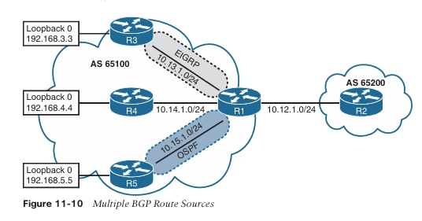

**Ejemplo 11-11** muestra la tabla de enrutamiento de R1. Obsérvese que el loopback de R3 se aprende vía EIGRP, el loopback de R4 se alcanza usando una ruta estática, y el loopback de R5 se aprende desde OSPF.

**Ejemplo 11-11:** Tabla de Enrutamiento de R1 con Loopbacks para R3, R4 y R5
```
R1# show ip route
! Output omitted for brevity
Codes: L - local, C - connected, S - static, R - RIP, M - mobile, B - BGP
       D - EIGRP, EX - EIGRP external, O - OSPF, IA - OSPF inter area

Gateway of last resort is not set

     10.0.0.0/8 is variably subnetted, 8 subnets, 2 masks
C    10.12.1.0/24 is directly connected, GigabitEthernet0/0
C    10.13.1.0/24 is directly connected, GigabitEthernet0/1
C    10.14.1.0/24 is directly connected, GigabitEthernet0/2
C    10.15.1.0/24 is directly connected, GigabitEthernet0/3
C    192.168.1.1 is directly connected, Loopback0
B    192.168.2.2 [20/0] via 10.12.1.2, 00:01:17
D    192.168.3.3 [90/3584] via 10.13.1.3, 00:02:10, GigabitEthernet0/1
S    192.168.4.4 [1/0] via 10.14.1.4
O    192.168.5.5 [110/11] via 10.15.1.5, 00:00:08, GigabitEthernet0/3
```

El **Ejemplo 11-12** muestra la instalación de los loopbacks de R3 y R4 usando una sentencia **network**. El loopback de R5 se aprende redistribuyendo OSPF directamente en BGP.

**Ejemplo 11-12:** Configuración de Anuncio de Rutas para Rutas No Conectadas
```
R1
router bgp 65100
 network 10.12.1.0 mask 255.255.255.0
 network 192.168.1.1 mask 255.255.255.255
 network 192.168.3.3 mask 255.255.255.255
 network 192.168.4.4 mask 255.255.255.255
 redistribute ospf 1
 neighbor 10.12.1.2 remote-as 65200
```

> **NOTA**  Redistribuir rutas aprendidas desde un IGP hacia BGP es completamente seguro; sin embargo, las rutas aprendidas por BGP deben redistribuirse hacia un IGP con precaución. BGP está diseñado para gran escala y puede manejar una tabla de enrutamiento del tamaño de Internet (940,000+ prefijos), mientras que los IGP podrían tener problemas de estabilidad con menos de 20,000 rutas.

El **Ejemplo 11-13** muestra las tablas BGP en R1 y R2. Obsérvese que en R1, el siguiente salto coincide con el siguiente salto aprendido desde la RIB, el **AS_Path** está en blanco, y el origen es **IGP** (para rutas aprendidas desde el enrutamiento IGP) o **incomplete** (redistribuidas). La métrica se transporta desde los protocolos de enrutamiento IGP de R3 y R5 y se refleja como el **MED**. R2 aprende las rutas estrictamente desde BGP y ve solo los códigos de origen.

**Ejemplo 11-13:** Tabla BGP para Rutas desde Múltiples Fuentes
```
R1# show bgp ipv4 unicast
BGP table version is 9, local router ID is 192.168.1.1
Status codes: s suppressed, d damped, h history, * valid, > best, i - internal,
              r RIB-failure, S stale, m multipath, b backup-path, f RT-Filter,
              x best-external, a additional-path, c RIB-compressed,
Origin codes: i - IGP, e - EGP, ? - incomplete
RPKI validation codes: V valid, I invalid, N Not found

   Network          Next Hop      Metric LocPrf Weight Path
*> 10.12.1.0/24     0.0.0.0            0      32768 i
*>                   10.12.1.2          0             65200 i
*> 10.15.1.0/24     0.0.0.0            0      32768 ?
*> 192.168.1.1/32   0.0.0.0            0      32768 i
*> 192.168.2.2/32   10.12.1.2           0             65200 i
*> 192.168.3.3/32   10.13.1.3        3584      32768 i
*> 192.168.4.4/32   10.14.1.4           0      32768 i
*> 192.168.5.5/32   10.15.1.5          11      32768 ?
```

```
R2# show bgp ipv4 unicast | begin Network
   Network          Next Hop      Metric LocPrf Weight Path
*> 10.12.1.0/24     10.12.1.1          0             65100 i
*> 10.15.1.0/24     10.12.1.1          0             65100 ?
*> 192.168.1.1/32   10.12.1.1          0             65100 i
*> 192.168.2.2/32   0.0.0.0            0      32768 i
*> 192.168.3.3/32   10.12.1.1       3584             65100 i
*> 192.168.4.4/32   10.12.1.1          0             65100 i
*> 192.168.5.5/32   10.12.1.1         11             65100 ?
```

**Resumen de Rutas IPv4**

El resumen de rutas, también conocido como agregación de rutas, conserva los recursos del router y acelera el cálculo de la mejor ruta al reducir el tamaño de la tabla. El resumen de rutas también proporciona el beneficio de la estabilidad al ocultar los cambios de estado de enlaces (flaps) a los routers aguas abajo, reduciendo así la convergencia. Por esta razón, la mayoría de los proveedores de servicios no aceptan prefijos mayores que /24 para IPv4 (/25 a /32). Internet, al momento de escribir esto, todavía tiene más de 940,000 rutas y continúa creciendo. El resumen de rutas es necesario para reducir el tamaño de la tabla BGP en los routers de Internet.

El resumen de rutas BGP en routers de borde (edge) reduce la carga de cómputo en los routers del core para las rutas BGP recibidas o anunciadas. En la Figura 11-11, R3 resume todos los prefijos eBGP recibidos desde AS 65100 y AS 65200 para reducir la carga de cómputo en R4 durante los flaps de enlaces. En el evento de un flap de enlace en la red 10.13.1.0/24, R3 elimina las rutas AS 65100 aprendidas directamente desde R1 e identifica los mismos prefijos de red vía R2 con diferentes atributos de ruta (un AS_Path más largo). R3 debe anunciar nuevas rutas a R4 debido a estos flaps, lo cual es un desperdicio de ciclos de CPU porque R4 recibe conectividad únicamente desde R3. Si R3 resumiera el prefijo de red, R4 ejecutaría el algoritmo de mejor ruta una sola vez y no necesitaría ejecutarlo durante los flaps del enlace 10.13.1.0/24.

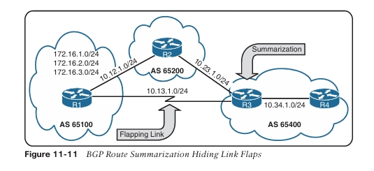

Hay dos técnicas para la sumarización en BGP:

- **Estática:** Crear una ruta estática hacia Null0 para el prefijo de red resumido y luego anunciar este prefijo con un comando `network`. La desventaja de esta técnica es que la ruta resumida siempre se anuncia, incluso si las redes no están disponibles.
    
- **Dinámica:** Configurar un prefijo de red agregado. Cuando las rutas componentes válidas que coinciden con el prefijo de red agregado ingresan a la tabla BGP, entonces se crea el prefijo agregado. El router originador establece el next-hop en Null0 como una ruta de descarte para el prefijo agregado, con el fin de prevenir bucles.
    

En ambos métodos de agregación de rutas, se anuncia en BGP un nuevo prefijo de red con una longitud de prefijo más corta. Debido a que el prefijo agregado es una nueva ruta, el router que realiza la sumarización es el originador de la nueva ruta agregada.

**Dirección Agregada**

La sumarización dinámica de rutas se logra mediante la configuración de la familia de direcciones BGP usando el comando:

`aggregate-address network subnet-mask [summary-only] [as-set]`

La Figura 11-12 elimina el enlace serial inestable entre R1 y R3 para demostrar la sumarización de rutas BGP y los efectos del comando `aggregate-address`.

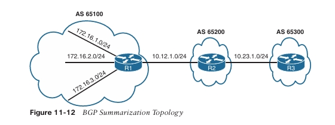

El **Ejemplo 11-14** muestra las tablas BGP para R1, R2 y R3 antes de que se realice la sumarización de rutas. Las subredes de R1 (172.16.1.0/24, 172.16.2.0/24 y 172.16.3.0/24) se anuncian a lo largo de todo el sistema autónomo, junto con las direcciones de loopback (192.168.1.1/32, 192.168.2.2/32 y 192.168.3.3/32) y los enlaces de peering (10.12.1.0/24 y 10.23.1.0/24).

**Ejemplo 11-14:** Tablas BGP para R1, R2 y R3 sin sumarización
```
R1# show bgp ipv4 unicast | begin Network
Network          Next Hop        Metric LocPrf Weight Path
*> 10.12.1.0/24  10.12.1.2             0             65200 ?
*> 10.23.1.0/24  10.12.1.2             0             65200 ?

*> 172.16.1.0/24 0.0.0.0               0        32768 ?
*> 172.16.2.0/24 0.0.0.0               0        32768 ?
*> 172.16.3.0/24 0.0.0.0               0        32768 ?
*> 192.168.1.1/32 0.0.0.0              0        32768 ?
*> 192.168.2.2/32 10.12.1.2             0             65200 ?
*> 192.168.3.3/32 10.12.1.2             0        65200 65300 ?
```

```
R2# show bgp ipv4 unicast | begin Network
Network          Next Hop        Metric LocPrf Weight Path
*> 10.12.1.0/24  10.12.1.1             0             65100 ?
*> 10.23.1.0/24  10.23.1.3             0             65300 ?
*> 172.16.1.0/24 10.12.1.1             0             65100 ?
*> 172.16.2.0/24 10.12.1.1             0             65100 ?
*> 172.16.3.0/24 10.12.1.1             0             65100 ?
*> 192.168.1.1/32 10.12.1.1             0             65100 ?
*> 192.168.2.2/32 0.0.0.0               0        32768 ?
*> 192.168.3.3/32 10.23.1.3             0             65300 ?
```

```
R3# show bgp ipv4 unicast | begin Network
Network          Next Hop        Metric LocPrf Weight Path
*> 10.12.1.0/24  10.23.1.2             0             65200 ?
*> 10.23.1.0/24  10.23.1.2             0             65200 ?
*> 172.16.1.0/24 10.23.1.2             0        65200 65100 ?
*> 172.16.2.0/24 10.23.1.2             0        65200 65100 ?
*> 172.16.3.0/24 10.23.1.2             0        65200 65100 ?
*> 192.168.1.1/32 10.23.1.2             0        65200 65100 ?
*> 192.168.2.2/32 10.23.1.2             0             65200 ?
*> 192.168.3.3/32 0.0.0.0               0        32768 ?
```

R1 agrega todas las subredes (172.16.1.0/24, 172.16.2.0/24 y 172.16.3.0/24) en una ruta resumen 172.16.0.0/20. R2 resume todas las direcciones de loopback del router en una ruta resumen 192.168.0.0/16. El **Ejemplo 11-15** muestra la configuración para R1 usando la familia de direcciones IPv4 por defecto y para R2 con la familia de direcciones IPv4 deshabilitada.

**Ejemplo 11-15:** Configuración de la Sumarización de Rutas BGP
```
R1# show running-config | section router bgp
router bgp 65100
 aggregate-address 172.16.0.0 255.255.240.0
 redistribute connected
 neighbor 10.12.1.2 remote-as 65200
```

```
R2# show running-config | section router bgp
router bgp 65200
 no bgp default ipv4-unicast
 neighbor 10.12.1.1 remote-as 65100
 neighbor 10.23.1.3 remote-as 65300
 !
 address-family ipv4
  aggregate-address 192.168.0.0 255.255.0.0
  redistribute connected
  neighbor 10.12.1.1 activate
  neighbor 10.23.1.3 activate
```

El **Ejemplo 11-16** muestra las tablas BGP para R1, R2 y R3 después de que la sumarización está configurada en R1 y R2.

**Ejemplo 11-16:** Tablas BGP para R1, R2 y R3 con Sumarización
```
R1# show bgp ipv4 unicast | begin Network
Network          Next Hop        Metric LocPrf Weight Path
*  10.12.1.0/24  10.12.1.2             0             65200 ?
*>                0.0.0.0               0        32768 ?
*  10.23.1.0/24  10.12.1.2             0             65200 ?
*> 172.16.0.0/20 0.0.0.0               0        32768 ?
*> 172.16.1.0/24 0.0.0.0               0        32768 ?
*> 172.16.2.0/24 0.0.0.0               0        32768 ?
*> 172.16.3.0/24 0.0.0.0               0        32768 ?
*> 192.168.0.0/16 10.12.1.2             0             65200 i
*> 192.168.1.1/32 0.0.0.0               0        32768 ?
*> 192.168.2.2/32 10.12.1.2             0             65200 ?
*> 192.168.3.3/32 10.12.1.2             0        65200 65300 ?
```

```
R2# show bgp ipv4 unicast | begin Network
Network          Next Hop        Metric LocPrf Weight Path
*  10.12.1.0/24  10.12.1.1             0             65100 ?
*>                0.0.0.0               0        32768 ?
*  10.23.1.0/24  10.23.1.3             0             65300 ?
*>                0.0.0.0               0        32768 ?
*> 172.16.0.0/20 10.12.1.1             0             65100 i
*> 172.16.1.0/24 10.12.1.1             0             65100 ?
*> 172.16.2.0/24 10.12.1.1             0             65100 ?
*> 172.16.3.0/24 10.12.1.1             0             65100 ?
*> 192.168.0.0/16 0.0.0.0               0        32768 i
*> 192.168.1.1/32 10.12.1.1             0             65100 ?
*> 192.168.2.2/32 0.0.0.0               0        32768 ?
*> 192.168.3.3/32 10.23.1.3             0             65300 ?
```

```
R3# show bgp ipv4 unicast | begin Network
Network          Next Hop        Metric LocPrf Weight Path
*> 10.12.1.0/24  10.23.1.2             0             65200 ?
*> 10.23.1.0/24  10.23.1.2             0             65200 ?
*>                0.0.0.0               0        32768 ?
*> 172.16.1.0/24 10.23.1.2             0        65200 65100 ?
*> 172.16.2.0/24 10.23.1.2             0        65200 65100 ?
*> 172.16.3.0/24 10.23.1.2             0        65200 65100 ?
*> 192.168.1.1/32 10.23.1.2             0        65200 65100 ?
*> 192.168.2.2/32 10.23.1.2             0             65200 ?
*> 192.168.3.3/32 0.0.0.0               0        32768 ?
```

Obsérvese que las rutas resumen **172.16.0.0/20** y **192.168.0.0/16** son visibles, pero las rutas componentes más pequeñas aún existen en todos los routers. El comando **aggregate-address summary-only** suprime las rutas componentes, y solo se anuncia la ruta resumen. El **Ejemplo 11-17** muestra la configuración con la palabra clave **summary-only**.

**Ejemplo 11-17:** Configuración de Sumarización de Rutas BGP con Supresión
```
R1# show running-config | section router bgp
router bgp 65100
 aggregate-address 172.16.0.0 255.255.240.0 summary-only
 redistribute connected
 neighbor 10.12.1.2 remote-as 65200
```

```
R2# show running-config | section router bgp
router bgp 65200
 no bgp default ipv4-unicast
 neighbor 10.12.1.1 remote-as 65100
 neighbor 10.23.1.3 remote-as 65300
 !
 address-family ipv4
  aggregate-address 192.168.0.0 255.255.0.0 summary-only
  redistribute connected
  neighbor 10.12.1.1 activate
  neighbor 10.23.1.3 activate
```

El **Ejemplo 11-18** muestra la tabla BGP para R3 después de que se agrega la palabra clave **summary-only** al comando **aggregate-address** en R1 y R2. Obsérvese que las rutas resumen **172.16.0.0/20** y **192.168.0.0/16** son visibles, pero las rutas componentes más pequeñas ya no están presentes.

**Ejemplo 11-18:** Tablas BGP para R3 con Agregación y Supresión
```
R3# show bgp ipv4 unicast | begin Network
Network          Next Hop        Metric LocPrf Weight Path
*  10.12.1.0/24  10.23.1.2             0             65200 ?
*  10.23.1.0/24  10.23.1.2             0             65200 ?
*>                0.0.0.0               0        32768 ?
*> 172.16.0.0/20 10.23.1.2             0        65200 65100 i
*> 192.168.0.0/16 10.23.1.2             0             65200 i
*> 192.168.3.3/32 0.0.0.0               0        32768 ?
```

El **Ejemplo 11-19** muestra la tabla BGP y la RIB para R2. Obsérvese que las redes loopback componentes han sido suprimidas por BGP y no son anunciadas por R2. Además, se ha instalado una ruta de descarte resumen hacia **Null0** como mecanismo de prevención de bucles.

**Ejemplo 11-19:** BGP y RIB de R2 Después de la Agregación con Supresión
```
R2# show bgp ipv4 unicast
BGP table version is 10, local router ID is 192.168.2.2
Status codes: s suppressed, d damped, h history, * valid, > best, i - internal,
              r RIB-failure, S Stale, m multipath, b backup-path, f RT-Filter,
              x best-external, a additional-path, c RIB-compressed,
Origin codes: i - IGP, e - EGP, ? - incomplete
RPKI validation codes: V valid, I invalid, N Not found

Network          Next Hop        Metric LocPrf Weight Path
*  10.12.1.0/24  10.12.1.1             0             65100 ?
*>                0.0.0.0               0        32768 ?
*  10.23.1.0/24  10.23.1.3             0             65300 ?
*>                0.0.0.0               0        32768 ?
*> 172.16.0.0/20 10.12.1.1             0             65100 i
*> 192.168.0.0/16 0.0.0.0               0        32768 i
s> 192.168.2.2/32 0.0.0.0               0        32768 ?
*>                 10.23.1.3             0             65300 ?
```

```
R2# show ip route bgp | begin Gateway
Gateway of last resort is not set

172.16.0.0/20 is subnetted, 1 subnets
B  172.16.0.0/20 [20/0] via 10.12.1.1, 00:06:18
192.168.0.0/16 is subnetted, 1 subnets
B  192.168.0.0/16 [200/0] 00:05:37, Null0
192.168.1.1/32 is subnetted, 1 subnets
B  192.168.1.1/32 [20/0] via 10.12.1.1, 00:02:15
192.168.3.3/32 is subnetted, 1 subnets
B  192.168.3.3/32 [20/0] via 10.23.1.3, 00:02:15
```

El **Ejemplo 11-20** muestra que las redes stub de R1 han sido suprimidas y que la ruta de descarte resumen para **172.16.0.0/20** ha sido instalada en la RIB también.

**Ejemplo 11-20:** BGP y RIB de R1 Después de la Agregación con Supresión
```
R1# show bgp ipv4 unicast | begin Network
Network          Next Hop        Metric LocPrf Weight Path
*  10.12.1.0/24  10.12.1.2             0             65200 ?
*>                0.0.0.0               0        32768 ?
*  10.23.1.0/24  10.12.1.2             0             65200 ?
*> 172.16.0.0/20 0.0.0.0               0        32768 i
s> 172.16.1.0/24 0.0.0.0               0        32768 ?
s> 172.16.2.0/24 0.0.0.0               0        32768 ?
s> 172.16.3.0/24 0.0.0.0               0        32768 ?
*> 192.168.0.0/16 10.12.1.2             0             65200 i
*> 192.168.1.1/32 0.0.0.0               0        32768 ?
```

```
R1# show ip route bgp | begin Gateway
Gateway of last resort is not set

10.0.0.0/8 is variably subnetted, 3 subnets, 2 masks
B  10.23.1.0/24 [20/0] via 10.12.1.2, 00:12:50
172.16.0.0/16 is variably subnetted, 7 subnets, 3 masks
B  172.16.0.0/20 [200/0] 00:06:51, Null0
B  192.168.0.0/16 [20/0] via 10.12.1.2, 00:06:10
```

Atomic Aggregate

Las rutas resumidas actúan como rutas BGP nuevas con una longitud de prefijo más corta. Cuando un router BGP resume una ruta, no anuncia la información de AS_Path previa a la ruta resumida. Los atributos BGP como AS_Path, MED y las comunidades BGP no se incluyen en el nuevo anuncio BGP.

El atributo atomic aggregate indica que se ha producido una pérdida de información de atributos de ruta. Para demostrar esto, se eliminó la agregación de rutas BGP previa en R1 y se añadió a R2, de modo que R2 ahora está resumiendo las redes 172.16.0.0/20 y 192.168.0.0/16 con supresión específica usando la palabra clave summary-only. El Ejemplo 11-21 muestra la configuración en R2.

**Example 11-21:** Configuring Aggregation for 172.16.0.0/20 and 192.168.0.0/16
```text
R2# show running-config | section router bgp
router bgp 65200
 no bgp default ipv4-unicast
 neighbor 10.12.1.1 remote-as 65100
 neighbor 10.23.1.3 remote-as 65300
 !
 address-family ipv4
  aggregate-address 192.168.0.0 255.255.0.0 summary-only
  aggregate-address 172.16.0.0 255.255.240.0 summary-only
  redistribute connected
  neighbor 10.12.1.1 activate
  neighbor 10.23.1.3 activate
```

El Ejemplo 11-22 muestra las tablas BGP de R2 y R3. R2 está resumiendo y suprimiendo las redes stub de R1 (172.16.1.0/24, 172.16.2.0/24 y 172.16.3.0/24) dentro de la ruta resumen 172.16.0.0/20. Las rutas componentes mantienen un AS Path de 65100 en R2, mientras que la ruta resumen 172.16.0.0/20 aparece como generada localmente en R2.

Desde la perspectiva de R3, R2 no anuncia las redes stub de R1; en su lugar, anuncia la ruta resumen 172.16.0.0/20 como propia. El AS Path para la ruta resumen 172.16.0.0/20 en R3 es simplemente AS 65200 y no incluye AS 65100.

**Example 11-22:** R2’s and R3’s BGP Tables with Path Attribute Loss
```text
R2# show bgp ipv4 unicast | begin Network
     Network          Next Hop      Metric LocPrf Weight Path
 *   10.12.1.0/24     10.12.1.1          0             0 65100 ?
 *>                   0.0.0.0            0         32768 ?
 *   10.23.1.0/24     0.0.0.0            0         32768 ?
 *>  172.16.0.0/20    0.0.0.0            0         32768 i
 *>  172.16.1.0/24    10.12.1.1          0             0 65100 ?
 *>  172.16.2.0/24    10.12.1.1          0             0 65100 ?
 *>  172.16.3.0/24    10.12.1.1          0             0 65100 ?
 *>  192.168.0.0/16   0.0.0.0            0         32768 i
 *>  192.168.1.1/32   10.12.1.1          0             0 65100 i
 *>  192.168.2.2/32   0.0.0.0            0         32768 ?
 *>  192.168.3.3/32   10.23.1.3          0             0 65300 ?
```

```text
R3# show bgp ipv4 unicast | begin Network
     Network          Next Hop      Metric LocPrf Weight Path
 *>  10.12.1.0/24     10.23.1.2          0             0 65200 ?
 *>  10.23.1.0/24     10.23.1.2          0             0 65200 ?
 *>                   0.0.0.0            0         32768 ?
 *>  172.16.0.0/20    10.23.1.2          0             0 65200 i
 *>  192.168.0.0/16   10.23.1.2          0             0 65200 i
 *>  192.168.3.3/32   0.0.0.0            0         32768 ?
```

El Ejemplo 11-23 muestra la entrada explícita del prefijo 172.16.0.0/20 en R3. La información de la ruta indica que las rutas fueron resumidas (agregadas) en el AS 65200 por el router con el RID 192.168.2.2. Además, el atributo atomic aggregate se ha establecido para indicar una pérdida de atributos de ruta, como AS_Path en este escenario.

**Example 11-23:** Examining the BGP Attribute for the Atomic Aggregate Attribute
```text
R3# show bgp ipv4 unicast 172.16.0.0
BGP routing table entry for 172.16.0.0/20, version 25
Paths: (1 available, best #1, table default)

  Not advertised to any peer

  Refresh Epoch 2

  65200, (aggregated by 65200 192.168.2.2)
    10.23.1.2 from 10.23.1.2 (192.168.2.2)
      Origin IGP, metric 0, localpref 100, valid, external, atomic-aggregate, best
      rx pathid: 0, tx pathid: 0x0
```

## Route Aggregation with AS_SET

Para mantener el historial de información BGP, la palabra clave opcional **as-set** puede usarse con el comando **aggregate-address**. A medida que el router genera la ruta resumen, la información de ruta BGP de las rutas componentes se copia en ella. La configuración **AS_Path** de las rutas componentes originales se almacena en la porción **AS_SET** del AS_Path. El AS_SET, que se muestra entre corchetes, cuenta como un solo salto, incluso si se enumeran múltiples AS.

El Ejemplo 11-24 muestra la configuración BGP actualizada de R2 para resumir ambas redes con la palabra clave **as-set**.

**Example 11-24:** Configuring Aggregation While Preserving BGP Attributes
```text
R2# show running-config | section router bgp
router bgp 65200
 no bgp default ipv4-unicast
 neighbor 10.12.1.1 remote-as 65100
 neighbor 10.23.1.3 remote-as 65300
 !
 address-family ipv4
  aggregate-address 192.168.0.0 255.255.0.0 as-set summary-only
  aggregate-address 172.16.0.0 255.255.240.0 as-set summary-only
  redistribute connected
  neighbor 10.12.1.1 activate
  neighbor 10.23.1.3 activate
```

El Ejemplo 11-25 muestra nuevamente la ruta resumen 172.16.0.0/20, incluyendo la información de ruta BGP copiada en ella. Nótese que la información del AS_Path ahora contiene AS 65100.

**Example 11-25:** Verifying That Path Attributes Are Injected into the BGP Aggregate
```text
R3# show bgp ipv4 unicast 172.16.0.0
BGP routing table entry for 172.16.0.0/20, version 30
Paths: (1 available, best #1, table default)

  Not advertised to any peer

  Refresh Epoch 2

  65200 65100, (aggregated by 65200 192.168.2.2)
    10.23.1.2 from 10.23.1.2 (192.168.2.2)
      Origin incomplete, metric 0, localpref 100, valid, external, best
      rx pathid: 0, tx pathid: 0x0
```

```text
R3# show bgp ipv4 unicast | begin Network
     Network          Next Hop      Metric LocPrf Weight Path
 *>  10.12.1.0/24     10.23.1.2          0             0 65200 ?
 *>  10.23.1.0/24     10.23.1.2          0             0 65200 ?
 *>                   0.0.0.0            0         32768 ?
 *>  172.16.0.0/20    10.23.1.2          0             0 65200 65100 ?
 *>  192.168.3.3/32   0.0.0.0            0         32768 ?
```

¿Notaste que la ruta resumen 192.168.0.0/16 ya no está presente en la tabla BGP de R3? La razón es que AS_Path ahora resume todas las redes loopback desde R1 (AS 65100), R2 (AS 65200) y R3 (AS 65300). Ahora R2 está copiando todos los atributos BGP del AS_Path en la agregación. El AS_Path para la ruta 192.168.0.0/16 ahora contiene los AS 65300. Cuando la ruta agregada se anuncia a R3, R3 descarta esa ruta porque ve su propio AS en el AS_Path del anuncio y piensa que es un bucle.

El Ejemplo 11-26 muestra la tabla BGP de R2 y los atributos de ruta para la entrada 192.168.0.0/16.

**Example 11-26:** Viewing the Aggregated Properties of 192.168.0.0/16
```text
R2# show bgp ipv4 unicast | begin Network
     Network          Next Hop      Metric LocPrf Weight Path
 *>  10.12.1.0/24     10.12.1.1          0             0 65100 ?
 *>                   0.0.0.0            0         32768 ?
 *>  10.23.1.0/24     10.23.1.3          0             0 65300 ?
 *>                   0.0.0.0            0         32768 ?
 *>  172.16.0.0/20    0.0.0.0          100         32768 65100 ?
 *>  172.16.1.0/24    10.12.1.1          0             0 65100 ?
 *>  172.16.2.0/24    10.12.1.1          0             0 65100 ?
 *>  172.16.3.0/24    10.12.1.1          0             0 65100 ?
 *>  192.168.0.0/16   0.0.0.0          100         32768 [65100,65300] ?
 *>  192.168.1.1/32   10.12.1.1          0             0 65100 ?
 *>  192.168.2.2/32   0.0.0.0            0         32768 ?
 *>  192.168.3.3/32   10.23.1.3          0             0 65300 ?
```

```text
R2# show bgp ipv4 unicast 192.168.0.0
BGP routing table entry for 192.168.0.0/16, version 28
Paths: (1 available, best #1, table default)

  Advertised to update-groups:
     1

  Refresh Epoch 1

  [65100,65300], (aggregated by 65200 192.168.2.2)
    0.0.0.0 from 0.0.0.0 (192.168.2.2)
      Origin incomplete, metric 0, localpref 100, weight 32768, valid, aggregated, local, best
      rx pathid: 0, tx pathid: 0x0
```

R1 no instala la ruta resumen 192.168.0.0/16 por las mismas razones por las que R3 no instala la 192.168.0.0/16. R1 considera que el anuncio es un bucle porque detecta el AS 65100 en el anuncio. Puedes confirmar esto examinando la tabla BGP de R1, como se muestra en el Ejemplo 11-27.

**Example 11-27:** R1’s BGP Table, with 192.168.0.0/16 Discarded
```text
R1# show bgp ipv4 unicast | begin Network
     Network          Next Hop      Metric LocPrf Weight Path
 *>  10.12.1.0/24     10.12.1.2          0             0 65200 ?
 *>                   0.0.0.0            0         32768 ?
 *>  10.23.1.0/24     10.12.1.2          0             0 65200 ?
 *>  172.16.1.0/24    0.0.0.0            0         32768 ?
 *>  172.16.2.0/24    0.0.0.0            0         32768 ?
 *>  172.16.3.0/24    0.0.0.0            0         32768 ?
 *>  192.168.1.1/32   0.0.0.0            0         32768 ?
```

## Multiprotocol BGP for IPv6

El BGP multiprotocolo (MP-BGP) permite a BGP transportar rutas para múltiples protocolos, como IPv4, IPv6 y redes privadas virtuales de Capa 3 sobre Conmutación por Etiquetas Multiprotocolo (MPLS L3 VPN).

El RFC 4760 define las siguientes nuevas características:

- Un nuevo modelo de identificador de familia de direcciones (AFI)
    
- Nuevos atributos opcionales y no transitivos de BGPv4:
    
    - NLRI alcanzable multiprotocolo
        
    - NLRI no alcanzable multiprotocolo
        

El nuevo atributo de ruta NLRI alcanzable multiprotocolo describe información de rutas IPv6, y el NLRI no alcanzable multiprotocolo retira la ruta IPv6 del servicio. Los atributos son opcionales y no transitivos, por lo que si un router antiguo no entiende los atributos, la información simplemente puede ignorarse.

Todas las mismas características y reglas subyacentes del protocolo de enrutamiento se aplican a MP-BGP para IPv6. MP-BGP para IPv6 continúa utilizando el mismo puerto TCP bien conocido 179 para el establecimiento de sesiones, al igual que BGP usa para IPv4. Durante la negociación inicial del mensaje OPEN, el peer BGP intercambia capacidades. Las extensiones MP-BGP incluyen un atributo de familia de direcciones (AFI) que describe los protocolos soportados, junto con identificadores de familia de direcciones subsiguientes (SAFI) que describen si el prefijo aplica a la tabla de enrutamiento unicast o multicast:

- IPv4 unicast: AFI: 1, SAFI: 1
    
- IPv6 unicast: AFI: 2, SAFI: 1
    

La Figura 11-13 demuestra una topología simple con tres AS diferentes y R2 formando una sesión eBGP con R1 y R3. Las direcciones link-local han sido configuradas a partir del rango link-local definido FE80::/10. Todos los enlaces de R1 están configurados con FE80::1, todos los enlaces de R2 están configurados con FE80::2, y todos los enlaces de R3 están configurados con FE80::3. Esta topología se utiliza a lo largo de esta sección.

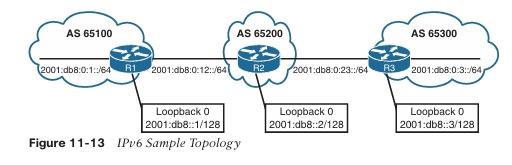

## Configuración IPv6

Todas las reglas de configuración de BGP demostradas anteriormente se aplican a IPv6, excepto que la familia de direcciones IPv6 debe inicializarse y el vecino debe activarse. Los routers que solo utilicen direccionamiento IPv6 deben definir estáticamente el RID de BGP para que se formen las sesiones.

El protocolo utilizado para establecer una sesión BGP es independiente de la familia de direcciones (AFI/SAFI) anunciada. La sesión TCP utilizada por BGP es un protocolo de Capa 4 y puede usar direcciones IPv4 o IPv6 para formar una adyacencia de sesión y el intercambio de rutas. Anunciar prefijos IPv6 sobre una sesión BGP IPv4 es posible, pero queda fuera del alcance de este libro porque se requiere configuración adicional.

> **NOTA**  Se recomienda el uso de direcciones unicast globales para el establecimiento de sesiones BGP para evitar complejidad operativa. El emparejamiento BGP utilizando direcciones link-local puede introducir riesgos si la dirección no se asigna manualmente a una interfaz. Una falla de hardware o movimiento de cableado cambiará la dirección MAC, lo que resultará en una nueva dirección link-local. Esto provocará que la sesión falle porque la autoconfiguración de direcciones sin estado generará una nueva dirección IP.

El Ejemplo 11-28 muestra la configuración de BGP IPv6 para R1, R2 y R3. El emparejamiento se realiza usando direcciones unicast globales después de establecer la sesión. El RID de BGP se ha establecido en la dirección loopback IPv4 y se mantiene en todo el libro. R1 anuncia todas las redes a través de redistribución, y R2 y R3 usan la sentencia network para anunciar todas sus redes conectadas.

**Example 11-28:** Configuring IPv6 BGP
```
R1
router bgp 65100
 bgp router-id 192.168.1.1
 no bgp default ipv4-unicast
 neighbor 2001:DB8:0:12::2 remote-as 65200
 !
 address-family ipv6
  neighbor 2001:DB8:0:12::2 activate
  redistribute connected
```

```
R2
router bgp 65200
 bgp router-id 192.168.2.2
 no bgp default ipv4-unicast
 neighbor 2001:DB8:0:12::1 remote-as 65100
 neighbor 2001:DB8:0:23::3 remote-as 65300
 !
 address-family ipv6
  neighbor 2001:DB8:0:12::1 activate
  neighbor 2001:DB8:0:23::3 activate
  network 2001:DB8::2/128
  network 2001:DB8:0:12::/64
  network 2001:DB8:0:23::/64
```

```
R3
router bgp 65300
 bgp router-id 192.168.3.3
 no bgp default ipv4-unicast
 neighbor 2001:DB8:0:23::2 remote-as 65200
 !
 address-family ipv6
  neighbor 2001:DB8:0:23::2 activate
  network 2001:DB8::3/128
  network 2001:DB8:0:3::/64
  network 2001:DB8:0:23::/64
```

> **NOTA**  La capacidad de enrutamiento IPv4 unicast se anuncia por defecto en IOS XE, a menos que el vecino se deshabilite explícitamente dentro de la familia de direcciones IPv4 o de forma global dentro del proceso BGP con el comando `no bgp default ipv4-unicast`.

Los routers intercambian capacidades AFI al iniciar la negociación de la sesión BGP. El comando `show bgp ipv6 unicast neighbors ip-address [detail]` muestra información detallada sobre si las capacidades IPv6 se negociaron correctamente. El Ejemplo 11-29 muestra los campos que deben examinarse para el establecimiento de sesiones IPv6 y el anuncio de rutas.

**Example 11-29:** Visualización de vecinos BGP para capacidades IPv6
```
R1# show bgp ipv6 unicast neighbors 2001:DB8:0:12::2
! Output omitted for brevity

BGP neighbor is 2001:DB8:0:12::2, remote AS 65200, external link
 BGP version 4, remote router ID 192.168.2.2
 BGP state = Established, up for 00:28:25
 Last read 00:00:54, last write 00:00:34, hold time is 180, keepalive interval is 60 seconds
 Neighbor sessions:
  1 active, is not multisession capable (disabled)

 Neighbor capabilities:
  Route refresh: advertised and received (new)
  Four-octets ASN Capability: advertised and received
  Address family IPv6 Unicast: advertised and received
  Enhanced Refresh Capability: advertised and received

 For address family: IPv6 Unicast
  Session: 2001:DB8:0:12::2
  BGP table version 13, neighbor version 13/0
  Output queue size : 0
  Index 1, Advertise bit 0
  1 update-group member
  Slow-peer detection is disabled
  Slow-peer split-update-group dynamic is disabled

  Sent Rcvd
  ---- ----
 Prefix activity:
  Prefixes Current:     3          5 (Consumes 520 bytes)
  Prefixes Total:       6          10
```

El comando `show bgp ipv6 unicast summary` muestra un resumen del estado de las sesiones, incluyendo el número de prefijos que han sido intercambiados y el tiempo de actividad de la sesión.

El Ejemplo 11-30 destaca el estado del vecino IPv6 AFI para R2. Observe que las dos adyacencias de vecinos han estado activas por aproximadamente 25 minutos. El vecino 2001:DB8:0:12::1 está anunciando tres prefijos, y el vecino 2001:DB8:0:23::3 está anunciando tres prefijos.

**Example 11-30:** Verificación de sesión BGP IPv6
```
R2# show bgp ipv6 unicast summary
BGP router identifier 192.168.2.2, local AS number 65200
BGP table version is 19, main routing table version 19
7 network entries using 1176 bytes of memory
8 path entries using 832 bytes of memory
3/3 BGP path/bestpath attribute entries using 456 bytes of memory
2 BGP AS-PATH entries using 48 bytes of memory
0 BGP route-map cache entries using 0 bytes of memory
0 BGP filter-list cache entries using 0 bytes of memory
BGP using 2512 total bytes of memory
BGP activity 7/0 prefixes, 8/0 paths, scan interval 60 secs

Neighbor           V    AS MsgRcvd MsgSent TblVer InQ OutQ Up/Down  State/PfxRcd
2001:DB8:0:12::1   4 65100      35      37     19    0    0 00:25:08           3
2001:DB8:0:23::3   4 65300      32      37     19    0    0 00:25:11           3
```

El Ejemplo 11-31 muestra las tablas BGP IPv6 unicast para R1, R2 y R3. Observe que algunas de las rutas incluyen una dirección no especificada (::) como siguiente salto. Una dirección no especificada indica que el router local está generando el prefijo para la tabla BGP. El valor de peso 32,768 también indica que el prefijo se originó localmente en el router.

**Example 11-31:** Visualización de las tablas BGP IPv6
```
R1# show bgp ipv6 unicast
BGP table version is 13, local router ID is 192.168.1.1
Status codes: s suppressed, d damped, h history, * valid, > best, i - internal,
              r RIB-failure, S Stale, m multipath, b backup-path, f RT-Filter,
              x best-external, a additional-path, c RIB-compressed,
Origin codes: i - IGP, e - EGP, ? - incomplete
RPKI validation codes: V valid, I invalid, N Not found

     Network              Next Hop                Metric LocPrf Weight Path
*> 2001:DB8::1/128        ::                            0          32768 ?
*> 2001:DB8::2/128        2001:DB8:0:12::2              0                 65200 i
*> 2001:DB8::3/128        2001:DB8:0:12::2              0                 65200 65300 i
*> 2001:DB8:0:1::/64      ::                            0          32768 ?
*> 2001:DB8:0:3::/64      2001:DB8:0:12::2              0                 65200 65300 i
*> 2001:DB8:0:12::/64     ::                            0          32768 ?
*> 2001:DB8:0:23::/64     2001:DB8:0:12::2              0                 65200 i
```

```
R2# show bgp ipv6 unicast | begin Network
    Network              Next Hop                Metric LocPrf Weight Path
*>  2001:DB8::1/128      2001:DB8:0:12::1              0          65100 ?
*>  2001:DB8::2/128      ::                            0          32768 i
*>  2001:DB8::3/128      2001:DB8:0:23::3              0          65300 i
*>  2001:DB8:0:1::/64    2001:DB8:0:12::1              0          65100 ?
```

```
*>  2001:DB8:0:3::/64    2001:DB8:0:23::3              0          65300 i
*>  2001:DB8:0:12::/64   ::                            0          32768 i
*>  2001:DB8:0:23::/64   2001:DB8:0:12::1              0          65100 ?
```

```
R3# show bgp ipv6 unicast | begin Network
    Network              Next Hop                Metric LocPrf Weight Path
*>  2001:DB8::1/128      2001:DB8:0:23::2              0          65200 65100 ?
*>  2001:DB8::2/128      2001:DB8:0:23::2              0          65200 i
*>  2001:DB8::3/128      ::                            0          32768 i
*>  2001:DB8:0:1::/64    2001:DB8:0:23::2              0          65200 65100 ?
*>  2001:DB8:0:3::/64    ::                            0          32768 i
*>  2001:DB8:0:23::/64   ::                            0          32768 i
```

Los atributos de ruta BGP para una ruta IPv6 se muestran con el comando `show bgp ipv6 unicast prefix/prefix-length`. El Ejemplo 11-32 muestra a R3 examinando la dirección loopback de R1. Algunos de los atributos comunes, como AS Path, origin y local preference, son idénticos a los usados para rutas IPv4.

**Example 11-32:** Visualización de los atributos de ruta BGP para una ruta IPv6
```
R3# show bgp ipv6 unicast 2001:DB8::1/128
BGP routing table entry for 2001:DB8::1/128, version 9
Paths: (1 available, best #1, table default)
  Not advertised to any peer

  Refresh Epoch 2
  65200 65100
    2001:DB8:0:23::2 (FE80::2) from 2001:DB8:0:23::2 (192.168.2.2)
      Origin incomplete, localpref 100, valid, external, best
      rx pathid: 0, tx pathid: 0x0
```

El Ejemplo 11-33 muestra las entradas de ruta RIB para rutas IPv6 aprendidas por BGP en R2. Observe que la dirección del siguiente salto es la dirección link-local del siguiente salto de reenvío, la cual se resuelve mediante una búsqueda recursiva.

**Example 11-33:** Entradas de ruta RIB para rutas IPv6 aprendidas por BGP
```
R2# show ipv6 route bgp | begin Application
 a - Application

 B   2001:DB8::1/128 [20/0]
      via FE80::1, GigabitEthernet0/0
 B   2001:DB8::3/128 [20/0]
      via FE80::3, GigabitEthernet0/1
 B   2001:DB8:0:1::/64 [20/0]
      via FE80::1, GigabitEthernet0/0
 B   2001:DB8:0:3::/64 [20/0]
      via FE80::3, GigabitEthernet0/1
```

**Resumen de rutas IPv6**

El mismo proceso de resumen/agregación de rutas para IPv4 ocurre con rutas IPv6, y el formato es idéntico, excepto que la configuración se coloca bajo la familia de direcciones IPv6 usando el comando `aggregate-address prefix/prefix-length [summary-only] [as-set]`.

Revisemos el despliegue IPv6 previo, pero ahora queremos resumir todas las direcciones loopback (2001:db8:0:1/128, 2001:db8:0:2/128 y 2001:db8:0:3/128) junto con el enlace entre pares (2001:db8:0:12/64) en R2. La configuración se vería como se muestra en el Ejemplo 11-34.

**Example 11-34:** Configuración de agregación BGP IPv6 en R2
```
router bgp 65200
 bgp router-id 192.168.2.2
 neighbor 2001:DB8:0:12::1 remote-as 65100
 neighbor 2001:DB8:0:23::3 remote-as 65300
 !
 address-family ipv4
  no neighbor 2001:DB8:0:12::1 activate
  no neighbor 2001:DB8:0:23::3 activate
 !
 address-family ipv6
  network 2001:DB8::2/128
  network 2001:DB8:0:12::/64
  network 2001:DB8:0:23::/64
  aggregate-address 2001:DB8::/58 summary-only
  neighbor 2001:DB8:0:12::1 activate
  neighbor 2001:DB8:0:23::3 activate
```

El Ejemplo 11-35 muestra las tablas BGP en R1 y R3. Se puede observar que todas las rutas componentes más pequeñas han sido suprimidas y agregadas en la ruta resumen 2001:db8::/58, como se esperaba.

**Example 11-35:** Verificación de la agregación de rutas IPv6
```
R3# show bgp ipv6 unicast | b Network
    Network              Next Hop            Metric LocPrf Weight Path
*>  2001:DB8::/59        2001:DB8:0:23::2          0          65200 i
*>  2001:DB8::3/128      ::                        0          32768 i
*>  2001:DB8:0:3::/64    ::                        0          32768 i
*>  2001:DB8:0:23::/64   ::                        0          32768 i
```

```
R1# show bgp ipv6 unicast | b Network
    Network              Next Hop            Metric LocPrf Weight Path
*>  2001:DB8::/59        2001:DB8:0:12::2          0          65200 i
*>  2001:DB8::1/128      ::                        0          32768 ?
*>  2001:DB8:0:1::/64    ::                        0          32768 ?
*>  2001:DB8:0:12::/64   ::                        0          32768 ?
```

La sumarización de las direcciones loopback IPv6 (2001:db8::1/128, 2001:db8::2/128 y 2001:db8::3/128) y de las redes stub de R1/R3 (2001:db8:0:1::/64 y 2001:db8:0:3::/64) es bastante simple porque todas caen dentro del mismo rango base IPv6 2001:db8:0:0::/64. El cuarto hexteto que comienza con un valor decimal de 1, 2 o 3 consumiría solo 2 bits; el rango puede resumirse fácilmente en el rango de red 2001:db8:0::/62 (o 2001:db8::/62).

El enlace de emparejamiento entre R2 y R3 (2001:db8:0:23::/64) requiere pensar primero en hexadecimal, en lugar de decimal. El cuarto hexteto tiene un valor decimal de 35 (hex 23), lo que requiere 6 bits mínimos. La Tabla 11-5 lista los bits necesarios para la sumarización IPv6, las redes componentes en el rango resumen.

**Table 11-5 Tabla de sumarización IPv6**

|Bits Needed|Summary Address|Component Networks|
|---|---|---|
|2|2001:db8:0:0::/62|2001:db8:0:0::/64 through 2001:db8:0:3::/64|
|3|2001:db8:0:0::/61|2001:db8:0:0::/64 through 2001:db8:0:7::/64|
|4|2001:db8:0:0::/60|2001:db8:0:0::/64 through 2001:db8:0:f::/64|
|5|2001:db8:0:0::/59|2001:db8:0:0::/64 through 2001:db8:0:1f::/64|
|6|2001:db8:0:0::/58|2001:db8:0:0::/64 through 2001:db8:0:3f::/64|
