**CAPÍTULO 12**
## CAPÍTULO 12

### BGP Avanzado

Este capítulo cubre los siguientes temas:

- **Multihoming BGP**: Esta sección revisa los métodos para proporcionar resiliencia mediante conexiones BGP redundantes, junto con consideraciones de diseño deseadas y no deseadas para conexiones a Internet y MPLS (sucursal y centro de datos).
    
- **Coincidencia condicional**: Esta sección proporciona una visión general de cómo los prefijos de red pueden coincidirse condicionalmente con ACLs, listas de prefijos y expresiones regulares.
    
- **Route Maps**: Esta sección explica la estructura de un route map y cómo la coincidencia condicional y las acciones condicionales pueden combinarse para filtrar o manipular rutas.
    
- **Filtrado y manipulación de rutas BGP**: Esta sección amplía cómo funcionan la coincidencia condicional y los route maps aplicando casos reales para demostrar el filtrado y la manipulación de rutas BGP.
    
- **Comunidades BGP**: Esta sección explica los atributos obligatorios y conocidos de BGP y cómo pueden usarse para etiquetar un prefijo y hacer que las políticas de enrutamiento se apliquen por routers dentro del mismo sistema autónomo o en un sistema autónomo externo.
    
- **Comprender la selección de rutas BGP**: Esta sección describe la lógica utilizada por BGP para identificar la mejor ruta cuando múltiples rutas están instaladas en la tabla BGP.
    

El Border Gateway Protocol (BGP) puede soportar cientos de miles de rutas, lo que lo convierte en la opción ideal para Internet. Las organizaciones también usan BGP por su flexibilidad y capacidades de ingeniería de tráfico. Este capítulo amplía el Capítulo 11, “BGP”, explicando las funciones y conceptos avanzados involucrados con el protocolo de enrutamiento BGP, como multihoming BGP, filtrado de rutas, comunidades BGP y la lógica para identificar la mejor ruta hacia una red de destino específica.

---

Internet se ha convertido en un componente vital para las empresas en la actualidad. La conectividad a Internet es necesaria, como mínimo, para correo electrónico e investigación. Además, algunas organizaciones alojan servidores de comercio electrónico, usan telefonía sobre IP (VoIP) o terminan túneles VPN mediante conexiones MPLS privadas. Una organización debe incorporar redundancias en la arquitectura de red para garantizar que no existan puntos únicos de falla (SPOF) y así mantener la conectividad de red que respalde las necesidades del negocio.

Una empresa puede conectarse a Internet con una ruta por defecto simple utilizando una sola conexión. Sin embargo, si una empresa desea usar múltiples proveedores de servicios (SP) para redundancia o mayor capacidad, BGP es el protocolo de enrutamiento utilizado en Internet.

El uso de BGP por parte de una empresa no se limita a la conectividad a Internet. Si la empresa utiliza MPLS L3VPN de un proveedor de servicios, probablemente esté usando BGP para intercambiar redes LAN con el proveedor. Las rutas normalmente se redistribuyen entre BGP y el protocolo de enrutamiento basado en LAN. En ambos escenarios, BGP se utiliza en el borde de la red (Internet o WAN) y cuenta con conexiones redundantes para garantizar una red confiable. Proporciona selección de rutas avanzada y conectividad para una organización.

## Multihoming BGP

El método más simple para proporcionar redundancia es suministrar un segundo circuito. Agregar un segundo circuito y establecer una segunda sesión BGP a través de ese emparejamiento se conoce como **multihoming BGP**, ya que existen múltiples sesiones BGP para aprender rutas y establecer conectividad. El comportamiento por defecto de BGP es anunciar solo la mejor ruta a la RIB, lo que significa que solo una ruta por prefijo de red se utiliza al reenviar tráfico de red hacia un destino.

## Resiliencia en Proveedores de Servicios

Las fallas de enrutamiento pueden ocurrir dentro de la red de un proveedor de servicios, y algunas organizaciones optan por usar diferentes SP para cada circuito. Un segundo proveedor de servicios puede seleccionarse por varias razones, pero la elección suele reducirse a costo, disponibilidad de circuitos para ubicaciones remotas o separación del plano de control.

Si se utiliza un SP diferente, si un SP tiene problemas en su red, el tráfico aún puede fluir a través del otro SP. Además, agregar más SP permite que el tráfico seleccione una ruta óptima entre dispositivos debido al algoritmo de mejor ruta de BGP, que se analiza más adelante en este capítulo.

La Figura 12-1 ilustra cuatro escenarios comunes de multihoming:

- **Escenario 1**: R1 se conecta a R3 con el mismo SP. Este diseño contempla fallas de enlace; sin embargo, una falla en R1 o dentro de la red del SP resulta en una falla de red.
    
- **Escenario 2**: R1 se conecta a R3 y R4 con el mismo SP. Este diseño contempla fallas de enlace; sin embargo, una falla en R1 o dentro de la red del SP resulta en una falla de red.
    
- **Escenario 3**: R1 se conecta a R3 y R4 con diferentes SP. Este diseño contempla fallas de enlace y fallas dentro de la red de cualquiera de los SP, y puede optimizar el enrutamiento del tráfico. Sin embargo, una falla en R1 resulta en una falla de red.
    
- **Escenario 4**: R1 y R2 forman una sesión iBGP entre ellos. R3 se conecta a SP1 y R4 se conecta a SP2. Este diseño contempla fallas de enlace y fallas en la red de cualquiera de los SP, y puede optimizar el enrutamiento del tráfico.

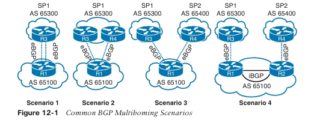

## Enrutamiento de Tránsito por Internet

Si una empresa utiliza BGP para conectarse con más de un proveedor de servicios, corre el riesgo de convertirse en un sistema autónomo (AS) que actúe como tránsito. En la Figura 12-2, el AS 500 se conecta a dos proveedores de servicios diferentes (SP3 y SP4) para lograr resiliencia.

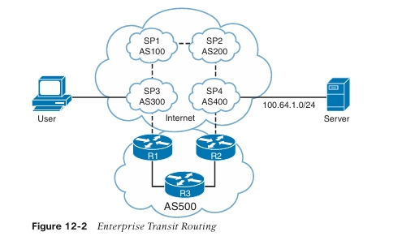

Si R1 y R2 usan la política de enrutamiento BGP por defecto, SP3 recibe el prefijo 100.64.1.0/24 desde el AS 100 y el AS 500. SP3 selecciona la ruta a través del AS 500 porque el AS Path es mucho más corto que ir pasando por las redes de SP1 y SP2. Un usuario que se conecta a SP3 (AS 300) enruta a través de la red empresarial (AS 500) para llegar a un servidor que se conecta a SP4 (AS 400).

La red del AS 500 está proporcionando **enrutamiento de tránsito** a todo el mundo en Internet, lo cual puede saturar los enlaces de peering del AS 500. Además de causar problemas para los usuarios en el AS 500, esta situación tiene un impacto en el tráfico de otros usuarios que están intentando atravesar el AS 500.

El enrutamiento de tránsito puede evitarse aplicando políticas de rutas BGP salientes que solo permitan que las rutas BGP locales se anuncien a otros sistemas autónomos. Este tema se trata más adelante en este capítulo, en la sección “Filtrado y Manipulación de Rutas BGP”.

## Enrutamiento de Tránsito en Sucursales

Un diseño de red adecuado debe tener en cuenta los patrones de tráfico para prevenir un enrutamiento subóptimo o bucles. La Figura 12-3 muestra un diseño con multihoming usando transporte MPLS en todos los sitios. Todos los routers están configurados para preferir el transporte MPLS de SP2 sobre el transporte MPLS de SP1 (activo/pasivo). Todos los routers de sucursal hacen peering y anuncian todas las rutas por eBGP a los routers de los proveedores SP. Los routers de sucursal no filtran ninguno de los prefijos, y todos los routers de sucursal establecen la preferencia local para MPLS de SP2 a un valor más alto para enrutar el tráfico a través de él.

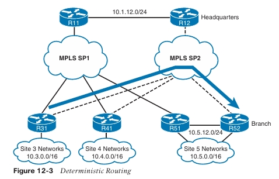

Cuando la red funciona según lo previsto, el tráfico entre los sitios utiliza la red del proveedor de servicios preferido (MPLS SP2) en ambas direcciones. Esto simplifica la resolución de problemas cuando el flujo de tráfico es **simétrico** (el mismo camino en ambas direcciones) en lugar de un reenvío asimétrico (un camino diferente para cada dirección), porque la ruta completa debe descubrirse en ambas direcciones. El camino se considera **determinista y predecible** cuando el flujo entre sitios está predeterminado.

Durante una falla de enlace dentro de la red del proveedor de servicios, existe la posibilidad de que un router de sucursal se conecte al router de la sucursal de destino a través de un router de sucursal intermedio. La Figura 12-4 muestra el escenario de falla con R41 proporcionando conectividad de tránsito entre el Sitio 3 y el Sitio 5.

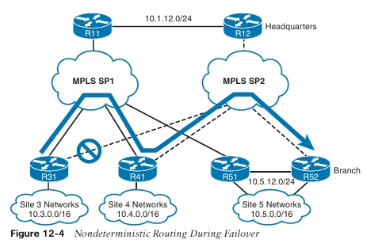

La conectividad de tránsito no planificada presenta los siguientes problemas:

- Los circuitos del router de tránsito pueden saturarse porque fueron dimensionados solo para el tráfico de ese sitio y no para el tráfico que los atraviesa.
    
- Los patrones de enrutamiento pueden volverse impredecibles y no deterministas. En este escenario, el tráfico desde R31 fluye a través de R41, pero el tráfico de retorno puede tomar un camino distinto. El camino puede ser muy diferente si el tráfico se origina en un router distinto. Esto impide un enrutamiento determinista, complica la resolución de problemas y puede hacer que el personal del NOC sienta que está jugando “whack-a-mole” al solucionar incidencias de red.
    

Los entornos multihomed deben configurarse de modo que los routers de sucursal no puedan actuar como routers de tránsito. En la mayoría de los diseños, el tránsito de tráfico desde otra sucursal es indeseable, porque el ancho de banda WAN puede no estar dimensionado adecuadamente. El enrutamiento de tránsito puede evitarse configurando filtrado de rutas de salida en cada sucursal. En esencia, los sitios de sucursal no anuncian lo que aprenden desde la WAN, sino que anuncian solo las redes que enfrentan a la LAN. Si se requiere comportamiento de tránsito, este se restringe a los centros de datos o a ubicaciones específicas de la siguiente manera:

- Un diseño de enrutamiento adecuado puede soportar caídas.
    
- El ancho de banda puede dimensionarse adecuadamente.
    
- El patrón de enrutamiento es bidireccional y predecible.
    

> **NOTA**  El enrutamiento de tránsito en el centro de datos u otras ubicaciones planificadas es normal en diseños empresariales porque se ha considerado el ancho de banda. Normalmente, esto se hace cuando algunas sucursales están disponibles solo con un proveedor de servicios, y las otras sucursales se conectan con un proveedor distinto.

## Coincidencia Condicional

Esta sección revisa algunas de las técnicas comunes usadas para hacer coincidir condicionalmente una ruta, utilizando listas de control de acceso (ACL), listas de prefijos, expresiones regulares (regex) y ACL de AS path.

## Listas de Control de Acceso (ACL)

Originalmente, las listas de control de acceso (ACL) estaban destinadas a proporcionar filtrado de paquetes que entran o salen de una interfaz de red, de forma similar a la funcionalidad de un firewall básico. Hoy en día, además de su función original, las ACL proporcionan clasificación de paquetes para una variedad de funciones, como calidad de servicio (QoS), o para identificar redes dentro de los protocolos de enrutamiento.

Las ACL están compuestas por entradas de control de acceso (ACE), que son las entradas dentro de la ACL que identifican la acción a realizar (permitir o denegar) y la clasificación de paquetes. La clasificación de paquetes comienza desde arriba (menor secuencia) y avanza hacia abajo (mayor secuencia). Una vez que se identifica una coincidencia de paquete, se aplica la acción apropiada (permitir o denegar) y se detiene el procesamiento. Al final de cada ACL existe una ACE implícita de denegación, que niega todos los paquetes que no coincidan antes con la ACL.

> **NOTA**  La ubicación de las ACE dentro de una ACL es importante, y pueden producirse consecuencias no deseadas si las ACE están fuera de orden.

Las ACL se clasifican en dos categorías:

- **ACL estándar**: Definen paquetes basándose únicamente en la red de origen.
    
- **ACL extendidas**: Definen paquetes basándose en origen, destino, protocolo, puerto, o una combinación de otros atributos del paquete. Este libro se centra en el origen, destino y protocolo.
    

Las ACL estándar utilizan una entrada numerada del 1–99, 1300–1999, o una ACL con nombre. Las ACL extendidas utilizan una entrada numerada del 100–199, 2000–2699, o una ACL con nombre. Las ACL con nombre proporcionan mayor relevancia a la funcionalidad de la ACL, pueden usarse tanto con ACL estándar como extendidas, y generalmente son preferidas.

## ACL Estándar

El siguiente es el proceso para definir una ACL estándar:

**Paso 1.**  
Definir la ACL usando el comando  
`ip access-list standard {acl-number | acl-name}`  
y entrar al modo de configuración de ACL.

**Paso 2.**  
Configurar la ACE específica con el comando  
`[sequence] {permit | deny} source source-wildcard`.  
En lugar de usar `source source-wildcard`, la palabra clave `any` reemplaza `0.0.0.0 255.255.255.255`, y el uso de la palabra clave `host` se refiere a una dirección IP /32, por lo que el `source-wildcard` puede omitirse.

La Tabla 12-2 proporciona ejemplos de entradas ACL dentro del modo de configuración de ACL y especifica las redes que coincidirían con una ACL estándar.

**Tabla 12-2 Entradas de ACL estándar a red**

|Entrada ACE|Redes|
|---|---|
|permit any|Permite todas las redes|
|permit 172.16.0.0 0.0.255.255|Permite todas las redes en el rango 172.16.0.0/16|
|permit host 192.168.1.1|Permite solo la red 192.168.1.1/32|
## ACL Extendidas

El siguiente es el proceso para definir una ACL extendida:

**Paso 1.**  
Definir la ACL usando el comando  
`ip access-list extended {acl-number | acl-name}`  
y entrar al modo de configuración de ACL.

**Paso 2.**  
Configurar la ACE específica con el comando  
`[sequence] {permit | deny} protocol source source-wildcard destination destination-wildcard`.  
El comportamiento para seleccionar un prefijo de red con una ACL extendida varía según si el protocolo es un IGP (EIGRP, OSPF o IS-IS) o BGP.

## Selección de Redes en BGP

Las ACL extendidas reaccionan de forma diferente al hacer coincidencias con rutas BGP que al hacerlo con rutas IGP. Los campos de origen se comparan contra la porción de red de la ruta, y los campos de destino se comparan contra la máscara de red, como se muestra en la Figura 12-5. Hasta la introducción de las listas de prefijos, las ACL extendidas eran el único criterio de coincidencia utilizado con BGP.

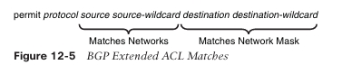

La Tabla 12-3 demuestra el concepto del _wildcard_ para la red y la máscara de subred.

**Tabla 12-3 ACL Extendida para la Selección de Rutas BGP**

|ACL Extendida|Coincide con Estas Redes|
|---|---|
|`permit ip 10.0.0.0 0.0.255.255 255.255.0.0 0.0.0.0`|Permite únicamente la red 10.0.0.0/16|
|`permit ip 10.0.0.0 0.0.255.0 255.255.255.0 0.0.0.0`|Permite cualquier red 10.0.x.0 con longitud de prefijo /24|
|`permit ip 172.16.0.0 0.0.255.255 255.255.255.0 0.0.0.255`|Permite cualquier red 172.16.x.x con longitud de prefijo /24 a /32|
|`permit ip 172.16.0.0 0.0.255.255 255.255.255.128 0.0.0.127`|Permite cualquier red 172.16.x.x con longitud de prefijo /25 a /32|

## Coincidencia de Prefijos

Las listas de prefijos proporcionan otro método para identificar redes en un protocolo de enrutamiento. Una lista de prefijos identifica una dirección IP específica, un prefijo de red o un rango de redes y permite la selección de múltiples redes con una variedad de longitudes de prefijo utilizando una especificación de coincidencia por prefijo. Muchos ingenieros de red prefieren este método sobre la selección de redes mediante ACL.

Una especificación de coincidencia por prefijo contiene dos partes: un patrón de bits de orden superior y un conteo de bits de orden inferior, que determina el patrón de bits de orden superior que debe coincidir. Parte de la documentación se refiere al patrón de bits de orden superior como la dirección o red y al conteo de bits de orden inferior como la longitud del prefijo o de la máscara.

En la Figura 12-6, la especificación de coincidencia por prefijo tiene el patrón de bits de orden superior 192.168.0.0 y el conteo de bits de orden inferior 16. El patrón de bits de orden superior se ha convertido a binario para demostrar dónde cuenta el conteo de bits de orden superior. Debido a que no se incluyen parámetros adicionales de longitud de coincidencia, el conteo de bits de orden superior es una coincidencia exacta.

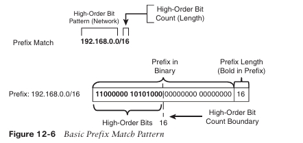

En este punto, la lógica de la especificación de coincidencia por prefijo se ve idéntica a la funcionalidad de una lista de control de acceso. La verdadera potencia y flexibilidad provienen del uso de parámetros de longitud de coincidencia para identificar múltiples redes con longitudes de prefijo específicas mediante una sola sentencia. Los parámetros de coincidencia son los siguientes:

- **le**: Menor o igual que, <=
    
- **ge**: Mayor o igual que, >=
    

La Figura 12-7 demuestra la especificación de coincidencia por prefijo con el patrón de bits de orden superior 10.168.0.0 y un conteo de bits de orden superior de 13; la longitud de coincidencia del prefijo debe ser mayor o igual a 24.

El prefijo 10.168.0.0/13 no cumple con el parámetro de longitud de coincidencia porque la longitud del prefijo es menor que el mínimo de 24 bits, mientras que el prefijo 10.168.0.0/24 sí cumple con el parámetro de longitud de coincidencia. El prefijo 10.173.1.0/28 califica porque los primeros 13 bits coinciden con el patrón de bits de orden superior y la longitud del prefijo está dentro del parámetro de longitud de coincidencia. El prefijo 10.104.0.0/24 no califica porque el patrón de bits de orden superior no coincide dentro del conteo de bits de orden superior.

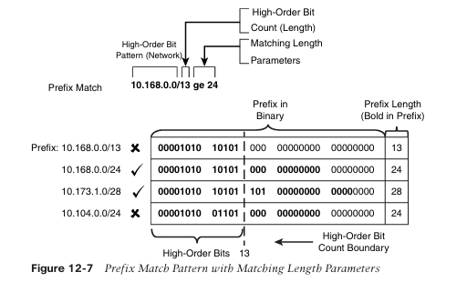

La Figura 12-8 demuestra una especificación de coincidencia por prefijo con el patrón de bits de orden superior 10.0.0.0, un conteo de bits de orden superior de 8 y una longitud de coincidencia entre 22 y 26.

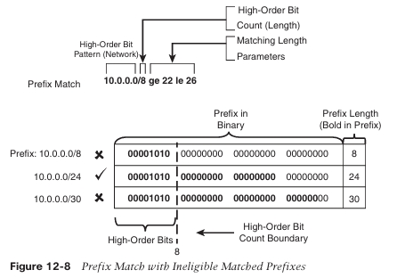

El prefijo **10.0.0.0/8** no coincide porque la longitud del prefijo es demasiado corta. La red **10.0.0.0/24** sí cumple porque el patrón de bits coincide y la longitud del prefijo está entre 22 y 26. El prefijo **10.0.0.0/30** no coincide porque la longitud del prefijo es demasiado larga. Cualquier prefijo que comience con **10** en el primer octeto y tenga una longitud de prefijo entre **22 y 26** coincidirá.

> **NOTA**  La coincidencia con una longitud de prefijo específica que sea mayor que el conteo de bits de orden superior requiere que coincidan los valores **ge** y **le**.

## Listas de Prefijos

Las listas de prefijos pueden contener múltiples entradas de especificación de coincidencia de prefijos que incluyen una acción de **permitir** o **denegar**. Las listas de prefijos se procesan en orden secuencial o de arriba hacia abajo, y la primera entrada que se procesa con la acción adecuada de permitir o denegar es la que se aplica.

Las listas de prefijos se configuran con el comando de configuración global:  
**ip prefix-list prefix-list-name [seq sequence-number] [permit | deny] high-order-bit-pattern/high-order-bit-count [ge ge-value] [le le-value]**

Si no se proporciona un número de secuencia, este se incrementa automáticamente en 5, basado en el número de secuencia de bits de orden superior. La primera entrada es la secuencia 5. La secuenciación permite la eliminación de una entrada específica. Debido a que las listas de prefijos no pueden reordenarse, es aconsejable dejar suficiente espacio para la inserción de números de secuencia en un momento posterior.

IOS XE requiere que el valor **ge** sea mayor que el conteo de bits de orden superior y que el valor **le** sea mayor o igual que el valor **ge**:

**high-order-bit-count < ge-value <= le-value**

El Ejemplo 12-1 proporciona una lista de prefijos de ejemplo llamada **RFC1918** para todas las redes en el rango de direcciones RFC 1918. La lista de prefijos permite que solo existan prefijos **/32** en el rango **192.168.0.0** y no existan en ningún otro rango de red en la lista de prefijos.

Observe que la secuencia **5** permite todos los prefijos **/32** en el patrón de bits **192.168.0.0/16**, y la secuencia **10** deniega todos los **/32** en cualquier patrón. Las secuencias **15, 20 y 25** permiten rutas en los rangos de red apropiados. El orden de secuencia es importante para las primeras dos entradas para asegurar que solo existan prefijos **/32** en la red **192.168.0.0** para la lista de prefijos.

**Ejemplo 12-1:** Lista de Prefijos de Ejemplo
```
ip prefix-list RFC1918 seq 5 permit 192.168.0.0/16 ge 32
ip prefix-list RFC1918 seq 10 deny 0.0.0.0/0 ge 32
ip prefix-list RFC1918 seq 15 permit 10.0.0.0/8 le 32
ip prefix-list RFC1918 seq 20 permit 172.16.0.0/12 le 32
ip prefix-list RFC1918 seq 25 permit 192.168.0.0/16 le 32
```

## Listas de Prefijos IPv6

La lógica de coincidencia de prefijos funciona exactamente igual para redes IPv6 que para redes IPv4. El punto más importante a recordar es que las redes IPv6 se notan en hexadecimal y no en decimal al identificar rangos. En última instancia, sin embargo, todo funciona a nivel binario.

Las listas de prefijos IPv6 se configuran con el comando de configuración global:  
**ipv6 prefix-list prefix-list-name [seq sequence-number] [permit | deny] high-order-bit-pattern/high-order-bit-count [ge ge-value] [le le-value]**

El Ejemplo 12-2 proporciona una lista de prefijos IPv6 de ejemplo llamada **PRIVATE-IPV6** para todas las redes en la documentación y en el espacio de enlace.

**Ejemplo 12-2:** Lista de Prefijos IPv6 de Ejemplo
```
ipv6 prefix-list PRIVATE-IPV6 seq 5 permit 2001:2::/48 le 128
ipv6 prefix-list PRIVATE-IPV6 seq 10 permit 2001:db8::/32 le 128
```

## Expresiones Regulares (regex)

Puede haber ocasiones en las que la coincidencia condicional en prefijos de red sea demasiado compleja y se prefiera identificar todas las rutas de una organización específica. En ese caso, la selección de rutas puede realizarse usando una **ruta de BGP AS Path**.

Las **expresiones regulares (regex)** se utilizan para analizar el gran número de ASNs disponibles (4,294,967,295). Las expresiones regulares se basan en modificadores de consulta usados para seleccionar contenido apropiado. La tabla BGP puede emparejarse con regex usando el comando:  
**show bgp afi safi regexp regex-pattern**

La Tabla 12-4 proporciona una lista y descripción de los modificadores de consulta regex comunes.

**Tabla 12-4 Modificadores de Consulta Regex**

|Modificador|Descripción|
|---|---|
|`_` (guion bajo)|Coincide con un espacio|
|`^` (acento circunflejo)|Indica el inicio de una cadena|
|`$` (signo de dólar)|Indica el final de una cadena|
|`[]` (corchetes)|Coincide con un solo carácter o con anidamiento dentro de un rango|
|`-` (guion)|Indica un rango de números dentro de corchetes|
|`[^]` (acento circunflejo en corchetes)|Excluye los caracteres listados entre corchetes|
|`()` (paréntesis)|Usado para anidar patrones de búsqueda|
|`|` (barra vertical)|
|`.` (punto)|Coincide con un solo carácter, incluyendo un espacio|
|`*` (asterisco)|Coincide con cero o más caracteres o patrones|
|`+` (signo más)|Coincide con una o más instancias del carácter o patrón|
|`?` (signo de interrogación)|Coincide con cero o una instancia del carácter o patrón|

Aprender **regex** puede llevar tiempo, pero los más comunes usados en BGP involucran **^**, **$** y **_**. La Tabla 12-5 muestra algunas expresiones regex comunes en BGP.

**Tabla 12-5 Expresiones Regulares Comunes en BGP**

|Expresión Regular|Significado|
|---|---|
|`^$`|Rutas originadas localmente|
|`permit ^200`|Solo rutas del vecino AS 200|
|`permit _200$`|Solo rutas originadas desde AS 200|
|`permit _200_`|Solo rutas que pasan a través del AS 200|
|`permit ^[0-9]+ [0-9]+ [0-9]+$`|Rutas con tres o menos entradas AS_Path|

> **NOTA**  La experiencia práctica es útil al aprender tecnologías como regex. Servidores públicos llamados _looking glasses_ permiten a los usuarios iniciar sesión y ver tablas BGP. La mayoría de estos dispositivos son routers Cisco, pero algunos son de otros fabricantes. Estos servidores permiten a los ingenieros de red ver si están anunciando sus rutas a Internet como lo pretendían y proporcionan un excelente método para probar expresiones regulares en la tabla BGP de Internet.  

> Una búsqueda rápida en Internet proporcionará listados de sitios web de _looking glass_ y servidores de rutas. Se sugiere **[www.bgp4.as](http://www.bgp4.as/)**.

## Mapas de Rutas (Route Maps)

Los mapas de rutas proporcionan muchas funciones diferentes a una variedad de protocolos de enrutamiento. En el nivel más simple, los mapas de rutas pueden filtrar redes de la misma manera que las ACLs, pero también proporcionan capacidad adicional mediante la adición o modificación de atributos de red. Para influir en un protocolo de enrutamiento, un mapa de rutas debe ser referenciado desde el protocolo de enrutamiento. Los mapas de rutas son críticos para BGP porque son el componente principal para modificar políticas de enrutamiento en base vecino por vecino.

Un mapa de rutas tiene cuatro componentes:

- **Número de secuencia**: Dicta el orden de procesamiento del mapa de rutas.
    
- **Criterio de coincidencia condicional**: Identifica características de prefijos (el prefijo en sí, atributos de ruta BGP, siguiente salto, etc.) para una secuencia específica.
    
- **Acción de procesamiento**: Permite o deniega el prefijo.
    
- **Acción opcional**: Permite manipulaciones, dependiendo de cómo el mapa de rutas sea referenciado en el router. Las acciones pueden incluir modificación, adición o eliminación de características de la ruta.
    

Un mapa de rutas usa la sintaxis del comando:  
`route-map route-map-name [permit | deny] [sequence-number]`

Las siguientes reglas aplican a las sentencias de mapas de rutas:

- Si no se proporciona una acción de procesamiento, el valor por defecto es **permit**.
    
- Si no se proporciona un número de secuencia, el número de secuencia se incrementa automáticamente en **10**.
    
- Si no se incluye una sentencia de coincidencia (_match_), se asocia implícitamente **match all prefixes** con la sentencia.
    
- El procesamiento dentro de un mapa de rutas se detiene después de que todas las acciones opcionales han sido procesadas (si se configuraron) tras coincidir un criterio de coincidencia condicional.
    
- Existe un **deny implícito** asociado a los prefijos que no están asociados con una acción **permit**.
    

El Ejemplo 12-3 proporciona un mapa de rutas de ejemplo para demostrar los cuatro componentes de un mapa de rutas mostrados anteriormente. El criterio de coincidencia condicional se basa en rangos de red especificados en una ACL.

**Ejemplo 12-3 Mapa de Rutas de Ejemplo**

```
route-map EXAMPLE permit 10
 match ip address ACL-ONE
! Prefixes that match ACL-ONE are permitted. Route-map completes processing 
! upon a match

route-map EXAMPLE deny 20
 match ip address ACL-TWO
! Prefixes that match ACL-TWO are denied. Route-map completes processing upon 
! a match

route-map EXAMPLE permit 30
 match ip address ACL-THREE
 set metric 20
! Prefixes that match ACL-THREE are permitted and their metric is modified. 
! Route-map completes processing upon a match

route-map EXAMPLE permit 40
! Because matching criteria were not specified, all other prefixes are permitted 
! If this sequence was not configured, all other prefixes would drop because of the 
! implicit deny with route-maps
```

> **NOTA**  Al eliminar una sentencia específica de un mapa de rutas, incluya el número de secuencia para evitar eliminar el mapa de rutas completo.

## Coincidencia Condicional (Conditional Matching)

Ahora que se han explicado los componentes y el orden de procesamiento de un mapa de rutas, esta sección amplía cómo un prefijo puede ser comparado. La Tabla 12-6 proporciona la sintaxis de los comandos para los métodos más comunes de coincidencia condicional de prefijos y describe su uso.  
Como se puede ver, hay varias opciones disponibles.

**Tabla 12-6 Opciones de Coincidencia Condicional**

|Comando match|Descripción|
|---|---|
|`match as-path acl-number`|Selecciona prefijos basados en una consulta regex para aislar el ASN en el atributo AS path (PA) de BGP. Las ACL de AS path están numeradas del 1 al 500. Este comando permite múltiples variables de coincidencia.|
|`match ip address {acl-number|acl-name}`|


|Comando match|Descripción|
|---|---|
|`match ip address prefix-list prefix-list-name`|Selecciona prefijos basados en criterios de selección de prefijos. Este comando permite múltiples variables de coincidencia.|
|`match local-preference local-preference`|Selecciona prefijos basados en el atributo BGP de preferencia local. Este comando permite múltiples variables de coincidencia.|
|`match metric {1-4294967295|external 1-4294967295} [+- deviation]`|
|`match tag tag-value`|Selecciona prefijos basados en una etiqueta numérica (0 a 4294967295) que fue establecida por otro router. Este comando permite múltiples variables de coincidencia.|
|`match community {1-500|community-list-name} [exact]`|
## Múltiples Condiciones de Coincidencia Condicional

Si se configuran múltiples variables (ACLs, listas de prefijos, etiquetas, etc.) para una secuencia específica de un mapa de rutas, **solo una variable debe coincidir** para que el prefijo califique. La lógica booleana usa un operador **OR** para esta configuración.

En el Ejemplo 12-4, la secuencia 10 requiere que un prefijo pase **ACL-ONE o ACL-TWO**. Nótese que la secuencia 20 no tiene una sentencia _match_, por lo que todos los prefijos que no pasen la secuencia 10 calificarán y serán denegados.

**Ejemplo 12-4:** Ejemplo de Mapa de Rutas con Múltiples Variables de Coincidencia
```
route-map EXAMPLE permit 10
 match ip address ACL-ONE ACL-TWO
!
route-map EXAMPLE deny 20
```

> **NOTA**  En el Ejemplo 12-4, la secuencia 20 es redundante debido al _deny_ implícito para cualquier prefijo que no coincida en la secuencia 10.

Si se configuran múltiples opciones de coincidencia para una secuencia específica de un mapa de rutas, **ambas opciones deben coincidir** para que el prefijo califique para esa secuencia. La lógica booleana usa un operador **AND** para esta configuración.

En el Ejemplo 12-5, la secuencia 10 requiere que el prefijo coincida con **ACL-ONE** y que la métrica tenga un valor entre **500 y 600**. Si el prefijo no califica para ambas opciones de coincidencia, no califica para la secuencia 10 y es denegado porque otra secuencia no existe con una acción _permit_.

**Ejemplo 12-5:** Ejemplo de Mapa de Rutas con Múltiples Opciones de Coincidencia
```
route-map EXAMPLE permit 10
 match ip address ACL-ONE
 match metric 550 +- 50
```

## Coincidencia Compleja (Complex Matching)

Algunos ingenieros de red consideran que los mapas de rutas son demasiado complejos si los criterios de coincidencia condicional (es decir, ACL, ACL de AS path o lista de prefijos) contienen una sentencia _deny_. El Ejemplo 12-6 muestra una configuración donde la ACL usa una sentencia _deny_ para el rango de red **172.16.1.0/24**.

Leer configuraciones como esta debe seguir el orden de las secuencias primero y los criterios de coincidencia condicional después, y solo después de una coincidencia ocurre la acción de procesamiento y la acción opcional. Usar una sentencia _deny_ en los criterios de coincidencia condicional excluye la ruta de esa secuencia en el mapa de rutas.

El prefijo **172.16.1.0/24** es denegado por **ACL-ONE**, lo que implica que no hay coincidencia en las secuencias 10 y 20; por lo tanto, la acción de procesamiento (permitir o denegar) no es necesaria. La secuencia 30 no contiene una cláusula _match_, por lo que cualquier ruta restante es permitida.  
El prefijo **172.16.1.0/24** pasaría por la secuencia 30 con la métrica establecida en 20. El prefijo **172.16.2.0/24** coincidiría con **ACL-ONE** y pasaría en la secuencia 10.

**Ejemplo 12-6 Mapas de Rutas con Coincidencia Compleja**

```
ip access-list standard ACL-ONE
 deny 172.16.1.0 0.0.0.255
 permit 172.16.0.0 0.0.255.255

route-map EXAMPLE permit 10
 match ip address ACL-ONE
!
route-map EXAMPLE deny 20
 match ip address ACL-ONE
!
route-map EXAMPLE permit 30
 set metric 20
```

> **NOTA**  Los mapas de rutas se procesan usando un orden particular de evaluación: la secuencia, los criterios de coincidencia condicional, la acción de procesamiento y la acción opcional, en ese orden. Cualquier sentencia _deny_ en el componente _match_ queda aislada de la acción de la secuencia del mapa de rutas.

## Acciones Opcionales

Además de permitir que el prefijo pase, los mapas de rutas pueden modificar atributos de ruta. La Tabla 12-7 proporciona una breve descripción de las modificaciones de atributos más populares.

**Tabla 12-7 Acciones `set` en Mapas de Rutas**

|Acción set|Descripción|
|---|---|
|`set as-path prepend {as-number-pattern|last-as 1-10}`|
|`set ip next-hop {ip-address|peer-address|
|`set local-preference 0-4294967295`|Establece la preferencia local de BGP.|
|`set metric {+value|-value|
|`set origin {igp|incomplete}`|
|`set tag tag-value`|Establece una etiqueta numérica (0–4294967295) para identificación por otros routers.|
|`set weight 0-65535`|Establece el peso de BGP.|
|`set community bgp-community [additive]`|Establece comunidades BGP (PA).|
## La Palabra Clave `continue`

El comportamiento predeterminado de los mapas de rutas procesa las secuencias en orden y, tras la primera coincidencia, ejecuta la acción de procesamiento, realiza cualquier acción opcional (si es posible) y detiene el procesamiento. Esto evita que se procesen múltiples secuencias del mapa de rutas.

Agregar la palabra clave `continue` a un mapa de rutas permite que el mapa continúe procesando otras secuencias. El Ejemplo 12-7 muestra una configuración básica. El prefijo de red **192.168.1.1** coincide en las secuencias 10, 20 y 30. Debido a que la palabra clave `continue` se añadió a la secuencia 10, la secuencia 20 procesa, pero la secuencia 30 no lo hace porque el comando `continue` no estaba presente en la secuencia 20. El prefijo **192.168.1.1** es permitido y se modifica, con la métrica en 20 y el _next-hop_ **10.12.1.1**.

**Ejemplo 12-7:** Mapa de Rutas con la Palabra Clave `continue`
```
ip access-list standard ACL-ONE
 permit 192.168.1.1 0.0.0.0
 permit 172.16.0.0 0.0.255.255

ip access-list standard ACL-TWO
 permit 192.168.1.1 0.0.0.0
 permit 172.31.0.0 0.0.255.255

route-map EXAMPLE permit 10
 match ip address ACL-ONE
 set metric 20
 continue
!
route-map EXAMPLE permit 20
 match ip address ACL-TWO
 set ip next-hop 10.12.1.1
!
route-map EXAMPLE permit 30
 set ip next-hop 10.13.1.3
```

> **NOTA**  El comando `continue` no se usa comúnmente porque añade complejidad al solucionar problemas de mapas de rutas.


**Filtrado y Manipulación de Rutas BGP**

El filtrado de rutas es un método para identificar selectivamente las rutas que se anuncian o se reciben de los routers vecinos. El filtrado de rutas puede utilizarse para manipular los flujos de tráfico, reducir el uso de memoria o mejorar la seguridad. Por ejemplo, es común que los ISP implementen filtros de rutas en las sesiones BGP con clientes. Garantizar que solo las rutas del cliente estén permitidas a través del enlace de _peering_ evita que el cliente se convierta accidentalmente en un AS de tránsito en Internet.

La Figura 12-9 muestra la lógica completa de procesamiento de rutas BGP. Obsérvese que las políticas de enrutamiento se aplican tanto en la recepción de rutas entrantes como en el anuncio de rutas salientes.

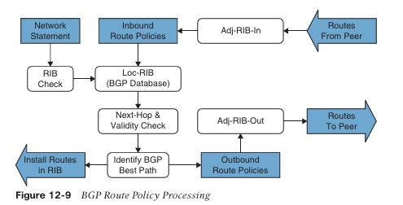

IOS XE proporciona cuatro métodos para filtrar rutas entrantes o salientes para un _peer_ BGP específico. Estos métodos pueden usarse de forma individual o simultánea con otros métodos:

- **Distribute list**: Una _distribute list_ implica el filtrado de prefijos de red basado en una ACL estándar o extendida. Existe un _deny_ implícito asociado a cualquier prefijo que no esté permitido.
    

---

- **Prefix list**: Las especificaciones de coincidencia de prefijos en una lista permiten o deniegan prefijos de red en un orden descendente (_top-down_), de forma similar a una ACL. Existe un _deny_ implícito asociado a cualquier prefijo que no esté permitido.
    
- **AS path ACL/filtering**: Los comandos _regex_ en una lista permiten permitir o denegar un prefijo de red en función de los valores actuales del AS path. Existe un _deny_ implícito asociado a cualquier prefijo que no esté permitido.
    
- **Route maps**: Los _route maps_ proporcionan un método de coincidencia condicional sobre una variedad de atributos de prefijo y permiten realizar distintas acciones. Las acciones pueden ser un simple _permit_ o _deny_, o incluir la modificación de atributos BGP. Existe un _deny_ implícito asociado a cualquier prefijo que no esté permitido.
    

> **NOTA**  Un vecino BGP no puede usar una _distribute list_ y una _prefix list_ al mismo tiempo en la misma dirección (entrante o saliente).

Las siguientes secciones explican cada una de estas técnicas de filtrado con más detalle. Imagine un escenario simple con R1 (AS 65100) que tiene una única sesión eBGP con R2 (AS 65200), la cual puede enrutar con otros sistemas autónomos (como AS 65300). La porción relevante de la topología es que R1 se empareja con R2 y se enfoca en la tabla BGP de R1, como se muestra en el Ejemplo 12-8, con énfasis en el prefijo de red y el AS path.

**Ejemplo 12-8:**  Tabla BGP de referencia
```
R1# show bgp ipv4 unicast | begin Network
Network          Next Hop        Metric LocPrf Weight Path
*> 10.3.3.0/24   10.12.1.2            33       0 65200 65300 3003 ?
*> 10.12.1.0/24  10.12.1.2            22       0 65200 ?
*> 10.23.1.0/24  0.0.0.0                0   32768 ?
*> 100.64.2.0/25 10.12.1.2            22       0 65200 ?
*> 100.64.3.192/26 10.12.1.2          22       0 65200 ?
*> 100.64.3.0/25 10.12.1.2            22       0 65200 65300 300 ?
*> 192.168.1.1/32 0.0.0.0               0   32768 ?
*> 192.168.2.2/32 10.12.1.2            22       0 65200 ?
*> 192.168.3.3/32 10.12.1.2          3333       0 65200 65300 ?
```

### Filtrado con Distribute List

Las _distribute lists_ realizan filtrado de rutas en base vecino por vecino, utilizando ACLs estándar o extendidas. Configurar una _distribute list_ requiere usar el comando de configuración del _address-family_ BGP:

```
neighbor ip-address distribute-list {acl-number | acl-name} {in | out}
```

Recuerde que las ACLs extendidas para uso en BGP utilizan los campos de origen para coincidir con la porción de red y los campos de destino para coincidir con la máscara de red.

El Ejemplo 12-9 muestra la configuración BGP de R1, que demuestra el filtrado con _distribute lists_. La configuración usa una ACL extendida llamada **ACL-ALLOW** que contiene dos entradas. La primera entrada permite cualquier prefijo que comience en 192.168.0.0 hasta 192.168.255.255 con longitud de prefijo /32 únicamente. La segunda entrada permite prefijos que contienen el patrón 100.64.x.0 con una longitud de prefijo /25 para demostrar las capacidades de comodines (_wildcard_) de una ACL extendida con BGP. La _distribute list_ se asocia luego con la sesión BGP de R2.

**Ejemplo 12-9:**  Configuración de Distribute List en BGP
```
R1
ip access-list extended ACL-ALLOW
 permit ip 192.168.0.0 0.0.255.255 host 255.255.255.255
 permit ip 100.64.0.0 0.0.255.0 host 255.255.255.128
!
router bgp 65100
 neighbor 10.12.1.2 remote-as 65200
 address-family ipv4
  neighbor 10.12.1.2 activate
  neighbor 10.12.1.2 distribute-list ACL-ALLOW in
```

El Ejemplo 12-10 muestra la tabla BGP de R1. Dos rutas locales son inyectadas en la tabla BGP por R1 (10.12.1.0/24 y 192.168.1.1/32). Las dos rutas de _loopback_ de R2 (AS 65200) y las rutas de AS 65300 son permitidas porque están dentro de la primera entrada **ACL-ALLOW**, y se aceptan dos rutas que coinciden con el patrón 100.64.x.0 (100.64.2.0/25 y 100.64.3.0/25). La ruta 100.64.3.192/26 es rechazada porque la longitud de prefijo no coincide con la segunda entrada **ACL-ALLOW**. El Ejemplo 12-8 puede usarse como referencia para identificar las rutas antes de que se aplicara la _distribute list_ en BGP.

**Ejemplo 12-10:**  Visualización de Rutas Filtradas por Distribute List en BGP
```
R1# show bgp ipv4 unicast | begin Network
Network          Next Hop        Metric LocPrf Weight Path
*> 10.12.1.0/24  0.0.0.0               0   32768 ?
*> 100.64.2.0/25 10.12.1.2            22       0 65200 ?
*> 100.64.3.0/25 10.12.1.2            22       0 65200 65300 300 ?
*> 192.168.1.1/32 0.0.0.0               0   32768 ?
*> 192.168.2.2/32 10.12.1.2            22       0 65200 ?
*> 192.168.3.3/32 10.12.1.2          3333       0 65200 65300 ?
```

### Filtrado con Prefix List

Las _prefix lists_ realizan filtrado de rutas en base vecino por vecino, utilizando una lista de prefijos. Configurar un _prefix list_ implica usar el comando de configuración del _address-family_ BGP:

```
neighbor ip-address prefix-list prefix-list-name {in | out}
```

Para demostrar el uso de una _prefix list_, podemos usar la misma tabla BGP inicial del Ejemplo 12-8 y filtrarla para permitir únicamente rutas dentro del espacio RFC 1918. Se utiliza la misma _prefix list_ del Ejemplo 12-1 y se aplica al _peering_ de R1 hacia R2 (AS 65200). El Ejemplo 12-11 muestra la configuración de la _prefix list_ y su aplicación a R2.

**Ejemplo 12-11:**  Configuración de Filtrado con Prefix List
```
R1# configure terminal
Enter configuration commands, one per line. End with CNTL/Z.
R1(config)# ip prefix-list RFC1918 seq 5 permit 192.168.0.0/16 ge 32
R1(config)# ip prefix-list RFC1918 seq 10 deny 0.0.0.0/0 le 32
R1(config)# ip prefix-list RFC1918 seq 15 permit 10.0.0.0/8 le 32
R1(config)# ip prefix-list RFC1918 seq 20 permit 172.16.0.0/12 le 32
R1(config)# ip prefix-list RFC1918 seq 25 permit 192.168.0.0/16 le 32
R1(config)# router bgp 65100
R1(config-router)# address-family ipv4 unicast
R1(config-router-af)# neighbor 10.12.1.2 prefix-list RFC1918 in
```

Ahora que la _prefix list_ ha sido aplicada, la tabla BGP puede examinarse en R1, como se muestra en el Ejemplo 12-12. Observe que las rutas 100.64.2.0/25, 100.64.2.192/26 y 100.64.3.0/25 fueron filtradas porque no coinciden con los criterios de la _prefix list_. El Ejemplo 12-8 puede usarse como referencia para identificar las rutas antes de que se aplicara el filtrado con _prefix list_ en BGP.

**Ejemplo 12-12:** Verificación del Filtrado con Prefix List en BGP
```
R1# show bgp ipv4 unicast | begin Network
Network          Next Hop        Metric LocPrf Weight Path
*> 10.3.3.0/24   10.12.1.2            33       0 65200 65300 3003 ?
*> 10.12.1.0/24  10.12.1.2            22       0 65200 ?
*> 10.23.1.0/24  0.0.0.0                0   32768 ?
*> 192.168.1.1/32 0.0.0.0               0   32768 ?
*> 192.168.2.2/32 10.12.1.2            22       0 65200 ?
*> 192.168.3.3/32 10.12.1.2          3333       0 65200 65300 ?
```

### Filtrado con AS_Path ACL

La selección de rutas desde un vecino BGP mediante el AS Path requiere la definición de una **lista de acceso AS Path (AS_Path ACL)**. Las expresiones regulares, introducidas anteriormente en este capítulo, son un componente del filtrado por AS Path.

El Ejemplo 12-13 muestra las rutas que R2 (AS 65200) está anunciando a R1 (AS 65100).

**Ejemplo 12-13:** Rutas Anunciadas desde R2 hacia R1
```
R2# show bgp ipv4 unicast neighbors 10.12.1.1 advertised-routes | begin Network
Network          Next Hop        Metric LocPrf Weight Path
*> 10.3.3.0/24   10.23.1.3            33       0 65300 3003 ?
*> 10.12.1.0/24  0.0.0.0                0   32768 ?
*> 10.23.1.0/24  0.0.0.0                0   32768 ?
*> 100.64.2.0/25 0.0.0.0                0   32768 ?
*> 100.64.2.192/26 0.0.0.0              0   32768 ?
*> 100.64.3.0/25 10.23.1.3              3       0 65300 300 ?
*> 192.168.2.2/32 0.0.0.0               0   32768 ?
*> 192.168.3.3/32 10.23.1.3            333       0 65300 ?
Total number of prefixes 8
```

R2 está anunciando las rutas aprendidas desde R3 (AS 65300) a R1. En esencia, R2 proporciona conectividad de tránsito entre sistemas autónomos. Si esta fuera una conexión a Internet y R2 fuera una empresa, no querría anunciar rutas aprendidas desde otros AS. Usar una _AS Path access list_ para restringir el anuncio únicamente a rutas del AS 65200 sería lo recomendado.

El procesamiento se realiza en orden secuencial de arriba hacia abajo, y la primera coincidencia válida se procesa contra la acción _permit_ o _deny_ correspondiente. Existe un _deny_ implícito al final de la ACL de AS Path. IOS admite ACLs de AS Path y utiliza el comando:

```
ip as-path access-list acl-number {deny | permit} regex-query
```

para crear una ACL de AS Path. La ACL se aplica con el comando:

```
neighbor ip-address filter-list acl-number {in | out}
```

El Ejemplo 12-14 muestra la configuración en R2 usando una _AS Path ACL_ para restringir el tráfico únicamente a rutas originadas localmente, usando el patrón regex `^$` (consulte la Tabla 12-4). Para completar, la _AS Path ACL_ se aplica en todas las vecindades eBGP.

**Ejemplo 12-14:** Configuración de AS Path Access List
```
R2
ip as-path access-list 1 permit ^$
!
router bgp 65200
 neighbor 10.12.1.1 remote-as 65100
 neighbor 10.23.1.3 remote-as 65300
 address-family ipv4 unicast
  neighbor 10.12.1.1 activate
  neighbor 10.23.1.3 activate
  neighbor 10.12.1.1 filter-list 1 out
  neighbor 10.23.1.3 filter-list 1 out
```

Ahora que la _AS Path ACL_ ha sido aplicada, las rutas anunciadas pueden verificarse nuevamente. El Ejemplo 12-15 muestra las rutas anunciadas a R1. Observe que ninguna de las rutas tiene AS Path, lo que confirma que solo se están anunciando rutas originadas localmente. El Ejemplo 12-13 puede usarse como referencia para identificar las rutas antes de que se aplicara la _AS Path ACL_ en BGP.

**Ejemplo 12-15:** Verificación de Anuncios de Rutas Locales con una AS_Path ACL
```
R2# show bgp ipv4 unicast neighbors 10.12.1.1 advertised-routes | begin Network
Network          Next Hop        Metric LocPrf Weight Path
*> 10.12.1.0/24  0.0.0.0               0   32768 ?
*> 10.23.1.0/24  0.0.0.0               0   32768 ?
*> 100.64.2.0/25 0.0.0.0               0   32768 ?
*> 100.64.2.192/26 0.0.0.0             0   32768 ?
*> 192.168.2.2/32 0.0.0.0              0   32768 ?

Total number of prefixes 5
```

### Route Maps

Como se explicó anteriormente, los _route maps_ proporcionan funcionalidad adicional más allá del filtrado puro. Los _route maps_ ofrecen un método para manipular atributos de rutas BGP también. Los _route maps_ se aplican por vecino BGP para rutas que son anunciadas o recibidas. Un _route map_ diferente puede usarse para cada dirección. El _route map_ se asocia con un vecino BGP mediante el comando:

```
neighbor ip-address route-map route-map-name {in | out}
```

bajo el _address family_ específico.

El Ejemplo 12-16 muestra la tabla BGP de R1, que se utiliza aquí para demostrar el poder de un _route map_.

**Ejemplo 12-16:** Tabla BGP Antes de Aplicar un Route Map
```
R1# show bgp ipv4 unicast | begin Network
Network          Next Hop        Metric LocPrf Weight Path
*> 10.1.1.0/24   0.0.0.0               0   32768 ?
*> 10.3.3.0/24   10.12.1.2             33       0 65200 65300 3003 ?
*> 10.12.1.0/24  10.12.1.2             22       0 65200 ?
*> 10.23.1.0/24  0.0.0.0               0   32768 ?
*> 100.64.2.0/25 10.12.1.2             22       0 65200 ?
*> 100.64.2.192/26 10.12.1.2           22       0 65200 ?
*> 100.64.3.0/25 10.12.1.2             22       0 65200 65300 300 ?
*> 192.168.1.1/32 0.0.0.0              0   32768 ?
*> 192.168.2.2/32 10.12.1.2             22       0 65200 ?
*> 192.168.3.3/32 10.12.1.2           3333       0 65200 65300 ?
```

Los _route maps_ permiten múltiples pasos en el procesamiento. Para demostrar este concepto, nuestro _route map_ consistirá en cuatro pasos:

1. Denegar cualquier ruta que esté en el rango de red 192.168.0.0/16 usando una _prefix list_.
    
2. Hacer _match_ de cualquier ruta originada desde el AS 65200 que esté dentro del rango 100.64.0.0/10 y establecer la preferencia local BGP en 222.
    
3. Hacer _match_ de cualquier ruta originada desde el AS 65200 que no haya coincidido con el paso 2 y establecer el _weight_ BGP en 23456.
    
4. Permitir que todas las demás rutas se procesen.
    

El Ejemplo 12-17 demuestra la configuración de R1, donde se referencian múltiples _prefix lists_ junto con una ACL de AS Path.

**Ejemplo 12-17:** Configuración del Route Map de R1 para Rutas Entrantes del AS 65200
```
R1
ip prefix-list FIRST-RFC1918 permit 192.168.0.0/16 le 32
ip as-path access-list 1 permit _65200$
ip prefix-list SECOND-CGNAT permit 100.64.0.0/10 le 32
!
route-map AS65200IN deny 10
 description Deny RFC1918 192.168.0.0/16 routes via Prefix List Matching
 match ip address prefix-list FIRST-RFC1918
!
route-map AS65200IN permit 20
 description Change local preference for AS65200 originated route in 100.64.x.x/10
 match ip address prefix-list SECOND-CGNAT
 match as-path 1
 set local-preference 222
!
route-map AS65200IN permit 30
 description Change the weight for AS65200 originated routes
 match as-path 1
 set weight 23456
!
route-map AS65200IN permit 40
 description Permit all other routes un-modified
!
router bgp 65100
 neighbor 10.12.1.2 remote-as 65200
 address-family ipv4 unicast
  neighbor 10.12.1.2 activate
  neighbor 10.12.1.2 route-map AS65200IN in
```

El Ejemplo 12-18 muestra la tabla BGP de R1. Han ocurrido las siguientes acciones:

- Las rutas 192.168.2.2/32 y 192.168.3.3/32 fueron descartadas. La ruta 192.168.1.1/32 es una ruta generada localmente.
    
- Las rutas 100.64.2.0/25 y 100.64.2.192/26 tuvieron la preferencia local modificada a 222 porque se originaron en el AS 65200 y están dentro del rango de red 100.64.0.0/10.
    
- Las rutas 10.12.1.0/24 y 10.23.1.0/24 provenientes de R2 recibieron el atributo BGP localmente significativo _weight_ con valor 23456.
    
- Todas las demás rutas fueron aceptadas y no se modificaron.
    
**Ejemplo 12-18:** Verificación de Cambios del Route Map de R1 hacia el AS 65200
```
R1# show bgp ipv4 unicast | b Network
Network          Next Hop        Metric LocPrf Weight Path
*> 10.1.1.0/24   0.0.0.0               0   32768 ?
*> 10.3.3.0/24   10.12.1.2             33       0 65200 65300 3003 ?
*> 10.12.1.0/24  10.12.1.2             22   23456 65200 ?
*>                0.0.0.0               0   32768 ?
*> 10.23.1.0/24  10.12.1.2            333   23456 65200 ?
*> 100.64.2.0/25 10.12.1.2             22       0 65200 ?
*> 100.64.2.192/26 10.12.1.2           22       0 65200 ?
*> 100.64.3.0/25 10.12.1.2             22       0 65200 65300 300 ?
*> 192.168.1.1/32 0.0.0.0               0   32768 ?
```

> **NOTA**  Se considera una buena práctica usar una política de ruteo diferente para prefijos entrantes y salientes para cada vecino BGP.

### Limpieza de Conexiones BGP

Dependiendo del cambio en la técnica de manipulación de rutas BGP, una sesión BGP puede necesitar ser refrescada para que el cambio tenga efecto. BGP soporta dos métodos para limpiar una sesión BGP. El primer método es un _hard reset_, que derriba la sesión BGP, elimina las rutas BGP del vecino y es el más disruptivo. El segundo método es un _soft reset_, que invalida la caché BGP y solicita una publicidad completa desde su vecino BGP.

Los routers inician un _hard reset_ con el comando `clear ip bgp ip-address {soft}` y un _soft reset_ usando la palabra clave opcional `soft`. Todas las sesiones BGP activas pueden limpiarse usando un asterisco `*` en lugar de la dirección IP del vecino.

Cuando cambia una política BGP, la tabla BGP debe procesarse nuevamente para que los vecinos sean notificados de forma acorde. Las rutas recibidas por un par BGP deben reprocesarse. Si la sesión BGP soporta la capacidad de _route refresh_, el par BGP vuelve a anunciar (refresca) los prefijos al router solicitante, permitiendo que la política entrante procese los nuevos cambios. La capacidad de _route refresh_ se negocia para cada familia de direcciones cuando se establece la sesión.

Realizar un _soft reset_ en sesiones que soportan la capacidad de _route refresh_ en realidad inicia una actualización de rutas. Los _soft resets_ a menudo pueden realizarse para una familia de direcciones específica usando el comando `clear bgp afi safi ip-address {soft in | out}`. Los _soft resets_ reducen el número de rutas que deben intercambiarse cuando múltiples familias de direcciones están configuradas dentro de una sola sesión BGP. Los cambios en las políticas de ruteo salientes usan la palabra clave opcional `out`, y los cambios en las políticas de ruteo entrantes usan la palabra clave opcional `in`. Se puede usar `*` en lugar de especificar la dirección IP de un par para realizar esta acción en todos los pares BGP.

### Comunidades BGP

Las comunidades BGP proporcionan capacidad adicional para etiquetar rutas y para modificar la política de ruteo BGP en routers aguas arriba y aguas abajo. Las comunidades BGP pueden agregarse, eliminarse o modificarse selectivamente en cada atributo a medida que una ruta viaja de router a router.

Las comunidades BGP son un atributo BGP opcional y transitivo que puede atravesar de AS en AS. Una comunidad BGP es un número de 32 bits que puede incluirse con una ruta. Una comunidad BGP puede mostrarse como un número completo de 32 bits (0–4,294,967,295) o como dos números de 16 bits (0–65535):(0–65535), comúnmente denominado _new format_.

Las comunidades BGP privadas siguen una convención particular donde los primeros 16 bits representan el AS de la comunidad, proporcionando control sobre 16 bits para representar un patrón deseado. La asignación de una comunidad BGP privada no requiere registro y puede significar ubicaciones geográficas para un AS mientras también significa un método de anuncio de rutas en otro AS. Algunas organizaciones publican su política de comunidades BGP en sitios web como **[www.onesc.net/communities/](http://www.onesc.net/communities/)**.

En 2006, el RFC 4360 amplió las capacidades de las comunidades BGP proporcionando un formato extendido. Las _Extended BGP communities_ proporcionan estructuras para varios tipos de información y se usan comúnmente para servicios VPN. El RFC 8092 proporciona soporte para comunidades mayores a 32 bits (las cuales están fuera del alcance de este libro).

### Comunidades Bien Conocidas

El RFC 1997 define un conjunto de comunidades globales (conocidas como _well-known communities_) que están dentro del rango de comunidades 4,294,901,760 (0xFFFFFF00) a 4,294,967,295 (0xFFFFFFFF).  
Todos los routers que sean capaces de enviar/recibir comunidades BGP deben implementar las comunidades bien conocidas. A continuación se describen cuatro comunidades bien conocidas comunes:

- **Internet**: Esta es una comunidad estandarizada para identificar rutas que deben anunciarse a Internet. En redes más grandes que despliegan BGP en el núcleo, las rutas anunciadas deben anunciarse a Internet y deben tener configurada esta comunidad. Esto permite que los routers BGP de borde solo permitan el anuncio de rutas BGP con esta comunidad hacia Internet. El filtrado no es automático, pero puede hacerse con un route map de salida.
    
- **No_Advertise**: Las rutas con esta comunidad no serán anunciadas a ningún par BGP (iBGP o eBGP).
    
- **Local-AS**: Las rutas con esta comunidad no se anuncian a un par eBGP, pero pueden anunciarse a pares de confederación BGP. Los pares de confederación BGP se consideran fuera del alcance del examen.
    
- **No_Export**: Cuando se recibe una ruta con esta comunidad, la ruta no se anuncia a ningún par eBGP. Las rutas con esta comunidad pueden anunciarse a pares iBGP.
    

### Habilitación del Soporte de Comunidades BGP

Por defecto, los routers IOS XE no anuncian comunidades BGP a los pares. Las comunidades se habilitan en base vecino-por-vecino con el comando de configuración de familia de direcciones BGP  
`neighbor ip-address send-community [standard | extended | both]`  
bajo la configuración de familia de direcciones del vecino. Si no se especifica una palabra clave, las comunidades estándar se envían por defecto.

Los routers IOS XE pueden mostrar las comunidades en formato nuevo, que es más fácil de leer, con el comando de configuración global `ip bgp-community new-format`. El Ejemplo 12-19 muestra primero el formato decimal de comunidades BGP, seguido del formato nuevo.

**Ejemplo 12-19:**  Formatos de Comunidad BGP
```
! Formato Decimal
R3# show bgp 192.168.1.1
! Output omitted for brevity
BGP routing table entry for 192.168.1.1/32, version 6
Community: 6553602 6577023

! Formato Nuevo
R3# show bgp 192.168.1.1
! Output omitted for brevity
BGP routing table entry for 192.168.1.1/32, version 6
Community: 100:2 100:23423
```

### Coincidencia Condicional de Comunidades BGP

La coincidencia condicional de comunidades BGP permite la selección de rutas basada en las comunidades BGP dentro de los atributos de ruta. Esta selección puede ocurrir en route maps. El Ejemplo 12-20 demuestra la tabla BGP para R1, que ha recibido múltiples rutas desde R2 (AS 65200).

**Ejemplo 12-20:**  Rutas BGP desde R2 (AS 65200)
```
R1# show bgp ipv4 unicast | begin Network
Network          Next Hop        Metric LocPrf Weight Path
*> 10.1.1.0/24   0.0.0.0               0   32768 ?
*> 10.12.1.0/24  10.12.1.2             22       0 65200 ?
*> 10.23.1.0/24  10.12.1.2            333       0 65200 ?
*> 192.168.1.1/32 0.0.0.0               0   32768 ?
*> 192.168.2.2/32 10.12.1.2             22       0 65200 ?
*> 192.168.3.3/32 10.12.1.2            333       0 65200 65300 ?
```

En este ejemplo, suponga que desea hacer coincidir condicionalmente una comunidad específica. El contenido completo de la tabla BGP puede mostrarse con el comando `show bgp afi safi detail` y luego puede seleccionar manualmente una ruta con una comunidad específica. Sin embargo, si la comunidad BGP es conocida, todas las rutas que coincidan con la comunidad pueden mostrarse con el comando `show bgp afi safi community community`, como se muestra en el Ejemplo 12-21.

**Ejemplo 12-21:**  Visualización de Rutas BGP con una Comunidad Específica
```
R1# show bgp ipv4 unicast community 333:333 | begin Network
Network          Next Hop        Metric LocPrf Weight Path
*> 10.23.1.0/24  10.12.1.2            333       0 65200 ?
```

El Ejemplo 12-22 muestra la entrada de ruta explícita para la red 10.23.1.0/24 y todos los atributos de ruta BGP. Observe que se agregan dos comunidades BGP (333:333 y 65300:333) a la ruta.

**Ejemplo 12-22:** Visualización de los Atributos de Ruta BGP para la Red 10.23.1.0/24
```
R1# show ip bgp 10.23.1.0/24
BGP routing table entry for 10.23.1.0/24, version 15
Paths: (1 available, best #1, table default)
  Not advertised to any peer
  Refresh Epoch 3
  65200
    10.12.1.2 from 10.12.1.2 (192.168.2.2)
      Origin incomplete, metric 333, localpref 100, valid, external, best
      Community: 333:333 65300:333
      rx pathid: 0, tx pathid: 0x0
```

La coincidencia condicional requiere la creación de una lista de comunidades que comparte una estructura similar a una ACL, puede ser estándar o extendida, y puede referenciarse por número o nombre. Las listas de comunidades estándar están numeradas del 1 al 99 y hacen coincidir comunidades bien conocidas o un número de comunidad privada (as-number:16-bit-number). Las listas de comunidades extendidas están numeradas del 100 al 500 y usan patrones regex.

La sintaxis de configuración para una lista de comunidades es:  
`ip community-list [1-500 | standard list-name | expanded list-name] {permit | deny} community-pattern`  
Después de definir la lista de comunidades, esta se referencia en el route map con el comando:  
`match community {1-500 | community-list-name [exact]}`

> **NOTA**  Cuando existen múltiples comunidades en la misma sentencia de lista de comunidades, todas las comunidades de esa sentencia deben existir en la ruta. Si solo se requiere una de muchas comunidades, se pueden usar múltiples sentencias `ip community-list`.

El Ejemplo 12-23 demuestra la creación de una lista de comunidades BGP que coincide con la comunidad 333:333. La lista de comunidades BGP se utiliza luego en la primera secuencia del route map COMMUNITY-CHECK, que niega cualquier ruta con esa comunidad. La segunda secuencia del route map permite todas las demás rutas BGP y establece el peso BGP (localmente significativo) en 111. El route map se aplica luego a las rutas anunciadas desde R2 hacia R1.

**Ejemplo 12-23:** Coincidencia Condicional de Comunidades BGP
```
R1
 ip community-list 100 permit 333:333
 !
 route-map COMMUNITY-CHECK deny 10
  description Block Routes with Community 333:333 in it
  match community 100
 route-map COMMUNITY-CHECK permit 20
  description Allow routes with either community in it
```

```
 set weight 111
 !
 router bgp 65100
  address-family ipv4 unicast
   neighbor 10.12.1.2 route-map COMMUNITY-CHECK in
```

El Ejemplo 12-24 muestra la tabla BGP después de que el route map ha sido aplicado al vecino. La ruta 10.23.1.0/24 fue descartada, y todas las demás rutas aprendidas desde el AS 65200 tuvieron el peso BGP establecido en 111.

**Ejemplo 12-24:** Tabla BGP de R1 Después de Aplicar el Route Map
```
R1# show bgp ipv4 unicast | begin Network
Network          Next Hop        Metric LocPrf Weight Path
*> 10.1.1.0/24   0.0.0.0               0   32768 ?
*> 10.12.1.0/24  10.12.1.2             22     111 65200 ?
*> 192.168.1.1/32 0.0.0.0               0   32768 ?
*> 192.168.2.2/32 10.12.1.2             22     111 65200 ?
*> 192.168.3.3/32 10.12.1.2           3333     111 65200 65300 ?
```

### Configuración de Comunidades BGP Privadas

Una comunidad BGP privada se establece en un route map con el comando `set community bgp-community [additive]`. Por defecto, cuando se establece una comunidad, cualquier comunidad existente se sobrescribe, pero puede preservarse usando la palabra clave opcional `additive`.

El Ejemplo 12-25 muestra las entradas de la tabla BGP para la red 10.23.1.0/24, que tiene las comunidades 333:333 y 65300:333. La red 10.3.3.0/24 tiene la comunidad 65300:300.

**Ejemplo 12-25:** Visualización de las Comunidades BGP para Dos Prefijos de Red
```
R1# show bgp ipv4 unicast 10.23.1.0/24
! Output omitted for brevity
BGP routing table entry for 10.23.1.0/24, version 15
  65200
    10.12.1.2 from 10.12.1.2 (192.168.2.2)
      Origin incomplete, metric 333, localpref 100, valid, external, best
      Community: 333:333 65300:333

R1# show bgp ipv4 unicast 10.3.3.0/24
! Output omitted for brevity
BGP routing table entry for 10.3.3.0/24, version 12
  65200 65300 3003
    10.12.1.2 from 10.12.1.2 (192.168.2.2)
      Origin incomplete, metric 33, localpref 100, valid, external, best
      Community: 65300:300
```

**Ejemplo 12-26** muestra la configuración donde la comunidad BGP se establece en **10:23** para la ruta **10.23.1.0/24**. La palabra clave **additive** no se utiliza, por lo que los valores de comunidad previos **333:333** y **65300:333** se sobrescriben con la comunidad **10:23**. La ruta **10.3.3.0/24** tiene las comunidades **3:0**, **3:3** y **10:10** añadidas a la comunidad existente. Este route map se asocia luego a **R2 (AS 65200)**.

**Ejemplo 12-26:** Configuración de Comunidad BGP Privada
```
ip prefix-list PREFIX10.23.1.0 seq 5 permit 10.23.1.0/24
ip prefix-list PREFIX10.3.3.0 seq 5 permit 10.3.3.0/24
!
route-map SET-COMMUNITY permit 10
 match ip address prefix-list PREFIX10.23.1.0
 set community 10:23
route-map SET-COMMUNITY permit 20
 match ip address prefix-list PREFIX10.3.3.0
 set community 3:0 3:3 10:10 additive
route-map SET-COMMUNITY permit 30
!
router bgp 65100
 address-family ipv4
  neighbor 10.12.1.2 route-map SET-COMMUNITY in
```

Ahora que el route map ha sido aplicado y las rutas han sido refrescadas, los atributos de ruta pueden examinarse, como se demuestra en el **Ejemplo 12-27**. Como se anticipó, las comunidades BGP previas fueron eliminadas para la red **10.23.1.0/24**, pero se mantuvieron para la red **10.3.3.0/24**.

**Ejemplo 12-27:** Verificación de Cambios en Comunidades BGP
```
R1# show bgp ipv4 unicast 10.23.1.0/24
! Output omitted for brevity
BGP routing table entry for 10.23.1.0/24, version 22
  65200
    10.12.1.2 from 10.12.1.2 (192.168.2.2)
      Origin incomplete, metric 333, localpref 100, valid, external, best
      Community: 10:23
```

```
R1# show bgp ipv4 unicast 10.3.3.0/24
BGP routing table entry for 10.3.3.0/24, version 20
  65200 65300 3003
    10.12.1.2 from 10.12.1.2 (192.168.2.2)
      Origin incomplete, metric 33, localpref 100, valid, external, best
      Community: 3:0 3:3 10:10 65300:300
```

### Comprendiendo la Selección de Ruta BGP

El algoritmo de selección de mejor ruta de BGP influye en cómo el tráfico entra o sale de un AS. Algunas configuraciones de routers modifican los atributos BGP para influir en el tráfico entrante, el tráfico saliente, o ambos, dependiendo de los requisitos de diseño de la red. A muchos ingenieros de redes no les resulta claro el proceso de selección de mejor ruta de BGP, lo que a menudo puede resultar en un enrutamiento subóptimo. Esta sección explica la lógica utilizada por un router que usa BGP al reenviar paquetes.

### Selección de Ruta de Enrutamiento Usando la Coincidencia de Prefijo Más Largo

Los routers siempre seleccionan la ruta que mejor coincide examinando la longitud del prefijo de una entrada de red. La ruta seleccionada para un paquete se elige en función de la longitud del prefijo, donde el prefijo más largo siempre es preferido. Por ejemplo, **/28** es preferido sobre **/26**, y **/26** es preferido sobre **/24**.

Esta lógica puede usarse para influir en la selección de rutas en BGP. Suponga que una organización posee el rango de red **100.64.0.0/16**, pero solo necesita anunciar dos subredes (**100.64.1.0/24** y **100.64.2.0/24**) a todos sus routers, pero quiere distribuir la carga para que todo el tráfico entrante llegue a un router (como **R1**).

La organización podría modificar varios atributos de ruta BGP (PA) que se anuncian externamente, pero un SP podría tener una política de enrutamiento BGP que ignore esos atributos de ruta, lo que resultaría en una selección de rutas aleatoria.

Una forma más elegante que garantiza que las rutas se seleccionen de manera determinista fuera de la organización es anunciar un prefijo de coincidencia más largo en el router que debería recibir el tráfico de red para ese prefijo. La **Figura 12-10** muestra el concepto, con **R1** anunciando el prefijo **100.64.1.0/24**, **R2** anunciando el prefijo **100.64.2.0/24**, y ambos routers anunciando el prefijo resumen **100.64.0.0/16**.

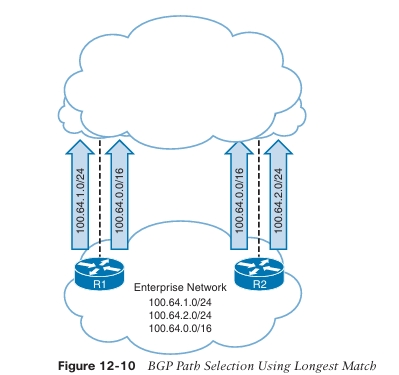

Independientemente de la política de enrutamiento de un SP, los prefijos más específicos se anuncian únicamente por un solo router. La redundancia se proporciona anunciando las direcciones resumidas. Si **R1** falla, los dispositivos utilizan el anuncio de ruta de **R2** de **100.64.0.0/16** para alcanzar la red **100.64.1.0/24**.

> **NOTA**  Asegúrese de que los resúmenes de red que se anuncian desde su organización estén únicamente dentro de su propio rango de red. Además, los proveedores de servicios normalmente no aceptan rutas IPv4 más largas que **/24** (por ejemplo, **/25** o **/26**) ni rutas IPv6 más largas que **/48**. Las rutas se restringen para controlar el tamaño de la tabla de enrutamiento de Internet.

## Descripción General del Mejor Camino en BGP

En BGP, los anuncios de rutas consisten en paquetes de actualización BGP que contienen la **Network Layer Reachability Information (NLRI)**. La NLRI consiste en la longitud del prefijo y el prefijo. Un router BGP puede contener múltiples caminos hacia la misma red de destino. Los atributos de cada camino influyen en la deseabilidad de la ruta cuando un router selecciona el mejor camino. Por defecto, un router BGP anuncia únicamente el mejor camino a los routers vecinos.

Dentro del **Loc-RIB**, todas las rutas y sus atributos se mantienen con el mejor camino calculado. El mejor camino se instala luego en el **RIB** del router. Si el mejor camino deja de estar disponible, el router puede usar rápidamente los caminos existentes para identificar un nuevo mejor camino. BGP recalcula el mejor camino para un prefijo ante cuatro posibles eventos:

- Cambio en la alcanzabilidad del next-hop de BGP
    
- Falla de una interfaz conectada a un peer eBGP
    
- Cambio por redistribución
    
- Recepción de nuevos caminos o eliminación de caminos para una ruta
    

BGP instala automáticamente el primer camino recibido como el mejor camino. Cuando se reciben caminos adicionales para la misma longitud de prefijo de red, los nuevos caminos se comparan con el mejor camino actual. Si hay un empate, el proceso continúa hasta que se identifica el ganador del mejor camino.

El algoritmo de selección del mejor camino de BGP utiliza los siguientes atributos, en el orden mostrado, para seleccionar el mejor camino:

1. **Weight**
    
2. **Local preference**
    
3. **Origen local** (network statement, redistribución o agregación)
    
4. **AIGP**
    
5. **AS Path más corto**
    
6. **Tipo de origen**
    
7. **MED más bajo**
    
8. **eBGP sobre iBGP**
    
9. **Métrica IGP más baja hacia el next hop**
    
10. **Preferir el camino de la sesión eBGP más antigua**
    
11. **Preferir la ruta que proviene del peer BGP con el RID más bajo**
    
12. **Preferir la ruta con la menor longitud de cluster list**
    
13. **Preferir el camino que proviene de la dirección de vecino más baja**
    

La política de enrutamiento BGP puede variar de una organización a otra, en función de la manipulación de los atributos BGP. Debido a que algunos AS pueden ejecutar BGP con otro AS, esos cambios podrían afectar el enrutamiento aguas abajo para otros SP. Otras PA solo influyen en la política de enrutamiento dentro de la organización. Los prefijos de red se igualan condicionalmente en función de una variedad de factores, como la longitud del AS Path, ASN específico, comunidades BGP u otros atributos.

El algoritmo de mejor camino se explica en las siguientes secciones.

## Weight

**Weight** es un atributo definido por Cisco y es el primer paso para seleccionar el mejor camino BGP. Weight es un valor de 16 bits (0 a 65,535) asignado localmente en el router; no se anuncia a otros routers. Se prefiere el camino con el weight más alto. El weight puede configurarse para rutas específicas con un route map entrante o para todas las rutas aprendidas de un vecino específico. El weight solo influye en el tráfico saliente de un router o un AS. Debido a que es el primer paso en el algoritmo de mejor camino, debe usarse cuando otros atributos no deben influir en el mejor camino para una red específica.

Examinar un prefijo de red con el comando `show bgp afi safi network` mostrará todos los caminos y los atributos de camino asociados, así como el mejor camino seleccionado. Identificar el mejor camino puede llevar tiempo a personas nuevas en BGP, y versiones más recientes de IOS XE proporcionan comandos para identificar rápidamente el mejor camino con el comando `show bgp afi safi network bestpath`. El comando `show bgp afi safi network bestpath-reason` mostrará todos los caminos y describirá por qué un camino es preferido o no preferido.

**Ejemplo 12-28** muestra la tabla BGP para la red **172.16.0.0/24** en **R5**. En la cuarta línea de la salida, el router indica que existen dos caminos y que el segundo camino es el mejor camino. Al examinar la salida de cada camino, el camino aprendido a través del **AS 200** tiene un weight de **123**. El camino a través del **AS 300** no tiene weight, lo que equivale a un valor de **0**; por lo tanto, la ruta a través del **AS 200** es el mejor camino. Observe que el segundo conjunto de salidas utiliza la palabra clave **bestpath** y solo muestra ese camino. El tercer conjunto de salidas incluye la opción **bestpath-reason**. Esa salida indica que el primer camino tiene un weight menor que el mejor camino seleccionado.

**Ejemplo 12-28:** Un Ejemplo de Selección del Mejor Camino BGP Basada en Weight
```
R5# show bgp ipv4 unicast 172.16.0.0/24
! Output omitted for brevity
BGP routing table entry for 172.16.0.0/24, version 5
Paths: (2 available, best #2, table default)
Not advertised to any peer
300 100
  192.168.6.6 (metric 130816) from 192.168.6.6 (192.168.6.6)
    Origin IGP, metric 0, localpref 100, valid, internal
```

```
192.168.4.4 (metric 130816) from 192.168.4.4 (192.168.4.4)
  Origin IGP, metric 0, localpref 100, weight 123, valid, internal, best
```

```
R5# show bgp ipv4 unicast 172.16.0.0/24 bestpath
! Output omitted for brevity
BGP routing table entry for 172.16.0.0/24, version 5
Paths: (2 available, best #2, table default)
200 100
  192.168.4.4 (metric 130816) from 192.168.4.4 (192.168.4.4)
    Origin IGP, metric 0, localpref 100, weight 123, valid, internal, best
```

```
R5# show bgp ipv4 unicast 172.16.0.0/24 best-path-reason
! Output omitted for brevity
BGP routing table entry for 172.16.0.0/24, version 5
Paths: (2 available, best #2, table default)
300 100
  192.168.6.6 (metric 130816) from 192.168.6.6 (192.168.6.6)
    Origin IGP, metric 0, localpref 100, valid, internal
    Best Path Evaluation: Lower weight
200 100
  192.168.4.4 (metric 130816) from 192.168.4.4 (192.168.4.4)
    Origin IGP, metric 0, localpref 100, weight 123, valid, internal, best
    Best Path Evaluation: Overall best path
```

## Preferencia Local

La **preferencia local (LOCAL_PREF)** es un atributo de camino bien conocido y se incluye con los anuncios de camino dentro de un AS. El atributo de preferencia local es un valor de 32 bits (0 a 4,294,967,295) que indica la preferencia para salir del AS hacia la red de destino. La preferencia local no se anuncia entre peers eBGP y normalmente se usa para influir en la dirección del next-hop para el tráfico saliente (es decir, al salir de un sistema autónomo). La preferencia local puede configurarse para rutas específicas mediante un route map o para todas las rutas recibidas de un vecino específico.

Un valor más alto es preferido frente a un valor más bajo. Si un router BGP de borde no define la preferencia local para un prefijo, durante el cálculo del mejor camino se usa el valor por defecto de **100**, y se incluye en los anuncios hacia otros peers iBGP. Modificar la preferencia local puede influir en la selección del camino en otros peers iBGP sin afectar a los peers eBGP, ya que la preferencia local no se anuncia fuera del sistema autónomo.

El **Ejemplo 12-29** muestra la tabla BGP para el prefijo de red **172.16.1.0/24** en **R4**. En la tercera línea de la salida, el router indica que existen dos caminos y que el primer camino es el mejor. El atributo **weight** de BGP no existe, por lo que se utiliza la preferencia local para seleccionar el mejor camino. El camino aprendido a través del **AS 300** es el mejor camino porque tiene una preferencia local de **333**, mientras que el camino a través del **AS 200** tiene una preferencia local de **111**.

**Ejemplo 12-29:** Un Ejemplo de Selección del Mejor Camino BGP Basada en Preferencia Local
```
R4# show bgp ipv4 unicast 172.16.1.0/24 best-path-reason
! Output omitted for brevity
BGP routing table entry for 172.16.1.0/24, version 6
Paths: (2 available, best #1, table default)
300 100
  192.168.6.6 (metric 131072) from 192.168.6.6 (192.168.6.6)
    Origin IGP, metric 0, localpref 333, valid, internal, best
    Best Path Evaluation: Overall best path
200 100
  100.64.24.2 from 100.64.24.2 (192.168.2.2)
    Origin IGP, localpref 111, valid, external
    Best Path Evaluation: Lower local preference
```

### Originado Localmente vía Network o Aggregate Advertisement

El tercer punto de decisión en el algoritmo de selección del mejor camino es determinar si la ruta se originó localmente. La preferencia se da en el siguiente orden:

- Rutas que fueron anunciadas localmente
    
- Redes que han sido agregadas localmente
    
- Rutas recibidas por peers BGP
    

### Métrica Acumulada del Protocolo de Gateway Interior

El **Accumulated Interior Gateway Protocol (AIGP)** es un atributo de camino opcional y no transitivo que se incluye en los anuncios a lo largo de un AS. Los IGP normalmente utilizan la métrica de menor costo para identificar el camino más corto hacia un destino, pero no pueden proporcionar la escalabilidad que BGP requiere cuando un AS se define como un único dominio de control para una política de enrutamiento. BGP no utiliza métricas de camino debido a problemas de escalabilidad combinados con la noción de que los AS pueden usar políticas de enrutamiento diferentes para calcular métricas.

AIGP proporciona la capacidad de que BGP mantenga y calcule una métrica conceptual de camino en entornos que utilizan múltiples AS con dominios de enrutamiento IGP únicos en cada AS. La capacidad de BGP para tomar decisiones de enrutamiento basadas en una métrica de camino es una ventaja viable porque todos los AS están bajo el control de un solo dominio, con políticas de enrutamiento consistentes tanto para BGP como para los IGP.

En la Figura 12-11, los AS 100, AS 200 y AS 300 están todos bajo el control del mismo proveedor de servicios. AIGP se ha habilitado en las sesiones BGP entre todos los routers, y los IGP se redistribuyen en BGP. La métrica AIGP se anuncia entre los AS 100, AS 200 y AS 300, permitiendo que BGP use la métrica AIGP para los cálculos de mejor camino entre los sistemas autónomos.

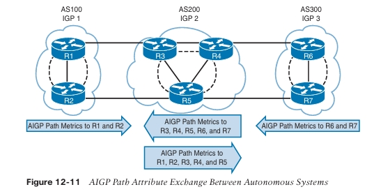

Las siguientes directrices aplican a las métricas **AIGP**:

- Un camino con una métrica AIGP es preferido sobre un camino sin una métrica AIGP.
    
- Si la dirección del siguiente salto requiere una búsqueda recursiva, el camino AIGP debe calcular una métrica derivada para incluir la distancia al siguiente salto. Esto garantiza que el costo hacia los routers de borde BGP esté incluido. La fórmula es:
    
    **Métrica AIGP derivada = (métrica AIGP original + métrica AIGP del siguiente salto)**
    
- Si existen múltiples caminos y uno de los siguientes saltos contiene una métrica AIGP y el otro no, el camino sin AIGP no se utiliza.
    
- La métrica AIGP del siguiente salto se añade de forma recursiva si se realizan múltiples búsquedas.
    
- Los caminos AIGP se comparan en función de la métrica AIGP derivada (con saltos recursivos al siguiente salto) o la métrica AIGP real (siguiente salto no recursivo). El camino con la métrica AIGP más baja es preferido.
    
- Cuando R2 anuncia un camino con AIGP habilitado que fue aprendido desde R1, si la dirección del siguiente salto cambia a la dirección de R2, R2 incrementa la métrica AIGP para reflejar la distancia (la métrica del IGP) entre R1 y R2.
    

### Camino AS Más Corto

El siguiente factor de decisión para el algoritmo de mejor camino de BGP es la **longitud del AS path**. La longitud del camino normalmente se correlaciona con el conteo de saltos AS. Un AS path más corto es preferido sobre uno más largo.

Anteponer ASN al AS path lo hace más largo, haciendo ese camino menos deseable en comparación con otros caminos. Típicamente, el AS path se antepone con el ASN del propietario de la red.

En general, un camino que tiene el AS path antepuesto no es seleccionado como el mejor camino BGP porque el AS path es más largo que el anuncio sin anteposición. El tráfico entrante es influenciado anteponiendo la longitud del AS path en anuncios hacia otros AS, y el tráfico saliente es influenciado anteponiendo anuncios recibidos desde otros AS.

El **Ejemplo 12-30** muestra la tabla BGP para la ruta **172.24.0.0/16** en R4. No hay peso configurado en ninguna de las rutas, y la preferencia local es idéntica. La primera ruta tiene una longitud de AS path de 2 (**300 100**), mientras que la segunda ruta tiene una longitud de AS path de 4 (**200 200 200 100**). La primera ruta, aprendida a través del AS 300, es seleccionada como el mejor camino porque tiene una longitud de AS path más corta.

```
Example 12-30  An Example of a BGP Best-Path Choice Based on AS Path Length

R4# show bgp ipv4 unicast 172.24.0.0/16 best-path-reason
! Output omitted for brevity
BGP routing table entry for 172.24.0.0/16, version 18
Paths: (2 available, best #1, table default)
  300 100
    192.168.6.6 (metric 131072) from 192.168.6.6 (192.168.6.6)
      Origin IGP, metric 0, localpref 100, valid, internal, best
      Best Path Evaluation: Overall best path
  200 200 200 100
    100.64.24.2 from 100.64.24.2 (192.168.2.2)
      Origin IGP, localpref 100, valid, external
      rx pathid: 0, tx pathid: 0
      Best Path Evaluation: Longer AS path
```

> **NOTA**  Los ASN se repiten para la segunda ruta, lo que indica que el AS 200 antepuso su anuncio BGP para dirigir el tráfico de red.

> **NOTA**  El emparejamiento con diferentes proveedores de Internet proporciona enrutamiento óptimo para la mayoría de las empresas porque un SP puede estar a un salto de AS o proporcionar conectividad a otros 2/3 SP, mientras que un SP diferente puede tener un AS path más corto hacia otros clientes.

### Tipo de Origen

El siguiente factor de decisión del mejor camino BGP es el atributo BGP obligatorio y bien conocido llamado **origin**. Por defecto, las redes que se anuncian mediante el comando **network** se establecen con origen IGP, y las redes redistribuidas se asignan con el atributo de origen **incomplete** (?). El orden de preferencia de origen es:

1. Origen IGP (más preferido)
    
2. Origen EGP
    
3. Origen Incomplete (menos preferido)
    

El **Ejemplo 12-31** muestra la tabla BGP de R4. Observe que la ruta **172.24.0.0/24** tiene dos caminos. El camino desde el AS 300 fue seleccionado como el mejor camino porque fue anunciado desde un IGP, mientras que el camino desde el AS 200 tiene un origen incomplete y se considera inferior al camino vía AS 300.

**Example 12-31:**  Un Ejemplo de Selección del Mejor Camino BGP Basado en el Tipo de Origen
```
R4# show bgp ipv4 unicast
BGP table version is 21, local router ID is 192.168.4.4
Status codes: s suppressed, d damped, h history, * valid, > best, i - internal,
              r RIB-failure, S Stale, m multipath, b backup-path, f RT-Filter,
              x best-external, a additional-path, c RIB-compressed,
              t secondary path, l long-lived-stale,
Origin codes: i - IGP, e - EGP, ? - incomplete
RPKI validation codes: V valid, I invalid, N Not found

   Network          Next Hop      Metric LocPrf Weight Path
*> 172.16.0.0/24    10.24.1.2           0      0 200 100 i
*  172.20.0.0/24    192.168.6.6          0    100 0 300 100 i
*                    10.24.1.2           0      0 200 100 i
*>i 172.24.0.0/24   192.168.6.6          0    100 0 300 100 i
*                    10.24.1.2           0      0 200 100 ?
```

### Discriminador de Salida Múltiple (MED)

El siguiente factor de decisión del mejor camino BGP es el atributo BGP no transitivo llamado **multi-exit discriminator (MED)**. MED utiliza un valor de 32 bits (0 a 4,294,967,295) llamado **metric**. BGP establece el MED automáticamente a la métrica IGP durante la redistribución de redes conectadas. Si el MED se recibe desde una sesión eBGP, no se anuncia a otros peers iBGP, pero no debe establecerse fuera del AS que lo recibe. El propósito del MED es influir en los flujos de tráfico entrante desde un AS diferente. Un MED más bajo es preferido sobre uno más alto.

> **NOTA**  Para que el MED sea un factor de decisión efectivo, los caminos que se comparan deben provenir del mismo ASN.

Las directrices del RFC 4451 establecen que a un prefijo sin valor MED se le debe dar prioridad y, en esencia, compararse con un valor de 0. Algunas organizaciones requieren que se establezca un MED a un valor específico para todos los prefijos y declaran que los caminos sin MED deben tratarse como menos preferidos. Por defecto, si el MED falta de un prefijo aprendido desde un peer eBGP, los dispositivos IOS XE utilizan un MED de 0 para el cálculo del mejor camino. Los routers IOS XE anuncian un MED de 0 a peers iBGP para rutas eBGP que no tienen MED.

El **Ejemplo 12-32** muestra la tabla BGP para la ruta **172.16.1.0/24** en R2. Observe que R2 está emparejado solo con el AS 300 para que el MED sea elegible en el proceso de selección del mejor camino. El primer camino tiene un MED de 0 y el segundo camino tiene un MED de 33. El primer camino es preferido porque el MED es menor.

**Example 12-32:**  Un Ejemplo de Selección del Mejor Camino BGP Basado en MED
```
R2# show bgp ipv4 unicast 172.16.1.0
BGP routing table entry for 172.16.1.0/24, version 9
Paths: (2 available, best #1, table default)
Advertised to update-groups:
  2
Refresh Epoch 4
  300
    10.12.1.1 from 10.12.1.1 (192.168.1.1)
      Origin IGP, metric 0, localpref 100, valid, external, best
Refresh Epoch 14
  300
    10.23.1.3 from 10.23.1.3 (192.168.3.3)
      Origin IGP, metric 33, localpref 100, valid, external
```

> **NOTA**  Es posible que el proveedor de servicios (SP) olvide anunciar el MED desde ambos peers y configure solo uno. Esta situación puede tener consecuencias no deseadas y puede corregirse fácilmente.

### eBGP sobre iBGP

El siguiente factor de decisión del mejor camino BGP es si la ruta proviene de un peer iBGP, eBGP o de un AS miembro de una confederación (sub-AS). El orden de selección del mejor camino es:

1. Peers eBGP (más deseable)
    
2. Peers de AS miembro de confederación
    
3. Peers iBGP (menos deseable)
    

> **NOTA**  Las confederaciones BGP están fuera del alcance del examen CCNP y CCIE Enterprise Core ENCOR 350-401 y no se tratan en este libro.

### Métrica IGP Más Baja

El siguiente paso de decisión es usar el costo IGP más bajo hacia la dirección del siguiente salto BGP. La Figura 12-11 ilustra una topología donde R2, R3, R4 y R5 están en el AS 400, y el enfoque estará en R3 y R5. El AS 400 utiliza un full mesh iBGP y establece sesiones BGP usando interfaces loopback. R2 y R4 anuncian prefijos de red con la característica next-hop-self. R1 anuncia el prefijo de red **172.16.0.0/24** a R2 y R4.

R3 prefiere el camino desde R2 en comparación con el camino iBGP desde R4 porque la métrica para alcanzar la dirección del siguiente salto es menor. R5 prefiere el camino desde R4 en comparación con el camino iBGP desde R2 porque la métrica para alcanzar la dirección del siguiente salto es menor.

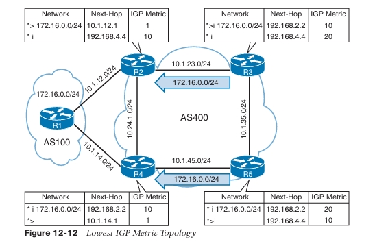

### Preferir el Camino de la Sesión eBGP Más Antigua

BGP puede mantener grandes tablas de enrutamiento, y las sesiones inestables provocan que el cálculo del mejor camino BGP se ejecute con frecuencia. BGP mantiene la estabilidad en una red prefiriendo el camino de la sesión eBGP más antigua (establecida).

La desventaja de esta técnica es que no conduce a un método determinista para identificar el mejor camino BGP desde una perspectiva de diseño.

### Router ID

El siguiente paso del algoritmo de selección del mejor camino BGP es seleccionar el mejor camino usando el router ID más bajo del router BGP anunciante. Si la ruta fue recibida por un route reflector, entonces el router ID de origen se sustituye por el router ID del reflector. El Ejemplo 12-33 demuestra un escenario donde R5 elige el camino a través de R6 sobre R4 debido al router ID más alto.

**Example 12-33:**  Una Elección del Mejor Camino BGP Basada en el Router ID
```
R5# show bgp ipv4 unicast 172.16.0.0/16 best-path-reason
! Output omitted for brevity

BGP routing table entry for 172.16.0.0/16, version 8
Paths: (2 available, best #2, table default)
  300 100
    192.168.6.6 (metric 130816) from 192.168.6.6 (192.168.6.6)
      Origin IGP, metric 0, localpref 100, valid, internal
      Best Path Evaluation: Higher router ID

  200 100
    192.168.4.4 (metric 130816) from 192.168.4.4 (192.168.4.4)
      Origin IGP, metric 0, localpref 100, valid, internal, best
      Best Path Evaluation: Overall best path
```

### Longitud Mínima de la Lista de Clúster

El siguiente paso en el algoritmo de selección del mejor camino BGP es seleccionar el mejor camino usando la menor longitud de la lista de clúster. La lista de clúster es un atributo BGP no transitivo que se agrega (no se sobrescribe) por un route reflector con su router ID. Los route reflectors usan el atributo de clúster como un mecanismo de prevención de bucles. La lista de clúster no se anuncia entre AS y es localmente significativa. En términos simples, esto localiza el camino que ha atravesado el menor número de saltos de anuncios iBGP.

> **NOTA**  Los route reflectors BGP están fuera del alcance del examen CCNP y CCIE Enterprise Core ENCOR 350-401 y no se tratan en este libro.

### Dirección del Vecino Más Baja

El último paso del algoritmo de selección del mejor camino BGP es seleccionar el camino que proviene de la dirección IP de vecino BGP más baja. Este paso está limitado a emparejamientos iBGP porque los emparejamientos eBGP usan el camino recibido más antiguo como criterio de desempate.

La Figura 12-13 demuestra el concepto de elegir el router con la dirección de vecino más baja. R1 anuncia la red 172.16.0.0/24 hacia R2. R1 y R2 han establecido dos sesiones BGP usando las redes 10.12.1.0/24 y 10.12.2.0/24. R2 selecciona el camino anunciado desde 10.12.1.1 porque es la dirección IP más baja.

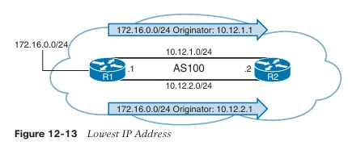