**CAPÍTULO 13**

## Multicast

This chapter covers the following subjects:

- Multicast Fundamentals: This section describes multicast concepts as well as the need for multicast.
    
- Multicast Addressing: This section describes the multicast address scopes used by multicast to operate at Layer 2 and Layer 3.
    
- Internet Group Management Protocol: This section explains how multicast receivers join multicast groups to start receiving multicast traffic using IGMPv2 or IGMPv3. It also describes how multicast flooding on Layer 2 switches is prevented using a feature called IGMP snooping.
    
- Protocol Independent Multicast: This section describes the concepts, operation, and features of PIM. PIM is the protocol used to route multicast traffic across network segments from a multicast source to a group of receivers.
    
- Rendezvous Points: This section describes the purpose, function, and operation of rendezvous points in a multicast network.
    

Multicast is deployed in almost every type of network. It allows a source host to send data packets to a group of destination hosts (receivers) in an efficient manner that conserves bandwidth and system resources. This chapter describes the need for multicast as well as the fundamental protocols that are required to understand its operation, such as IGMP, PIM dense mode/sparse mode, and rendezvous points (RPs).

---
## Fundamentos de Multicast

La comunicación IP tradicional entre hosts de red normalmente utiliza uno de los siguientes métodos de transmisión:

- **Unicast (uno a uno)**
    
- **Broadcast (uno a todos)**
    
- **Multicast (uno a muchos)**
    

La comunicación multicast es una tecnología que optimiza el uso del ancho de banda de la red y conserva los recursos del sistema. Se basa en el **Internet Group Management Protocol (IGMP)** para su funcionamiento en redes de **Capa 2**, y en **Protocol Independent Multicast (PIM)** para su operación en redes de **Capa 3**.

La **Figura 13-1** ilustra cómo IGMP opera entre los receptores y el router multicast local, y cómo PIM opera entre routers. Estas dos tecnologías trabajan de forma conjunta para permitir que el tráfico multicast fluya desde la fuente hacia los receptores, y se explican a lo largo de este capítulo.

La **Figura 13-2** muestra un ejemplo en el que cinco estaciones de trabajo están visualizando el mismo video que es anunciado por un servidor utilizando tráfico unicast (uno a uno). Cada flecha representa un flujo de datos del mismo video hacia cinco hosts diferentes. Si cada flujo es de **10 Mbps**, el enlace de red entre **R1 y R2** necesita **50 Mbps** de ancho de banda. El trayecto de red entre **R2 y R4** requiere **30 Mbps** de ancho de banda, y el enlace entre **R2 y R5** necesita **20 Mbps** de ancho de banda.

El servidor debe mantener información de estado de sesión para todas las sesiones entre los hosts. La carga de ancho de banda y de procesamiento en el servidor aumenta a medida que más receptores solicitan el mismo flujo de video.

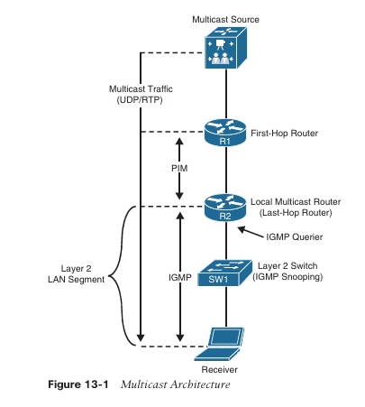

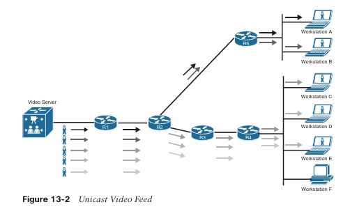

Un método alternativo para que las cinco estaciones de trabajo reciban el video es enviarlo desde el servidor utilizando tráfico **broadcast (uno a todos)**. La **Figura 13-3** muestra un ejemplo de cómo el mismo flujo de video se transmite utilizando broadcast IP dirigido. La carga en el servidor se reduce porque ya no mantiene información de estado de sesión. El mismo flujo de video consume solo **10 Mbps** de ancho de banda en todos los enlaces de red. Sin embargo, este enfoque presenta desventajas:

- La funcionalidad de **broadcast IP dirigido** no está habilitada por defecto en los routers Cisco, y habilitarla expone al router a ataques de **denegación de servicio distribuido (DDoS)**.
    
- Las **tarjetas de interfaz de red (NIC)** de las estaciones de trabajo no interesadas aún deben procesar los paquetes broadcast y enviarlos a la CPU de la estación, lo que desperdicia recursos de procesamiento. En la **Figura 13-3**, la estación de trabajo **F** está procesando paquetes unicast.

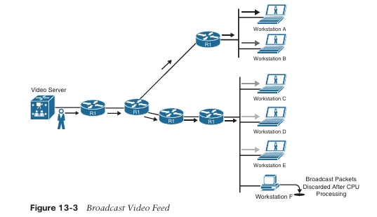

Por estas razones, el tráfico **broadcast** generalmente no es recomendado.

El tráfico **multicast** proporciona comunicación **uno a muchos**, donde solo se envía un paquete de datos por un enlace según sea necesario y luego se replica entre enlaces de datos que se ramifican (splits) en un dispositivo de red a lo largo del **árbol de distribución multicast (MDT)**. Los paquetes de datos se conocen como un **stream** que utiliza una dirección IP de destino especial, conocida como **dirección de grupo**. Un servidor de video que transmite solo una sesión, y los dispositivos de red reciben el stream multicast. Los dispositivos receptores de un stream multicast se conocen como **receptores**. Las aplicaciones comunes que aprovechan el tráfico multicast incluyen **Cisco TelePresence**, video en tiempo real, **IPTV**, **tickers bursátiles**, **educación a distancia**, **videoconferencias**, **música en espera** y **juegos**.

La **Figura 13-4** muestra un ejemplo del mismo flujo de video utilizando multicast. Cada uno de los enlaces de red consume solo **10 Mbps** de ancho de banda, al igual que con el tráfico broadcast, pero solo los receptores que están interesados en el flujo de video procesan el tráfico multicast. Por ejemplo,

La **estación de trabajo F** descartaría el tráfico multicast a nivel de la **NIC**, ya que no estaría configurada para aceptar tráfico multicast.

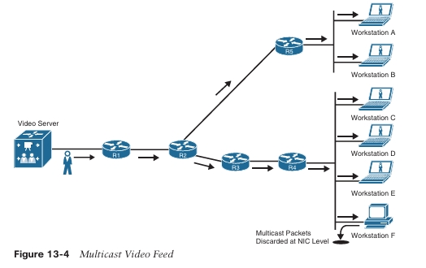

> **NOTA**  La estación de trabajo F no recibiría ningún tráfico multicast si el switch de ese segmento de red tiene habilitado **Internet Group Management Protocol (IGMP) snooping**. IGMP e IGMP snooping se tratan en la siguiente sección.

## Direccionamiento Multicast

La **Internet Assigned Numbers Authority (IANA)** asignó el espacio de direcciones **IP Clase D 224.0.0.0/4** para el direccionamiento multicast; este incluye direcciones que van desde **224.0.0.0 hasta 239.255.255.255**. Los primeros **4 bits** de todo este rango comienzan con **1110**.

En el espacio de direcciones multicast, múltiples bloques de direccionamiento están reservados para propósitos específicos, como se muestra en la **Tabla 13-2**.

**Tabla 13-2:** Direcciones IP Multicast Asignadas por IANA

| Designación                                                                              | Rango de direcciones multicast |
| ---------------------------------------------------------------------------------------- | ------------------------------ |
| Bloque de control de red local                                                           | 224.0.0.0 a 224.0.0.255        |
| Bloque de control de red intermedia                                                      | 224.0.1.0 a 224.0.1.255        |
| Bloque ad hoc I                                                                          | 224.0.2.0 a 224.0.255.255      |
| Reservado                                                                                | 224.1.0.0 a 224.1.255.255      |
| Bloque SDP/SAP                                                                           | 224.2.0.0 a 224.2.255.255      |
| Bloque ad hoc II                                                                         | 224.3.0.0 a 224.4.255.255      |
| Reservado                                                                                | 224.5.0.0 a 224.251.255.255    |
| Grupos transitorios DIS                                                                  | 224.252.0.0 a 224.255.255.255  |
| Reservado                                                                                | 225.0.0.0 a 231.255.255.255    |
| Bloque de Multicast Específico de Fuente (SSM)                                           | 232.0.0.0 a 232.255.255.255    |
| Bloque GLOP                                                                              | 233.0.0.0 a 233.255.255.255    |
| Bloque ad hoc III                                                                        | 233.252.0.0 a 233.255.255.255  |
| Direcciones multicast IPv4 basadas en prefijo unicast                                    | 234.0.0.0 a 234.255.255.255    |
| Reservado                                                                                | 235.0.0.0 a 238.255.255.255    |
| Alcance local organizacional (comúnmente conocido como bloque de alcance administrativo) | 239.0.0.0 a 239.255.255.255    |

De los bloques multicast mencionados en la **Tabla 13-2**, los más importantes son los siguientes:

- **Bloque de control de red local (224.0.0.0/24):**  
    Las direcciones del bloque de control de red local se utilizan para tráfico de control de protocolos que no se reenvía fuera de un dominio de broadcast. Ejemplos de este tipo de tráfico multicast de control incluyen todos los hosts en esta subred (**224.0.0.1**), todos los routers en esta subred (**224.0.0.2**) y todos los routers PIM (**224.0.0.13**).
    
- **Bloque de control de red intermedia (224.0.1.0/24):**  
    Las direcciones del bloque de control de red intermedia se utilizan para tráfico de control de protocolos que puede ser reenviado a través de Internet. Ejemplos incluyen **Network Time Protocol (NTP)** (**224.0.1.1**), **Cisco-RP-Announce** (**224.0.1.39**) y **Cisco-RP-Discovery** (**224.0.1.40**).
    

La **Tabla 13-3** enumera algunas de las direcciones multicast bien conocidas del bloque de control de red local y del bloque de control de red intermedia.

**Tabla 13-3:** Direcciones Multicast Reservadas Bien Conocidas

|Dirección IP Multicast|Descripción|
|---|---|
|224.0.0.0|Dirección base (reservada)|
|224.0.0.1|Todos los hosts en esta subred (grupo all-hosts)|
|224.0.0.2|Todos los routers en esta subred|
|224.0.0.5|Todos los routers OSPF (AllSPFRouters)|
|224.0.0.6|Todos los DR de OSPF (AllDRouters)|
|224.0.0.9|Todos los routers RIPv2|
|224.0.0.10|Todos los routers EIGRP|
|224.0.0.13|Todos los routers PIM|
|224.0.0.18|VRRP|
|224.0.0.22|IGMPv3|
|224.0.0.102|HSRPv2 y GLBP|
|224.0.1.1|NTP|
|224.0.1.39|Cisco-RP-Announce (Auto-RP)|
|224.0.1.40|Cisco-RP-Discovery (Auto-RP)|
- **Bloque de Multicast Específico de Fuente (SSM) (232.0.0.0/8):**  
    Este es el rango predeterminado utilizado por SSM. SSM es una extensión de PIM descrita en el RFC 4607. SSM reenvía tráfico a receptores únicamente desde aquellas fuentes multicast por las que los receptores han expresado explícitamente interés; está dirigido principalmente a aplicaciones de uno a muchos.
    
- **Bloque GLOP (233.0.0.0/8):**  
    Las direcciones en el bloque GLOP son direcciones asignadas globalmente de forma estática. La asignación se realiza para dominios con un número de sistema autónomo (ASN) de 16 bits, mapeando el ASN del dominio, expresado en octetos como X.Y, dentro de los dos octetos intermedios del bloque GLOP, lo que da como resultado una asignación de **233.X.Y.0/24**. El mapeo y la asignación están definidos en el RFC 3180. Los dominios con un ASN de 32 bits pueden solicitar espacio en el bloque ad hoc III o considerar el uso de direcciones multicast IPv6.
    
- **Alcance Local Organizacional (239.0.0.0/8):**  
    Estas direcciones, descritas en el RFC 2365, están limitadas a un grupo local u organización. Son similares a las direcciones unicast privadas reservadas (como 10.0.0.0/8) definidas en el RFC 1918 y no serán asignadas por la IANA a ningún grupo u protocolo externo. En otras palabras, los administradores de red son libres de usar direcciones multicast dentro de este rango en su propio dominio sin preocuparse por conflictos con otros en Internet.
    

## Direcciones Multicast de Capa 2

Históricamente, las NIC en un segmento LAN solo podían recibir paquetes destinados a su dirección MAC grabada o a la dirección MAC de broadcast. El uso de esta lógica podía generar una carga en los recursos de enrutamiento durante la replicación de paquetes en segmentos LAN. Se creó otro método para permitir que la replicación de tráfico multicast no requiriera manipulación de paquetes, y se creó un método que utiliza una dirección MAC estándar como destino.

Una dirección MAC es un valor único asociado a una NIC que se utiliza para identificarla de forma única en un segmento LAN. Las direcciones MAC tienen una longitud hexadecimal de 12 dígitos (48 bits) y normalmente se almacenan en segmentos de 8 bits separados por guiones (-) o dos puntos (:) (por ejemplo, **00-12-34-56-78-00** o **00:12:34:56:78:00**).

Cada dirección de grupo multicast IP se asigna a una dirección MAC especial que permite a las interfaces Ethernet identificar paquetes multicast destinados a un grupo específico. Un segmento LAN puede tener múltiples flujos multicast, y un receptor conoce qué tráfico debe enviar a la CPU para su procesamiento en función de la dirección MAC asignada al tráfico multicast.

Los primeros **24 bits** de una dirección MAC multicast siempre comienzan con **01:00:5E**. El bit de menor orden del primer byte es el **bit individual/grupo (I/G)**, también conocido como el bit unicast/multicast, y cuando está configurado en 1 indica que la trama es multicast; el bit 25 siempre es 0. Los **23 bits inferiores** de la dirección MAC multicast se copian de los **23 bits inferiores** de la dirección IP del grupo multicast.

La **Figura 13-5** muestra un ejemplo del mapeo de la dirección IP multicast **239.255.1.1** en la dirección MAC multicast **01:00:5E:7F:01:01**. Los **25 bits superiores** siempre son fijos, y los **23 bits inferiores** se copian directamente de los **23 bits inferiores** de la dirección IP del grupo multicast.

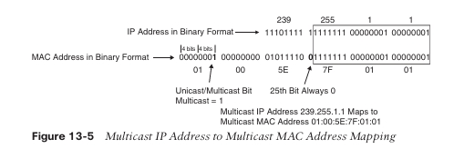

De los **9 bits** de la dirección IP multicast que no se copian en la dirección MAC multicast, los **5 bits de orden superior** permanecen fijos en **1110**, y los **5 bits restantes**, que son variables, no se transfieren a la dirección MAC. Debido a esto, existen **32 (2⁵)** direcciones IP multicast que no son universalmente únicas y que podrían corresponder a una sola dirección MAC multicast; en otras palabras, existe superposición. La **Figura 13-6** muestra un ejemplo de dos direcciones IP multicast que se superponen porque se asignan a la misma dirección MAC multicast.

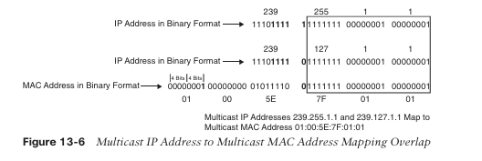

Cuando un receptor desea recibir un flujo multicast específico, envía un **mensaje IGMP join** utilizando la **dirección IP del grupo multicast** correspondiente a ese flujo. El receptor reprograma su interfaz para aceptar la dirección del grupo multicast y la asocia a la dirección MAC del grupo. Por ejemplo, una PC podría enviar un join IGMP al grupo **239.255.1.1** y correlacionar el grupo con la dirección MAC **01:00:5E:7F:01:01**.  
Si la PC intentara recibir una actualización OSPF enviada a **224.0.0.5** y su MAC multicast correspondiente **01:00:5E:00:00:05**, ignoraría esa actualización y evitaría el procesamiento de tráfico multicast no deseado, eliminando así el desperdicio de ciclos de CPU.

## Internet Group Management Protocol

El **Internet Group Management Protocol (IGMP)** es el protocolo que permite a los receptores unirse a grupos multicast y comenzar a recibir tráfico de dichos grupos. IGMP debe ser soportado tanto por los receptores como por las interfaces del router que enfrentan a los receptores. Cuando un receptor desea recibir tráfico multicast desde una fuente, envía un mensaje IGMP join a su router. Si el router no tiene IGMP habilitado en la interfaz, la solicitud es ignorada.

Existen tres versiones de IGMP. **RFC 1112** define **IGMPv1**, que es antiguo y rara vez utilizado. **RFC 2236** define **IGMPv2**, que es común en la mayoría de las redes multicast, y **RFC 3376** define **IGMPv3**, que es utilizado por **SSM**. En este capítulo solo se describen **IGMPv2** e **IGMPv3**.

## IGMPv2

IGMPv2 utiliza el formato de mensaje mostrado en la **Figura 13-7**. Este mensaje se encapsula en un paquete IP con un **número de protocolo 2**. Los mensajes se envían con la opción de **router alert** del protocolo IP, lo que indica que los paquetes deben ser examinados con mayor atención, y con un **tiempo de vida (TTL)** de **1**. El TTL es un campo de 8 bits en la cabecera del paquete IP que es establecido por el emisor y decrementado por cada router en el camino hacia su destino. Si el TTL llega a 0 antes de alcanzar el destino, el paquete se descarta. Los paquetes IGMP no deben reenviarse más allá del segmento de red local y, por esta razón, se envían con un TTL de 1. Esto garantiza que los paquetes IGMP sean procesados únicamente por el/los router(s) local(es) y no se reenvíen a otros routers.

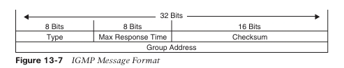

Los campos del formato del mensaje **IGMP** se definen de la siguiente manera:

- **Type (Tipo)**: Este campo describe cinco tipos diferentes de mensajes IGMP utilizados por routers y receptores:
    
    - **Version 2 membership report** (valor de tipo **0x16**): Es un tipo de mensaje comúnmente denominado **IGMP join**; es utilizado por los receptores para unirse a un grupo multicast o para responder a una consulta de membresía de un router local.
        
    - **Version 1 membership report** (valor de tipo **0x12**): Es utilizado por los receptores para compatibilidad hacia atrás con IGMPv1.
        
    - **Version 2 leave group** (valor de tipo **0x17**): Es utilizado por los receptores para indicar que desean dejar de recibir tráfico multicast para un grupo al que se habían unido.
        
    - **General membership query** (valor de tipo **0x11**): Se envía periódicamente a la dirección de grupo de todos los hosts **224.0.0.1** para verificar si hay receptores en la subred conectada. Establece el campo de dirección de grupo en **0.0.0.0**.
        
    - **Group-specific query** (valor de tipo **0x11**): Se envía en respuesta a un mensaje de abandono de grupo hacia la dirección de grupo que el receptor solicitó dejar. La dirección de grupo es la dirección IP de destino del encabezado IP.
        
- **Max response time (Tiempo máximo de respuesta)**: Este campo se establece únicamente en los mensajes de consulta de membresía general y específica de grupo (valor de tipo **0x11**); especifica el tiempo máximo permitido antes de enviar un reporte de respuesta, en unidades de décimas de segundo. En todos los demás mensajes, el emisor lo establece en **0x00** y es ignorado por los receptores.
    
- **Checksum**: Este campo es la suma de complemento a 1 de 16 bits del mensaje IGMP. Es el algoritmo de checksum estándar utilizado por TCP/IP.
    
- **Group address (Dirección de grupo)**: Este campo se establece en **0.0.0.0** en los mensajes de consulta general y se establece con la dirección del grupo en los mensajes específicos de grupo. Los mensajes de reporte de membresía llevan en este campo la dirección del grupo reportado; los mensajes de abandono de grupo llevan la dirección del grupo en este campo.
    

Cuando un receptor desea recibir un flujo multicast, envía un **reporte de membresía no solicitado**, comúnmente denominado **IGMP join**, al router local para el grupo al que desea unirse (por ejemplo, **239.1.1.1**). El router local envía entonces un **mensaje PIM join** aguas arriba hacia la fuente para solicitar el flujo multicast. Cuando el router local comienza a recibir el flujo multicast, lo reenvía aguas abajo hacia la subred donde reside el receptor que lo solicitó.

**NOTA**  
**IGMP join** no es un tipo de mensaje válido en las especificaciones RFC de IGMP, pero el término se utiliza comúnmente en la práctica en lugar de **IGMP membership report** porque es más fácil de decir y escribir.

El router envía periódicamente mensajes de consulta de membresía general a la subred, a la dirección de grupo de todos los hosts **224.0.0.1**, para verificar si existen miembros en la subred conectada. El mensaje de consulta general contiene un campo de tiempo máximo de respuesta que, por defecto, se establece en **10 segundos**.

En respuesta a esta consulta, los receptores configuran un temporizador interno aleatorio entre **0 y 10 segundos** (el valor puede cambiar si el tiempo máximo de respuesta se ajusta a un valor distinto). Cuando expira el temporizador, los receptores envían reportes de membresía para cada uno de los grupos a los que pertenecen. Si un receptor recibe el reporte de otro receptor para uno de los grupos al que pertenece mientras su temporizador aún está en ejecución, detiene su temporizador para esa dirección de grupo y no envía un reporte; esto se hace para suprimir reportes duplicados.

Cuando un receptor desea abandonar un grupo, si fue el último receptor en responder a una consulta, envía un mensaje de abandono de grupo a la dirección de grupo de todos los routers **224.0.0.2**. De lo contrario, puede salir silenciosamente, ya que debe existir otro receptor en la subred.

Cuando el router recibe el mensaje de abandono de grupo, envía una **consulta de membresía específica de grupo** a la dirección de grupo multicast para determinar si aún existen receptores interesados en ese grupo dentro de la subred. Si no los hay, el router elimina el estado IGMP para ese grupo.

Si hay más de un router en un segmento LAN, se lleva a cabo una **elección del querier IGMP** para determinar cuál router será el querier. Los routers IGMP envían mensajes de consulta de membresía general con su dirección de interfaz como dirección IP de origen y con destino a la dirección multicast **224.0.0.1**. Cuando un router IGMPv2 recibe un mensaje, verifica la dirección IP de origen y la compara con su propia dirección IP de interfaz. El router con la **dirección IP de interfaz más baja** en la subred LAN es elegido como el querier IGMP. A partir de ese momento, los routers no querier se abstienen de enviar consultas de membresía cada vez que reciben un reporte de membresía desde el router querier.

Si el router querier deja de enviar consultas de membresía por alguna razón (por ejemplo, si se apaga), se produce una nueva elección de querier. Un router no querier espera el **doble del intervalo de consulta**, que por defecto es **60 segundos**, y si no ha escuchado consultas del querier IGMP, se activa el proceso de elección del querier IGMP.

### IGMPv3

En IGMPv2, cuando un receptor envía un reporte de membresía para unirse a un grupo multicast, no especifica desde qué fuente le gustaría recibir el tráfico multicast. **IGMPv3** es una extensión de IGMPv2 que agrega soporte para **filtrado de fuentes multicast**, proporcionando a los receptores la capacidad de elegir de qué fuente desean aceptar tráfico multicast.

IGMPv3 está diseñado para coexistir con IGMPv1 e IGMPv2.

IGMPv3 soporta todos los tipos de mensajes IGMP de IGMPv2 y es compatible hacia atrás con IGMPv2. Las diferencias entre ambos son que IGMPv3 añadió nuevos campos al reporte de membresía IGMP e introdujo un nuevo tipo de mensaje IGMP llamado **Version 3 membership report** para soportar el filtrado por fuente.

IGMPv3 soporta aplicaciones que señalan explícitamente las fuentes desde las cuales desean recibir tráfico. Con IGMPv3, los receptores indican su membresía a una dirección de grupo multicast utilizando un reporte de membresía en uno de los siguientes dos modos:

- **Include mode**: En este modo, el receptor anuncia su membresía a una dirección de grupo multicast y proporciona una lista de direcciones de origen (**include list**) desde las cuales desea recibir tráfico.
    
- **Exclude mode**: En este modo, el receptor anuncia su membresía a una dirección de grupo multicast y proporciona una lista de direcciones de origen (**exclude list**) desde las cuales no desea recibir tráfico. El receptor recibe tráfico únicamente de fuentes cuyos direcciones IP no estén listadas en la exclude list. Para recibir tráfico de todas las fuentes, que es el comportamiento de IGMPv2, un receptor utiliza el modo exclude con una exclude list vacía.
    

**NOTA**  
IGMPv3 se utiliza para proporcionar filtrado de fuentes para **Source Specific Multicast (SSM)**.

### IGMP Snooping

Para optimizar el reenvío y minimizar el flooding, los switches necesitan un método para enviar tráfico únicamente a los receptores interesados. En el caso del tráfico unicast, los switches Cisco aprenden direcciones MAC de Capa 2 y a qué puertos están asociadas inspeccionando la dirección MAC de origen en Capa 2; almacenan esta información en la tabla de direcciones MAC. Si reciben una trama de Capa 2 con una dirección MAC de destino que no está en esta tabla, la tratan como una trama unicast desconocida y la inundan por todos los puertos dentro de la misma VLAN, excepto por el puerto en el que se recibió la trama. Las estaciones de trabajo no interesadas notarán que la dirección MAC de destino en la trama no es la suya y descartarán el paquete.

En la Figura 13-8, **SW1** comienza con una tabla de direcciones MAC vacía. Cuando la estación de trabajo A envía una trama, SW1 almacena su dirección MAC de origen y la interfaz en la tabla de direcciones MAC y luego inunda la trama recibida por todos los puertos (excepto el puerto por el que recibió la trama).

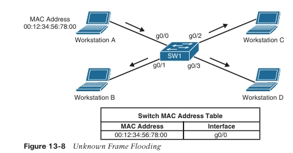

Si cualquier otra estación de trabajo envía una trama destinada a la dirección MAC de la estación de trabajo A, la trama ya no se inunda porque dicha dirección ya se encuentra en la tabla de direcciones MAC, y se envía únicamente a la estación de trabajo A, como se muestra en la Figura 13-9.

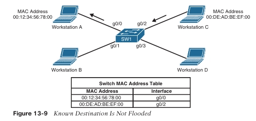

En el caso del tráfico multicast, una dirección MAC multicast nunca se utiliza como dirección MAC de origen. Por defecto, los switches tratan las direcciones MAC multicast como tramas multicast desconocidas y las inundan por todos los puertos. Luego, corresponde a las estaciones de trabajo seleccionar qué tramas procesar y cuáles descartar. Las estaciones no interesadas descartan el tráfico multicast a nivel de la NIC porque no estarían programadas para aceptar dicho tráfico. La inundación de tráfico multicast en un switch desperdicia ancho de banda en cada segmento LAN.

Los switches Cisco admiten dos métodos para reducir la inundación de tráfico multicast en un segmento LAN:

- IGMP snooping
    
- Entradas de direcciones MAC estáticas
    

**IGMP snooping**, definido en la RFC 4541, es el método más utilizado y funciona examinando los mensajes IGMP join enviados por los receptores y manteniendo una tabla de interfaces a las que se han recibido joins IGMP. Cuando el switch recibe una trama multicast destinada a un grupo multicast, reenvía el paquete únicamente a los puertos donde se han recibido joins IGMP para ese grupo multicast específico.

La Figura 13-10 ilustra a las estaciones de trabajo A y C enviando mensajes IGMP join a 239.255.1.1, que se mapea a la dirección MAC multicast 01:00:5E:7F:01:01 (ver Figura 13-5 para un ejemplo de mapeo de direcciones IP multicast a direcciones MAC). El Switch 1 tiene IGMP snooping habilitado y llena la tabla de direcciones MAC con esta información.

> **NOTA**   Incluso con IGMP snooping habilitado, algunos grupos multicast siguen siendo inundados en todos los puertos (por ejemplo, 224.0.0.0/24, direcciones reservadas).

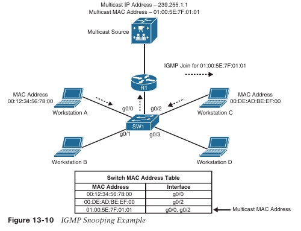

La Figura 13-11 ilustra a la fuente enviando tráfico a 239.255.1.1 (01:00:5E:7F:01:01). El Switch 1 recibe este tráfico y lo reenvía únicamente por las interfaces g0/0 y g0/2, ya que esas son las únicas interfaces que han recibido mensajes IGMP join para ese grupo.

Una entrada multicast estática también puede configurarse manualmente en la tabla de direcciones MAC, pero esta no es una solución escalable porque no puede reaccionar dinámicamente a los cambios; por esta razón, no es un enfoque recomendado.

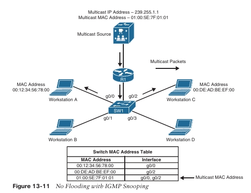

**Multicast Independiente del Protocolo**

Los receptores utilizan IGMP para unirse a un grupo multicast, lo cual es suficiente si la fuente del grupo se conecta al mismo router al que está conectado el receptor. Se necesita un protocolo de enrutamiento multicast para transportar el tráfico multicast a través de la red, de modo que los routers puedan localizar y solicitar flujos multicast de otros routers. Existen múltiples protocolos de enrutamiento multicast, pero Cisco es totalmente compatible únicamente con **Protocol Independent Multicast (PIM)**, que es el más popular y un protocolo estándar de la industria definido en la RFC 4601.

PIM es un protocolo de enrutamiento multicast que encamina tráfico multicast entre segmentos de red. PIM puede utilizar cualquiera de los protocolos de enrutamiento unicast para identificar la ruta entre la fuente y los receptores.

**Árboles de Distribución PIM**

El multicast crea árboles de distribución que definen la ruta que sigue el tráfico IP multicast a través de la red para llegar a los receptores. Los dos tipos básicos de árboles de distribución multicast son los árboles de origen, también conocidos como **árboles de ruta más corta (SPT)**, y los árboles compartidos.

**Árboles de Origen**

Un **árbol de origen** es un árbol de distribución multicast donde la fuente es la raíz del árbol, y las ramas forman un árbol de distribución a través de la red hasta llegar a los receptores.

Cuando se construye este árbol, utiliza la ruta más corta a través de la red desde la fuente hasta las hojas del árbol; por esta razón, también se le conoce como árbol de ruta más corta (SPT).

El estado de reenvío del SPT se conoce mediante la notación **(S,G)**, pronunciado “S coma G”, donde **S** es la fuente del flujo multicast (servidor) y **G** es la dirección del grupo multicast. Usando esta notación, el estado SPT para el ejemplo mostrado en la Figura 13-12 es **(10.1.1.2, 239.1.1.1)**, donde la fuente multicast **S** es 10.1.1.2 y el grupo multicast **G** es 239.1.1.1, al que se han unido los receptores A y B.

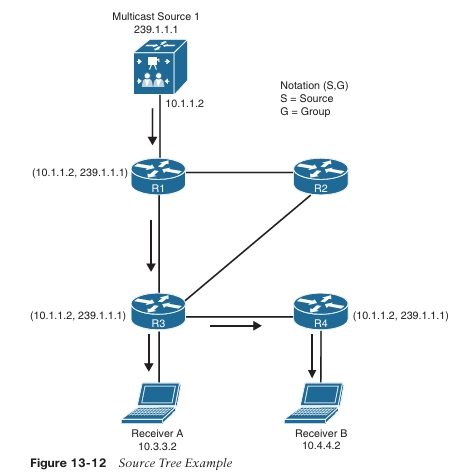

Debido a que cada SPT está enraizado en la fuente **S**, cada fuente que envía a un grupo multicast requiere un SPT.

**Árboles Compartidos**

Un **árbol compartido** es un árbol de distribución multicast donde la raíz del árbol compartido no es la fuente, sino un router designado como **punto de encuentro (RP, rendezvous point)**. Por esta razón, los árboles compartidos también se conocen como **árboles de punto de encuentro (RPT)**. El tráfico multicast se reenvía a lo largo del árbol compartido de acuerdo con la dirección del grupo **G** al que van dirigidos los paquetes, independientemente de la dirección de la fuente. Por esta razón, el estado de reenvío en el árbol compartido se identifica con la notación **(*,G)**, pronunciado “asterisco coma G”. La Figura 13-13 ilustra un árbol compartido donde **R2** es el RP y **(*,G)** es _(239.1.1.1)_.

> **NOTA**  En cualquier multicast con fuente (_ASM_), el estado **(S,G)** requiere un par _(S,G)_. Por esta razón, la Figura 13-13 muestra que **R1** y **R2** tienen **(*,G)** como estado, y **R3** y **R4** aún no se han unido al árbol de origen, lo cual se indica por la ausencia de **(S,G)** en su tabla de enrutamiento multicast.

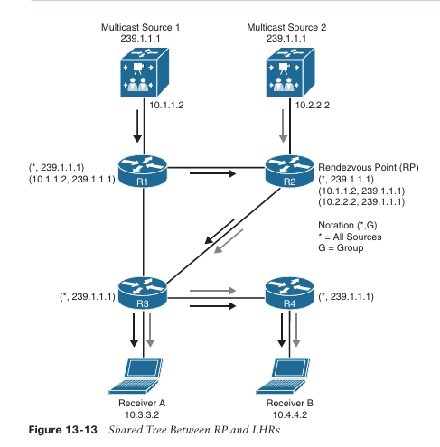

Uno de los beneficios de los árboles compartidos frente a los árboles de origen es que requieren menos entradas multicast (por ejemplo, _(S,G)_ y _(_,G)_). Por ejemplo, a medida que se introducen más fuentes en la red enviando tráfico al mismo grupo multicast, el número de entradas multicast en **R3** y **R4** siempre permanece igual: _(_,239.1.1.1)_.

La principal desventaja de los árboles compartidos es que los receptores reciben tráfico de todas las fuentes que envían al mismo grupo multicast. Aunque las aplicaciones de los receptores pueden filtrar el tráfico no deseado, esta situación sigue generando una gran cantidad de tráfico innecesario en la red, desperdiciando ancho de banda. Además, debido a que los árboles compartidos permiten múltiples fuentes en un grupo multicast IP, existe un posible problema de seguridad en la red, ya que fuentes no deseadas podrían enviar paquetes no deseados a los receptores.

**Terminología PIM**

La Figura 13-14 proporciona una topología de referencia para parte de la terminología de enrutamiento multicast.

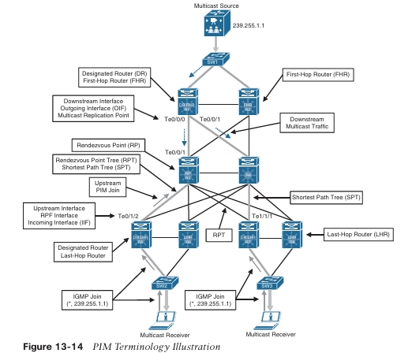

La siguiente lista define la terminología común de PIM ilustrada en la Figura 13-14:

- **Interfaz de Reverse Path Forwarding (RPF)**: La interfaz con la ruta de menor costo (basada en la distancia administrativa [AD] y la métrica) hacia la dirección IP de la fuente (SPT) o hacia el RP, en el caso de árboles compartidos. Si varias interfaces tienen el mismo costo, se utiliza la interfaz con el valor más alto de IP address como desempate. Un ejemplo de este tipo de interfaz es **Te0/1/2 en R5**, porque es la ruta más corta hacia la fuente. Otro ejemplo es **Te1/1/1 en R7**, porque la ruta más corta hacia la fuente se determinó a través de R4.
    
- **Vecino RPF (RPF neighbor)**: El vecino PIM en la interfaz RPF. Por ejemplo, si R7 está usando el RP compartido, el vecino RPF sería **R3**, que es el router con el menor costo hacia el RP. Si se está usando el SPT, **R4** sería el vecino RPF porque ofrece el menor costo hacia la fuente.
    
- **Upstream**: Hacia la fuente del árbol, que puede ser la fuente real en árboles basados en la fuente o el RP en árboles compartidos. Todo el tráfico PIM viaja en sentido upstream hacia la fuente.
    
- **Interfaz upstream**: La interfaz hacia la fuente del árbol. También se conoce como la interfaz RPF o la interfaz de entrada (**Incoming Interface, IIF**). Un ejemplo de una interfaz upstream es **Te0/1/2 de R5**, que puede enviar mensajes PIM join upstream a su vecino RPF.
    
- **Downstream**: Lejos de la fuente del árbol y hacia los receptores.
    
- **Interfaz downstream**: Cualquier interfaz que se utilice para reenviar tráfico multicast hacia abajo en el árbol, también conocida como interfaz de salida (**Outgoing Interface, OIF**). Un ejemplo de una interfaz downstream es la interfaz **Te0/0/0 de R1**, que reenvía tráfico multicast a la interfaz **Te0/0/1 de R3**.
    
- **Interfaz de entrada (Incoming Interface, IIF)**: El único tipo de interfaz que puede aceptar tráfico multicast proveniente de la fuente, que es la misma que la interfaz RPF. Un ejemplo de este tipo de interfaz es **Te0/0/1 en R3**, porque la ruta más corta hacia la fuente se conoce a través de esta interfaz.
    
- **Interfaz de salida (Outgoing Interface, OIF)**: Cualquier interfaz que se utilice para reenviar tráfico multicast hacia abajo en el árbol, también conocida como interfaz downstream.
    
- **Lista de interfaces de salida (Outgoing Interface List, OIL)**: Un grupo de OIF que están reenviando tráfico multicast al mismo grupo. Un ejemplo es **Te0/0/0 y Te0/0/1 de R5**, interfaces que envían tráfico multicast downstream a R3 y R4 para el mismo grupo multicast.
    
- **Router de último salto (Last-hop router, LHR)**: Un router que está directamente conectado a los receptores, también conocido como router hoja. Es responsable de enviar mensajes PIM join upstream hacia el RP o hacia la fuente.
    
- **Router de primer salto (First-hop router, FHR)**: Un router que está directamente conectado a la fuente, también conocido como router raíz. Es responsable de enviar mensajes PIM register hacia el RP.
    
- **Base de Información de Enrutamiento Multicast (Multicast Routing Information Base, MRIB)**: Una tabla de topología que también se conoce como la tabla de rutas multicast (_mroute_). Se construye con base en la información de la tabla de enrutamiento unicast y PIM. La MRIB contiene la fuente **S**, el grupo **G**, las interfaces de entrada (**IIF**), las interfaces de salida (**OIF**) y la información del vecino RPF para cada ruta multicast, así como otra información relacionada con multicast.
    
- **Base de Información de Reenvío Multicast (Multicast Forwarding Information Base, MFIB)**: Una tabla de reenvío que utiliza la MRIB para programar la información de reenvío multicast en el hardware para un reenvío más rápido.
    
- **Estado multicast**: El estado de reenvío de tráfico multicast que utiliza un router para reenviar tráfico multicast. El estado multicast está compuesto por las entradas que se encuentran en la tabla _mroute_ (S, G, IIF, OIF, y así sucesivamente).
    

Actualmente existen cinco modos de operación de PIM:

- **PIM Dense Mode (PIM-DM)**
    
- **PIM Sparse Mode (PIM-SM)**
    
- **PIM Sparse Dense Mode**
    
- **PIM Source Specific Multicast (PIM-SSM)**
    
- **PIM Bidirectional Mode (Bidir-PIM)**
    

> **NOTA**  PIM-DM y PIM-SM también se denominan comúnmente multicast de cualquier fuente (**Any-Source Multicast, ASM**).

Todos los mensajes de control PIM utilizan el número de protocolo IP **103**; pueden ser unicast (es decir, los mensajes _register_ y _register-stop_ se envían con un TTL mayor que 1) o multicast, con un TTL de 1 a la dirección multicast bien conocida **224.0.0.13**. La Tabla 13-4 enumera los mensajes de control PIM.

> **NOTA**  PIM-DM y PIM-SM también se conocen comúnmente como _any-source multicast_ (ASM).

Todos los mensajes de control PIM utilizan el número de protocolo IP **103**; pueden ser **unicast** (es decir, los mensajes _register_ y _register-stop_ se envían con un TTL mayor que 1) o **multicast**, con un TTL de 1 a la dirección multicast bien conocida **224.0.0.13**.  
La Tabla 13-4 enumera los mensajes de control PIM.

**Tabla 13-4:** Tipos de mensajes de control PIM

| Tipo | Tipo de mensaje            | Destino                                         | Protocolo PIM                   |
| ---: | -------------------------- | ----------------------------------------------- | ------------------------------- |
|    0 | Hello                      | 224.0.0.13 (todos los routers PIM)              | PIM-SM, PIM-DM, Bidir-PIM y SSM |
|    1 | Register                   | Dirección del RP (unicast)                      | PIM-SM                          |
|    2 | Register stop              | Router de primer salto (unicast)                | PIM-SM                          |
|    3 | Join/prune                 | 224.0.0.13 (todos los routers PIM)              | PIM-SM, Bidir-PIM y SSM         |
|    4 | Bootstrap                  | 224.0.0.13 (todos los routers PIM)              | PIM-SM y Bidir-PIM              |
|    5 | Assert                     | 224.0.0.13 (todos los routers PIM)              | PIM-SM, PIM-DM y Bidir-PIM      |
|    8 | Candidate RP advertisement | Dirección del router Bootstrap (unicast al BSR) | PIM-SM y Bidir-PIM              |
|    9 | State refresh              | 224.0.0.13 (todos los routers PIM)              | PIM-DM                          |
|   10 | DF election                | 224.0.0.13 (todos los routers PIM)              | Bidir-PIM                       |

Los mensajes _hello_ de PIM se envían por defecto cada **30 segundos** por cada interfaz con PIM habilitado para aprender sobre los routers PIM vecinos en cada interfaz hacia la dirección **all PIM routers**, como se muestra en la Tabla 13-4. Los mensajes _hello_ también son el mecanismo utilizado para elegir un **designated router (DR)**, como se describe más adelante en este capítulo, y para negociar capacidades adicionales. Todos los routers PIM deben registrar la información _hello_ recibida de cada vecino PIM.

## PIM Dense Mode

Los routers PIM pueden configurarse en **PIM Dense Mode (PIM-DM)** cuando es seguro asumir que los receptores de un grupo multicast están ubicados en **cada subred dentro de la red**; en otras palabras, cuando los receptores multicast de un grupo están densamente distribuidos en la red.

En PIM-DM, el árbol multicast se construye **inundando** el tráfico por cada interfaz desde la fuente hacia cada router Dense Mode en la red. El árbol se expande desde la raíz hacia las hojas. A medida que cada router recibe tráfico para el grupo multicast, debe decidir si ya tiene receptores activos esperando recibir dicho tráfico. Si es así, el router permanece activo y permite que el flujo multicast continúe. Si ningún receptor ha solicitado el flujo multicast para ese grupo en el **LHR**, el router envía un mensaje _prune_ hacia la fuente. Esa rama del árbol se **poda**, de modo que el tráfico innecesario no continúe. El árbol resultante es un árbol de fuente que es único desde la fuente hacia los receptores.

La Figura 13-5 muestra la operación de **flood and prune** del modo Dense. El tráfico multicast desde la fuente se inunda por toda la red. A medida que cada router recibe el tráfico multicast de su vecino upstream a través de su **interfaz RPF**, reenvía el tráfico multicast a todas sus interfaces PIM habilitadas. Esto resulta en tráfico multicast a través de interfaces no RPF, como en el caso de R3 recibiendo tráfico de R2 por su interfaz no RPF. Los paquetes que llegan por una interfaz no RPF se descartan.

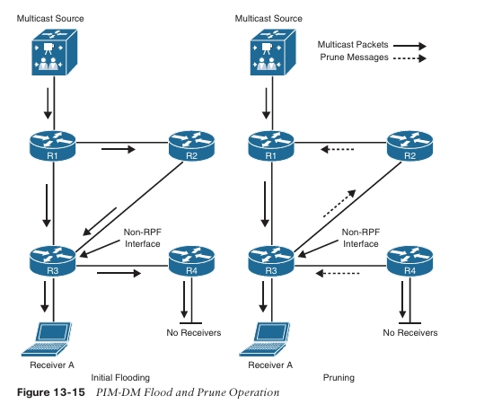

Estos flujos multicast **no-RPF** son normales durante la inundación inicial del tráfico multicast y se corrigen mediante el mecanismo normal de **poda (pruning)** de PIM-DM. El mecanismo de poda se utiliza para detener el flujo de tráfico no deseado. Las podas (indicadas por las flechas discontinuas) se envían por la **interfaz RPF** cuando el router no tiene miembros downstream que necesiten el tráfico multicast.

Este es el caso de **R4**, que no tiene receptores interesados, y también se envían por interfaces **no-RPF** para detener el flujo de tráfico multicast que está llegando por la interfaz no-RPF, como ocurre en **R3**, donde el tráfico multicast llega desde **R2** por una interfaz no-RPF, lo que resulta en un mensaje _prune_.

La **Figura 13-16** ilustra la topología resultante después de que todos los enlaces innecesarios han sido podados. Esto da como resultado un **SPT** desde la fuente hasta el receptor. Aunque el flujo de tráfico multicast ya no llega a la mayoría de los routers de la red, el estado **(S,G)** sigue presente en todos los routers de la red. Este estado **(S,G)** se mantiene hasta que la fuente deja de transmitir.

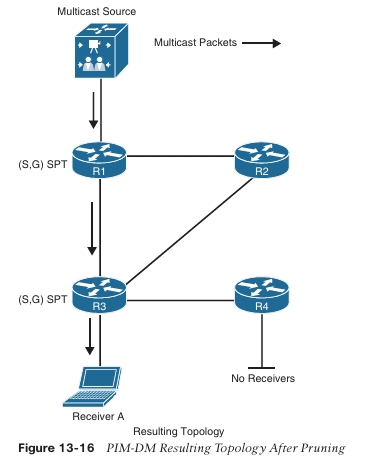

